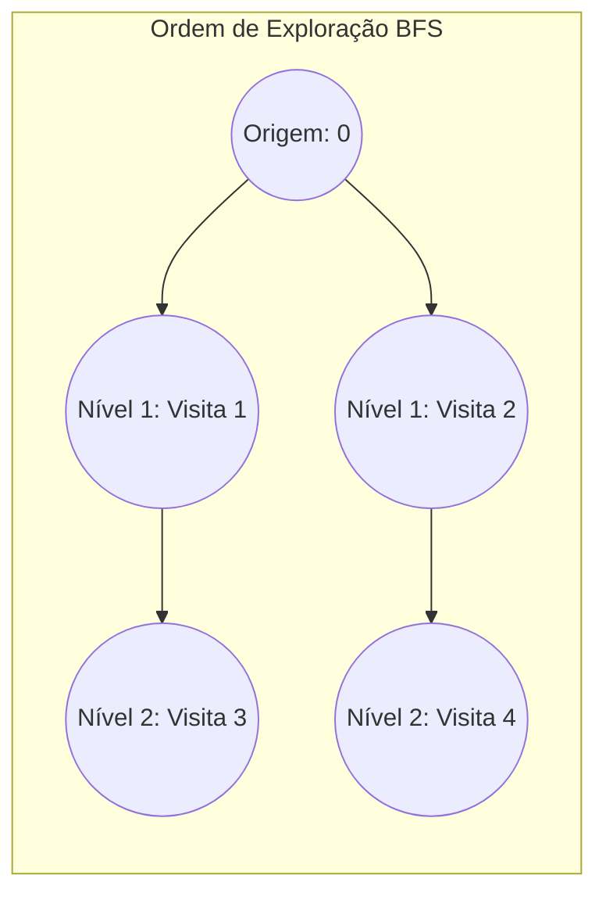

# Percursos em Grafos (BFS e DFS)

## Objetivo
Ao final deste tópico, o estudante será capaz de explicar a mecânica de Busca em Largura (BFS) e Busca em Profundidade (DFS) em grafos, analisar suas respectivas complexidades temporais e espaciais, aplicar BFS para achar caminhos mínimos e DFS para detectar ciclos, e implementar ambos os algoritmos em Java.

## Pré-requisitos
- [01. Representações de Grafos](./01-graph-representations.md)
- [03. Pilhas (Stacks)](../02-linear-structures/03-stacks.md)
- [04. Filas e Deques (Queues and Deques)](../02-linear-structures/04-queues-and-deques.md)

## Conceitos Fundamentais

Caminhar por um grafo de forma sistemática é mais complexo do que percorrer árvores, pois grafos podem conter **ciclos** e partes isoladas (componentes desconexos). Para evitar loops infinitos, precisamos obrigatoriamente rastrear quais vértices já foram visitados.

---

### 1. Busca em Largura (BFS - Breadth-First Search)
A BFS explora o grafo nível por nível. Partindo de um nó inicial, ela visita todos os vizinhos diretos (distância 1), depois os vizinhos dos vizinhos (distância 2) e assim por diante.

#### Características
*   **Estrutura de dados auxiliar**: Usa uma **Fila (Queue)**.
*   **Propriedade Chave**: A BFS garante encontrar o **caminho mais curto** (em termos de menor número de arestas) entre o vértice de origem e qualquer outro vértice acessível em grafos não-ponderados.
*   **Complexidade**:
    *   *Temporal*: $\mathcal{O}(|V| + |E|)$
    *   *Espacial*: $\mathcal{O}(|V|)$ (para guardar a fila e o array de visitados)



---

### 2. Busca em Profundidade (DFS - Depth-First Search)
A DFS explora os caminhos o mais profundamente possível ao longo de cada ramo antes de retroceder (*backtracking*).

#### Características
*   **Estrutura de dados auxiliar**: Usa uma **Pilha (Stack)** (geralmente implícita via recursão de chamadas).
*   **Casos de Uso**: Detecção de ciclos, ordenação topológica (agendamento de tarefas com dependências) e resolução de labirintos.
*   **Complexidade**:
    *   *Temporal*: $\mathcal{O}(|V| + |E|)$
    *   *Espacial*: $\mathcal{O}(|V|)$ (pior caso da pilha de recursão para grafos lineares)

```mermaid
flowchart TD
    subgraph DFS_Order [Ordem de Exploração DFS]
        direction TB
        s((Origem: 0)) --> n1((Visita 1)) --> n2((Visita 2)) --> n3((Visita 3))
        n3 -->|Beco sem saída - Retrocede| n1
    end
end
```

---

## Funcionamento Interno: Detecção de Ciclos
*   **Em Grafos Direcionados**: A DFS detecta um ciclo se encontrar uma aresta que aponta para um ancestral direto na pilha de recursão atual. Para implementar isso, usamos estados para os vértices (não-visitado, visitando/na-pilha, visitado-completo).
*   **Em Grafos Não-Direcionados**: Um ciclo é detectado se encontrarmos um vértice vizinho que já foi visitado e que **não é o pai direto** do vértice atual no caminho da travessia.

---

## Erros Comuns
1.  **Não marcar nós como visitados antes de empilhar/enfileirar**: Colocar o marcador de visitado apenas no momento de retirar o elemento da fila/pilha. Isso causa inserções redundantes do mesmo nó na fila, podendo gerar consumo excessivo de memória em grafos densos. **Regra**: Marque o nó como visitado assim que ele for colocado na fila (`enqueue`).
2.  **Ignorar Vértices Isolados**: Rodar BFS ou DFS a partir de um único nó e achar que o algoritmo cobriu o grafo inteiro. Se o grafo tiver componentes desconexos, é preciso rodar o algoritmo em loop sobre todos os vértices não-visitados.

---

## Exemplos em Java

Abaixo está o código contendo as funções de BFS e DFS aplicadas sobre a classe `ListGraph` de lista de adjacência.

```java
import java.util.ArrayList;
import java.util.LinkedList;
import java.util.List;
import java.util.Queue;

public class GraphTraversals {

    // 1. Busca em Largura (BFS) a partir de um vértice inicial: O(V + E)
    public List<Integer> bfs(ListGraph graph, int start) {
        int V = graph.getNumVertices();
        boolean[] visited = new boolean[V];
        List<Integer> result = new ArrayList<>();
        Queue<Integer> queue = new LinkedList<>();

        // Inicializa a origem
        visited[start] = true;
        queue.add(start);

        while (!queue.isEmpty()) {
            int current = queue.poll();
            result.add(current);

            // Explora vizinhos
            for (int neighbor : graph.getNeighbors(current)) {
                if (!visited[neighbor]) {
                    visited[neighbor] = true; // Marca imediatamente ao enfileirar
                    queue.add(neighbor);
                }
            }
        }
        return result;
    }

    // 2. Busca em Profundidade (DFS) recursiva: O(V + E)
    public List<Integer> dfs(ListGraph graph, int start) {
        int V = graph.getNumVertices();
        boolean[] visited = new boolean[V];
        List<Integer> result = new ArrayList<>();
        
        dfsHelper(graph, start, visited, result);
        
        return result;
    }

    private void dfsHelper(ListGraph graph, int current, boolean[] visited, List<Integer> result) {
        visited[current] = true;
        result.add(current);

        for (int neighbor : graph.getNeighbors(current)) {
            if (!visited[neighbor]) {
                dfsHelper(graph, neighbor, visited, result);
            }
        }
    }
    
    // 3. Detecção de Ciclo em Grafo Não-Direcionado usando DFS
    public boolean hasCycleUndirected(ListGraph graph) {
        int V = graph.getNumVertices();
        boolean[] visited = new boolean[V];
        
        // Loop para cobrir componentes desconexos
        for (int i = 0; i < V; i++) {
            if (!visited[i]) {
                if (hasCycleHelper(graph, i, -1, visited)) {
                    return true;
                }
            }
        }
        return false;
    }

    private boolean hasCycleHelper(ListGraph graph, int current, int parent, boolean[] visited) {
        visited[current] = true;

        for (int neighbor : graph.getNeighbors(current)) {
            // Se o vizinho não foi visitado, avança na recursão
            if (!visited[neighbor]) {
                if (hasCycleHelper(graph, neighbor, current, visited)) {
                    return true;
                }
            } 
            // Se o vizinho já foi visitado e não é o pai imediato, detectou ciclo
            else if (neighbor != parent) {
                return true;
            }
        }
        return false;
    }
}
```

---

## Exercícios

### Exercício 1: Teórico — Rastreamento de BFS/DFS
Dado o grafo não-direcionado com conexões:
```
  0 --- 1 --- 3
  |     |
  2 --- 4
```
Escreva a ordem exata de visitação dos nós partindo da origem **0** usando:
1. BFS (se houver escolha de vizinhos, prefira os de menor ID numérico).
2. DFS recursivo (mesma regra de ordenação numérica de vizinhos).

### Exercício 2: Prático — Encontrar Distâncias Mínimas
Modifique o método `bfs` para retornar um array `int[] dist` onde `dist[i]` indica a distância mínima (número de arestas) da origem até o vértice `i`.
*   *Regra*: Inicialize o array com `-1` para representar vértices inacessíveis e defina `dist[start] = 0`.

---

## Referências
*   CORMEN, Thomas H. et al. **Introduction to Algorithms**. Capítulos 20.2 (Breadth-first search) e 20.3 (Depth-first search).
*   Visualizador animado dos passos de BFS e DFS: [VisuAlgo - DFS/BFS](https://visualgo.net/en/dfsbfs).
