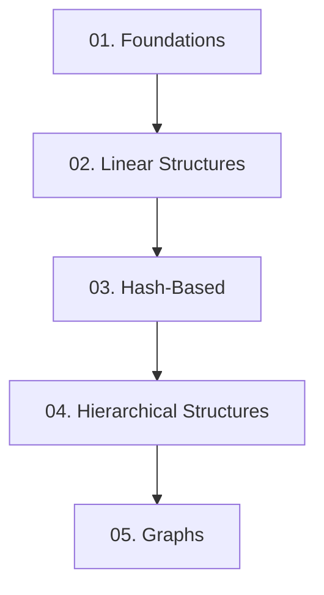

# Estruturas de Dados (Data Structures)

Bem-vindo ao módulo de estudos de **Estruturas de Dados**. Este repositório foi construído para servir como um guia completo, cobrindo desde os fundamentos teóricos até implementações práticas e análises matemáticas avançadas utilizando a linguagem de programação **Java**.

---

## Por que estudar Estruturas de Dados?

As estruturas de dados são a base da computação moderna. Elas determinam como organizamos, armazenamos e manipulamos dados na memória do computador. A escolha da estrutura correta pode significar a diferença entre um sistema que executa em frações de segundo e um que trava ou consome recursos excessivos.

Estudar este assunto a fundo permite:
1. **Escrever código eficiente**: Compreender os trade-offs de tempo (`Time Complexity`) e espaço (`Space Complexity`).
2. **Resolver problemas complexos**: Muitas soluções elegantes de algoritmos dependem diretamente de modelar o problema com a estrutura correta (ex: grafos para redes sociais, filas de prioridade para agendamento).
3. **Destacar-se em entrevistas técnicas**: As principais empresas de tecnologia avaliam rigorosamente o domínio de estruturas de dados e algoritmos.

---

## Roadmap Geral

O aprendizado está estruturado de forma incremental. Recomenda-se seguir a ordem proposta abaixo:

### [Módulo 1: Foundations](./01-foundations/)
- [01. Introdução a Estruturas de Dados e ADTs](./01-foundations/01-introduction-to-data-structures.md)
- [02. Análise de Complexidade de Algoritmos (Notação Big O)](./01-foundations/02-time-space-complexity-big-o.md)

### [Módulo 2: Linear Data Structures](./02-linear-structures/)
- [01. Arrays e Vetores Dinâmicos](./02-linear-structures/01-arrays-and-dynamic-arrays.md)
- [02. Listas Encadeadas (Singles, Double, Circular)](./02-linear-structures/02-linked-lists.md)
- [03. Pilhas (Stacks)](./02-linear-structures/03-stacks.md)
- [04. Filas e Deques (Queues and Deques)](./02-linear-structures/04-queues-and-deques.md)

### [Módulo 3: Hash-Based Structures](./03-hash-based/)
- [01. Tabelas Hash (Hash Tables)](./03-hash-based/01-hash-tables.md)

### [Módulo 4: Non-Linear Hierarchical Structures](./04-hierarchical-structures/)
- [01. Árvores Gerais e Árvores Binárias](./04-hierarchical-structures/01-trees-and-binary-trees.md)
- [02. Árvores Binárias de Busca (BST)](./04-hierarchical-structures/02-binary-search-trees.md)
- [03. Árvores Balanceadas (AVL e Red-Black)](./04-hierarchical-structures/03-avl-and-red-black-trees.md)
- [04. Heaps e Filas de Prioridade](./04-hierarchical-structures/04-heaps-and-priority-queues.md)

### [Módulo 5: Graphs](./05-graphs/)
- [01. Representações de Grafos](./05-graphs/01-graph-representations.md)
- [02. Percursos em Grafos (BFS e DFS)](./05-graphs/02-graph-traversals.md)

---

## Como Utilizar este Material

1. **Acompanhe o Progresso**: Utilize o arquivo [progress.md](./progress.md) para gerenciar o que você já estudou.
2. **Consulte Termos Rápidos**: Utilize o [glossary.md](./glossary.md) sempre que encontrar um conceito ou termo especializado que não se recorde imediatamente.
3. **Execute os Códigos**: Todos os tópicos contêm exemplos em **Java**. Escreva, compile e execute esses arquivos em sua IDE para consolidar as operações e depurar as referências/ponteiros de objetos.
