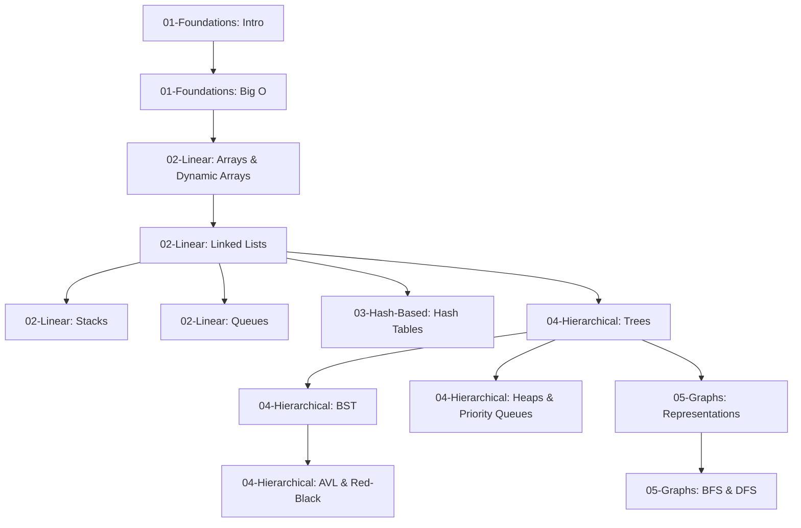

# Roadmap de Estruturas de Dados

Este documento define a ordem recomendada de estudo e as dependências entre os tópicos do assunto.

## Índice de Tópicos e Dependências

### Módulo 1: Foundations (Fundamentos)
1. **[01. Introdução a Estruturas de Dados](./01-foundations/01-introduction-to-data-structures.md)**
   - *Dependências*: Nenhuma.
   - *Descrição*: Entenda o conceito de estruturas de dados e Tipos Abstratos de Dados (ADTs).
2. **[02. Análise de Complexidade e Notação Big O](./01-foundations/02-time-space-complexity-big-o.md)**
   - *Dependências*: [Introdução a Estruturas de Dados](./01-foundations/01-introduction-to-data-structures.md).
   - *Descrição*: Ferramentas matemáticas para avaliar tempo e espaço consumidos por algoritmos.

### Módulo 2: Linear Data Structures (Estruturas Lineares)
3. **[01. Arrays e Vetores Dinâmicos](./02-linear-structures/01-arrays-and-dynamic-arrays.md)**
   - *Dependências*: [Análise de Complexidade](./01-foundations/02-time-space-complexity-big-o.md).
   - *Descrição*: Estruturas com alocação contígua e redimensionamento dinâmico.
4. **[02. Listas Encadeadas](./02-linear-structures/02-linked-lists.md)**
   - *Dependências*: [Arrays e Vetores Dinâmicos](./02-linear-structures/01-arrays-and-dynamic-arrays.md).
   - *Descrição*: Nós conectados por referências na memória Heap do Java.
5. **[03. Pilhas (Stacks)](./02-linear-structures/03-stacks.md)**
   - *Dependências*: [Listas Encadeadas](./02-linear-structures/02-linked-lists.md).
   - *Descrição*: Lógica LIFO e suas variadas aplicações de chamadas e reversão.
6. **[04. Filas e Deques (Queues & Deques)](./02-linear-structures/04-queues-and-deques.md)**
   - *Dependências*: [Listas Encadeadas](./02-linear-structures/02-linked-lists.md).
   - *Descrição*: Lógica FIFO e manipulação pelas duas extremidades.

### Módulo 3: Hash-Based Structures (Estruturas Baseadas em Espalhamento)
7. **[01. Tabelas Hash](./03-hash-based/01-hash-tables.md)**
   - *Dependências*: [Arrays e Vetores Dinâmicos](./02-linear-structures/01-arrays-and-dynamic-arrays.md) e [Listas Encadeadas](./02-linear-structures/02-linked-lists.md).
   - *Descrição*: Otimização de busca amortizada O(1) usando funções de espalhamento e tratamento de colisões.

### Módulo 4: Non-Linear Hierarchical Structures (Estruturas Hierárquicas)
8. **[01. Árvores Gerais e Árvores Binárias](./04-hierarchical-structures/01-trees-and-binary-trees.md)**
   - *Dependências*: [Listas Encadeadas](./02-linear-structures/02-linked-lists.md) e Recursão.
   - *Descrição*: Hierarquia, árvores binárias e percursos em profundidade/largura.
9. **[02. Árvores Binárias de Busca (BST)](./04-hierarchical-structures/02-binary-search-trees.md)**
   - *Dependências*: [Árvores Gerais e Árvores Binárias](./04-hierarchical-structures/01-trees-and-binary-trees.md).
   - *Descrição*: Ordenação natural em árvore e busca binária eficiente.
10. **[03. Árvores Balanceadas (AVL e Red-Black)](./04-hierarchical-structures/03-avl-and-red-black-trees.md)**
    - *Dependências*: [Árvores Binárias de Busca (BST)](./04-hierarchical-structures/02-binary-search-trees.md).
    - *Descrição*: Garantias de pior caso $O(\log n)$ por meio de rotações automáticas.
11. **[04. Heaps e Filas de Prioridade](./04-hierarchical-structures/04-heaps-and-priority-queues.md)**
    - *Dependências*: [Arrays e Vetores Dinâmicos](./02-linear-structures/01-arrays-and-dynamic-arrays.md) e [Árvores Gerais e Árvores Binárias](./04-hierarchical-structures/01-trees-and-binary-trees.md).
    - *Descrição*: Heaps estruturados sobre vetores e ordenação rápida de prioridades.

### Módulo 5: Graphs (Grafos)
12. **[01. Representações de Grafos](./05-graphs/01-graph-representations.md)**
    - *Dependências*: [Listas Encadeadas](./02-linear-structures/02-linked-lists.md) e [Tabelas Hash](./03-hash-based/01-hash-tables.md).
    - *Descrição*: Vértices, arestas e sua modelagem como Matriz ou Lista de Adjacência.
13. **[02. Percursos em Grafos (BFS & DFS)](./05-graphs/02-graph-traversals.md)**
    - *Dependências*: [Representações de Grafos](./05-graphs/01-graph-representations.md), [Pilhas](./02-linear-structures/03-stacks.md) e [Filas](./02-linear-structures/04-queues-and-deques.md).
    - *Descrição*: Varredura sistemática de grafos para achar caminhos mínimos e componentes conexos.
