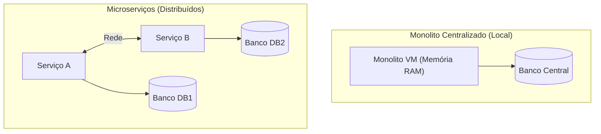

# 01. Introdução aos Sistemas Distribuídos e Falácias da Rede

## Objetivo
Ao final deste capítulo, você será capaz de conceituar o que caracteriza um sistema distribuído, identificar os motivos reais pelos quais a indústria migra para sistemas distribuídos e descrever detalhadamente as **8 Falácias da Computação Distribuída** formuladas por L. Peter Deutsch, reconhecendo suas manifestações em sistemas de produção.

---

## Motivação
Imagine que você está desenvolvendo uma plataforma de pagamentos simples. No início, toda a aplicação roda em um único servidor físico conectando-se a um único banco de dados local. Chamar uma classe de serviço de cobrança a partir da classe de controle é uma operação de memória instantânea, garantida pela JVM e pelo sistema operacional: ou a memória é acessada ou a JVM inteira cai.

No entanto, quando o número de transações diárias passa de milhares para milhões, um único servidor não consegue mais processar a carga. Você decide separar a aplicação em dois servidores: um para o Processamento de Pagamentos e outro para a Conta Corrente (Ledger). Agora, a chamada de serviço que antes durava nanossegundos em memória é feita através de um cabo de rede (HTTP/REST). 

Se você tratar essa nova chamada de rede com a mesma mentalidade de uma chamada em memória local, seu sistema falhará silenciosamente: threads ficarão travadas esperando respostas de rede que nunca chegarão, pacotes de transações financeiras serão duplicados ou perdidos no ar, e a aplicação inteira travará. Entender as limitações físicas da rede é o primeiro passo para não projetar um monolito distribuído frágil.

---

## Pré-requisitos
* Experiência intermediária em programação orientada a objetos (Java ou Kotlin).
* Noções básicas de comunicação web (conceito de requisição HTTP e portas TCP/IP).

---

## Conceitos Fundamentais

### 1. Definição de Sistema Distribuído
Um sistema distribuído é uma coleção de computadores fisicamente independentes (nós) que se comunicam estritamente por **troca de mensagens em rede** e se apresentam para o usuário final como um único sistema unificado.
Existem três pilares físicos fundamentais que diferenciam esse ambiente de uma máquina local:
1. **Ausência de memória compartilhada**: O Nó A não consegue ler os registradores ou a memória RAM do Nó B. A única forma de sincronizar estados é codificar dados em bytes e enviá-los por um canal físico de rede.
2. **Ausência de relógio global**: Não há como garantir que o relógio físico do Nó A marque exatamente o mesmo microssegundo do Nó B.
3. **Falhas independentes (parciais)**: O Nó B pode queimar ou travar sem que o Nó A tome conhecimento disso imediatamente, diferentemente de um sistema local onde a falha do processador derruba toda a execução.

---

### 2. Escalabilidade Vertical (Scale-Up) vs. Horizontal (Scale-Out)
* **Escalabilidade Vertical (Scale-up)**: Adicionar mais recursos de hardware (CPU, memória RAM, discos mais rápidos) a um único servidor existente.
  * *Trade-off*: Simples de manter e programar, mas possui limites físicos térmicos e econômicos intransponíveis (curva de custo exponencial após determinado patamar).
* **Escalabilidade Horizontal (Scale-out)**: Adicionar mais servidores de baixo custo (*commodity hardware*) trabalhando em conjunto em um cluster.
  * *Trade-off*: Permite crescimento teórico infinito com custo linear, mas introduz toda a complexidade de redes, consistência e tolerância a falhas parciais.

---

### 3. As 8 Falácias da Computação Distribuída
Nos anos 1990, L. Peter Deutsch e outros pioneiros da Sun Microsystems compilaram uma lista de suposições falsas que engenheiros de software costumam fazer ao projetar sistemas distribuídos pela primeira vez. Ignorar essas falácias é a causa raiz da maioria dos travamentos de produção.

#### Falácia 1: A rede é confiável (The network is reliable)
* **A Realidade**: Placas de rede falham, roteadores sofrem sobrecarga e descartam pacotes, cabos de fibra ótica de datacenters são rompidos acidentalmente e conexões sem fio sofrem interferência.
* **Impacto**: Se sua aplicação assume que a chamada sempre chegará ao destino, ela travará quando um roteador cair no meio da transação.

#### Falácia 2: A latência é zero (Latency is zero)
* **A Realidade**: Chamar um método local de memória RAM leva entre 10 e 100 nanossegundos. Enviar uma requisição de rede para outro servidor no mesmo datacenter leva entre 0.5 e 2 milissegundos (uma diferença de até 20.000 vezes). Se a requisição cruzar continentes, a velocidade da luz no cabo de fibra ótica limita fisicamente a latência a no mínimo 70-150 milissegundos.
* **Impacto**: Desenhar arquiteturas altamente "tagarelas" (onde um serviço faz dezenas de chamadas síncronas de rede para resolver uma única requisição de usuário) causa uma latência acumulada inaceitável.

#### Falácia 3: A largura de banda é infinita (Bandwidth is infinite)
* **A Realidade**: Embora as redes modernas sejam rápidas (10Gbps+), a quantidade de dados transmitidos concorrentemente em larga escala é um gargalo físico real.
* **Impacto**: Trafegar payloads gigantescos desnecessariamente (como grandes arquivos JSON ou XML) congestiona os buffers dos roteadores e aumenta o tempo de transmissão.

#### Falácia 4: A rede é segura (The network is secure)
* **A Realidade**: Qualquer tráfego de rede física pode ser interceptado, inspecionado ou modificado se não houver criptografia.
* **Impacto**: Confiar cegamente que "a rede interna do datacenter é segura" e não usar TLS ou autenticação forte expõe o sistema a ataques de interceptação (*man-in-the-middle*).

#### Falácia 5: A topologia não muda (Topology does not change)
* **A Realidade**: Servidores entram e saem da rede constantemente (autoscaling na nuvem, falhas de hardware, restarts do Kubernetes).
* **Impacto**: Hardcodar endereços IP nas configurações de microserviços garante que o sistema falhará na primeira atualização dinâmica da infraestrutura.

#### Falácia 6: Há apenas um administrador (There is one administrator)
* **A Realidade**: Diferentes microserviços e infraestruturas são operados por diferentes times, provedores de nuvem (AWS/Azure) ou terceiros.
* **Impacto**: Mudanças de segurança, políticas de firewall ou deploys de novas versões feitos por um time podem derrubar silenciosamente a comunicação do seu serviço.

#### Falácia 7: O custo de transporte é zero (Transport cost is zero)
* **A Realidade**: Serializar dados de objetos em memória para bytes e depois deserializá-los no destino consome muita CPU. Além disso, taxas de transferência de rede cobradas por provedores de nuvem (como taxas de saída de dados entre regiões) representam custos financeiros massivos em larga escala.
* **Impacto**: Negligenciar a eficiência da serialização aumenta drasticamente o custo operacional da empresa.

#### Falácia 8: A rede é homogênea (The network is homogeneous)
* **A Realidade**: O sistema distribuído se comunica com sistemas operacionais diferentes, roteadores de marcas diferentes e linguagens de programação diversas.
* **Impacto**: Assumir formatos proprietários de comunicação (como serialização nativa do Java) impede a integração com serviços escritos em Python, Go ou Kotlin.

---

## Funcionamento Interno
Quando você dispara uma chamada de rede em nível de aplicação (ex: `client.getBalance(accountId)`):
1. **Serialização**: O framework de aplicação serializa o objeto em bytes (JSON/Protobuf).
2. **Buffer de Escrita**: Os bytes são copiados para o buffer do socket TCP do sistema operacional da máquina de origem.
3. **Pacotes IP**: O sistema operacional fragmenta os bytes em pacotes TCP/IP.
4. **Trânsito Físico**: Roteadores e switches direcionam os pacotes através de cabos de rede físicos até o destino. Se houver congestionamento em um switch, os pacotes ficam em uma fila física de buffer local. Se a fila encher, pacotes são descartados (*drop*).
5. **Recepção e Reconstrução**: O sistema operacional de destino recebe os pacotes (que podem chegar fora de ordem), reagrupa-os em ordem no buffer de leitura do socket e notifica a aplicação servidora.
6. **Deserialização**: O servidor converte os bytes de volta para o objeto de aplicação.

A latência física é composta de:

$$
\text{Latência Total} = \text{Tempo de Processamento (CPU)} + \text{Tempo de Transmissão (tamanho/velocidade do link)} + \text{Tempo de Propagação (distância física)} + \text{Tempo de Fila (roteadores)}
$$

---

## Arquitetura
A decisão arquitetural primária é como estruturar a comunicação física e lógica.



* **Monolito Centralizado**: O acoplamento temporal é total, mas a latência de chamada é zero.
* **Microserviços Distribuídos**: Cada serviço é dono de seu dado. Reduz o acoplamento organizacional, mas introduz latência física de rede em todas as fronteiras de serviços e exige controle de falhas parciais.

---

## Exemplos

### Antipadrão: Chamada de Rede Ingênua (Tratada como chamada local)
O código abaixo demonstra um erro clássico: chamar outro serviço via rede sem configurar timeouts e tratamento de falhas físicas. Se a rede oscilar ou o serviço de Ledger ficar lento, as threads do serviço de pagamentos ficarão bloqueadas indefinidamente, causando degradação total do sistema.

```kotlin
// ARQUIVO: PaymentServiceNaive.kt
package com.distribuidos.naive

import java.net.URI
import java.net.http.HttpClient
import java.net.http.HttpRequest
import java.net.http.HttpResponse

class PaymentServiceNaive {
    // HttpClient padrão sem timeout de conexão configurado
    private val httpClient = HttpClient.newHttpClient()

    fun processPayment(accountId: String, amount: Double): String {
        val request = HttpRequest.newBuilder()
            .uri(URI.create("http://ledger-service/accounts/$accountId/debit?amount=$amount"))
            .POST(HttpRequest.BodyPublishers.noBody())
            .build() // PERIGO: Nenhum timeout de leitura definido na requisição!
            
        // Se a rede falhar ou o ledger ficar lento, essa linha bloqueia a thread executora por tempo indeterminado
        val response = httpClient.send(request, HttpResponse.BodyHandlers.ofString())
        
        return response.body()
    }
}
```

### Abordagem Correta: Chamada Resiliente com Timeouts e Falha Graciosa
Abaixo, o código configura limites de tempo de conexão e leitura rígidos, além de capturar exceções físicas de rede para responder de forma resiliente.

```kotlin
// ARQUIVO: PaymentServiceResilient.kt
package com.distribuidos.resilient

import java.io.IOException
import java.net.URI
import java.net.http.HttpClient
import java.net.http.HttpConnectTimeoutException
import java.net.http.HttpRequest
import java.net.http.HttpResponse
import java.time.Duration

class PaymentServiceResilient {
    
    // Configura um timeout de conexão física global de 2 segundos
    private val httpClient = HttpClient.newBuilder()
        .connectTimeout(Duration.ofSeconds(2))
        .build()

    fun processPayment(accountId: String, amount: Double): PaymentResponse {
        val request = HttpRequest.newBuilder()
            .uri(URI.create("http://ledger-service/accounts/$accountId/debit?amount=$amount"))
            .timeout(Duration.ofSeconds(3)) // Timeout de leitura: desiste se o servidor demorar mais de 3 segundos
            .POST(HttpRequest.BodyPublishers.noBody())
            .build()
            
        return try {
            val response = httpClient.send(request, HttpResponse.BodyHandlers.ofString())
            
            if (response.statusCode() == 200) {
                PaymentResponse.Success(transactionId = response.body())
            } else {
                PaymentResponse.Failed("Servidor retornou erro: ${response.statusCode()}")
            }
        } catch (e: HttpConnectTimeoutException) {
            // Falha física ao tentar fechar a conexão de rede
            PaymentResponse.Failed("Serviço de Ledger inacessível na rede (Timeout de conexão)")
        } catch (e: IOException) {
            // Queda física da rede ou conexão fechada abruptamente no trânsito
            PaymentResponse.Failed("Falha física de rede durante a transação")
        } catch (e: InterruptedException) {
            Thread.currentThread().interrupt()
            PaymentResponse.Failed("Operação abortada localmente")
        }
    }
}

sealed class PaymentResponse {
    data class Success(val transactionId: String) : PaymentResponse()
    data class Failed(val reason: String) : PaymentResponse()
}
```

---

## Casos de Uso
* **Netflix**: Migrou de uma arquitetura monolítica para milhares de microserviços. Para tolerar a *Falácia 1 (A rede é confiável)* e *Falácia 2 (A latência é zero)*, eles criaram bibliotecas de Circuit Breaker (Hystrix) e ferramentas para derrubar propositalmente servidores em produção (Chaos Monkey) a fim de validar se o sistema sobrevive a falhas físicas de rede.
* **Google Spanner**: Enfrentou a impossibilidade de manter relógios físicos sincronizados (gargalo de consistência em redes mundiais). Para mitigar as limitações físicas, o Google instalou relógios atômicos e GPS dedicados diretamente em seus datacenters para reduzir a janela de incerteza temporal das transações financeiras globais.

---

## Quando Utilizar
Sistemas distribuídos devem ser adotados **apenas** quando:
* O volume de processamento de dados excede o limite físico da maior máquina disponível no mercado (ex: indexação da web inteira).
* A alta disponibilidade é um requisito crítico de negócio (ex: o sistema de pagamentos de um banco não pode parar mesmo se um datacenter físico inteiro sofrer um blecaute).
* Há necessidade de reduzir latência geográfica distribuindo réplicas próximas a usuários finais em múltiplos países (Edge).

---

## Quando Não Utilizar
* **Monolitos locais/simples**: Se sua aplicação pode rodar confortavelmente em um único servidor em nuvem de tamanho médio com replicação passiva simples de banco de dados, evite a computação distribuída. Introduzir microserviços e chamadas de rede prematuramente causará o problema do **monolito distribuído**, adicionando complexidade acentuada sem qualquer benefício prático.

---

## Vantagens
* **Tolerância a Falhas**: A queda de um servidor não derruba o ecossistema inteiro.
* **Escalabilidade Horizontal**: Permite adicionar capacidade de processamento apenas adicionando novos servidores de baixo custo.
* **Flexibilidade Tecnológica**: Cada componente pode ser programado na linguagem ideal para o seu domínio (homogeneidade não é exigida).

---

## Desvantagens
* **Complexidade de Depuração**: Rastrear logs e pilhas de execução de chamadas que cruzam dezenas de servidores de rede é uma tarefa altamente complexa.
* **Incerteza de Estado**: É impossível para um nó saber o estado exato de outro nó no microssegundo atual devido à latência física de rede.
* **Consistência Fraca**: Replicar dados em rede exige escolher entre consistência forte e performance de gravação rápida.

---

## Comparações

| Dimensão | Chamada em Memória (Local) | Chamada de Rede (Distribuído) |
|---|---|---|
| **Velocidade típica** | 10 a 100 nanossegundos | 1 a 150 milissegundos (até 1.500.000× mais lento) |
| **Modelo de falha** | Binário (ou roda tudo ou a aplicação cai inteira) | Parcial (o cliente continua rodando, o servidor cai ou a rede some) |
| **Garantia de entrega** | 100% garantido pela CPU/JVM | Sem garantia sem protocolos de confirmação redundantes |
| **Segurança** | Protegido pelo isolamento de memória do SO | Aberto a interceptação se não houver criptografia física/lógica |

---

## Erros Comuns
1. **Timeout Padrão Infinito**: Confiar nos timeouts padrão de clientes HTTP ou bibliotecas de conexões de banco de dados, que costumam ser infinitos por padrão ou configurados em minutos.
2. **Ignorar Redundância e Retries**: Fazer uma chamada de rede sensível apenas uma vez e retornar erro ao usuário na primeira perda de pacotes, sem tentar um retry resiliente.
3. **Não Tratar Eventos Duplicados**: Fazer retries de requisições de débito financeiro sem que o servidor de destino possua verificação de idempotência, resultando em cobranças duplicadas do cliente.

---

## Projeto Prático
Neste capítulo, iniciamos o design conceitual da nossa plataforma de **FinTech Ledger**.
Como primeiro passo prático, desenharemos as interfaces e limites lógicos iniciais dos nossos dois serviços fundamentais:
1. `PaymentService`: Serviço que recebe requisições de pagamento dos clientes.
2. `LedgerService`: Livro-razão que registra débitos e créditos de contas.

Abaixo está o design inicial em Kotlin simulando as assinaturas de contrato que evoluirão para chamadas distribuídas reais no Módulo 2.

```kotlin
// ARQUIVO: AccountInterfaces.kt
package com.distribuidos.projeto

// Contrato de interface conceitual para o Ledger. 
// Atualmente, as assinaturas de métodos parecem locais, mas prepare-se: 
// nas próximas etapas, a implementação precisará tratar falhas de rede físicas.
interface LedgerService {
    /**
     * Registra uma transferência de fundos entre duas contas.
     * @throws DebitException se a conta de origem não tiver saldo suficiente.
     * @throws NetworkException simulada em etapas futuras para representar falhas físicas.
     */
    fun transfer(fromAccountId: String, toAccountId: String, amount: Double): TransactionResult
}

sealed class TransactionResult {
    data class Success(val transactionId: String, val timestamp: Long) : TransactionResult()
    data class Failed(val reason: String) : TransactionResult()
}
```

---

## Exercícios

### Básico
1. Explique por que tratar chamadas de rede distribuídas como chamadas de métodos locais da JVM é considerado um antipadrão arquitetural grave.
2. Cite 3 das 8 Falácias da Computação Distribuída que afetam diretamente o tempo de resposta percebido pelo usuário final de uma aplicação web.

### Intermediário
3. Considere que um servidor A em São Paulo precisa consultar o saldo de uma conta em um servidor B em Frankfurt (distância aproximada de 9.800 km). Sabendo que a velocidade da luz na fibra ótica é de aproximadamente 200.000 km/s e assumindo processamento local nulo e nenhuma perda de pacotes, calcule o limite físico teórico mínimo para o tempo de resposta (*Round Trip Time - RTT*). Por que a latência real medida na internet será superior a esse valor?

### Avançado
4. Escreva um pequeno programa em Kotlin ou Java que use o `HttpClient` nativo para fazer chamadas HTTP consecutivas a uma API pública externa (ex: `https://httpbin.org/delay/2`). Implemente um loop que tente reexecutar a chamada em caso de falha de rede utilizando a estratégia de **Linear Backoff** (esperar tempo incremental fixo a cada tentativa). Limite a execução a 3 tentativas e trate as exceções de timeout de forma apropriada.

---

## Perguntas de Entrevista
1. **O que é o acoplamento temporal em sistemas distribuídos e como a mensageria assíncrona ajuda a mitigá-lo?**
   * *Resposta esperada*: O acoplamento temporal ocorre quando o remetente de uma requisição exige que o destinatário esteja ativo e disponível exatamente no mesmo instante de tempo para que a operação tenha sucesso. Em caso de queda do destinatário, o fluxo inteiro falha. A mensageria assíncrona desacopla esse fluxo inserindo um message broker (como Kafka/RabbitMQ) entre os nós. O remetente grava o evento e segue em frente; o receptor processa a mensagem quando estiver ativo, tolerando indisponibilidades temporárias do receptor.

2. **Como a Falácia 5 (A topologia não muda) afeta a arquitetura de containers modernos e qual é o papel do Service Discovery nesse contexto?**
   * *Resposta esperada*: Em infraestruturas modernas de containers e nuvem (Kubernetes), servidores entram e saem de funcionamento a todo momento para escalabilidade e recuperação de falhas, mudando seus endereços IPs físicos constantemente. Se confiarmos que a topologia de rede é estática, o sistema quebrará rapidamente. O Service Discovery resolve isso mantendo um registro dinâmico dos nós ativos e mapeando nomes de serviços lógicos para IPs físicos de forma dinâmica (ex: CoreDNS, Consul).

---

## Resumo
* Sistemas distribuídos não compartilham memória nem possuem relógios perfeitamente sincronizados; a comunicação depende exclusivamente de trocas de mensagens físicas em rede.
* As 8 falácias da computação distribuída alertam sobre suposições incorretas de confiabilidade, latência nula, largura de banda infinita, segurança absoluta, topologia estática, administração única, transporte gratuito e homogeneidade de rede.
* Programar para sistemas distribuídos exige aceitar falhas parciais e implementar resiliência (timeouts, capturas de erros de rede e repetições controladas).

---

## Próximo Capítulo
No [Capítulo 02: Modelos de Tempo e Modelos de Falha](./02-timing-and-failure-models.md), estudaremos como a computação clássica modela matematicamente o tempo de entrega de mensagens (modelos síncronos vs. assíncronos) e os limites de tolerância a falhas parciais (dos travamentos simples até a traição bizantina).

---

## Referências
* **Designing Data-Intensive Applications**, Martin Kleppmann. Capítulo 8: *The Trouble with Distributed Systems*.
* **Distributed Systems**, Maarten van Steen e Andrew S. Tanenbaum. Capítulo 1: *Introduction*.
* **The Amazon Builders' Library**: *Avoiding Fallback in Distributed Systems*.