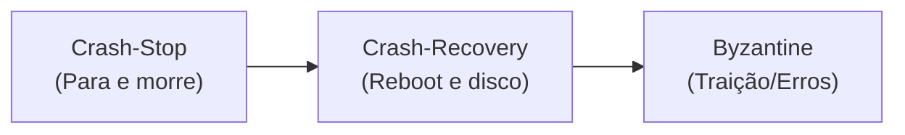
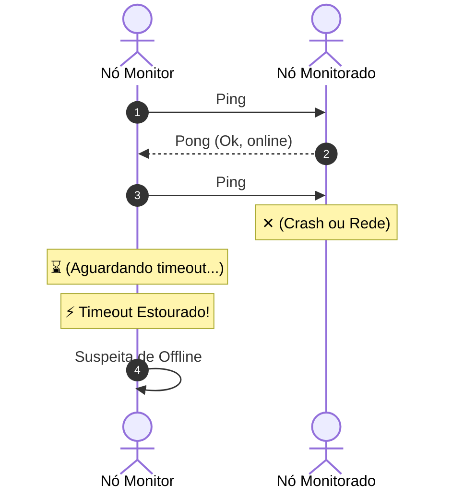

# 02. Modelos de Tempo e Modelos de Falha

## Objetivo
Ao final deste capítulo, você será capaz de diferenciar os três modelos de tempo físicos (Síncrono, Assíncrono e Parcialmente Síncrono), identificar e classificar falhas de nós em quatro níveis (de Crash-Stop a Bizantino) e explicar por que é impossível construir um detector de falhas perfeito em redes assíncronas.

---

## Motivação
Em uma aplicação monolítica rodando localmente, se o módulo de banco de dados parar de responder, o sistema operacional ou a JVM derrubam o processo imediatamente, permitindo diagnóstico instantâneo. Mas em um sistema distribuído, se o `PaymentService` chama o `LedgerService` via rede e não recebe resposta, o que aconteceu?
1. O nó do `LedgerService` queimou física e permanentemente?
2. O processo do `LedgerService` travou temporariamente por causa de um Garbage Collection (GC) longo da JVM?
3. O switch de rede intermediário congestionou e descartou a requisição?
4. O `LedgerService` processou o débito, mas a mensagem de confirmação de volta se perdeu no cabo?

Para o cliente, todos esses cenários se manifestam exatamente da mesma forma: **silêncio**. Sem um modelo rigoroso de tempo e falhas, você não conseguirá decidir se deve reexecutar a cobrança (risco de duplicidade) ou assumir que o nó morreu.

---

## Pré-requisitos
* [Capítulo 01: Introdução aos Sistemas Distribuídos e Falácias da Rede](./01-introduction-and-fallacies.md).

---

## Conceitos Fundamentais

### 1. Modelos de Tempo (Timing Models)
Para projetar algoritmos distribuídos que funcionem em redes reais, a ciência da computação define três premissas de tempo:

#### 1.1. Modelo Síncrono (Synchronous System Model)
* **Definição**: Assume que existe um limite superior conhecido e fixo $D$ para o tempo de trânsito de qualquer mensagem na rede, e um limite superior para o tempo de processamento de qualquer nó.
* **Corretude**: Se uma mensagem não chegou dentro de $D$ segundos, o remetente pode afirmar com **absoluta certeza** que a mensagem foi perdida ou que o destinatário falhou.
* **Realidade**: É uma abstração irrealista para redes WAN ou internet. Redes reais sofrem com flutuações de tráfego, retransmissões e filas nos roteadores.

#### 1.2. Modelo Assíncrono (Asynchronous System Model)
* **Definição**: Não assume qualquer limite de tempo para entrega de mensagens ou execução de processos. Mensagens podem atrasar indefinidamente (embora eventualmente cheguem, se assumirmos que o canal é confiável).
* **Corretude**: Um algoritmo correto sob o modelo assíncrono é extremamente robusto: ele funciona mesmo se a rede parar temporariamente e depois voltar.
* **Limitação**: Algoritmos assíncronos não podem usar relógios físicos ou timeouts para garantir segurança, pois é impossível distinguir um nó morto de um nó extremamente lento.

#### 1.3. Modelo Parcialmente Síncrono (Partially Synchronous Model)
* **Definição**: O sistema se comporta de forma assíncrona por períodos arbitrários de tempo (com atrasos e perdas imprevisíveis), mas eventualmente se estabiliza e passa a se comportar de forma síncrona (dentro de limites conhecidos) após um instante denominado GST (*Global Stabilization Time*).
* **Realidade**: É o modelo padrão utilizado para projetar sistemas de produção reais na nuvem. Nós projetamos algoritmos que garantem que nenhuma informação seja corrompida durante a fase assíncrona (propriedade de *Safety*), e que o sistema consiga progredir assim que a rede se estabilizar após o GST (propriedade de *Liveness*).

---

### 2. Modelos de Falha de Nós (Failure Models)
Nós podem falhar de diferentes maneiras. A indústria organiza as falhas em níveis progressivos de severidade:



#### 2.1. Crash-Stop (Fail-Stop)
* **Comportamento**: O nó funciona perfeitamente até que, de repente, para de executar instruções e nunca mais se recupera. Outros nós podem confiar que seu estado congelou permanentemente.

#### 2.2. Crash-Recovery (Fail-Recovery)
* **Comportamento**: O nó pode falhar (crash) a qualquer momento, mas pode reiniciar (recovery) posteriormente. 
* **Stable Storage**: Ao retornar, o estado em memória RAM é perdido, mas o nó lê seus dados persistidos em disco (como o Write-Ahead Log - WAL) para reconstruir o estado histórico antes da falha e voltar a cooperar no cluster.

#### 2.3. Omission Faults (Falhas de Omissão)
* **Comportamento**: Um nó continua ativo, mas falha ao enviar ou receber mensagens da rede de forma intermitente (ex: perda de pacotes física ou buffers cheios no sistema operacional).

#### 2.4. Byzantine Faults (Falhas Bizantinas ou Arbitrárias)
* **Comportamento**: O nó exibe qualquer comportamento arbitrário. Ele pode omitir mensagens, travar, mas também pode enviar dados corrompidos, mentir sobre transações financeiras, ou enviar respostas contraditórias a nós diferentes (duplicidade).

---

### 3. Detectores de Falha (Failure Detectors)
Um detector de falhas é um mecanismo local que monitora o status de nós remotos. Um detector perfeito deve garantir:
1. **Completeness (Completude)**: Todo nó que falhar será eventualmente detectado (suspeitado) por nós saudáveis.
2. **Accuracy (Precisão)**: Nenhum nó saudável será suspeitado incorretamente de ter falhado.

> [!WARNING]
> **Impossibilidade Teórica**: Sob o modelo assíncrono de rede, é **matematicamente impossível** construir um detector de falhas que seja simultaneamente $100\%$ Completo e $100\%$ Preciso. Nós sempre teremos que escolher entre detectar falhas rapidamente (gerando falsos positivos) ou evitar falsos suspeitos (demorando muito para detectar nós realmente mortos).

---

## Funcionamento Interno

### Heartbeats (Batimentos Cardíacos)
O mecanismo padrão na indústria é o envio periódico de mensagens de vida.
* **Heartbeat Ativo**: O nó monitorado envia uma mensagem pequena (`I am alive`) para o nó monitor de tempos em tempos (ex: a cada 1 segundo). Se o monitor não receber a mensagem após um intervalo (timeout), suspeita do nó.
* **Ping-Pong**: O monitor envia um sinal `Ping` e aguarda o `Pong` do nó monitorado.



---

## Arquitetura
Como lidar com o status do nó na arquitetura:

* **Failover Ativo (Active-Passive)**: O líder atende às requisições. O nó passivo recebe heartbeats do líder. Se o passivo detectar ausência de heartbeats por um período limite, ele assume a liderança.
* **Risco de Split-Brain**: Se o líder estiver vivo, mas houver uma partição de rede impedindo o envio de heartbeats para o passivo, o passivo assumirá a liderança de forma errônea. Agora você tem dois líderes aceitando escritas independentes, corrompendo os dados do negócio.

---

## Exemplos

### Detector de Falhas Simples em Kotlin com Timeout Fixo
Abaixo, criamos uma classe simuladora de monitoramento. Ela registra os batimentos cardíacos recebidos e valida se o último pulso recebido excede um timeout estático.

```kotlin
// ARQUIVO: FixedTimeoutFailureDetector.kt
package com.distribuidos.falhas

import java.time.Instant

class FixedTimeoutFailureDetector(
    private val timeoutMillis: Long
) {
    private val lastHeartbeatMap = mutableMapOf<String, Instant>()

    // Chamado quando uma mensagem de heartbeat chega do nó
    fun recordHeartbeat(nodeId: String) {
        lastHeartbeatMap[nodeId] = Instant.now()
    }

    // Retorna true se suspeitamos que o nó falhou
    fun isSuspected(nodeId: String): Boolean {
        val lastPulse = lastHeartbeatMap[nodeId] ?: return true
        val durationSinceLastPulse = Instant.now().toEpochMilli() - lastPulse.toEpochMilli()
        return durationSinceLastPulse > timeoutMillis
    }
}
```

### Simulação Prática do Monitor de Nós sob Rede Instável
O exemplo a seguir simula uma thread em segundo plano coletando batimentos cardíacos e suspeitando de nós lentos ou caídos.

```kotlin
// ARQUIVO: HeartbeatMonitorSimulator.kt
package com.distribuidos.falhas

import kotlinx.coroutines.*
import java.util.concurrent.ConcurrentHashMap
import kotlin.random.Random

class NodeMonitor(
    private val detector: FixedTimeoutFailureDetector
) {
    private val nodesStatus = ConcurrentHashMap<String, String>()

    fun startMonitoring(scope: CoroutineScope) {
        scope.launch {
            while (isActive) {
                val nodes = listOf("Ledger-01", "Ledger-02", "Ledger-03")
                for (node in nodes) {
                    if (detector.isSuspected(node)) {
                        nodesStatus[node] = "OFFLINE"
                        println("[MONITOR] Alerta: Nó $node está suspeito de falha!")
                    } else {
                        nodesStatus[node] = "ONLINE"
                    }
                }
                delay(500) // Valida a cada 500ms
            }
        }
    }
}

fun main() = runBlocking {
    // Timeout fixo de 1.5 segundos
    val detector = FixedTimeoutFailureDetector(1500)
    val monitor = NodeMonitor(detector)
    
    val scope = CoroutineScope(Dispatchers.Default)
    monitor.startMonitoring(scope)

    // Simula o envio de heartbeats do Ledger-01 com oscilação de rede
    val simJob = scope.launch {
        for (i in 1..10) {
            println("[Ledger-01] Enviando heartbeat...")
            detector.recordHeartbeat("Ledger-01")
            
            // Simula latência variável na rede física
            val delayDuration = if (i == 5) 2000L else 800L
            delay(delayDuration)
        }
    }

    simJob.join()
    scope.cancel()
}
```

---

## Casos de Uso
* **Apache Cassandra**: Utiliza o **Phi Accrual Failure Detector** (baseado no paper de Hayashibara et al.). Em vez de usar um timeout fixo (ex: 2 segundos), o Cassandra registra o histórico de intervalos entre heartbeats de cada nó e calcula uma escala de probabilidade contínua $\Phi$. Se a latência da rede oscilar, o detector se adapta estatisticamente, evitando falsos alarmes de nós "fora do ar".
* **Kubernetes (K8s) Leases**: Desde a versão 1.14, o Kubernetes gerencia heartbeats de nós através de objetos do tipo `Lease` (locação). Cada nó Kubelet atualiza seu Lease a cada 10 segundos. Se o plano de controle (API Server) não detectar atualizações no Lease, ele suspeita do nó e agenda o despejo de pods (*pod eviction*), mas aguarda uma janela de tolerância para evitar ações precipitadas em caso de queda temporária.

---

## Quando Utilizar
* **Detecção Dinâmica**: Sempre implemente timeouts dinâmicos e políticas adaptativas quando seu sistema distribuído operar em nuvens públicas ou redes WAN compartilhadas, onde a variação de latência (jitter) é alta.

---

## Quando Não Utilizar
* **Sistemas Embarcados/Redes Locais de Altíssima Confiança**: Em barramentos industriais fechados com garantias físicas de latência determinística, timeouts fixos pequenos de milissegundos são seguros e evitam falsos positivos.

---

## Vantagens
* **Autonomia de Operação**: Permite que clusters se recuperem de falhas de hardware reelegendo novos líderes automaticamente sem intervenção humana.
* **Economia de Recursos**: Libera portas de conexões ao identificar de forma autônoma nós travados.

---

## Desvantagens
* **Incerteza Inevitável**: O sistema deve lidar com falsos positivos de detecção e implementar algoritmos robustos de quórum para evitar catástrofes como o Split-Brain.

---

## Comparações

### Modelos de Tempo

| Característica | Síncrono | Assíncrono | Parcialmente Síncrono |
|---|---|---|---|
| **Limite de tempo de rede ($D$)** | Garantido e conhecido | Inexistente/Arbitrário | Eventualmente garantido após GST |
| **Garantia de segurança de rede** | Alta (simples de garantir) | Difícil (exige algoritmos complexos) | Balanço real da indústria |
| **Uso prático** | Redes locais determinísticas (LANs industriais) | Modelagem teórica rigorosa | Internet e nuvem pública (AWS, GCP) |

### Modelos de Falha de Nós

| Modelo | O nó pode travar? | O nó se recupera? | O nó pode mentir/alterar dados? |
|---|---|---|---|
| **Crash-Stop** | Sim | Não | Não |
| **Crash-Recovery** | Sim | Sim (preserva disco) | Não |
| **Byzantine** | Sim | Sim | Sim (comportamento malicioso/bugs) |

---

## Erros Comuns
1. **Timeouts Excessivamente Curtos (Flapping)**: Definir o timeout de indisponibilidade de nó idêntico ao tempo do envio de batimento cardíaco (ex: heartbeat a cada 1s, timeout de 1.1s). Qualquer oscilação simples de rede fará o monitor declarar o nó como "offline" indevidamente, gerando reeleições desnecessárias de líderes (flapping).
2. **Ignorar a Persistência no Crash-Recovery**: Implementar a recuperação de nós após falhas limpando totalmente a base de dados de logs locais, assumindo que eles devem iniciar do zero. O nó recuperado deve se reconfigurar a partir do estado persistido em disco para não violar as garantias de consenso históricas.

---

## Projeto Prático
Nesta etapa, adicionamos uma simulação de monitoramento e detecção de status de réplicas ao nosso projeto de **FinTech Ledger**.
Simularemos em memória as threads de verificação para demonstrar como o serviço de pagamentos atualiza a lista de nós de Ledger que estão disponíveis para receber transações.

```kotlin
// ARQUIVO: LedgerReplicaMonitor.kt
package com.distribuidos.projeto

import java.time.Instant

data class ReplicaStatus(
    val nodeId: String,
    val isOnline: Boolean,
    val lastSeen: Instant
)

class LedgerReplicaMonitor(
    private val nodesList: List<String>,
    private val maxInactivityMillis: Long
) {
    private val replicasLastPulse = mutableMapOf<String, Instant>()

    init {
        // Inicializa todos como ativos ao iniciar
        nodesList.forEach { replicasLastPulse[it] = Instant.now() }
    }

    fun receivePulse(nodeId: String) {
        replicasLastPulse[nodeId] = Instant.now()
    }

    fun getHealthyReplicas(): List<String> {
        val now = Instant.now()
        return replicasLastPulse.filter { (_, lastSeen) ->
            val elapsed = now.toEpochMilli() - lastSeen.toEpochMilli()
            elapsed <= maxInactivityMillis
        }.keys.toList()
    }
}
```

---

## Exercícios

### Básico
1. Qual a diferença fundamental entre o modelo de falha **Crash-Stop** e o **Crash-Recovery**?
2. Explique o conceito de GST (*Global Stabilization Time*) no modelo parcialmente síncrono.

### Intermediário
3. Desenhe um fluxograma ou diagrama no papel demonstrando o cenário de **Split-Brain** gerado por uma partição de rede física em um cluster com 2 nós (Líder e Passivo), destacando o momento em que ambos passam a acreditar que são os líderes legítimos.

### Avançado
4. Modifique a classe `FixedTimeoutFailureDetector` do exemplo prático do capítulo para implementar uma política de **Timeout Adaptativo Histórico Simples**. A classe deve armazenar os últimos 5 intervalos entre heartbeats recebidos do nó e definir o timeout dinamicamente como $2.5 \times$ a média desses intervalos históricos. Se o desvio padrão for alto, o timeout deve subir proporcionalmente.

---

## Perguntas de Entrevista
1. **O Teorema de Impossibilidade FLP afirma que consenso determinístico é impossível em sistemas assíncronos em presença de falhas. Como contornamos isso em bancos de dados de produção reais como o Spanner ou clusters Raft?**
   * *Resposta esperada*: O Spanner e o Raft contornam o FLP abrindo mão da assincronia pura do modelo. Na prática, eles assumem **sincronia parcial** (uso de timeouts). Eles utilizam timeouts para detectar possíveis falhas e iniciar reeleições. Se a rede estiver temporariamente instável (período assíncrono), o algoritmo pode ficar bloqueado sem conseguir eleger um líder (liveness comprometida temporariamente), mas ele nunca violará a consistência dos dados históricos (safety garantida). Uma vez restabelecida a estabilidade da rede (pós-GST), o consenso progride normalmente.

2. **Como o Garbage Collection (GC) da JVM do Java afeta detectores de falhas baseados em timeouts fixos e como mitigar isso?**
   * *Resposta esperada*: Um ciclo longo de "Stop-the-World" do Garbage Collection na JVM suspende todas as threads da aplicação por segundos. Durante essa pausa, o nó falha ao enviar seus batimentos cardíacos. O monitor remoto registrará a ausência de heartbeats e declarará o nó como morto, disparando failover indevidamente. Para mitigar, deve-se otimizar as configurações do GC da JVM (usando GCs modernos como ZGC ou Shenandoah), ajustar timeouts de batimentos cardíacos para serem superiores ao tempo máximo aceitável de pausa de GC, e adotar algoritmos adaptativos (como o Phi Accrual) que toleram ruídos estatísticos.

---

## Resumo
* A corretude de algoritmos distribuídos é guiada pelo modelo de tempo assumido: síncrono (limites rígidos), assíncrono (sem limites) ou parcialmente síncrono (eventualmente estável).
* Nós falham por desligamento permanente (Crash-Stop), desligamento com recuperação (Crash-Recovery), falhas de trânsito de rede (Omission) ou comportamento arbitrário/mentira (Byzantine).
* Um detector de falhas prático monitora heartbeats locais e utiliza timeouts balanceados para classificar nós como suspeitos ou saudáveis.

---

## Próximo Capítulo
No [Módulo 2, Capítulo 01: Comunicação Síncrona: Sockets e APIs RESTful](./02-concurrency-ipc/01-sockets-and-rest.md), entraremos na prática da comunicação física direta entre processos. Veremos como o sistema operacional gerencia Sockets de rede e discutiremos a arquitetura de comunicação síncrona REST tradicional.

---

## Referências
* **Designing Data-Intensive Applications**, Martin Kleppmann. Capítulo 8: *The Trouble with Distributed Systems* (Seção sobre *Timeouts and Unbounded Delays*).
* **The Phi Accrual Failure Detector**, Naohiro Hayashibara, Xavier Défago, Péter Urbán, Takuya Katayama (2004).
* **Distributed Systems**, Maarten van Steen. Capítulo 8: *Fault Tolerance*.
