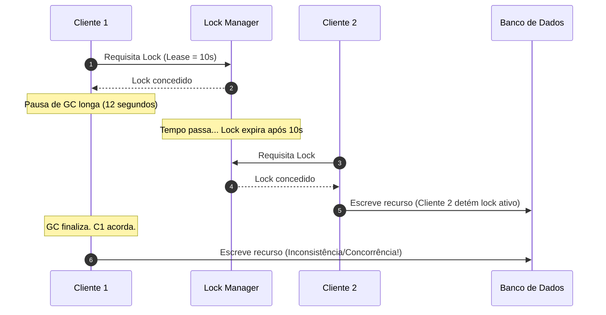
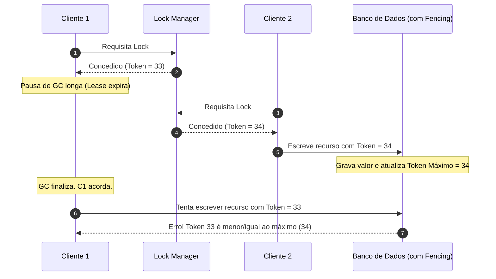

# Locks Distribuídos

## Objetivo
Ao final deste estudo, o estudante será capaz de compreender os desafios de garantir exclusão mútua em ambientes distribuídos, diagnosticar os perigos associados a falhas de relógio e pausas de execução (como *Garbage Collection*), avaliar o trade-off de algoritmos de lock distribuído (como Redlock vs. sistemas baseados em consenso) e aplicar soluções seguras utilizando *Fencing Tokens*.

## Pré-requisitos
Antes de iniciar este tópico, é altamente recomendável ter estudado:
* [Teorema CAP](01-cap-theorem.md)
* [Modelos de Consistência](02-consistency-models.md)
* [Consenso Distribuído](03-distributed-consensus.md)

---

## Conceitos Fundamentais

### Por que locks locais falham em ambientes distribuídos?
Em um único servidor (monólito), a exclusão mútua é garantida pelo Sistema Operacional ou pela *Runtime* da linguagem de programação usando a memória compartilhada (ex: `Mutex`, `semáforos`, `locks` internos sincronizados). 

Em uma arquitetura distribuída, no entanto:
1. **Não há memória compartilhada**: Múltiplos processos rodam em servidores físicos diferentes.
2. **Há falhas parciais**: Um servidor pode parar de responder temporariamente ou ser isolado da rede por uma partição (*split-brain*).
3. **Não há um relógio global unificado**: Relógios físicos derivam (*NTP drift*), impedindo a sincronização baseada em marcações de tempo absolutas.

Para garantir que apenas um nó execute uma determinada tarefa crítica por vez, precisamos de um coordenador de estado externo: o **Lock Distribuído**.

### Eficiência vs. Corretude
Martin Kleppmann propõe uma classificação fundamental sobre os motivos para se utilizar um lock distribuído:

1. **Para Eficiência (Evitar trabalho duplicado)**:
   * **Objetivo**: Economizar recursos computacionais (ex: processar um relatório pesado, renderizar uma imagem).
   * **Se o lock falhar**: Dois nós farão o trabalho concorrentemente. Haverá desperdício de recurso, mas nenhum dado será corrompido.
   * **Abordagem típica**: Banco de cache in-memory rápido e leve (ex: Redis simples, sem complexidade de consistência forte).
2. **Para Corretude (Evitar corrupção de dados)**:
   * **Objetivo**: Impedir que inconsistências sérias aconteçam (ex: processar duas vezes o pagamento de um cliente, decrementar estoque abaixo de zero).
   * **Se o lock falhar**: Dados serão corrompidos irreversivelmente, causando prejuízo financeiro ou inconsistência de estado.
   * **Abordagem típica**: Sistemas com garantia de consistência forte baseados em consenso (ex: etcd, ZooKeeper, Consul) e uso obrigatório de mecanismos de proteção contra concorrência tardia (*fencing*).

---

## Funcionamento Interno

### O Problema do Tempo: GC Pauses e Timeouts (Leases)
Em sistemas distribuídos, locks geralmente são implementados com um tempo de expiração associado (*lease* ou *Time-To-Live* - TTL). Isso evita que, caso o nó que detém o lock morra de forma abrupta, o recurso fique bloqueado para sempre (o lock expira sozinho).

No entanto, a combinação de expiração baseada em tempo com pausas de execução do processo (como a limpeza de memória promovida pelo *Garbage Collector* - GC) introduz uma brecha de segurança física grave.

#### Cenário de Quebra de Exclusão Mútua
Imagine que o Cliente 1 adquire um lock com duração de 10 segundos. Imediatamente após obter o lock e antes de escrever no banco de dados, o cliente sofre uma pausa de GC (*Stop-the-World*) que dura 12 segundos.
1. O lock expira no coordenador após 10 segundos.
2. O Cliente 2 adquire o mesmo lock.
3. O Cliente 2 realiza a alteração no armazenamento.
4. O Cliente 1 acorda da pausa do GC, assume que ainda possui o lock (pois seu código interno não sabe que esteve suspenso) e envia sua escrita ao banco de dados, corrompendo a alteração feita pelo Cliente 2.



### A Solução: Fencing Tokens (Tokens de Proteção)
Para resolver a falha causada por pausas de execução inesperadas, o gerenciador de lock deve gerar um **Fencing Token** a cada aquisição. Este token é um número estritamente crescente (um contador incremental ou número de transação).

O armazenamento de destino (ex: Banco de dados) deve participar do protocolo rejeitando qualquer escrita que venha com um token menor do que o último token que ele já aceitou e gravou.



---

## Comparações

### Coordenador baseado em Memória (Redis / Redlock) vs. Consenso Forte (etcd / ZooKeeper)

Existem duas abordagens principais para gerenciar o estado do lock distribuído no mercado:

| Critério | Locks In-Memory (Redis/Redlock) | Locks baseados em Consenso (etcd/ZooKeeper) |
| :--- | :--- | :--- |
| **Garantia Teórica** | Heurística. Depende de pressuposições sobre relógio de rede e latências máximas estáveis. | Algoritmo formal de Consenso (Raft/Paxos). Não depende de precisão de relógios. |
| **Desempenho** | **Excelente**. Operações em memória de alta taxa de transferência e baixíssima latência. | **Moderado**. Operações de escrita exigem replicação síncrona por quórum e gravação em disco (*WAL*). |
| **Lidando com Quedas** | Usa TTL. Se o master falhar antes de replicar, pode ocorrer perda de lock. | Usa sessões efêmeras atreladas a *heartbeats*. Se o cliente cai, a sessão expira e libera o lock de forma consistente. |
| **Indicado para** | Otimização de processos, cenários de **Eficiência**. | Operações financeiras, coordenação crítica, cenários de **Corretude**. |

---

## Casos de Uso
1. **Processamento Batch Distribuído**: Evitar que duas instâncias de um microsserviço leiam e processem as mesmas linhas de uma fila de tarefas legada.
2. **Geração de Relatórios Custosos**: Garantir que múltiplos usuários finais clicando simultaneamente em "Gerar PDF" não disparem consultas redundantes idênticas ao banco de dados.
3. **Consolidação Financeira Diária**: Executar o fechamento contábil de contas uma única vez por dia em apenas um nó do cluster.

---

## Erros Comuns

* **Achar que o Lock substitui validações ACID do banco**: O lock distribuído ajuda na coordenação global, mas a barreira final de segurança deve ser mantida pelo banco de dados (ex: restrições únicas, concorrência otimista com tokens).
* **Ausência de Bloco de Liberação Seguro**: Não colocar a liberação do lock dentro de uma cláusula `finally` ou equivalente. Se o código lançar uma exceção inesperada, o lock ficará retido até o TTL expirar, atrasando outros nós.
* **Ignorar tempos de execução reais do processo**: Definir um TTL excessivamente baixo (ex: 200ms) para um processo que pode levar até 2 segundos em picos de I/O, gerando constante concorrência e quebra do lock.

---

## Exemplos

### 1. Pseudo-código de Aquisição Insegura (Sem Fencing)
Abaixo, um exemplo simples em Redis de como *não* implementar concorrência crítica de dados, embora sirva bem para tarefas puramente de eficiência:

```javascript
const redis = require("redis");
const client = redis.createClient();

async function processarTarefaInsegura() {
    const lockKey = "lock:processamento_relatorio";
    const uniqueVal = generateUUID();
    const ttlMs = 5000; // 5 segundos

    // SET com NX (Set if Not eXists) e PX (TTL em milissegundos)
    const acquired = await client.set(lockKey, uniqueVal, { NX: true, PX: ttlMs });

    if (!acquired) {
        console.log("Não foi possível adquirir o lock. Tentando mais tarde...");
        return;
    }

    try {
        // Executa processamento...
        await gerarRelatorioPDF();
    } finally {
        // Libera apenas se o valor ainda for o mesmo (garante que não liberamos o lock de outro cliente)
        const luaScript = `
            if redis.call("get", KEYS[1]) == ARGV[1] then
                return redis.call("del", KEYS[1])
            else
                return 0
            end
        `;
        await client.eval(luaScript, 1, lockKey, uniqueVal);
    }
}
```

### 2. Implementação Robusta com Fencing Tokens (Corretude)
Neste modelo, usamos um banco relacional como o destino de persistência. O banco valida o número de sequência (*fencing token*):

```sql
-- Estrutura da tabela de controle no Banco de Dados
CREATE TABLE recursos_compartilhados (
    id VARCHAR(50) PRIMARY KEY,
    conteudo TEXT,
    last_fencing_token BIGINT NOT NULL DEFAULT 0
);
```

```javascript
async function processarComFencingToken(lockManager, dbClient) {
    // 1. Adquire o lock distribuído e recebe o token sequencial do gerenciador de locks (ex: etcd)
    const lock = await lockManager.acquire("resource_id_123");
    const fencingToken = lock.token; // Ex: 1045 (sempre incremental)

    try {
        // 2. Tenta fazer a atualização inserindo o fencing token no payload de escrita
        const query = `
            UPDATE recursos_compartilhados 
            SET conteudo = $1, last_fencing_token = $2
            WHERE id = $3 AND last_fencing_token < $2
        `;
        
        const result = await dbClient.query(query, ["Novo Conteúdo", fencingToken, "resource_id_123"]);

        if (result.rowCount === 0) {
            // Se nenhuma linha foi alterada, significa que um token mais alto já escreveu!
            throw new Error("Transação Rejeitada: Violação de Fencing Token (concorrência atrasada detectada).");
        }

        console.log("Alteração persistida com sucesso sob token:", fencingToken);
    } finally {
        // 3. Libera o lock
        await lock.release();
    }
}
```

---

## Exercícios

### Exercício 1: Diagnóstico de Concorrência
Analise o cenário abaixo:
> Uma API recebe requisições para transferir fundos entre contas. Para evitar race conditions, o time de engenharia colocou um lock distribuído simples usando Redis Redis com TTL de 3 segundos associado ao ID da conta. Em produção, 0.05% das transferências continuam duplicando valores em dias de sobrecarga extrema no servidor de banco de dados SQL.

1. Explique por que o lock distribuído falhou nesse cenário.
2. Proponha uma solução técnica robusta baseada nos conceitos estudados sem necessariamente aumentar o TTL.

*Dica de resposta*: Sobrecargas extremas geram lentidão nas conexões SQL. Se o tempo da transação SQL exceder os 3 segundos do TTL, o lock é liberado automaticamente e outro nó adquire o lock iniciando uma transação concorrente. A solução é acoplar um *Fencing Token* ou usar concorrência otimista direto no banco relacional.

### Exercício 2: Escolha de Coordenador
Indique qual tecnologia de coordenação (Redis/Redlock vs. ZooKeeper/Consul/etcd) você escolheria para as seguintes necessidades e justifique:
1. Um cluster de Web Scrapers onde precisamos garantir que duas máquinas não acessem a mesma URL do site alvo nos mesmos 10 minutos (risco de bloqueio de IP).
2. O agendador centralizado de um sistema de compensação de boletos bancários da compensação nacional (risco de pagar/cobrar duas vezes o mesmo lote de milhões).

---

## Referências
* **KLEPPMANN, Martin.** *How to do a distributed lock*. 2016. Disponível em: <https://martin.kleppmann.com/2016/02/08/how-to-do-distributed-lock.html> (Essencial para compreender a crítica ao Redlock e a conceituação de Fencing Tokens).
* **SANFILIPPO, Salvatore (antirez).** *Is Redlock safe?*. 2016. Disponível em: <http://antirez.com/news/1013> (A resposta do criador do Redis defendendo a heurística do Redlock).
* **KLEPPMANN, Martin.** *Designing Data-Intensive Applications*. O'Reilly Media, 2017. (Capítulo 8: *The Trouble with Distributed Systems*).
* **ETCD Core Concepts.** *Distributed Locks using etcd*. Disponível em: <https://etcd.io/>.
