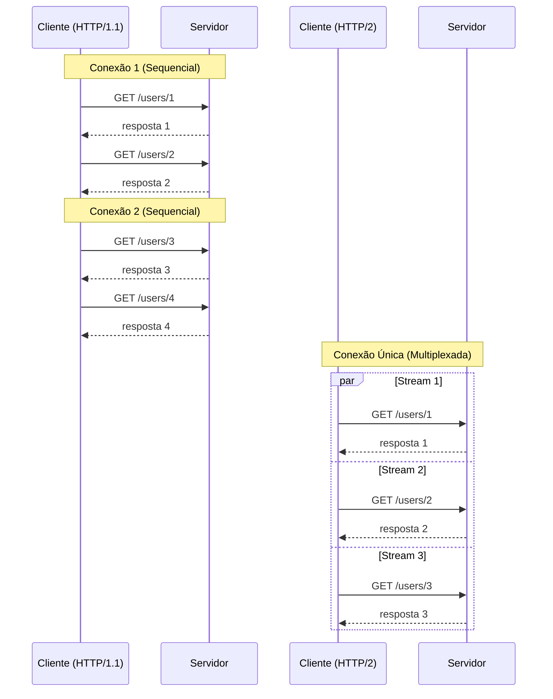
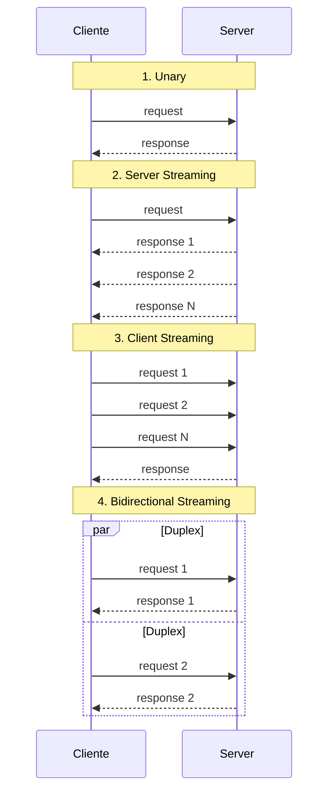

# REST e gRPC

## Objetivo

Comparar em profundidade os dois protocolos de comunicação síncrona mais usados em microserviços — REST (HTTP/JSON) e gRPC (HTTP/2 + Protocol Buffers) — entendendo quando usar cada um, como implementá-los em Go, e os trade-offs de performance, ecossistema e operação.

---

## Pré-requisitos

- [Síncrono vs Assíncrono](01-synchronous-vs-asynchronous.md)
- Conceitos de HTTP/1.1 e HTTP/2
- Noção de serialização de dados (JSON, Protobuf)

---

## Conceitos Fundamentais

### REST (Representational State Transfer)

REST é um **estilo arquitetural** (não um protocolo) para APIs sobre HTTP, baseado em recursos e verbos HTTP.

**Princípios REST**:
1. **Recursos** identificados por URLs: `/users/123`, `/orders/456`
2. **Verbos HTTP** para operações: `GET`, `POST`, `PUT`, `PATCH`, `DELETE`
3. **Stateless**: Cada requisição contém toda informação necessária
4. **Representações**: Dados em JSON, XML, etc.
5. **HATEOAS**: Links para navegação entre recursos (raramente implementado)

```
GET /api/v1/users/123 HTTP/1.1
Host: user-service
Accept: application/json

HTTP/1.1 200 OK
Content-Type: application/json

{
  "id": "123",
  "name": "Alice",
  "email": "alice@example.com"
}
```

### gRPC (Google Remote Procedure Call)

gRPC é um **framework de RPC** baseado em HTTP/2 e **Protocol Buffers** (Protobuf) para serialização.

**Características**:
1. **Contract-first**: API definida em arquivo `.proto`
2. **HTTP/2**: Multiplexação, streaming, header compression
3. **Protocol Buffers**: Serialização binária, eficiente e tipada
4. **Code generation**: Gera client/server em múltiplas linguagens
5. **Streaming**: Unary, Server streaming, Client streaming, Bidirectional

```protobuf
// user.proto
syntax = "proto3";
package user;

service UserService {
  rpc GetUser(GetUserRequest) returns (User);
  rpc ListUsers(ListUsersRequest) returns (stream User);
}

message GetUserRequest {
  string id = 1;
}

message User {
  string id = 1;
  string name = 2;
  string email = 3;
}
```

### Comparação Detalhada

| Aspecto | REST | gRPC |
|---------|------|------|
| **Protocolo** | HTTP/1.1 (ou 2) | HTTP/2 (obrigatório) |
| **Formato** | JSON (texto) | Protobuf (binário) |
| **Contrato** | OpenAPI/Swagger (opcional) | .proto (obrigatório) |
| **Performance** | ~5-10x mais lento | Referência (mais rápido) |
| **Payload** | Maior (texto JSON) | ~3-10x menor (binário) |
| **Streaming** | Não nativo (WebSocket/SSE) | Nativo (4 modos) |
| **Code Gen** | Opcional (OpenAPI codegen) | Obrigatório (protoc) |
| **Browser** | Nativo | Requer gRPC-Web proxy |
| **Tooling** | Postman, curl, browser | grpcurl, Bloom RPC |
| **Debug** | JSON legível por humanos | Binário (precisa decodificar) |
| **Ecossistema** | Universal | Crescente, forte em backends |
| **Versionamento** | URL (`/v1/`, `/v2/`) | Protobuf (forward/backward compatible) |
| **Load Balancer** | L7 HTTP padrão | Requer L7 com suporte a HTTP/2 |

---

## Funcionamento Interno

### Serialização: JSON vs Protobuf

```
JSON (REST):
{"id":"123","name":"Alice","email":"alice@example.com","age":30}
= 63 bytes (texto, legível)

Protobuf (gRPC):
0a 03 31 32 33 12 05 41 6c 69 63 65 1a 11 ...
= ~35 bytes (binário, 44% menor)
```

**Benchmark típico** (serialização de 1000 objetos):
| Operação | JSON | Protobuf | Diferença |
|----------|------|----------|-----------|
| Serialização | 15ms | 2ms | 7.5x |
| Deserialização | 20ms | 3ms | 6.7x |
| Tamanho | 150KB | 50KB | 3x |

### HTTP/2 vs HTTP/1.1



### Modos de Streaming gRPC



---

## Casos de Uso

### Quando usar REST

1. **APIs públicas**: Browsers e clientes genéricos suportam nativamente
2. **CRUD simples**: Recursos com operações padrão (GET, POST, PUT, DELETE)
3. **Integração com terceiros**: Universalmente suportado
4. **Prototyping rápido**: Não precisa de compilação de contratos
5. **Quando debug fácil importa**: JSON é legível por humanos

### Quando usar gRPC

1. **Comunicação interna** entre microserviços (backend-to-backend)
2. **Alta performance**: Latência e throughput são críticos
3. **Streaming**: Dados em tempo real (logs, métricas, chat)
4. **Polyglot**: Equipes usando diferentes linguagens (Go, Java, Python)
5. **Contratos rígidos**: Equipes grandes que precisam de type-safety

### Netflix — gRPC Internamente, REST Externamente

- **Externo** (apps, browsers): REST/GraphQL — compatibilidade universal
- **Interno** (entre microserviços): gRPC — performance e contratos tipados
- API Gateway traduz entre os dois mundos

### Google — gRPC para Tudo Interno

Google criou o gRPC e usa internamente para comunicação entre serviços (Stubby → gRPC). Bilhões de RPCs por segundo.

---

## Vantagens

### REST
1. Universalidade: funciona em qualquer HTTP client
2. Simplicidade: curl, browser, Postman
3. Cacheável: HTTP caching nativo (GET, ETags)
4. Human-readable: JSON é legível
5. Ecossistema: middleware, proxies, CDNs

### gRPC
1. Performance: 5-10x mais rápido que REST/JSON
2. Type-safety: contratos .proto compilados
3. Streaming nativo: 4 modos de streaming
4. Code generation: clients e servers gerados automaticamente
5. Backward compatibility: Protobuf evolui sem quebrar clientes

---

## Desvantagens

### REST
1. Overhead de JSON: serialização lenta, payloads grandes
2. Sem streaming nativo: WebSocket/SSE são workarounds
3. Sem contrato obrigatório: OpenAPI é opcional
4. Over-fetching / Under-fetching: sem GraphQL, retorna dados demais ou de menos
5. HTTP/1.1 head-of-line blocking

### gRPC
1. Não funciona em browsers nativamente (precisa gRPC-Web)
2. Debug mais difícil: binário não é legível
3. Learning curve: Protobuf, compilação, code generation
4. Load balancing complexo: L7 com suporte HTTP/2
5. Tooling menor: menos ferramentas que REST

---

## Erros Comuns

### 1. "gRPC é sempre mais rápido"
**Depende**. Para payloads muito pequenos (<100 bytes), a diferença é negligível. O ganho real aparece com payloads maiores e alto throughput. Além disso, gRPC precisa de HTTP/2, que pode ter overhead de setup de conexão.

### 2. Usar gRPC para APIs públicas
Browsers não suportam gRPC nativamente. Você precisa de gRPC-Web + proxy (Envoy), adicionando complexidade. REST é a escolha natural para APIs públicas.

### 3. Não versionar a API REST
```
// ❌ Breaking change sem versionamento
GET /users/123 → antes retornava {name: "Alice"}, agora retorna {fullName: "Alice"}

// ✅ Versionamento por URL
GET /v1/users/123 → {name: "Alice"}
GET /v2/users/123 → {fullName: "Alice"}
```

### 4. Ignorar backward compatibility no Protobuf
```protobuf
// ❌ Remover campo existente (quebra clientes antigos)
message User {
  string id = 1;
  // string name = 2; // REMOVIDO — clientes antigos vão quebrar!
}

// ✅ Marcar como reserved
message User {
  string id = 1;
  reserved 2;
  reserved "name";
  string full_name = 3; // novo campo
}
```

### 5. Não usar deadlines/timeouts no gRPC
gRPC sem deadline = chamada que pode durar para sempre. Sempre configure:
```go
ctx, cancel := context.WithTimeout(context.Background(), 5*time.Second)
defer cancel()
resp, err := client.GetUser(ctx, req)
```

---

## Exemplos

### Exemplo: Servidor REST e gRPC em Go

```go
package main

import (
	"context"
	"encoding/json"
	"fmt"
	"log"
	"net/http"
	"time"
)

// --- Modelo compartilhado ---

type User struct {
	ID    string `json:"id"`
	Name  string `json:"name"`
	Email string `json:"email"`
}

// UserStore simula um repositório
type UserStore struct {
	users map[string]User
}

func NewUserStore() *UserStore {
	return &UserStore{
		users: map[string]User{
			"1": {ID: "1", Name: "Alice", Email: "alice@example.com"},
			"2": {ID: "2", Name: "Bob", Email: "bob@example.com"},
			"3": {ID: "3", Name: "Charlie", Email: "charlie@example.com"},
		},
	}
}

// --- REST Server ---

type RESTServer struct {
	store *UserStore
}

func (s *RESTServer) GetUser(w http.ResponseWriter, r *http.Request) {
	id := r.URL.Path[len("/api/v1/users/"):]

	user, ok := s.store.users[id]
	if !ok {
		http.Error(w, `{"error":"user not found"}`, http.StatusNotFound)
		return
	}

	w.Header().Set("Content-Type", "application/json")
	json.NewEncoder(w).Encode(user)
}

func (s *RESTServer) ListUsers(w http.ResponseWriter, r *http.Request) {
	users := make([]User, 0, len(s.store.users))
	for _, u := range s.store.users {
		users = append(users, u)
	}

	w.Header().Set("Content-Type", "application/json")
	json.NewEncoder(w).Encode(users)
}

// --- Benchmark ---

func benchmarkREST(iterations int) time.Duration {
	store := NewUserStore()
	server := &RESTServer{store: store}

	// Simula chamadas REST (sem rede, apenas serialização)
	start := time.Now()
	for i := 0; i < iterations; i++ {
		// Serialização JSON (o overhead principal do REST)
		user := store.users["1"]
		data, _ := json.Marshal(user)
		var decoded User
		json.Unmarshal(data, &decoded)
		_ = decoded
		_ = server // evita warning
	}
	return time.Since(start)
}

func benchmarkProtobufSimulated(iterations int) time.Duration {
	store := NewUserStore()

	// Simula serialização Protobuf (usa encoding binário simplificado)
	start := time.Now()
	for i := 0; i < iterations; i++ {
		user := store.users["1"]
		// Protobuf é ~5-10x mais rápido que JSON
		// Aqui simulamos com fmt.Sprintf (na prática usaria proto.Marshal)
		data := fmt.Sprintf("%s|%s|%s", user.ID, user.Name, user.Email)
		_ = data
	}
	return time.Since(start)
}

func main() {
	fmt.Println("=== REST vs gRPC: Comparação de Serialização ===\n")

	iterations := 100000

	// Benchmark REST (JSON)
	jsonDuration := benchmarkREST(iterations)
	fmt.Printf("REST (JSON):     %d iterações em %v\n", iterations, jsonDuration)
	fmt.Printf("  Média por op:  %v\n", jsonDuration/time.Duration(iterations))

	// Benchmark simulado Protobuf
	protoDuration := benchmarkProtobufSimulated(iterations)
	fmt.Printf("\ngRPC (Protobuf): %d iterações em %v\n", iterations, protoDuration)
	fmt.Printf("  Média por op:  %v\n", protoDuration/time.Duration(iterations))

	speedup := float64(jsonDuration) / float64(protoDuration)
	fmt.Printf("\nSpeedup: %.1fx (Protobuf vs JSON)\n", speedup)

	fmt.Println("\n--- Exemplo de API REST ---")
	// Inicia servidor REST
	store := NewUserStore()
	restServer := &RESTServer{store: store}

	mux := http.NewServeMux()
	mux.HandleFunc("/api/v1/users/", restServer.GetUser)
	mux.HandleFunc("/api/v1/users", restServer.ListUsers)

	fmt.Println("REST Server rodando em :8080")
	fmt.Println("  GET /api/v1/users     → lista todos")
	fmt.Println("  GET /api/v1/users/1   → busca por ID")

	_ = context.Background() // placeholder

	// Em produção: log.Fatal(http.ListenAndServe(":8080", mux))
	_ = mux
	fmt.Println("\n💡 Para um exemplo completo com gRPC, use 'protoc' para gerar o código a partir do .proto")
}
```

---

## Exercícios

### Exercício 1 — Design de API
Projete uma API para um sistema de e-commerce com:
- Produtos, Pedidos, Usuários, Pagamentos
- Defina: quais endpoints usariam REST? Quais usariam gRPC? Justifique.

### Exercício 2 — Protobuf Schema
Escreva o arquivo `.proto` para o serviço de Pedidos (Orders) com:
- `CreateOrder`, `GetOrder`, `ListOrders`, `CancelOrder`
- Mensagens: `Order`, `OrderItem`, `OrderStatus`

### Exercício 3 — Benchmark
Implemente um benchmark real comparando:
- Serialização JSON vs Protobuf para uma struct complexa (Order com items)
- Meça: tempo de serialização, deserialização e tamanho do payload

---

## Projeto Prático

### API Gateway REST → gRPC

**Objetivo**: Implementar um API Gateway que expõe REST externamente e chama gRPC internamente.

**Requisitos**:
1. Gateway REST (porta 8080) com endpoints `/api/v1/users/*`
2. Serviço gRPC (porta 9090) implementando `UserService`
3. Gateway traduz JSON ↔ Protobuf automaticamente
4. Métricas: latência REST vs latência gRPC pura
5. Tratamento de erros: gRPC status codes → HTTP status codes

---

## Perguntas de Entrevista

### Nível Pleno

**P: Quando você escolheria gRPC em vez de REST?**
R: gRPC para comunicação interna entre microserviços onde performance importa (Protobuf é ~5-10x mais eficiente que JSON), onde preciso de contratos tipados (arquivo .proto), ou onde preciso de streaming (dados em tempo real). REST para APIs públicas (browsers suportam nativamente), integração com terceiros (universalmente suportado), ou quando debug fácil é prioridade (JSON é legível).

### Nível Senior

**P: Quais os desafios de migrar de REST para gRPC em produção?**
R: (1) Load balancing: gRPC usa HTTP/2 com conexões persistentes — L4 load balancers distribuem mal (uma conexão = todo tráfego). Precisa de L7 LB (Envoy, Istio). (2) Tooling: debug com Protobuf binário é mais difícil — precisa de grpcurl/reflection. (3) Browser clients: precisa de gRPC-Web proxy. (4) Backward compatibility: mudanças no .proto precisam ser compatíveis. (5) Monitoramento: métricas e tracing precisam suportar gRPC. (6) Error handling: gRPC usa status codes próprios, diferentes dos HTTP.

### Nível Staff

**P: Como o gRPC lida com load balancing e quais as implicações para service mesh?**
R: gRPC usa HTTP/2 com multiplexação — múltiplos RPCs na mesma conexão TCP. L4 load balancers (que distribuem por conexão) enviam todo tráfego de um cliente para um único backend. Soluções: (1) Client-side LB: o client conhece todos os backends e distribui (grpc-go tem suporte nativo com resolvers). (2) Proxy-based L7 LB: Envoy, Nginx com suporte HTTP/2, onde o proxy decodifica os frames HTTP/2 e distribui por RPC. (3) Service mesh: Istio/Linkerd fazem L7 LB via sidecar, transparente para o serviço. O trade-off é que proxy L7 adiciona latência (~1ms), mas garante distribuição uniforme.

---

## Referências

1. **Spec gRPC**: [https://grpc.io/docs/](https://grpc.io/docs/)
2. **Protocol Buffers**: [https://protobuf.dev](https://protobuf.dev)
3. **REST**: Fielding, R. (2000). *Architectural Styles and the Design of Network-based Software Architectures*
4. **Livro**: Indrasiri, K. & Kuruppu, D. (2020). *gRPC: Up and Running*
5. **Artigo**: [gRPC vs REST Performance](https://blog.dreamfactory.com/grpc-vs-rest-how-does-grpc-compare-with-traditional-rest-apis/)
6. **Tópicos relacionados**: [Síncrono vs Assíncrono](01-synchronous-vs-asynchronous.md) | [Message Brokers](03-message-brokers.md) | [API Gateway](../07-orchestration/02-api-gateway.md)
