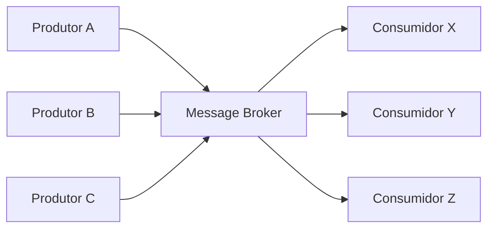
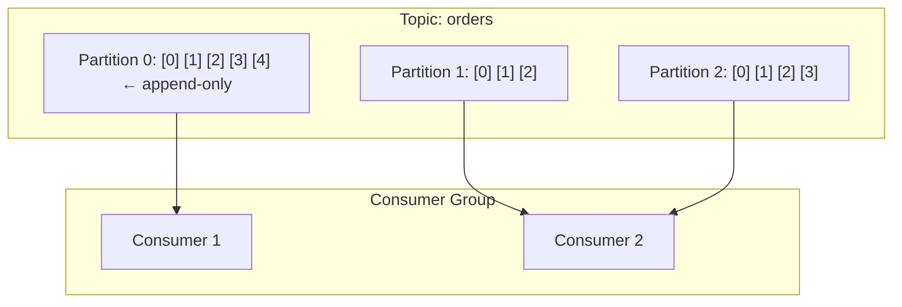
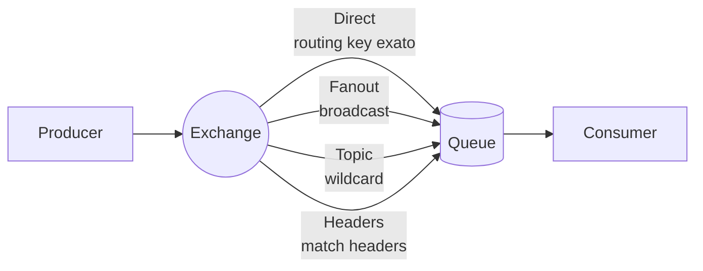

# Message Brokers

## Objetivo

Entender o papel dos message brokers em arquiteturas distribuídas, comparando Kafka, RabbitMQ e NATS em profundidade — suas arquiteturas internas, garantias de entrega, modelos de consumo, e quando escolher cada um.

---

## Pré-requisitos

- [Síncrono vs Assíncrono](01-synchronous-vs-asynchronous.md)
- Conceitos de filas e tópicos
- Noção de persistência de dados

---

## Conceitos Fundamentais

### O que é um Message Broker?

Um message broker é um **intermediário** que recebe mensagens de produtores, armazena-as e entrega a consumidores. Ele desacopla temporalmente e espacialmente os serviços.



### Modelos de Entrega

| Modelo | Descrição | Exemplo |
|--------|-----------|---------|
| **Point-to-Point** | Uma mensagem → um consumidor | RabbitMQ Queue |
| **Pub/Sub** | Uma mensagem → todos os assinantes | Kafka Topic, RabbitMQ Exchange+Bindings |
| **Request-Reply** | Produtor aguarda resposta via outro canal | RabbitMQ Reply Queue |

### Garantias de Entrega

| Garantia | Descrição | Implementação |
|----------|-----------|---------------|
| **At-Most-Once** | Entrega no máximo uma vez (pode perder) | Fire-and-forget, sem ACK |
| **At-Least-Once** | Entrega pelo menos uma vez (pode duplicar) | ACK do consumidor, retry do broker |
| **Exactly-Once** | Processada exatamente uma vez | At-least-once + idempotência no consumidor |

> **Exatamente uma vez** é uma semântica, não uma garantia real do broker. Na prática, é implementada como at-least-once no broker + deduplicação/idempotência na aplicação.

---

## Funcionamento Interno

### Apache Kafka

Kafka é um **log distribuído e persistente**. Não é uma fila tradicional — é um commit log append-only.



**Arquitetura**:
- **Topic**: Canal lógico de mensagens
- **Partition**: Unidade de paralelismo. Mensagens dentro de uma partição são **ordenadas**
- **Offset**: Posição da mensagem na partição (imutável, incrementa monotonicamente)
- **Consumer Group**: Grupo de consumidores onde cada partição é lida por **exatamente um** consumidor do grupo
- **Replication**: Cada partição tem N réplicas (líder + followers) para durabilidade

**Características chave**:
- Persistência em disco (retenção configurável: 7 dias, para sempre, etc.)
- Consumidores controlam o offset (podem re-ler mensagens antigas)
- Throughput extremo: milhões de mensagens/segundo
- Ordenação garantida **dentro** de uma partição
- Não deleta mensagens após consumo (log append-only)

### RabbitMQ

RabbitMQ é um **broker de mensagens tradicional** baseado no protocolo AMQP.



**Arquitetura**:
- **Exchange**: Recebe mensagens e roteia para queues baseado em regras
- **Queue**: Armazena mensagens até serem consumidas
- **Binding**: Regra que liga um Exchange a uma Queue
- **ACK**: Consumidor confirma processamento; broker remove mensagem

**Características chave**:
- Mensagem é **removida** após ACK do consumidor
- Suporte a prioridade de mensagens
- Dead Letter Exchange (DLX) para mensagens que falham
- Flexible routing com exchanges
- Mensagens na memória por padrão (persistência opcional por mensagem)

### NATS

NATS é um sistema de mensageria **ultra-leve e de alta performance**, focado em simplicidade.

```mermaid
flowchart LR
    subgraph NATS Core (Fire-and-forget)
        P1[Publisher] -->|subject| S1[Subscriber]
    end
    
    subgraph NATS JetStream (Persistência)
        P2[Publisher] -->|stream| ST[(Storage)]
        ST --> C2[Consumer]
    end
```

**Características chave**:
- **NATS Core**: At-most-once, sem persistência, microsegundos de latência
- **JetStream**: Adiciona persistência, replay, at-least-once
- Cluster sem ZooKeeper (auto-discovery)
- Protocolo texto simples (fácil debug com telnet)
- Embeddable: pode ser incluído dentro da aplicação Go

### Comparação

| Aspecto | Kafka | RabbitMQ | NATS |
|---------|-------|----------|------|
| **Modelo** | Distributed log | Message broker | Messaging system |
| **Persistência** | Sim (always) | Opcional (per-message) | JetStream (opcional) |
| **Ordenação** | Por partição | Por queue (FIFO) | Por subject (JetStream) |
| **Throughput** | Milhões msg/s | ~50K msg/s | Milhões msg/s |
| **Latência** | ~5-10ms | ~1-5ms | ~0.1ms (core) |
| **Replay** | Sim (offset) | Não (msg deletada) | JetStream (sim) |
| **Protocolo** | Binário (TCP) | AMQP, MQTT, STOMP | Texto (TCP) |
| **Complexidade** | Alta (ZooKeeper/KRaft) | Média (Erlang) | Baixa (single binary) |
| **Use case ideal** | Event streaming, logs | Task queues, routing complexo | IoT, edge, microserviços |

---

## Casos de Uso

### LinkedIn — Kafka (criador)

LinkedIn criou o Kafka para processar **trilhões de mensagens/dia**: logs de atividade, métricas, feeds de notícias. Kafka funciona como a "espinha dorsal" de dados, conectando centenas de serviços.

### Uber — Kafka + Schemaless

Uber processa **~1 trilhão de mensagens/dia** via Kafka para: localização de motoristas, pricing, analytics, logs. Usa schema registry para evolução de contratos.

### CloudFlare — NATS

CloudFlare usa NATS para comunicação entre serviços no edge (200+ datacenters). A latência ultra-baixa do NATS é essencial para DNS e security services que precisam responder em <1ms.

---

## Vantagens

### Kafka
1. Throughput massivo (milhões msg/s)
2. Persistência durável com retenção configurável
3. Replay de mensagens (consumidor controla offset)
4. Ecossistema rico (Kafka Streams, Connect, Schema Registry)

### RabbitMQ
1. Routing flexível com exchanges
2. Mensagens com prioridade
3. Dead Letter Exchange para tratamento de falhas
4. Protocolo AMQP padronizado
5. Baixa latência para volumes moderados

### NATS
1. Simplicidade operacional (single binary)
2. Latência ultra-baixa (<1ms)
3. Embeddable em aplicações Go
4. Auto-clustering sem dependências externas

---

## Desvantagens

### Kafka
1. Complexidade operacional (ZooKeeper ou KRaft, partitions, ISR)
2. Latência maior que RabbitMQ/NATS
3. Não suporta routing complexo (sem exchange/binding)
4. Repartitioning é doloroso (rebalance de consumer groups)

### RabbitMQ
1. Throughput limitado comparado a Kafka/NATS
2. Não tem replay nativo (mensagem deletada após ACK)
3. Escalabilidade horizontal mais complexa (clustering Erlang)
4. Memória: pode ficar sem memória se consumidores não acompanham

### NATS
1. NATS Core: sem persistência (perda de mensagens aceitável?)
2. Ecossistema menor que Kafka/RabbitMQ
3. JetStream: funcionalidades ainda em evolução
4. Menos ferramentas de monitoramento

---

## Erros Comuns

### 1. Usar Kafka como fila de tarefas
Kafka não deleta mensagens após consumo. Se você quer "processe e descarte", RabbitMQ é mais adequado. Kafka é para event streaming e logs.

### 2. Não configurar Dead Letter Queue
Mensagens que falham repetidamente (poison pills) devem ir para uma DLQ. Sem DLQ, ficam em loop infinito de retry.

### 3. Assumir ordenação global no Kafka
Kafka garante ordenação **por partição**, não globalmente. Se precisa de ordenação, use a mesma partition key para mensagens relacionadas.

### 4. Criar muitas partições no Kafka
Mais partições = mais paralelismo, mas também: mais file descriptors, mais memória, mais tempo de rebalance, leader election mais lenta. Comece com poucas e aumente conforme necessidade.

### 5. Não implementar idempotência no consumidor
Brokers entregam at-least-once. Seu consumidor **vai** receber duplicatas. Se não for idempotente, processará o mesmo evento duas vezes.

---

## Exemplos

### Exemplo: Pub/Sub Simples com Channels em Go (Simulando Broker)

```go
package main

import (
	"encoding/json"
	"fmt"
	"sync"
	"time"
)

// Message representa uma mensagem no broker
type Message struct {
	ID        string
	Topic     string
	Payload   json.RawMessage
	Timestamp time.Time
}

// Broker simula um message broker in-memory
type Broker struct {
	subscribers map[string][]chan Message
	mu          sync.RWMutex
}

func NewBroker() *Broker {
	return &Broker{
		subscribers: make(map[string][]chan Message),
	}
}

// Subscribe cria uma subscription para um tópico
func (b *Broker) Subscribe(topic string, bufSize int) <-chan Message {
	b.mu.Lock()
	defer b.mu.Unlock()

	ch := make(chan Message, bufSize)
	b.subscribers[topic] = append(b.subscribers[topic], ch)
	fmt.Printf("[Broker] Novo subscriber para '%s' (total: %d)\n",
		topic, len(b.subscribers[topic]))
	return ch
}

// Publish publica uma mensagem em um tópico (fan-out)
func (b *Broker) Publish(topic string, payload interface{}) error {
	b.mu.RLock()
	defer b.mu.RUnlock()

	data, err := json.Marshal(payload)
	if err != nil {
		return fmt.Errorf("erro ao serializar: %w", err)
	}

	msg := Message{
		ID:        fmt.Sprintf("msg-%d", time.Now().UnixNano()),
		Topic:     topic,
		Payload:   data,
		Timestamp: time.Now(),
	}

	subs := b.subscribers[topic]
	fmt.Printf("[Broker] Publicando em '%s' → %d subscribers\n", topic, len(subs))

	for _, ch := range subs {
		// Non-blocking send (drop se buffer cheio)
		select {
		case ch <- msg:
		default:
			fmt.Printf("[Broker] ⚠️  Subscriber com buffer cheio, mensagem descartada\n")
		}
	}

	return nil
}

// --- Domain Events ---

type OrderCreated struct {
	OrderID  string  `json:"order_id"`
	UserID   string  `json:"user_id"`
	Amount   float64 `json:"amount"`
	Products []string `json:"products"`
}

func main() {
	fmt.Println("=== Simulação de Message Broker (Pub/Sub) ===\n")

	broker := NewBroker()
	var wg sync.WaitGroup

	// --- Consumidores ---

	// Inventory Service
	inventoryCh := broker.Subscribe("order.created", 10)
	wg.Add(1)
	go func() {
		defer wg.Done()
		for msg := range inventoryCh {
			var order OrderCreated
			json.Unmarshal(msg.Payload, &order)
			fmt.Printf("[InventoryService] Reservando estoque para pedido %s (%d produtos)\n",
				order.OrderID, len(order.Products))
			time.Sleep(50 * time.Millisecond) // simula processamento
			fmt.Printf("[InventoryService] ✓ Estoque reservado\n")
		}
	}()

	// Payment Service
	paymentCh := broker.Subscribe("order.created", 10)
	wg.Add(1)
	go func() {
		defer wg.Done()
		for msg := range paymentCh {
			var order OrderCreated
			json.Unmarshal(msg.Payload, &order)
			fmt.Printf("[PaymentService] Processando pagamento de R$%.2f para pedido %s\n",
				order.Amount, order.OrderID)
			time.Sleep(100 * time.Millisecond)
			fmt.Printf("[PaymentService] ✓ Pagamento aprovado\n")
		}
	}()

	// Notification Service
	notifCh := broker.Subscribe("order.created", 10)
	wg.Add(1)
	go func() {
		defer wg.Done()
		for msg := range notifCh {
			var order OrderCreated
			json.Unmarshal(msg.Payload, &order)
			fmt.Printf("[NotificationService] Enviando email para user %s\n", order.UserID)
			time.Sleep(30 * time.Millisecond)
			fmt.Printf("[NotificationService] ✓ Email enviado\n")
		}
	}()

	// --- Produtor ---
	fmt.Println("\n--- Publicando evento OrderCreated ---\n")

	order := OrderCreated{
		OrderID:  "ORD-12345",
		UserID:   "USR-001",
		Amount:   299.90,
		Products: []string{"Teclado Mecânico", "Mouse Gamer"},
	}

	broker.Publish("order.created", order)

	// Espera processamento
	time.Sleep(200 * time.Millisecond)

	fmt.Println("\n--- Segundo pedido ---\n")

	order2 := OrderCreated{
		OrderID:  "ORD-12346",
		UserID:   "USR-002",
		Amount:   1599.00,
		Products: []string{"Monitor 4K"},
	}

	broker.Publish("order.created", order2)

	time.Sleep(200 * time.Millisecond)
	fmt.Println("\n✓ Todos os eventos processados")
}
```

---

## Exercícios

### Exercício 1 — Escolha do Broker
Para cada cenário, recomende Kafka, RabbitMQ ou NATS e justifique:

1. Sistema de processamento de pagamentos com ~1K transações/minuto
2. Pipeline de ingestão de logs com ~1M eventos/segundo
3. Sistema IoT com 100K sensores enviando dados a cada 100ms
4. Sistema de notificações push com routing complexo (por região, por tipo)
5. Event sourcing para um e-commerce

### Exercício 2 — Partition Key Design
Para um tópico Kafka `order.events`, defina partition keys adequadas para:
1. Garantir que eventos do mesmo pedido estejam na mesma partição
2. Garantir que eventos do mesmo usuário estejam na mesma partição
3. Distribuir eventos uniformemente entre partições

### Exercício 3 — Dead Letter Queue
Implemente um mecanismo de DLQ para o broker do exemplo, onde mensagens que falham 3 vezes são movidas para um tópico `.dlq`.

---

## Projeto Prático

### Mini Event Bus com Consumer Groups

**Objetivo**: Implementar um event bus in-memory em Go com suporte a consumer groups.

**Requisitos**:
1. Publicação em tópicos
2. Consumer Groups: cada mensagem vai para **um** consumidor do grupo
3. Fan-out: mensagem vai para **todos** os consumer groups
4. Retry automático (3 tentativas)
5. Dead Letter Queue para mensagens que falharam
6. Métricas: mensagens publicadas, consumidas, em DLQ

---

## Perguntas de Entrevista

### Nível Pleno

**P: Qual a diferença entre Kafka e RabbitMQ?**
R: Kafka é um log distribuído: mensagens são persistidas e não deletadas após consumo — consumidores controlam o offset e podem re-ler. RabbitMQ é um broker de mensagens tradicional: mensagens são deletadas após ACK. Kafka é ideal para event streaming (alto throughput, replay). RabbitMQ é ideal para task queues (routing flexível, prioridades, acknowledgement granular).

### Nível Senior

**P: Como Kafka garante ordenação de mensagens?**
R: Kafka garante ordenação **dentro de uma partição**. Mensagens com a mesma partition key vão para a mesma partição e são consumidas na ordem. Ordenação global não é garantida (partições são independentes). Para obter ordenação de eventos de um pedido, por exemplo, use `orderId` como partition key. Limitação: uma partição é consumida por no máximo um consumidor do consumer group, então mais partições = mais paralelismo, mas partition key mal escolhida pode causar hot partitions.

### Nível Staff

**P: Quais os desafios de garantir exactly-once processing com Kafka?**
R: Exactly-once tem dois lados: (1) **Produtor**: Kafka tem idempotent producer (acks=all, retries com deduplicação por sequence number) desde v0.11 e transactional producer para escrever em múltiplos tópicos atomicamente. (2) **Consumidor**: o Kafka não garante exactly-once no consumo — se o consumidor processa a mensagem e crash antes de commitar o offset, vai reprocessar. Solução: idempotência na aplicação (idempotency key + upsert) ou Kafka Streams com exactly-once semantics (que usa transações internas). A recomendação prática: at-least-once delivery + idempotent consumers.

---

## Referências

1. **Kafka**: [https://kafka.apache.org/documentation/](https://kafka.apache.org/documentation/)
2. **RabbitMQ**: [https://www.rabbitmq.com/docs](https://www.rabbitmq.com/docs)
3. **NATS**: [https://docs.nats.io](https://docs.nats.io)
4. **Paper Kafka**: Kreps, J. et al. (2011). *Kafka: a Distributed Messaging System for Log Processing*
5. **Livro**: Narkhede, N. et al. (2017). *Kafka: The Definitive Guide*
6. **Tópicos relacionados**: [Event-Driven Architecture](04-event-driven-architecture.md) | [Outbox Pattern](../03-data-patterns/03-outbox-pattern.md) | [Idempotência](../04-resilience/05-idempotency.md)
