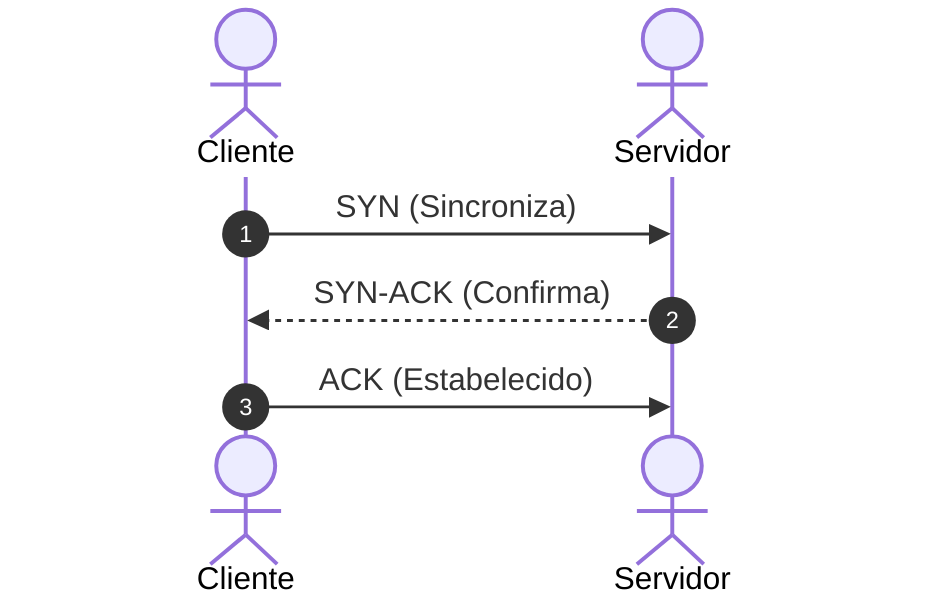

# 01. Comunicação Síncrona: Sockets e APIs RESTful

## Objetivo
Ao final deste capítulo, você será capaz de explicar como processos em máquinas distintas estabelecem conexão física no nível do sistema operacional através de Sockets TCP/UDP, descrever o funcionamento das APIs baseadas em REST e analisar criticamente as limitações de acoplamento temporal e performance do REST em arquiteturas distribuídas de larga escala.

---

## Motivação
Em sistemas locais, a comunicação ocorre via barramento do sistema ou chamadas locais de memória controladas pelo sistema operacional. Quando dividimos nossos serviços em processos separados na rede, essa facilidade desaparece. 

Para que o `PaymentService` faça o débito de uma conta no `LedgerService`, ele precisa instruir o sistema operacional a formatar dados de texto em impulsos elétricos ou ópticos e enviá-los por um cabo de rede. No nível mais baixo do sistema operacional, toda essa troca de dados ocorre através de uma abstração chamada **Socket**. 

Embora frameworks modernos ocultem os sockets sob camadas de HTTP e REST, entender o comportamento físico dessa abstração é crucial para identificar vazamentos de recursos (como estouro de *File Descriptors*), lentidão de conexões e problemas de vazão de dados em produção.

---

## Pré-requisitos
* [Módulo 1: Fundamentos e Limitações Físicas](./../01-foundations/README.md).

---

## Conceitos Fundamentais

### 1. Sockets de Rede (Network Sockets)
Um Socket é uma abstração de software fornecida pelo sistema operacional que atua como o ponto final (endpoint) de uma conexão bidirecional de comunicação entre dois programas rodando na rede.
Fisicamente, um socket é identificado pela combinação de:

$$
\text{Socket} = \text{Endereço IP} + \text{Porta TCP/UDP}
$$

#### 1.1. Tipos de Sockets
* **Stream Sockets (TCP - Transmission Control Protocol)**:
  * *Mecanismo*: Comunicação orientada a conexão. Fornece um fluxo de bytes contínuo, confiável, ordenado e sem perdas (garantido por pacotes de confirmação - *ACKs*, soma de verificação - *Checksum* e retransmissões automáticas).
  * *Controle de Fluxo*: O receptor informa ao transmissor quanto espaço tem em buffer para evitar sobrecarga (Windowing).
* **Datagram Sockets (UDP - User Datagram Protocol)**:
  * *Mecanismo*: Comunicação sem conexão (*connectionless*). Envia pacotes individuais (datagramas) de tamanho fixo sem garantias de entrega, ordem ou integridade.
  * *Vantagem*: Altíssima velocidade e baixíssima latência (sem handshakes). Usado para streaming de vídeo, jogos e DNS.

---

### 2. O Ciclo de Conexão TCP (3-Way Handshake)
Para estabelecer uma conexão confiável de socket TCP, o sistema operacional realiza três etapas físicas de sincronização:



1. **SYN**: O cliente envia um pacote com a flag `SYN` ativa e um número de sequência aleatório.
2. **SYN-ACK**: O servidor responde com as flags `SYN` e `ACK` ativas, confirmando o número de sequência do cliente e enviando seu próprio número de sequência.
3. **ACK**: O cliente responde com um pacote `ACK`, confirmando o número do servidor. A partir desse instante, a conexão está estabelecida e os dados podem fluir.

---

### 3. Chamadas de Sockets em Nível de Sistema Operacional (System Calls)
O kernel do sistema operacional fornece funções que a aplicação deve chamar para operar sockets:
* `socket()`: Cria um novo endpoint de socket.
* `bind()`: Associa o socket a um endereço IP e porta local específicos (geralmente no servidor).
* `listen()`: Coloca o socket do servidor em modo passivo, aguardando conexões de entrada.
* `accept()`: Bloqueia a execução aguardando a chegada de um cliente. Ao aceitar, retorna um **novo file descriptor** de socket dedicado exclusivamente à conversa com aquele cliente específico.
* `read()` / `write()`: Troca de bytes entre os nós.
* `close()`: Fecha a conexão e libera os recursos no kernel.

---

### 4. O Paradigma REST (Representational State Transfer)
Proposto por Roy Fielding em sua tese de doutorado em 2000, o REST é um estilo arquitetural para projetar sistemas hipermídia em rede. Ele baseia-se em 6 restrições fundamentais:
1. **Client-Server**: Separação clara de responsabilidades de interface e persistência.
2. **Stateless (Sem estado)**: Cada requisição do cliente deve conter todas as informações necessárias para ser processada, sem depender de sessões salvas na memória do servidor.
3. **Cacheable**: Respostas devem ser explicitamente marcadas como cacheáveis ou não para reduzir latência de rede.
4. **Interface Uniforme**: Uso de identificação de recursos (URIs), manipulação de recursos através de representações (JSON/XML) e mensagens auto-descritivas (métodos HTTP: GET, POST, PUT, DELETE).
5. **Layered System (Sistema em Camadas)**: O cliente não pode saber se está conectado diretamente ao servidor final ou a intermediários (como proxies, balanceadores de carga).
6. **Code on Demand (Opcional)**: Capacidade de enviar código executável ao cliente (ex: JavaScript).

---

## Funcionamento Interno
Em servidores web tradicionais (como o Apache Tomcat padrão do Spring Boot MVC), o modelo de execução física de chamadas HTTP síncronas baseia-se em **Blocking I/O (BIO)** e no padrão **Thread-per-connection**:
1. O servidor mantém uma pool de threads de tamanho fixo (ex: 200 threads).
2. Cada conexão TCP de cliente aceita pelo socket `ServerSocket.accept()` é delegada a uma thread dedicada da pool.
3. Essa thread executa toda a lógica: deserializa o JSON, acessa o banco de dados local bloqueando a thread, faz chamadas REST HTTP bloqueantes para outros microserviços e grava a resposta de volta no buffer do socket.
4. Se o `LedgerService` remoto ficar lento por apenas 5 segundos, todas as 200 threads da pool do `PaymentService` ficarão rapidamente bloqueadas aguardando a rede. Novas conexões de clientes no socket serão acumuladas na fila de backlog do sistema operacional e, quando o backlog encher, novos clientes receberão erro de conexão recusada (*Connection Refused*).

---

## Exemplos

### Servidor TCP Raw em Kotlin usando Sockets Bloqueantes (BIO)
O código abaixo implementa um servidor TCP cru que atende conexões de clientes em um loop bloqueante tradicional.

```kotlin
// ARQUIVO: RawTcpServer.kt
package com.distribuidos.ipc

import java.io.BufferedReader
import java.io.InputStreamReader
import java.io.PrintWriter
import java.net.ServerSocket
import java.net.Socket
import kotlin.concurrent.thread

class RawTcpServer(private val port: Int) {
    fun start() {
        val serverSocket = ServerSocket(port)
        println("[SERVER] Servidor TCP rodando na porta $port. Aguardando conexões...")

        while (true) {
            // Bloqueia o fluxo de execução até que um cliente conecte física e logicamente
            val clientSocket: Socket = serverSocket.accept()
            println("[SERVER] Novo cliente conectado: ${clientSocket.remoteSocketAddress}")

            // Delega o processamento para uma nova thread física para não travar o loop de aceitação
            thread {
                handleClient(clientSocket)
            }
        }
    }

    private fun handleClient(socket: Socket) {
        socket.use { s ->
            val reader = BufferedReader(InputStreamReader(s.getInputStream()))
            val writer = PrintWriter(s.getOutputStream(), true)

            writer.println("Conexão estabelecida com o Ledger Server. Envie seu comando:")
            
            var line: String?
            while (reader.readLine().also { line = it } != null) {
                println("[SERVER] Recebido: $line")
                if (line == "EXIT") {
                    writer.println("Encerrando conexão...")
                    break
                }
                
                // Processa comando de exemplo simples
                val response = when {
                    line!!.startsWith("BALANCE") -> "ACCOUNT_BALANCE = USD 1500.00"
                    else -> "COMANDO_DESCONHECIDO"
                }
                writer.println(response)
            }
        }
        println("[SERVER] Conexão com o cliente fechada.")
    }
}

fun main() {
    val server = RawTcpServer(8080)
    server.start()
}
```

---

## Casos de Uso
* **Integrações de Negócios e Web**: O REST é a tecnologia padrão para expor APIs públicas para a internet devido à sua simplicidade, legibilidade humana e facilidade de depuração usando navegadores ou ferramentas simples como o curl.
* **APIs Internas Legadas**: A maioria dos sistemas de microserviços inicia utilizando chamadas HTTP/REST síncronas entre si devido à facilidade de desenvolvimento integrada do ecossistema do Spring Boot (Spring MVC + RestTemplate/OpenFeign).

---

## Quando Utilizar REST
* APIs públicas consumidas por clientes externos (onde gRPC ou mensageria complexa traria barreiras de integração).
* Operações de consulta simples que se beneficiam fortemente de caches HTTP estruturados (usando cabeçalhos `Cache-Control`, `ETags`).

---

## Quando Não Utilizar REST
* Comunicação de alta performance interna entre microserviços em datacenters privados. A sobrecarga de abrir conexões TCP constantes, realizar handshakes TLS repetitivos e trafegar payloads JSON pesados de texto consome processamento e banda desnecessariamente.
* Fluxos orientados a eventos complexos onde o cliente não precisa aguardar uma resposta síncrona imediata.

---

## Vantagens
* **Desacoplamento de Tecnologia**: Clientes web escritos em JavaScript conversam de forma transparente com backends em Java/Kotlin.
* **Facilidade de Cache**: O modelo uniforme HTTP permite cachear dados estáticos de forma nativa na rede via CDNs ou caches locais.

---

## Desvantagens
* **Acoplamento Temporal**: O remetente exige que o receptor esteja online e responda instantaneamente para completar o fluxo de negócio.
* **Sobrecarga de CPU/Rede**: A serialização de strings JSON é computacionalmente cara se comparada a formatos binários nativos de computação.

---

## Comparações

| Característica | TCP Sockets | REST (HTTP/1.1) |
|---|---|---|
| **Formato de Dados** | Bytes brutos livres | Texto estruturado (JSON/XML) |
| **Abstração** | Baixo nível (OS Kernel) | Alto nível (Protocolo de Aplicação) |
| **Estado** | Stateful (conexão persistente mantida) | Stateless (cada requisição é isolada) |
| **Performance** | Altíssima vazão, baixíssima latência | Menor performance devido a cabeçalhos pesados |

---

## Erros Comuns
1. **Recriação Constante de Clientes HTTP**: Instanciar um novo objeto `HttpClient` (ou `RestTemplate` no Java) a cada requisição HTTP de saída. Isso força o sistema operacional a abrir uma nova porta TCP local, realizar o 3-Way Handshake e fechar a conexão após a chamada. Sob carga pesada, as portas locais entram no estado `TIME_WAIT` do kernel, esgotando todas as portas disponíveis do SO e gerando o erro fatal `Address already in use` (Port Exhaustion).
2. **Ignorar Métodos HTTP Idempotentes**: Usar o método `POST` para operações que deveriam ser idempotentes (como atualizações de saldo), gerando efeitos colaterais duplicados caso o cliente sofra timeout e tente reenviar a requisição.

---

## Projeto Prático
Nesta primeira etapa prática da nossa FinTech, implementamos as rotas síncronas RESTful em nosso **Ledger REST Controller** usando Spring Boot com Kotlin. Este serviço expõe o saldo e aceita transações financeiras locais.

```kotlin
// ARQUIVO: LedgerController.kt
package com.distribuidos.projeto.controller

import org.springframework.http.ResponseEntity
import org.springframework.web.bind.annotation.*
import java.util.concurrent.ConcurrentHashMap

@RestController
@RequestMapping("/accounts")
class LedgerController {

    // Simulação de banco de dados local em memória RAM thread-safe
    private val accountsBalance = ConcurrentHashMap<String, Double>().apply {
        put("conta-01", 1000.00)
        put("conta-02", 500.00)
    }

    @GetMapping("/{accountId}/balance")
    fun getBalance(@PathVariable accountId: String): ResponseEntity<Double> {
        val balance = accountsBalance[accountId]
        return if (balance != null) {
            ResponseEntity.ok(balance)
        } else {
            ResponseEntity.notFound().build()
        }
    }

    @PostMapping("/{accountId}/debit")
    fun debit(
        @PathVariable accountId: String,
        @RequestParam amount: Double
    ): ResponseEntity<String> {
        if (amount <= 0) {
            return ResponseEntity.badRequest().body("Valor deve ser maior que zero")
        }

        var success = false
        accountsBalance.compute(accountId) { _, currentBalance ->
            if (currentBalance != null && currentBalance >= amount) {
                success = true
                currentBalance - amount
            } else {
                currentBalance
            }
        }

        return if (success) {
            ResponseEntity.ok("Débito realizado com sucesso")
        } else {
            ResponseEntity.status(409).body("Saldo insuficiente ou conta inexistente")
        }
    }
}
```

---

## Exercícios

### Básico
1. O que é o *3-Way Handshake* no protocolo TCP e qual o seu objetivo?
2. Explique o significado da restrição *Stateless* no paradigma REST.

### Intermediário
3. Imagine que seu microserviço de Pagamentos faz uma chamada síncrona REST para o serviço de Ledger que, por sua vez, consulta um banco de dados relacional. Se o banco de dados travar travas de leitura (*lock*), detalhe o efeito cascata nas threads do servidor web do serviço de Pagamentos sob o modelo de execução *Thread-per-connection*.

### Avançado
4. Escreva um script em Kotlin (usando corrotinas) que simule o estouro de conexões em um servidor local. O cliente deve tentar abrir 300 conexões de socket TCP simultâneas contra a porta do `RawTcpServer` criado neste capítulo. Observe no terminal da sua máquina como o servidor reage e pesquise sobre o comando de terminal do sistema operacional (`netstat` ou `lsof`) para visualizar os sockets abertos ativos e suas portas locais.

---

## Perguntas de Entrevista
1. **O que é "Port Exhaustion" (Esgotamento de Portas TCP), como isso acontece em microserviços que se comunicam via REST/HTTP e como mitigar esse problema?**
   * *Resposta esperada*: Port Exhaustion ocorre quando um cliente de rede consome todas as portas efêmeras locais disponíveis (geralmente entre as portas 32768 e 61000) e não consegue abrir novos sockets para conexões de saída. Isso acontece em microserviços REST quando o desenvolvedor não reutiliza conexões HTTP e instancia novos clientes de rede para cada requisição. O sistema operacional não libera a porta imediatamente após o fechamento da conexão física; a porta permanece retida no estado `TIME_WAIT` por minutos para garantir que pacotes atrasados da rede não sejam entregues indevidamente. Sob alta vazão, novas conexões abertas a cada requisição esgotam a pool de portas do SO. A mitigação consiste em utilizar uma pool de conexões HTTP persistente (*HTTP Connection Pooling*), reutilizando as mesmas conexões TCP e soquetes já estabelecidos para múltiplas chamadas consecutivas.

2. **Como a propriedade de acoplamento temporal inerente ao REST síncrono impacta a disponibilidade geral de uma cadeia de chamadas de microserviços?**
   * *Resposta esperada*: O acoplamento temporal exige que todos os componentes de uma cadeia de chamadas estejam ativos e saudáveis simultaneamente para que a operação global tenha sucesso. A disponibilidade teórica de um sistema com acoplamento síncrono em cadeia é o produto das disponibilidades individuais de cada serviço ($A_{\text{total}} = A_1 \times A_2 \times A_3$). Se tivermos 4 microserviços em série, cada um com 99.9% de disponibilidade, a disponibilidade final da transação cai para aproximadamente 99.6%. Se um único serviço da cadeia ficar offline ou lento, toda a chamada cai em cascata, degradando a resiliência geral.

---

## Resumo
* Processos em computadores diferentes trocam dados através da abstração física do Socket do sistema operacional, sendo o TCP focado em fluxo confiável e o UDP em transmissão rápida sem conexão.
* RESTful é um estilo arquitetural de interfaces uniformes e sem estado construído sobre o protocolo HTTP.
* APIs REST síncronas introduzem forte acoplamento temporal e consumo elevado de recursos (threads locais travadas aguardando a rede) em cenários de alta vazão de microserviços.

---

## Próximo Capítulo
No [Capítulo 02: Chamadas de Procedimento Remoto (gRPC) e Serialização com Protobuf](./02-grpc-and-protobuf.md), estudaremos como a indústria superou as limitações de performance e tipagem fraca do REST/JSON através do protocolo HTTP/2 multiplexado e serialização binária compacta em gRPC.

---

## Referências
* **Designing Data-Intensive Applications**, Martin Kleppmann. Capítulo 4: *Encoding and Evolution* (Seção sobre *Dataflow Through Dataflow: Services (REST and RPC)*).
* **Architectural Styles and the Design of Network-based Software Architectures**, Roy Thomas Fielding (2000). Tese de Doutorado.
* **TCP/IP Illustrated, Volume 1**, W. Richard Stevens.