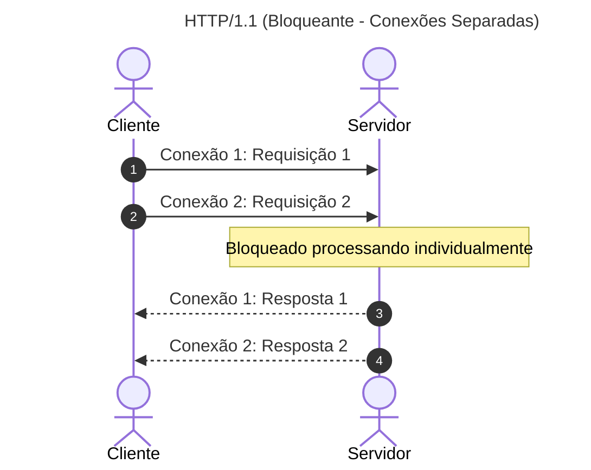
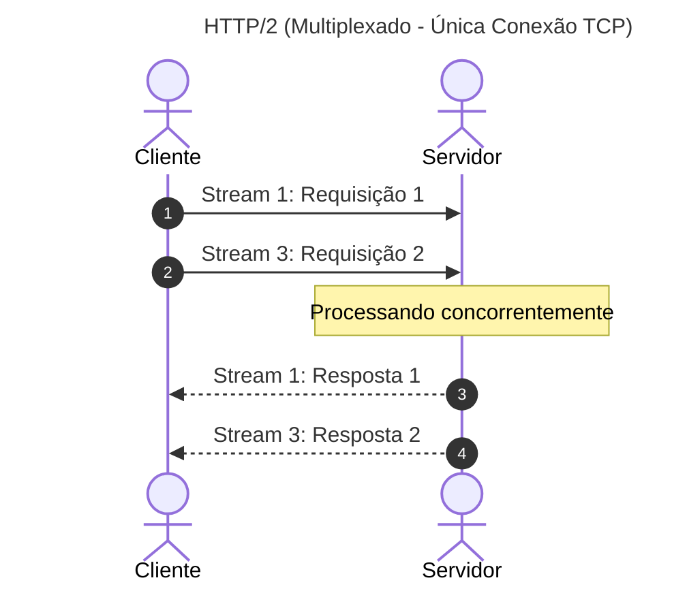

# 02. Chamadas de Procedimento Remoto (gRPC) e Serialização com Protobuf

## Objetivo
Ao final deste capítulo, você será capaz de explicar o funcionamento do protocolo gRPC e as vantagens de performance da multiplexação do HTTP/2, definir contratos tipados de mensagens e serviços usando Protocol Buffers (Protobuf) e implementar um servidor e um cliente gRPC funcionais em Kotlin.

---

## Motivação
No capítulo anterior, vimos que o paradigma REST com payloads JSON é legível e amplamente adotado, mas introduz um custo computacional alto de serialização de texto e consumo elevado de conexões TCP físicas. 

Para a comunicação de altíssima frequência dentro do ambiente privado de microserviços de uma FinTech (onde o `PaymentService` precisa consultar milhares de saldos por segundo no `LedgerService`), precisamos de um mecanismo de comunicação que reduza a latência de trânsito de dados, economize CPU e forneça **contratos estritos de tipagem** para evitar erros de digitação em campos dinâmicos JSON. A solução da indústria para esse cenário é o **gRPC**.

---

## Pré-requisitos
* [Módulo 2, Capítulo 01: Comunicação Síncrona: Sockets e APIs RESTful](./01-sockets-and-rest.md).

---

## Conceitos Fundamentais

### 1. O Retorno do RPC (Remote Procedure Call)
O paradigma RPC visa fazer com que uma chamada de função remota em outra máquina se pareça sintaticamente com uma chamada de método local da própria linguagem de programação.
* **Histórico**: Tentativas antigas (como Java RMI, CORBA e SOAP) falharam por serem extremamente lentas, gerarem forte acoplamento tecnológico ou possuírem especificações verbosas e complexas em XML.
* **gRPC**: Criado pelo Google em 2015 como evolução do seu framework interno Stubby, o gRPC é um framework RPC open-source, moderno e de alta performance que roda sobre o protocolo de transporte HTTP/2 e utiliza Protocol Buffers para serialização e definição de contratos.

---

### 2. A Base Física: HTTP/2 vs. HTTP/1.1
O gRPC obtém ganhos de performance de rede e infraestrutura porque utiliza o protocolo HTTP/2 como meio de transporte:
1. **Multiplexação por Streams**: No HTTP/1.1, cada requisição exige uma conexão TCP dedicada ou bloqueia a conexão persistente atual até ser concluída. No HTTP/2, múltiplas requisições e respostas bidirecionais fluem concorrentemente sobre uma **única conexão TCP** física em fluxos lógicos independentes chamados *Streams*. Isso elimina o esgotamento de portas de rede (*Port Exhaustion*).
2. **Framing Binário**: O HTTP/2 converte mensagens em frames binários menores (`HEADERS` e `DATA`), que são muito mais rápidos de serem parseados pela CPU do que o texto legível simples do HTTP/1.1.
3. **Compressão de Cabeçalhos (HPACK)**: O HTTP/2 comprime cabeçalhos de requisição que se repetem com frequência, economizando preciosos bytes na rede.





---

### 3. Protocol Buffers (Protobuf)
Protocol Buffers é o mecanismo agnóstico de linguagem criado pelo Google para serializar dados estruturados de forma binária e compacta.

#### 3.1. Arquivo de Contrato (.proto)
Em vez de programar os serviços de forma acoplada, o gRPC adota uma abordagem de **Contract-First**. Você escreve um arquivo de texto com extensão `.proto` definindo a estrutura das mensagens de dados e as assinaturas das funções. Um compilador (`protoc`) traduz esse contrato gerando stubs e classes de serviço nativas em Kotlin, Java, Go ou Python.

#### 3.2. Estrutura Binária e Tag Numbers
Considere a mensagem de definição abaixo:
```protobuf
message AccountRequest {
  string account_id = 1;
  double amount = 2;
}
```
* **Tag Numbers (1 e 2)**: São identificadores numéricos cruciais. No formato binário final enviado na rede, o nome do campo ("account_id") é **totalmente descartado**. Apenas o número da tag e o valor em bytes são transmitidos. Isso torna o payload compactado extremamente pequeno em comparação ao JSON, que repete a string `"account_id"` em todas as requisições.

> [!IMPORTANT]
> **Regra de Ouro da Evolução de Esquemas**: Nunca altere o número da tag de um campo existente após o deploy da API. Se você alterar a tag do campo `account_id` de 1 para 3, versões antigas da aplicação instaladas em produção falharão de forma catastrófica ao tentar ler dados gerados por novas versões.

---

### 4. Tipos de Serviço gRPC
O gRPC oferece quatro padrões de comunicação nativos:
1. **Unary (Unário)**: Comunicação tradicional de requisição única e resposta única (semelhante ao HTTP REST).
2. **Server Streaming**: O cliente envia uma requisição única e o servidor retorna um fluxo contínuo de mensagens (stream) pela mesma conexão.
3. **Client Streaming**: O cliente envia um fluxo contínuo de mensagens e o servidor responde com uma mensagem final única.
4. **Bidirectional Streaming**: Cliente e servidor enviam fluxos de mensagens concorrentes de forma independente e simultânea sobre o mesmo canal físico.

---

## Funcionamento Interno
Quando o compilador gRPC processa o `.proto`, ele gera duas estruturas cruciais:
* **Stub (Cliente)**: Uma classe local que expõe a mesma interface do serviço remoto. Quando a aplicação chama o stub localmente, ele encapsula os parâmetros, executa a serialização via biblioteca do Protobuf, envia os frames binários HTTP/2 pela conexão de rede e aguarda os bytes de resposta.
* **Base Service (Servidor)**: Classe abstrata que recebe os pacotes de rede decodificados, realiza o dispatch para o método correspondente que o desenvolvedor deve estender e retorna a resposta formatada.

---

## Exemplos

### 1. O Contrato gRPC (.proto)
O arquivo de contrato descreve o serviço de contas e ledger financeiro.

```protobuf
// ARQUIVO: ledger.proto
syntax = "proto3";

package com.distribuidos.grpc;

option java_multiple_files = true;
option java_package = "com.distribuidos.grpc";

// Definição do Serviço Ledger
service LedgerService {
  rpc GetBalance (BalanceRequest) returns (BalanceResponse);
  rpc TransferFunds (TransferRequest) returns (TransferResponse);
}

message BalanceRequest {
  string account_id = 1;
}

message BalanceResponse {
  string account_id = 1;
  double balance = 2;
}

message TransferRequest {
  string from_account_id = 1;
  string to_account_id = 2;
  double amount = 3;
}

message TransferResponse {
  bool success = 1;
  string transaction_id = 2;
  string message = 3;
}
```

### 2. Implementação do Servidor gRPC em Kotlin
Esta classe estende a base abstrata auto-gerada a partir do compilador proto para rodar a lógica.

```kotlin
// ARQUIVO: LedgerGrpcServer.kt
package com.distribuidos.grpc

import io.grpc.Server
import io.grpc.ServerBuilder
import io.grpc.stub.StreamObserver
import java.util.concurrent.ConcurrentHashMap
import java.util.UUID

class LedgerGrpcServer(private val port: Int) {
    private val server: Server = ServerBuilder.forPort(port)
        .addService(LedgerServiceImpl())
        .build()

    fun start() {
        server.start()
        println("[GRPC-SERVER] Servidor rodando na porta $port")
        Runtime.getRuntime().addShutdownHook(Thread {
            println("[GRPC-SERVER] Finalizando gRPC Server...")
            server.shutdown()
        })
    }

    fun blockUntilShutdown() {
        server.awaitTermination()
    }
}

// Implementação das regras de negócio estendendo a classe abstrata autogerada
class LedgerServiceImpl : LedgerServiceGrpc.LedgerServiceImplBase() {
    private val accountsBalance = ConcurrentHashMap<String, Double>().apply {
        put("conta-01", 10000.00)
        put("conta-02", 5000.00)
    }

    override fun getBalance(
        request: BalanceRequest,
        responseObserver: StreamObserver<BalanceResponse>
    ) {
        val accountId = request.accountId
        val balance = accountsBalance[accountId] ?: 0.0

        val response = BalanceResponse.newBuilder()
            .setAccountId(accountId)
            .setBalance(balance)
            .build()

        // Envia o objeto de volta
        responseObserver.onNext(response)
        // Finaliza o stream unário
        responseObserver.onCompleted()
    }

    override fun transferFunds(
        request: TransferRequest,
        responseObserver: StreamObserver<TransferResponse>
    ) {
        val from = request.fromAccountId
        val to = request.toAccountId
        val amount = request.amount

        var success = false
        var msg = ""

        if (amount > 0) {
            accountsBalance.compute(from) { _, currentBalance ->
                if (currentBalance != null && currentBalance >= amount) {
                    accountsBalance.compute(to) { _, targetBalance ->
                        (targetBalance ?: 0.0) + amount
                    }
                    success = true
                    msg = "Transferência processada."
                    currentBalance - amount
                } else {
                    msg = "Saldo insuficiente."
                    currentBalance
                }
            }
        } else {
            msg = "Valor inválido."
        }

        val response = TransferResponse.newBuilder()
            .setSuccess(success)
            .setTransactionId(if (success) UUID.randomUUID().toString() else "")
            .setMessage(msg)
            .build()

        responseObserver.onNext(response)
        responseObserver.onCompleted()
    }
}

fun main() {
    val server = LedgerGrpcServer(50051)
    server.start()
    server.blockUntilShutdown()
}
```

### 3. Implementação do Cliente gRPC (Stub) em Kotlin
Abaixo está o cliente que estabelece o canal (HTTP/2 persistent channel) e chama os stubs.

```kotlin
// ARQUIVO: LedgerGrpcClient.kt
package com.distribuidos.grpc

import io.grpc.ManagedChannel
import io.grpc.ManagedChannelBuilder
import java.util.concurrent.TimeUnit

class LedgerGrpcClient(host: String, port: Int) {
    // Canal que abstrai a pool de conexões HTTP/2 do gRPC. Deve ser reutilizado pela aplicação.
    private val channel: ManagedChannel = ManagedChannelBuilder.forAddress(host, port)
        .usePlaintext() // Desativa TLS para simplicidade local de exemplo
        .build()

    // Stub síncrono bloqueante gerado
    private val blockingStub: LedgerServiceGrpc.LedgerServiceBlockingStub =
        LedgerServiceGrpc.newBlockingStub(channel)

    fun queryBalance(accountId: String) {
        val request = BalanceRequest.newBuilder()
            .setAccountId(accountId)
            .build()

        val response = blockingStub.getBalance(request)
        println("[CLIENT-GRPC] Saldo da conta ${response.accountId}: USD ${response.balance}")
    }

    fun shutdown() {
        channel.shutdown().awaitTermination(5, TimeUnit.SECONDS)
    }
}

fun main() {
    val client = LedgerGrpcClient("localhost", 50051)
    try {
        client.queryBalance("conta-01")
    } finally {
        client.shutdown()
    }
}
```

---

## Casos de Uso
* **Netflix**: Migrou toda a comunicação síncrona interna de sua malha de milhares de microserviços (service mesh) de REST/JSON para gRPC, resultando em uma redução massiva no consumo de CPU global de seus datacenters e queda drástica no RTT (latência) de transição de dados.
* **Uber**: Utiliza gRPC amplamente em seu backplane de microsserviços para coordenar rotas e faturamento em tempo real, onde a multiplexação do HTTP/2 economiza portas locais nos hosts físicos.

---

## Quando Utilizar gRPC
* Comunicação síncrona ponto a ponto entre microserviços internos do mesmo sistema.
* Sistemas que exigem alta vazão e baixíssima latência sob volumes massivos de tráfego.
* Ambientes onde os contratos e tipos rígidos são valorizados para evitar divergências de integração entre múltiplos times.

---

## Quando Não Utilizar gRPC
* APIs públicas externas consumidas por terceiros de forma livre na internet (REST é mais acessível e simples de integrar).
* Integrações diretas de navegadores web (web browsers) legados que não suportam totalmente o controle estrito de frames do HTTP/2 necessário pelo gRPC (embora o `gRPC-Web` exista, ele introduz proxy intermediário e complexidade).

---

## Vantagens
* **Vazão e Latência**: O payload binário compacto e a conexão única HTTP/2 economizam tempo e recursos físicos.
* **Tipagem Estrita**: Os contratos `.proto` reduzem a quase zero erros de mapeamento de propriedades.
* **Geração de Código**: A geração automática de classes e stubs simplifica o desenvolvimento em ambientes poliglotas.

---

## Desvantagens
* **Depuração Complexa**: Pacotes binários brutos na rede são difíceis de visualizar diretamente (exige interpretadores específicos como o `grpcurl`).
* **Acoplamento de Esquema**: Mudanças de contratos exigem gerenciamento cuidadoso de compatibilidade para evitar quebras em cascata de serviços não atualizados.

---

## Comparações

### Formatos de Serialização

| Dimensão | JSON (REST) | Protocol Buffers (gRPC) |
|---|---|---|
| **Tipo físico** | Texto plano legível | Binário não-legível diretamente |
| **Tamanho do Payload** | Grande (chaves de strings repetidas) | Mínimo (apenas tags numéricas e valores) |
| **Uso de CPU** | Elevado (parseamento de strings complexas) | Mínimo (bytes ordenados diretamente) |
| **Esquema de Dados** | Opcional / Dinâmico | Obrigatório / Estático |

---

## Erros Comuns
1. **Reinstanciar o `ManagedChannel`**: Criar um novo objeto `ManagedChannel` a cada chamada de método. O canal do gRPC abstrai a conexão multiplexada persistente e a criação de subcanais de rede, sendo uma operação pesada e lenta. O correto é criar um único `ManagedChannel` para a vida útil da aplicação e reutilizá-lo concorrentemente em todas as threads.
2. **Modificar Tags Existentes no arquivo `.proto`**: Mudar os números de tag em atualizações de contrato, corrompendo a compatibilidade do tráfego físico.

---

## Projeto Prático
No projeto de **FinTech Ledger**, integramos o gRPC ao nosso módulo de comunicação local.
Agora, o nosso cliente de teste chamará a interface do ledger de pagamentos utilizando stubs gRPC ao invés de endpoints HTTP REST.

```kotlin
// ARQUIVO: LedgerGrpcAdapter.kt
package com.distribuidos.projeto.adapter

import com.distribuidos.projeto.LedgerService
import com.distribuidos.projeto.TransactionResult
import com.distribuidos.grpc.LedgerServiceGrpc
import com.distribuidos.grpc.TransferRequest
import io.grpc.ManagedChannelBuilder

class LedgerGrpcAdapter(host: String, port: Int) : LedgerService {
    
    private val channel = ManagedChannelBuilder.forAddress(host, port)
        .usePlaintext()
        .build()
        
    private val stub = LedgerServiceGrpc.newBlockingStub(channel)

    override fun transfer(fromAccountId: String, toAccountId: String, amount: Double): TransactionResult {
        val request = TransferRequest.newBuilder()
            .setFromAccountId(fromAccountId)
            .setToAccountId(toAccountId)
            .setAmount(amount)
            .build()
            
        return try {
            val response = stub.transferFunds(request)
            if (response.success) {
                TransactionResult.Success(
                    transactionId = response.transactionId,
                    timestamp = System.currentTimeMillis()
                )
            } else {
                TransactionResult.Failed(response.message)
            }
        } catch (e: Exception) {
            TransactionResult.Failed("Erro de rede gRPC: ${e.message}")
        }
    }
}
```

---

## Exercícios

### Básico
1. Qual a finalidade prática dos *Tag Numbers* nos campos de mensagens do Protocol Buffers?
2. Explique em termos de streams e conexões físicas a diferença entre o HTTP/1.1 e o HTTP/2.

### Intermediário
3. Considere o arquivo `.proto` apresentado neste capítulo. Adicione um novo método chamado `GetStatement` que utilize o padrão de comunicação **Server Streaming** para retornar um fluxo de mensagens do tipo `TransactionRecord` representando o extrato bancário de uma conta. Escreva apenas o trecho do código do contrato.

### Avançado
4. Realize uma simulação comparativa local simples. Escreva um script em Kotlin que serialize um objeto `Transaction` contendo 5 propriedades (ex: id, conta, valor, data, descrição) 100.000 vezes usando a biblioteca JSON (como o Jackson) e 100.000 vezes usando a biblioteca binária do Protocol Buffers. Meça e imprima no console a diferença de tempo de execução de CPU gasta e o tamanho em bytes gerado por cada formato.

---

## Perguntas de Entrevista
1. **Se o gRPC utiliza uma única conexão TCP multiplexada, como lidamos com balanceamento de carga (Load Balancing) em produção usando balanceadores tradicionais de nível 4 (L4)?**
   * *Resposta esperada*: Balanceadores de carga de nível 4 (L4) operam no nível do TCP, abrindo conexões persistentes simples. Quando um cliente gRPC se conecta a um balanceador L4, o tráfego daquela única conexão TCP persistente multiplexada é direcionado a apenas um servidor específico do cluster de destino, inviabilizando a distribuição uniforme de carga (os outros nós ficam ociosos). Para contornar, devemos realizar balanceamento no nível 7 (L7), utilizando Proxies que entendam o protocolo HTTP/2 (como Envoy, Linkerd ou Nginx), abrindo streams individuais para nós diferentes; ou implementando balanceamento no lado do cliente (*Client-side Load Balancing*), onde o cliente gRPC resolve múltiplos IPs através do DNS e distribui as chamadas de streams entre as conexões ativas.

2. **Como funciona a compatibilidade retroativa e progressiva (Backward and Forward Compatibility) no Protocol Buffers e o que acontece se o cliente receber um campo que ele ainda não conhece no contrato?**
   * *Resposta esperada*: A compatibilidade funciona com base nos números de tag. Se o servidor adicionar um novo campo com uma tag nova (ex: tag 4) e enviar a mensagem a um cliente antigo, o cliente lerá as tags que conhece (tags 1, 2, 3), identificará a tag 4 como um campo desconhecido e simplesmente a ignorará de forma silenciosa sem quebrar a execução da aplicação (garantindo compatibilidade progressiva). Da mesma forma, se o cliente enviar um campo novo para um servidor antigo, o servidor ignorará a tag extra. Para garantir a compatibilidade retroativa, novos campos nunca devem ser marcados como obrigatórios no nível lógico da aplicação, e tags antigas nunca devem ser reutilizadas para finalidades diferentes.

---

## Resumo
* gRPC é um framework RPC de alta performance e baixo acoplamento poliglotas, ideal para conexões ponto a ponto internas de microserviços.
* A multiplexação de Streams HTTP/2 resolve o problema de HoLB e esgotamento de portas de rede física do HTTP/1.1.
* Protocol Buffers otimiza o tráfego e processamento de CPU substituindo strings JSON pesadas por payloads binários compactados mapeados por tags numéricas.

---

## Próximo Capítulo
No [Capítulo 03: Concorrência Concorrente na JVM com Virtual Threads](./03-jvm-virtual-threads.md), estudaremos como a JVM moderna evoluiu para gerenciar milhões de chamadas síncronas de I/O em paralelo sem esgotar as threads do sistema operacional, introduzindo as Virtual Threads do Project Loom.

---

## Referências
* **gRPC IO Documentation**: [gRPC official site](https://grpc.io/docs/)
* **Protocol Buffers Guide**: [Protobuf Language Guide](https://protobuf.dev/programming-guides/proto3/)
* **HTTP/2 Specification**: [RFC 7540](https://datatracker.ietf.org/doc/html/rfc7540)