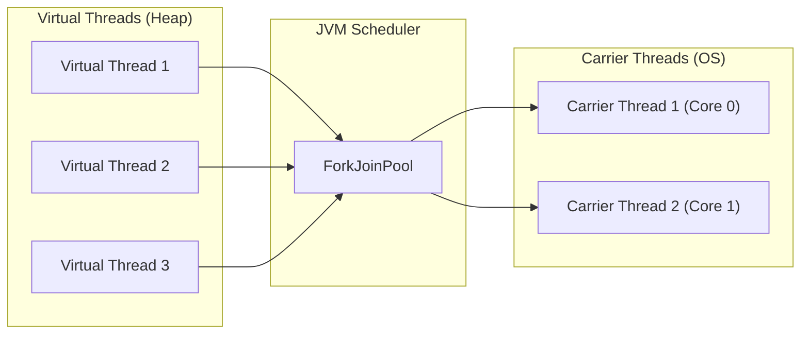

# 03. Concorrência Concorrente na JVM com Virtual Threads

## Objetivo
Ao final deste capítulo, você será capaz de explicar as limitações de escalabilidade física das threads de plataforma tradicionais, descrever o funcionamento interno das **Virtual Threads** (Project Loom, Java 21+) em termos de *Carrier Threads*, *Continuations* e escalonamento, e projetar servidores Spring Boot de alta concorrência otimizados para operações bloqueantes de rede.

---

## Motivação
Nos capítulos anteriores, estudamos a física dos sockets e a eficiência de protocolos como gRPC e REST. Contudo, em uma arquitetura de microserviços, de nada adianta ter uma rede otimizada se o seu servidor Java/Kotlin ficar travado sem conseguir gerenciar requisições paralelas. 

No modelo tradicional, cada requisição consome uma thread do sistema operacional. Como essas threads são recursos físicos caros, ficamos limitados a algumas centenas de requisições simultâneas por máquina. Se tentarmos ultrapassar esse limite, o servidor travará por falta de memória ou por gasto excessivo de CPU com troca de contexto (*context switch*). 

As **Virtual Threads** surgem para resolver essa limitação física de concorrência, permitindo que a aplicação processe milhões de chamadas síncronas de rede concorrentes com a mesma simplicidade de código sequencial e a performance de frameworks reativos assíncronos complexos.

---

## Pré-requisitos
* [Módulo 2, Capítulo 01: Comunicação Síncrona: Sockets e APIs RESTful](./01-sockets-and-rest.md).

---

## Conceitos Fundamentais

### 1. Threads de Plataforma (Platform Threads)
Historicamente, cada thread criada na JVM (uma instância de `java.lang.Thread`) é um mapeamento de $1:1$ para uma thread física do kernel do sistema operacional (SO).
* **Limitações Físicas**:
  * **Consumo de Memória**: Cada thread de plataforma reserva um espaço de memória física de Stack fixo (geralmente 1MB) para rastrear sua pilha de execução, independentemente de estar ativa ou ociosa. 1000 threads ativas consomem imediatamente cerca de 1GB de RAM estritamente em stacks.
  * **Custo de Criação**: Criar uma thread envolve chamadas de sistema cara do sistema operacional.
  * **Context Switch (Troca de Contexto)**: Mover o processamento de uma thread para outra exige que o kernel do SO salve e restaure registradores de CPU, consumindo ciclos preciosos de processamento.

---

### 2. O que são Virtual Threads?
Introduzidas como recurso estável no Java 21 (Project Loom), as Virtual Threads são threads de peso leve gerenciadas inteiramente pelo runtime da JVM, e não pelo sistema operacional.
* **Modelo M:N**: Múltiplas Virtual Threads ($M$) são agendadas para rodar sobre poucas Threads de Plataforma ($N$), chamadas de **Carrier Threads** (threads transportadoras).
* **Escalonamento**: A JVM gerencia um pool de Carrier Threads (usando um `ForkJoinPool` FIFO) de tamanho geralmente igual ao número de núcleos de CPU disponíveis no processador.



---

### 3. Montagem e Desmontagem (Mount & Unmount)
A mágica da performance das virtual threads reside no ciclo de suspensão automática:
1. **Montagem (Mount)**: Quando uma Virtual Thread é ativada, a JVM copia sua pilha de execução da memória Heap para o Stack de uma *Carrier Thread* física disponível para que a CPU possa executar suas instruções.
2. **Desmontagem (Unmount)**: Quando a Virtual Thread executa uma chamada de rede bloqueante (ex: `socket.read()`, chamada gRPC ou consulta JDBC), a JVM intercepta esse bloqueio de I/O, salva o estado da pilha de execução da Virtual Thread de volta na memória Heap e a **desmonta** da Carrier Thread.
3. **Liberação**: A Carrier Thread física fica imediatamente livre para montar e executar outras Virtual Threads úteis.
4. **Retorno**: Assim que o sistema operacional sinaliza que os bytes da rede chegaram (via eventos assíncronos como epoll/kqueue), o agendador da JVM agenda a Virtual Thread bloqueada para ser montada novamente em qualquer Carrier Thread disponível para continuar a execução a partir do ponto em que parou.

---

### 4. Thread Pinning (Fixação de Thread)
Uma Virtual Thread pode ficar "presa" a sua Carrier Thread física, impedindo que a JVM a desmonte durante operações bloqueantes. Isso é chamado de **Thread Pinning** e deteriora a escalabilidade do sistema.
* **Causas**:
  * Execução de código dentro de blocos ou métodos com a palavra-chave `synchronized`.
  * Execução de chamadas de funções nativas (via JNI/PANAMA).
* **Solução**: Substituir blocos `synchronized` por travas modernas de concorrência baseadas em código Java, como o `java.util.concurrent.locks.ReentrantLock`.

---

## Funcionamento Interno
O segredo técnico por trás das virtual threads é a implementação de **Continuations** (Continuações). Uma Continuation é um objeto em nível de máquina virtual que representa o estado de execução de uma tarefa (ponteiro de instrução atual e variáveis locais da pilha) que pode ser suspenso e retomado deterministicamente a qualquer momento.

---

## Exemplos

### 1. Executando 100.000 Chamadas Bloqueantes Concorrentes
O código abaixo compara a criação de 100.000 tarefas síncronas bloqueantes usando threads tradicionais (causará queda por estouro de memória ou lentidão extrema) vs. Virtual Threads (executa em frações de segundo com uso mínimo de memória).

```kotlin
// ARQUIVO: VirtualThreadsBenchmark.kt
package com.distribuidos.concorrencia

import java.time.Duration
import java.util.concurrent.Executors
import kotlin.system.measureTimeMillis

fun main() {
    val tasksCount = 100_000

    // Cria um Executor que instancia uma nova Virtual Thread para cada tarefa
    val executor = Executors.newVirtualThreadPerTaskExecutor()

    val timeTaken = measureTimeMillis {
        executor.use { exec ->
            for (i in 1..tasksCount) {
                exec.submit {
                    // Simula uma chamada síncrona bloqueante de rede (I/O) de 1 segundo
                    Thread.sleep(Duration.ofSeconds(1))
                }
            }
        } // O bloco .use aguarda o encerramento de todas as tarefas enviadas
    }

    println("[LOOM] Concluiu $tasksCount tarefas bloqueantes concorrentes!")
    println("[LOOM] Tempo total de execução: ${timeTaken / 1000.0} segundos.")
}
```

### 2. Corrigindo Thread Pinning por synchronized
Abaixo está o exemplo do problema de Pinning e sua respectiva correção usando `ReentrantLock`.

```kotlin
// ARQUIVO: ThreadPinningFix.kt
package com.distribuidos.concorrencia

import java.util.concurrent.locks.ReentrantLock
import kotlin.concurrent.withLock

// CASO RUIM: Bloqueia a Carrier Thread física na JVM devido ao synchronized
class PinningExample {
    @Synchronized
    fun executeBlockingOperation() {
        // Operação de I/O que prende a Carrier Thread inteira
        Thread.sleep(1000)
    }
}

// CASO BOM: Permite que a Virtual Thread se desmonte livremente durante o bloqueio
class ResilientLockExample {
    private val lock = ReentrantLock()

    fun executeBlockingOperation() {
        lock.withLock {
            // A JVM consegue desmontar a thread virtual aqui sem fixar a Carrier Thread
            Thread.sleep(1000)
        }
    }
}
```

---

## Casos de Uso
* **Servidores Spring Boot 3.2+**: Adotaram suporte completo a Virtual Threads. Ao configurar a propriedade `spring.threads.virtual.enabled=true`, o Spring Boot altera o servidor Tomcat embarcado para usar o Virtual Thread Executor para processar cada requisição HTTP de entrada. Isso dobra a vazão do servidor sob chamadas lentas de microsserviços sem precisar reescrever o código para programação reativa.

---

## Quando Utilizar
* Aplicações web com alta densidade de chamadas de I/O bloqueante (consultas JDBC tradicionais a bancos relacionais, chamadas gRPC/REST HTTP a microserviços).
* Lógicas de concorrência onde a clareza e legibilidade do código síncrono tradicional são cruciais.

---

## Quando Não Utilizar
* **Tarefas CPU-Bound**: Algoritmos matemáticos intensivos, criptografia ou processamento de imagem. Virtual threads não adicionam núcleos físicos adicionais de CPU; elas apenas ajudam a não desperdiçar as threads de plataforma existentes durante bloqueios de rede.
* **Aplicações legadas com uso massivo de bibliotecas nativas C (JNI)**: Alto risco de thread pinning generalizado.

---

## Vantagens
* **Escalabilidade Massiva**: Criação de milhões de threads simultâneas sem crash de memória.
* **Simplicidade de Depuração**: *Thread Dumps* e depuradores (*debuggers*) funcionam de forma tradicional síncrona passo a passo, diferentemente de fluxos reativos assíncronos (RxJava, WebFlux) que quebram a pilha de logs.
* **Compatibilidade**: Código síncrono existente e APIs JDBC tradicionais funcionam sem alterações.

---

## Desvantagens
* **Thread Pinning**: Exige revisão de dependências legadas que usam `synchronized`.
* **Uso de ThreadLocals**: Como virtual threads são baratas e criadas aos milhões, manter dados pesados em objetos `ThreadLocal` consome muita memória Heap da JVM.

---

## Comparações

| Característica | Platform Threads | Virtual Threads |
|---|---|---|
| **Gerenciamento** | Kernel do SO | JVM Runtime |
| **Tamanho da Stack** | Fixo (~1MB físico) | Dinâmico (Heap da JVM, começa em bytes) |
| **Context Switch** | Caro (Kernel/CPU) | Barato (Troca de ponteiros na JVM) |
| **Pinning** | Não se aplica | Risco em blocos `synchronized` |
| **Pooling** | Obrigatório (`ThreadPoolExecutor`) | Proibido (descartáveis e baratas) |

---

## Erros Comuns
1. **Criar Pools de Virtual Threads**: Usar pools de tamanho fixo para virtual threads (ex: `newFixedThreadPool(100)` configurado com virtual threads). Pools de threads servem para poupar recursos caros. Como virtual threads são baratas, o correto é nunca criar pools; crie uma nova virtual thread descartável diretamente por tarefa usando `Executors.newVirtualThreadPerTaskExecutor()`.
2. **Ignorar Backpressure**: Criar conexões de banco de dados ou chamadas de API sem limite apenas porque pode criar milhões de threads virtuais concorrentes. O banco de dados relacional remoto não suportará milhões de conexões ativas simultâneas. Deve-se controlar os limites de conexões remotas usando semáforos locais (`java.util.concurrent.Semaphore`).

---

## Projeto Prático
No projeto **FinTech Ledger**, atualizamos o executor do nosso gateway de pagamentos (`PaymentGateway`) para disparar requisições concorrentes de auditoria usando um executor de Virtual Threads, acelerando o fechamento de transações síncronas.

```kotlin
// ARQUIVO: PaymentGateway.kt
package com.distribuidos.projeto.gateway

import com.distribuidos.projeto.LedgerService
import com.distribuidos.projeto.TransactionResult
import java.util.concurrent.Executors

class PaymentGateway(
    private val ledgerService: LedgerService
) {
    // Executor que gera virtual threads sob demanda para cada chamada
    private val executor = Executors.newVirtualThreadPerTaskExecutor()

    fun processBatchPayments(payments: List<PaymentTask>) {
        executor.use { exec ->
            payments.forEach { task ->
                exec.submit {
                    val result = ledgerService.transfer(
                        fromAccountId = task.from,
                        toAccountId = task.to,
                        amount = task.amount
                    )
                    when (result) {
                        is TransactionResult.Success -> println("[GATEWAY] Sucesso: Transação ${result.transactionId}")
                        is TransactionResult.Failed -> println("[GATEWAY] Falha na transação: ${result.reason}")
                    }
                }
            }
        } // Aguarda a conclusão de todas as chamadas de rede concorrentes antes de prosseguir
    }
}

data class PaymentTask(val from: String, val to: String, val amount: Double)
```

---

## Exercícios

### Básico
1. Qual a função das *Carrier Threads* em relação às Virtual Threads na JVM?
2. Explique por que fazer pooling de virtual threads é considerado um antipadrão de desenvolvimento.

### Intermediário
3. Considere que sua aplicação faz chamadas HTTP para o serviço de Ledger que frequentemente demoram 2 segundos para responder. Sob carga de 10.000 requisições simultâneas de usuários, estime a diferença aproximada de consumo de memória física RAM caso sua aplicação utilize Threads de Plataforma vs. Virtual Threads.

### Avançado
4. Escreva um programa em Kotlin que use a biblioteca de concorrência estruturada para rodar 50.000 tarefas simultâneas que acessem uma seção crítica de código compartilhado. Metade das tarefas deve competir usando `synchronized` e a outra metade usando `ReentrantLock`. Utilize ferramentas de diagnóstico da JVM (como o `jstack` ou visualizadores de Thread Dump integrados na IDE) durante a execução para comprovar a ocorrência de Thread Pinning nas Carrier Threads no caso do `synchronized`.

---

## Perguntas de Entrevista
1. **As Virtual Threads eliminam a necessidade de utilizar corrotinas (Coroutines) do Kotlin ou frameworks reativos como o Spring WebFlux (Project Reactor)?**
   * *Resposta esperada*: Não de forma absoluta. As Virtual Threads eliminam o principal motivo para a adoção de frameworks reativos de backend (Spring WebFlux), que era a escalabilidade de I/O a nível de thread de plataforma, simplificando drasticamente o código que antes exigia cadeias funcionais complexas (`Mono`/`Flux`). No entanto, Kotlin Coroutines ainda oferecem recursos exclusivos não disponíveis no Loom nativo: **concorrência cooperativa rica**, fluxos reativos expressivos assíncronos (`Flow`), cancelamento cooperativo nativo estruturado e controle fino sobre o escopo de execução em interfaces gráficas ou clients assíncronos complexos. Em resumo, para servidores de APIs tradicionais de backend, as Virtual Threads facilitam muito o desenvolvimento; para orquestrações complexas, reatividade rica e clientes, corrotinas continuam altamente relevantes.

2. **Como a JVM lida com o estado da pilha (Stack) de uma Virtual Thread quando ela é desmontada de sua Carrier Thread e qual o impacto disso na memória Heap da JVM?**
   * *Resposta esperada*: Quando a Virtual Thread encontra uma operação de bloqueio de rede, o runtime da JVM captura esse ponto e suspende a execução usando a Continuation associada. A JVM copia toda a pilha de execução local (as variáveis locais e chamadas de métodos ativos que estavam no Stack da Carrier Thread) para a memória **Heap** da JVM, liberando a Carrier Thread física. Quando o evento de I/O é concluído, esses dados de frame de execução são copiados de volta do Heap para a nova Carrier Thread física montada. O impacto prático é que, embora economizemos memória de Stack fixa física do sistema operacional, temos um consumo maior de memória Heap dinâmico para gerenciar os frames das milhões de virtual threads suspensas. Isso exige monitoramento cuidadoso da alocação de Heap e comportamento do Garbage Collector.

---

## Resumo
* Platform Threads mapeiam 1:1 com threads do SO, sendo limitadas fisicamente por stack estático e context switch dispendioso.
* Virtual Threads são threads leves gerenciadas na JVM rodando sobre Carrier Threads sob modelo M:N, suspensas automaticamente em bloqueios de I/O.
* A fixação de threads (Thread Pinning) ocorre em blocos `synchronized` e deve ser prevenida utilizando `ReentrantLock`.

---

## Próximo Capítulo
No [Módulo 3, Capítulo 01: Introdução à Mensageria Assíncrona e RabbitMQ (AMQP)](./../03-messaging/01-rabbitmq-amqp.md), iniciaremos os estudos sobre comunicação assíncrona, analisando as vantagens de desacoplamento físico e o protocolo AMQP utilizando o RabbitMQ.

---

## Referências
* **JEP 444: Virtual Threads**: [OpenJDK specification](https://openjdk.org/jeps/444)
* **Modern Java in Action**, Raoul-Gabriel Urma, Mario Fusco, Alan Mycroft.
* **Designing Data-Intensive Applications**, Martin Kleppmann (Contextualização sobre concorrência em sistemas de dados).
