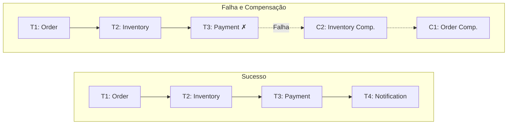
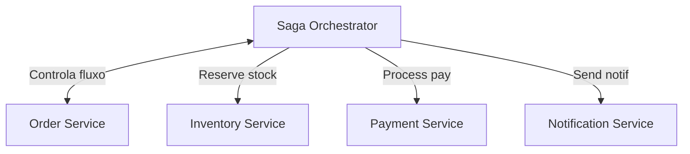
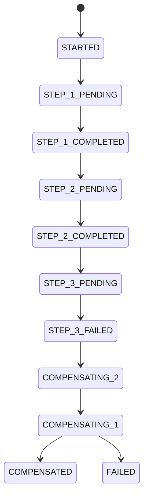

# Saga Pattern

## Objetivo

Compreender o Saga Pattern como solução para transações distribuídas em microserviços, diferenciando orquestração de coreografia, e entendendo como implementar compensações para manter consistência eventual.

---

## Pré-requisitos

- [Database per Service](01-database-per-service.md)
- [Message Brokers](../02-communication/03-message-brokers.md)
- Conceitos de transações ACID

---

## Conceitos Fundamentais

### O Problema

Com database-per-service, transações ACID não cruzam fronteiras de serviço. Como garantir que "criar pedido + reservar estoque + processar pagamento" seja atômico?

**2PC (Two-Phase Commit)** resolve, mas é **bloqueante, lento e reduz disponibilidade**.

### A Solução: Saga

Uma Saga é uma **sequência de transações locais** onde cada transação atualiza um serviço e publica um evento/mensagem que dispara a próxima transação. Se uma transação falha, a saga executa **compensating transactions** para desfazer as anteriores.



### Orquestração vs Coreografia

#### Coreografia (Choreography)
Cada serviço escuta eventos e decide o que fazer. Sem coordenador central.

```mermaid
flowchart TD
    subgraph Sucesso
        direction LR
        OS1[OrderService] -->|"OrderCreated"| IS1[InventoryService]
        IS1 -->|"StockReserved"| PS1[PaymentService]
        PS1 -->|"PaymentProcessed"| NS1[NotificationService]
        NS1 -->|"NotificationSent"| F1((FIM))
    end
    
    subgraph Falha
        direction LR
        PS2[PaymentService] -->|"PaymentFailed"| IS2[InventoryService]
        IS2 -->|"StockReleased"| OS2[OrderService]
        OS2 -->|"OrderCancelled"| F2((FIM))
    end
```



**Vantagens**: Simples, baixo acoplamento, sem single point of failure.
**Desvantagens**: Difícil de entender o fluxo completo, debugging complexo.

#### Orquestração (Orchestration)
Um **Saga Orchestrator** (coordenador) controla o fluxo, dizendo a cada serviço o que fazer.



**Vantagens**: Fluxo claro, fácil de entender e debugar, lógica centralizada.
**Desvantagens**: Orchestrator é single point of failure, acoplamento lógico.

---

## Funcionamento Interno

### Compensating Transactions

Uma compensação **desfaz semanticamente** o efeito de uma transação, mas **não** é um rollback (o dado pode ter sido persistido e lido por outros).

| Transação | Compensação |
|-----------|-------------|
| Criar pedido | Cancelar pedido |
| Reservar estoque | Liberar estoque |
| Cobrar cartão | Estornar pagamento |
| Enviar email | Enviar email de cancelamento |

**Regras**:
- Compensações devem ser **idempotentes** (podem ser executadas mais de uma vez)
- A ordem de compensação é **inversa** à das transações
- Nem toda operação tem compensação simples (email enviado não pode ser "desinviado")

### Estado da Saga



---

## Casos de Uso

### Uber — Saga para Corrida
1. **RequestRide** → Match motorista
2. **CalculatePrice** → Calcula tarifa
3. **ChargeRider** → Cobra passageiro
4. **PayDriver** → Paga motorista

Se `ChargeRider` falha → Cancela a corrida, libera motorista.

### E-commerce — Saga de Checkout
1. **CreateOrder** → Pedido criado
2. **ReserveInventory** → Estoque reservado
3. **ProcessPayment** → Pagamento processado
4. **ShipOrder** → Envio iniciado

Se `ProcessPayment` falha → Libera estoque, cancela pedido.

---

## Vantagens

1. **Sem bloqueio**: Cada transação é local e rápida
2. **Alta disponibilidade**: Não depende de todos os serviços ao mesmo tempo
3. **Escalável**: Cada serviço processa independentemente
4. **Audit trail**: Cada step é um evento registrado

---

## Desvantagens

1. **Complexidade**: Implementar compensações para cada step
2. **Consistência eventual**: Estado inconsistente entre steps
3. **Debugging**: Fluxo distribuído é difícil de rastrear
4. **Isolamento**: Dirty reads possíveis (outro processo pode ver estado intermediário)
5. **Compensação falha**: E se a compensação também falhar? (dead letter + alerta manual)

---

## Erros Comuns

### 1. Compensações não-idempotentes
Se a compensação "liberar estoque" falha e é retriada, pode liberar o dobro. Compensações **devem** ser idempotentes.

### 2. Não considerar "semantic rollback"
Email enviado não pode ser "desinviado". A compensação é enviar outro email: "Desculpe, seu pedido foi cancelado".

### 3. Saga sem timeout
Uma saga que fica em `STEP_2_PENDING` para sempre. Defina timeout para cada step e trate como falha.

### 4. Não persistir o estado da saga
Se o orchestrator crashar, o estado da saga se perde. Persista cada mudança de estado.

---

## Exemplos

### Exemplo: Saga Orchestrator em Go

```go
package main

import (
	"errors"
	"fmt"
	"time"
)

type StepStatus string

const (
	Pending    StepStatus = "PENDING"
	Completed  StepStatus = "COMPLETED"
	Failed     StepStatus = "FAILED"
	Compensated StepStatus = "COMPENSATED"
)

type SagaStep struct {
	Name       string
	Execute    func() error
	Compensate func() error
	Status     StepStatus
}

type Saga struct {
	ID    string
	Steps []SagaStep
}

func (s *Saga) Run() error {
	fmt.Printf("\n🔄 Saga %s iniciada\n", s.ID)

	for i := range s.Steps {
		step := &s.Steps[i]
		step.Status = Pending
		fmt.Printf("  ▶ Executando: %s\n", step.Name)

		if err := step.Execute(); err != nil {
			step.Status = Failed
			fmt.Printf("  ✗ Falha em '%s': %v\n", step.Name, err)
			fmt.Printf("\n🔙 Iniciando compensação...\n")

			// Compensar steps anteriores (ordem inversa)
			for j := i - 1; j >= 0; j-- {
				compStep := &s.Steps[j]
				fmt.Printf("  ↩ Compensando: %s\n", compStep.Name)
				if compErr := compStep.Compensate(); compErr != nil {
					fmt.Printf("  ⚠ Compensação falhou: %v (requer intervenção manual)\n", compErr)
				} else {
					compStep.Status = Compensated
					fmt.Printf("  ✓ Compensado: %s\n", compStep.Name)
				}
			}
			return fmt.Errorf("saga falhou em '%s': %w", step.Name, err)
		}

		step.Status = Completed
		fmt.Printf("  ✓ Concluído: %s\n", step.Name)
	}

	fmt.Printf("✅ Saga %s completada com sucesso\n", s.ID)
	return nil
}

func main() {
	fmt.Println("=== Saga Pattern: Order Processing ===")

	// --- Cenário 1: Sucesso ---
	saga1 := &Saga{
		ID: "SAGA-001",
		Steps: []SagaStep{
			{
				Name:       "CreateOrder",
				Execute:    func() error { time.Sleep(10 * time.Millisecond); return nil },
				Compensate: func() error { fmt.Println("    → Pedido cancelado"); return nil },
			},
			{
				Name:       "ReserveInventory",
				Execute:    func() error { time.Sleep(15 * time.Millisecond); return nil },
				Compensate: func() error { fmt.Println("    → Estoque liberado"); return nil },
			},
			{
				Name:       "ProcessPayment",
				Execute:    func() error { time.Sleep(20 * time.Millisecond); return nil },
				Compensate: func() error { fmt.Println("    → Pagamento estornado"); return nil },
			},
		},
	}
	saga1.Run()

	// --- Cenário 2: Falha no pagamento → compensação ---
	saga2 := &Saga{
		ID: "SAGA-002",
		Steps: []SagaStep{
			{
				Name:       "CreateOrder",
				Execute:    func() error { return nil },
				Compensate: func() error { fmt.Println("    → Pedido cancelado"); return nil },
			},
			{
				Name:       "ReserveInventory",
				Execute:    func() error { return nil },
				Compensate: func() error { fmt.Println("    → Estoque liberado"); return nil },
			},
			{
				Name:       "ProcessPayment",
				Execute:    func() error { return errors.New("cartão recusado") },
				Compensate: func() error { return nil }, // não precisa compensar (não executou)
			},
		},
	}
	saga2.Run()
}
```

---

## Exercícios

### Exercício 1 — Design de Saga
Projete uma saga para o fluxo de reserva de hotel com: 1) Reserva do quarto, 2) Cobrança, 3) Envio de confirmação, 4) Atualização do calendar. Defina a compensação de cada step.

### Exercício 2 — Coreografia vs Orquestração
Implemente o mesmo fluxo do exercício 1 usando coreografia (eventos) e orquestração. Compare a complexidade.

### Exercício 3 — Saga com Timeout
Adicione timeout de 5 segundos por step na saga do exemplo. Se exceder, trate como falha.

---

## Projeto Prático

### Order Saga com Estado Persistido

**Objetivo**: Implementar uma saga de pedido com estado persistido em arquivo e recovery após crash.

**Requisitos**:
1. Saga com 4 steps (order, inventory, payment, notification)
2. Estado persistido em JSON após cada transição
3. Recovery: ao reiniciar, retoma do último estado
4. Dashboard CLI: mostra status de todas as sagas

---

## Perguntas de Entrevista

### Nível Pleno

**P: O que é o Saga Pattern?**
R: É uma sequência de transações locais para manter consistência entre microserviços sem transações distribuídas. Cada transação atualiza um serviço e publica um evento. Se uma falha, compensating transactions desfazem as anteriores.

### Nível Senior

**P: Orquestração vs Coreografia — quando usar cada?**
R: Coreografia para fluxos simples (3-4 serviços, sem lógica condicional) onde o baixo acoplamento é prioritário. Orquestração para fluxos complexos (muitos steps, condições, retries) onde visibilidade e controle do fluxo são mais importantes. Na prática, orquestração é mais comum em produção porque facilita debugging e monitoramento.

### Nível Staff

**P: Como lidar com o problema de isolamento (dirty reads) em sagas?**
R: Sagas não têm isolamento ACID. Soluções: (1) Semantic lock: marcar recursos como "em processamento" para prevenir acesso concorrente. (2) Commutative updates: projetar operações que podem ser aplicadas em qualquer ordem. (3) Pessimistic view: ler o "pior caso" (ex: considerar estoque como já reservado). (4) Reread value: verificar o valor antes de atualizar na compensação. (5) Version file: registrar operações e reordenar se necessário.

---

## Referências

1. **Paper original**: Garcia-Molina, H. & Salem, K. (1987). *Sagas*
2. **Livro**: Richardson, C. (2018). *Microservices Patterns*, Cap. 4 — Managing Transactions with Sagas
3. **Tópicos relacionados**: [Outbox Pattern](03-outbox-pattern.md) | [Idempotência](../04-resilience/05-idempotency.md) | [Event-Driven Architecture](../02-communication/04-event-driven-architecture.md)
