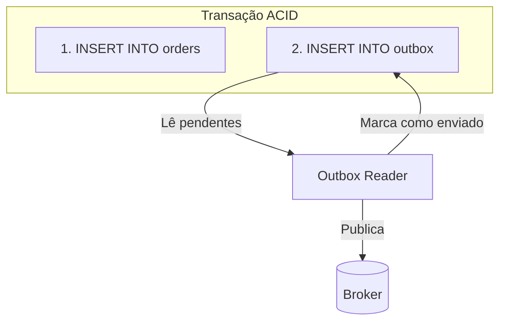
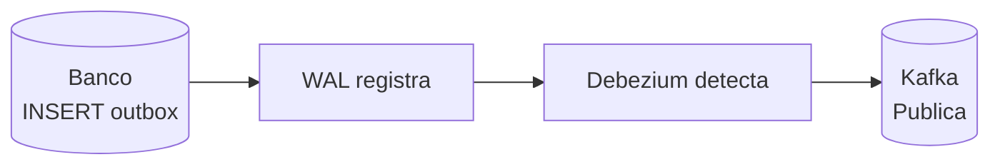

# Outbox Pattern

## Objetivo

Compreender o Outbox Pattern como solução para o problema do dual write — garantir que mudanças no banco de dados e publicação de eventos aconteçam de forma atômica, sem inconsistências.

---

## Pré-requisitos

- [Saga Pattern](02-saga-pattern.md)
- [Message Brokers](../02-communication/03-message-brokers.md)
- Conceitos de transações de banco de dados

---

## Conceitos Fundamentais

### O Problema: Dual Write

Ao salvar no banco **e** publicar um evento, duas coisas podem falhar independentemente:

```
// ❌ Dual Write — NÃO ATÔMICO
func CreateOrder(order Order) error {
    db.Save(order)           // 1. Salva no banco ✓
    broker.Publish(event)    // 2. Publica evento ✗ (broker caiu!)
    // Resultado: pedido salvo, mas ninguém sabe que foi criado
}
```

Cenários de falha:
- DB OK, Broker falha → Pedido criado, evento perdido
- Broker OK, DB falha → Evento publicado, mas pedido não existe
- App crash entre os dois → Estado inconsistente

### A Solução: Outbox Pattern

Salvar o evento em uma **tabela outbox** na mesma transação do banco. Um processo separado lê a outbox e publica no broker.



**Garantia**: Se a transação commitou, o evento está na outbox. Se não commitou, nenhum dos dois existe. **Atomicidade garantida**.

### Variantes

#### 1. Polling Publisher
Um job periódico consulta a tabela outbox por eventos não publicados.

```sql
-- A cada N ms:
SELECT * FROM outbox WHERE published = false ORDER BY created_at LIMIT 100;
-- Publica cada evento no broker
-- Marca como publicado:
UPDATE outbox SET published = true WHERE id IN (...);
```

**Vantagens**: Simples de implementar.
**Desvantagens**: Latência (depende do intervalo de polling), carga no banco.

#### 2. Change Data Capture (CDC)
Ferramentas como **Debezium** capturam mudanças diretamente do transaction log (WAL) do banco.



**Vantagens**: Latência muito baixa (~ms), sem polling no banco.
**Desvantagens**: Complexidade operacional (Debezium, Kafka Connect).

---

## Funcionamento Interno

### Estrutura da Tabela Outbox

```sql
CREATE TABLE outbox (
    id              UUID PRIMARY KEY DEFAULT gen_random_uuid(),
    aggregate_type  VARCHAR(255) NOT NULL,    -- "Order", "User"
    aggregate_id    VARCHAR(255) NOT NULL,    -- "ORD-123"
    event_type      VARCHAR(255) NOT NULL,    -- "OrderCreated"
    payload         JSONB NOT NULL,           -- dados do evento
    created_at      TIMESTAMP NOT NULL DEFAULT NOW(),
    published       BOOLEAN NOT NULL DEFAULT FALSE,
    published_at    TIMESTAMP,
    retry_count     INT NOT NULL DEFAULT 0
);

CREATE INDEX idx_outbox_unpublished ON outbox (created_at) WHERE published = FALSE;
```

### Fluxo Completo

```
1. Aplicação:
   BEGIN TRANSACTION;
     INSERT INTO orders VALUES (...);
     INSERT INTO outbox VALUES ('OrderCreated', 'ORD-123', '{"amount": 99.90}');
   COMMIT;

2. Outbox Publisher (goroutine separada):
   Loop:
     SELECT * FROM outbox WHERE published = false LIMIT 100;
     Para cada evento:
       Publica no Kafka/RabbitMQ
       UPDATE outbox SET published = true, published_at = NOW();
     Sleep(100ms)

3. Cleanup (job periódico):
   DELETE FROM outbox WHERE published = true AND published_at < NOW() - INTERVAL '7 days';
```

---

## Casos de Uso

### Nubank — Outbox + Kafka

Nubank usa o Outbox Pattern extensivamente. Toda transação financeira escreve na tabela de negócio e na outbox na mesma transação. Debezium captura os eventos via CDC do PostgreSQL e publica no Kafka.

### Shopify — Outbox para Event Sourcing

Shopify usa outbox para garantir que eventos de pedido são publicados de forma confiável, alimentando sistemas downstream de fulfillment, analytics e notificações.

---

## Vantagens

1. **Atomicidade**: Evento e dado salvos na mesma transação
2. **Confiabilidade**: Eventos nunca são perdidos (estão no banco)
3. **Simples**: Sem 2PC, sem transação distribuída
4. **Retry natural**: Eventos não publicados são retriados automaticamente
5. **Audit trail**: Tabela outbox é um log de todos os eventos publicados

---

## Desvantagens

1. **Latência**: Polling adiciona delay (mitigado com CDC)
2. **Carga no banco**: Escritas extras na outbox a cada operação
3. **At-least-once**: O mesmo evento pode ser publicado mais de uma vez → consumidores devem ser idempotentes
4. **Cleanup**: Tabela outbox cresce e precisa de limpeza periódica
5. **Complexidade com CDC**: Debezium/Kafka Connect são infraestrutura adicional

---

## Erros Comuns

### 1. Publicar fora da transação
O evento **deve** ser inserido na outbox dentro da mesma transação. Fora dela, é dual write.

### 2. Não tratar duplicatas no consumidor
O publisher pode publicar o mesmo evento duas vezes (crash depois de publicar, antes de marcar como enviado). Consumidores **devem** ser idempotentes.

### 3. Não limpar a outbox
A tabela outbox cresce indefinidamente. Implemente um job de cleanup que remove eventos publicados após N dias.

### 4. Ordenação
O polling publisher pode publicar eventos fora de ordem se múltiplas instâncias fazem polling simultâneo. Use `ORDER BY created_at` e processe sequencialmente por aggregate.

---

## Exemplos

### Exemplo: Outbox Pattern em Go

```go
package main

import (
	"encoding/json"
	"fmt"
	"sync"
	"time"
)

// OutboxEntry representa uma entrada na tabela outbox
type OutboxEntry struct {
	ID            string
	AggregateType string
	AggregateID   string
	EventType     string
	Payload       json.RawMessage
	CreatedAt     time.Time
	Published     bool
}

// Database simula banco de dados com transação
type Database struct {
	orders []map[string]interface{}
	outbox []OutboxEntry
	mu     sync.Mutex
}

// Transaction simula uma transação ACID
func (db *Database) Transaction(fn func(tx *Database) error) error {
	db.mu.Lock()
	defer db.mu.Unlock()

	// Snapshot para rollback
	ordersBkp := make([]map[string]interface{}, len(db.orders))
	copy(ordersBkp, db.orders)
	outboxBkp := make([]OutboxEntry, len(db.outbox))
	copy(outboxBkp, db.outbox)

	if err := fn(db); err != nil {
		db.orders = ordersBkp
		db.outbox = outboxBkp
		return err
	}
	return nil
}

// OrderService usa o Outbox Pattern
type OrderService struct {
	db *Database
}

func (s *OrderService) CreateOrder(orderID, userID string, amount float64) error {
	return s.db.Transaction(func(tx *Database) error {
		// 1. Salva o pedido
		order := map[string]interface{}{
			"id": orderID, "userId": userID, "amount": amount, "status": "created",
		}
		tx.orders = append(tx.orders, order)

		// 2. Insere evento na outbox (MESMA TRANSAÇÃO)
		payload, _ := json.Marshal(map[string]interface{}{
			"orderId": orderID, "userId": userID, "amount": amount,
		})
		tx.outbox = append(tx.outbox, OutboxEntry{
			ID:            fmt.Sprintf("evt-%d", time.Now().UnixNano()),
			AggregateType: "Order",
			AggregateID:   orderID,
			EventType:     "OrderCreated",
			Payload:       payload,
			CreatedAt:     time.Now(),
			Published:     false,
		})

		fmt.Printf("[TX] Order %s salvo + evento na outbox (atômico)\n", orderID)
		return nil
	})
}

// OutboxPublisher lê e publica eventos pendentes
type OutboxPublisher struct {
	db       *Database
	interval time.Duration
	stop     chan struct{}
}

func NewOutboxPublisher(db *Database, interval time.Duration) *OutboxPublisher {
	return &OutboxPublisher{db: db, interval: interval, stop: make(chan struct{})}
}

func (p *OutboxPublisher) Start() {
	go func() {
		for {
			select {
			case <-p.stop:
				return
			case <-time.After(p.interval):
				p.publishPending()
			}
		}
	}()
}

func (p *OutboxPublisher) publishPending() {
	p.db.mu.Lock()
	defer p.db.mu.Unlock()

	for i := range p.db.outbox {
		if !p.db.outbox[i].Published {
			entry := p.db.outbox[i]
			// Simula publicação no broker
			fmt.Printf("[Publisher] 📤 Publicando %s para %s/%s\n",
				entry.EventType, entry.AggregateType, entry.AggregateID)
			p.db.outbox[i].Published = true
		}
	}
}

func (p *OutboxPublisher) Stop() {
	close(p.stop)
}

func main() {
	fmt.Println("=== Outbox Pattern ===\n")

	db := &Database{}
	orderService := &OrderService{db: db}

	// Inicia publisher (polling a cada 200ms)
	publisher := NewOutboxPublisher(db, 200*time.Millisecond)
	publisher.Start()
	defer publisher.Stop()

	// Cria pedidos (evento é salvo atomicamente com o pedido)
	orderService.CreateOrder("ORD-001", "USR-1", 99.90)
	orderService.CreateOrder("ORD-002", "USR-2", 199.90)

	// Espera publisher processar
	fmt.Println("\n⏳ Aguardando publisher processar outbox...\n")
	time.Sleep(300 * time.Millisecond)

	orderService.CreateOrder("ORD-003", "USR-1", 49.90)
	time.Sleep(300 * time.Millisecond)

	fmt.Println("\n✅ Todos os eventos publicados de forma confiável")
}
```

---

## Exercícios

### Exercício 1 — SQL Design
Projete a tabela outbox para um sistema que tem Order, Payment e Notification events. Inclua índices adequados.

### Exercício 2 — Deduplicação
Implemente deduplicação no consumidor usando idempotency key para lidar com eventos duplicados publicados pela outbox.

### Exercício 3 — CDC vs Polling
Compare polling (100ms interval) vs CDC para: latência, carga no banco, complexidade operacional. Quando usar cada um?

---

## Projeto Prático

### Outbox com Retry e Dead Letter

**Objetivo**: Implementar outbox publisher com retry (3 tentativas) e DLQ.

**Requisitos**:
1. Tabela outbox com `retry_count` e `last_error`
2. Retry com backoff (1s, 5s, 30s)
3. Após 3 falhas → mover para DLQ
4. Dashboard: eventos pendentes, publicados, em DLQ

---

## Perguntas de Entrevista

### Nível Senior

**P: O que é o problema do dual write e como o Outbox Pattern resolve?**
R: Dual write ocorre quando a aplicação precisa atualizar dois sistemas (banco + broker) e não pode garantir atomicidade entre eles. O Outbox Pattern resolve salvando o evento em uma tabela outbox no mesmo banco, na mesma transação ACID que a operação de negócio. Um processo separado lê a outbox e publica no broker. Se o processo falha, os eventos continuam na outbox e serão publicados na próxima tentativa. Resultado: at-least-once delivery garantido.

### Nível Staff

**P: Compare Polling Publisher vs CDC (Debezium) para outbox. Trade-offs?**
R: Polling: simples, sem infra extra, mas adiciona latência (intervalo de polling) e carga no banco (queries periódicas). CDC: latência ~ms (lê do WAL), sem carga extra no banco, mas exige Debezium + Kafka Connect — infra complexa. Use polling para volumes baixos/médios (<10K eventos/min) onde simplicidade importa. Use CDC para volumes altos, latência crítica, ou quando já tem Kafka no stack.

---

## Referências

1. **Livro**: Richardson, C. (2018). *Microservices Patterns*, Cap. 3 — Transactional Outbox
2. **Debezium**: [https://debezium.io](https://debezium.io)
3. **Artigo**: Hohpe, G. & Woolf, B. (2003). *Enterprise Integration Patterns*
4. **Tópicos relacionados**: [Saga Pattern](02-saga-pattern.md) | [Event Sourcing](04-event-sourcing.md) | [Idempotência](../04-resilience/05-idempotency.md)
