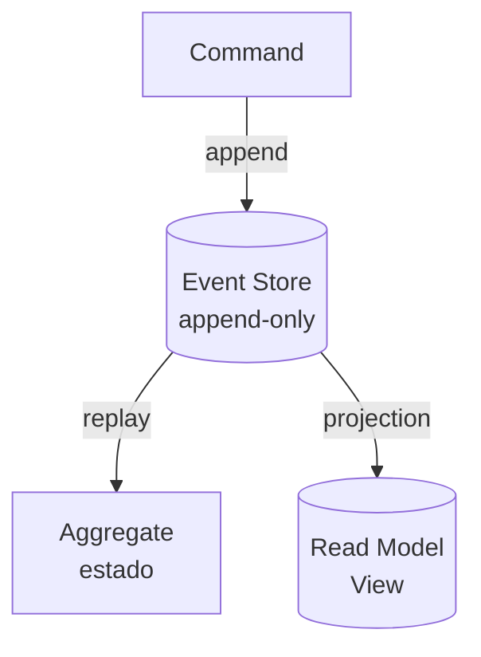

# Event Sourcing

## Objetivo

Compreender Event Sourcing como padrão de persistência onde o estado é derivado de uma sequência imutável de eventos, em vez de armazenar apenas o estado atual. Entender quando aplicá-lo, seus trade-offs e como implementá-lo em Go.

---

## Pré-requisitos

- [Event-Driven Architecture](../02-communication/04-event-driven-architecture.md)
- [Database per Service](01-database-per-service.md)
- Conceitos de imutabilidade e append-only logs

---

## Conceitos Fundamentais

### Modelo Tradicional vs Event Sourcing

```
Tradicional (CRUD):
  Estado atual: { saldo: 150 }  ← só o resultado final

Event Sourcing:
  Evento 1: ContaCriada { saldo_inicial: 0 }
  Evento 2: DepositoRealizado { valor: 200 }
  Evento 3: SaqueRealizado { valor: 50 }
  → Estado derivado: { saldo: 150 }  ← reconstruído a partir dos eventos
```

### Componentes



- **Event Store**: Log append-only de eventos imutáveis
- **Aggregate**: Entidade de domínio cujo estado é reconstruído pelo replay de eventos
- **Projection**: Transformação dos eventos em views otimizadas para leitura
- **Snapshot**: Estado pré-computado para evitar replay de todos os eventos

---

## Funcionamento Interno

### Event Store

```go
// Estrutura de um evento persistido
type StoredEvent struct {
    EventID       string    // UUID único
    AggregateID   string    // ID da entidade (ex: conta bancária)
    AggregateType string    // Tipo (ex: "BankAccount")
    EventType     string    // Tipo do evento (ex: "MoneyDeposited")
    Version       int       // Versão sequencial dentro do aggregate
    Data          []byte    // Payload serializado
    Metadata      []byte    // Correlation ID, user ID, etc.
    Timestamp     time.Time
}
```

**Regras**:
- Eventos são **imutáveis** — nunca editados ou deletados
- Eventos são **ordenados** dentro de um aggregate (version monotônica)
- **Optimistic concurrency**: ao salvar, verifica se a version esperada não mudou

### Snapshots

Para aggregates com muitos eventos, rebuildar o estado a cada leitura é lento. Snapshots resolvem:

```
Sem snapshot: Replay 10.000 eventos → Estado atual (lento)
Com snapshot: Snapshot@evento 9.900 + Replay 100 eventos → Estado atual (rápido)
```

Snapshots são criados periodicamente (a cada N eventos) e armazenados separadamente.

---

## Casos de Uso

### Nubank — Ledger como Event Store
Toda movimentação financeira é um evento imutável. O saldo é uma projeção dos eventos. Permite reconstruir o saldo em qualquer ponto no tempo e auditoria completa.

### EventStoreDB — Banco feito para Event Sourcing
Banco de dados projetado especificamente para event sourcing, com suporte nativo a streams, projections e subscriptions.

---

## Vantagens

1. **Audit trail completo**: Todo histórico preservado
2. **Time travel**: Reconstruir estado em qualquer ponto no tempo
3. **Debug**: "O que causou esse saldo?" → replay dos eventos
4. **Múltiplas projeções**: Um mesmo fluxo de eventos alimenta views diferentes
5. **Desacoplamento temporal**: Novos consumidores processam eventos do passado

---

## Desvantagens

1. **Complexidade**: Modelo mental diferente do CRUD
2. **Queries**: Não dá para fazer SELECT do estado atual sem projection
3. **Schema evolution**: Eventos antigos podem ter formato diferente
4. **Storage**: Eventos crescem indefinidamente
5. **Eventual consistency**: Projeções podem estar desatualizadas

---

## Erros Comuns

### 1. Usar event sourcing para tudo
Nem todo domínio se beneficia. CRUD simples (cadastro de usuários) não precisa de event sourcing. Use quando auditoria, temporal queries ou múltiplas projeções são requisitos reais.

### 2. Eventos mutáveis
**Nunca** alterar um evento persistido. Se o evento está errado, publique um evento compensatório.

### 3. Projeções sem idempotência
Se a projeção é reconstruída ou o evento é reprocessado, o resultado deve ser o mesmo.

---

## Exemplos

### Exemplo: Conta Bancária com Event Sourcing em Go

```go
package main

import (
	"encoding/json"
	"fmt"
	"time"
)

// --- Events ---
type Event struct {
	Type      string          `json:"type"`
	Data      json.RawMessage `json:"data"`
	Version   int             `json:"version"`
	Timestamp time.Time       `json:"timestamp"`
}

type AccountCreated struct{ OwnerName string `json:"owner_name"` }
type MoneyDeposited struct{ Amount float64 `json:"amount"` }
type MoneyWithdrawn struct{ Amount float64 `json:"amount"` }

// --- Aggregate ---
type BankAccount struct {
	ID      string
	Owner   string
	Balance float64
	Version int
	events  []Event // eventos não commitados
}

func (a *BankAccount) Apply(event Event) {
	switch event.Type {
	case "AccountCreated":
		var d AccountCreated
		json.Unmarshal(event.Data, &d)
		a.Owner = d.OwnerName
		a.Balance = 0
	case "MoneyDeposited":
		var d MoneyDeposited
		json.Unmarshal(event.Data, &d)
		a.Balance += d.Amount
	case "MoneyWithdrawn":
		var d MoneyWithdrawn
		json.Unmarshal(event.Data, &d)
		a.Balance -= d.Amount
	}
	a.Version = event.Version
}

func (a *BankAccount) addEvent(eventType string, data interface{}) {
	payload, _ := json.Marshal(data)
	a.events = append(a.events, Event{
		Type: eventType, Data: payload,
		Version: a.Version + len(a.events) + 1, Timestamp: time.Now(),
	})
}

func (a *BankAccount) Deposit(amount float64) error {
	if amount <= 0 { return fmt.Errorf("valor deve ser positivo") }
	a.addEvent("MoneyDeposited", MoneyDeposited{Amount: amount})
	return nil
}

func (a *BankAccount) Withdraw(amount float64) error {
	projected := a.Balance
	for _, e := range a.events {
		if e.Type == "MoneyDeposited" { var d MoneyDeposited; json.Unmarshal(e.Data, &d); projected += d.Amount }
		if e.Type == "MoneyWithdrawn" { var d MoneyWithdrawn; json.Unmarshal(e.Data, &d); projected -= d.Amount }
	}
	if projected < amount { return fmt.Errorf("saldo insuficiente: %.2f < %.2f", projected, amount) }
	a.addEvent("MoneyWithdrawn", MoneyWithdrawn{Amount: amount})
	return nil
}

// --- Event Store ---
type EventStore struct {
	streams map[string][]Event
}

func NewEventStore() *EventStore {
	return &EventStore{streams: make(map[string][]Event)}
}

func (es *EventStore) Save(aggregateID string, events []Event, expectedVersion int) error {
	stream := es.streams[aggregateID]
	if len(stream) != expectedVersion {
		return fmt.Errorf("conflito de concorrência: esperado v%d, atual v%d", expectedVersion, len(stream))
	}
	es.streams[aggregateID] = append(stream, events...)
	return nil
}

func (es *EventStore) Load(aggregateID string) []Event {
	return es.streams[aggregateID]
}

func (es *EventStore) LoadAccount(id string) *BankAccount {
	account := &BankAccount{ID: id}
	for _, event := range es.Load(id) {
		account.Apply(event)
	}
	return account
}

func main() {
	fmt.Println("=== Event Sourcing: Conta Bancária ===\n")
	store := NewEventStore()

	// Criar conta
	account := &BankAccount{ID: "ACC-001"}
	account.addEvent("AccountCreated", AccountCreated{OwnerName: "Alice"})
	account.Deposit(1000)
	account.Withdraw(250)
	account.Deposit(500)

	// Persistir eventos
	store.Save("ACC-001", account.events, 0)
	fmt.Println("Eventos persistidos:")
	for _, e := range store.Load("ACC-001") {
		fmt.Printf("  v%d: %s → %s\n", e.Version, e.Type, string(e.Data))
	}

	// Reconstruir estado (time travel)
	rebuilt := store.LoadAccount("ACC-001")
	fmt.Printf("\n💰 Estado reconstruído: %s | Saldo: R$%.2f\n", rebuilt.Owner, rebuilt.Balance)
}
```

---

## Exercícios

### Exercício 1 — Carrinho de Compras com Event Sourcing
Modele os eventos para um carrinho: ItemAdded, ItemRemoved, QuantityChanged, CartCheckedOut. Implemente o aggregate.

### Exercício 2 — Time Travel
Implemente um método `LoadAtVersion(id, version)` que reconstrua o estado até uma versão específica.

### Exercício 3 — Snapshots
Adicione suporte a snapshots que são criados a cada 10 eventos.

---

## Projeto Prático

### Event-Sourced Bank Account com API HTTP

**Requisitos**: API com `POST /accounts`, `POST /accounts/{id}/deposit`, `POST /accounts/{id}/withdraw`, `GET /accounts/{id}`, `GET /accounts/{id}/history`.

---

## Perguntas de Entrevista

### Nível Senior

**P: Quando usar Event Sourcing e quando NÃO usar?**
R: **Usar**: quando auditoria é requisito (financeiro, compliance), quando múltiplas projeções são necessárias, quando temporal queries são importantes ("qual era o estado em 15/01?"). **Não usar**: CRUD simples sem requisitos de auditoria, domínios com queries complexas sobre estado atual (relatórios ad-hoc), times sem experiência (curva de aprendizado alta).

### Nível Staff

**P: Como lidar com schema evolution em Event Sourcing?**
R: Três estratégias: (1) **Upcasting**: transformar eventos antigos no formato novo durante o replay (lazy migration). (2) **Weak schema**: usar formato flexível (JSON) e ignorar campos desconhecidos. (3) **Event versioning**: `OrderCreated_v1`, `OrderCreated_v2` com handlers separados. A recomendação: weak schema + upcasting é o mais prático. Nunca alterar eventos já persistidos.

---

## Referências

1. **Livro**: Vernon, V. (2013). *Implementing Domain-Driven Design*, Cap. 8
2. **Artigo**: Fowler, M. *Event Sourcing* — martinfowler.com
3. **EventStoreDB**: [https://eventstore.com](https://eventstore.com)
4. **Tópicos relacionados**: [CQRS](05-cqrs.md) | [Outbox Pattern](03-outbox-pattern.md)
