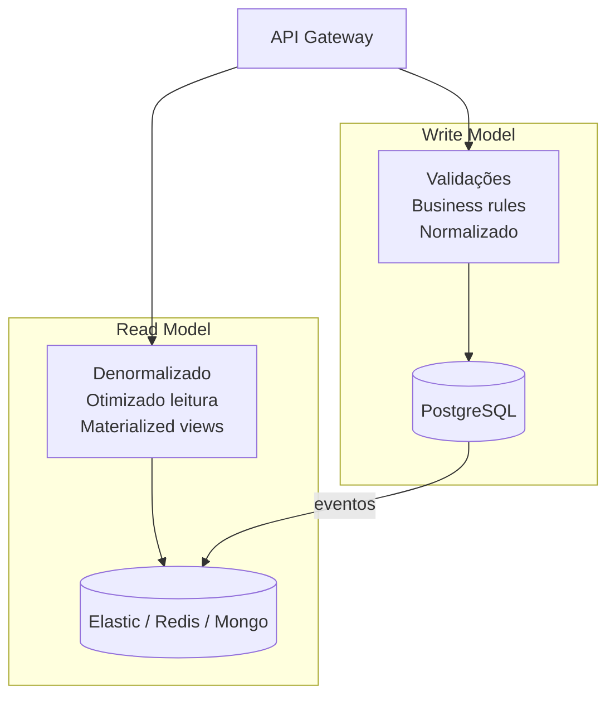
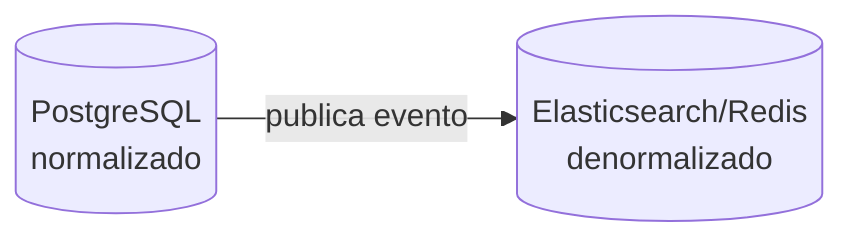
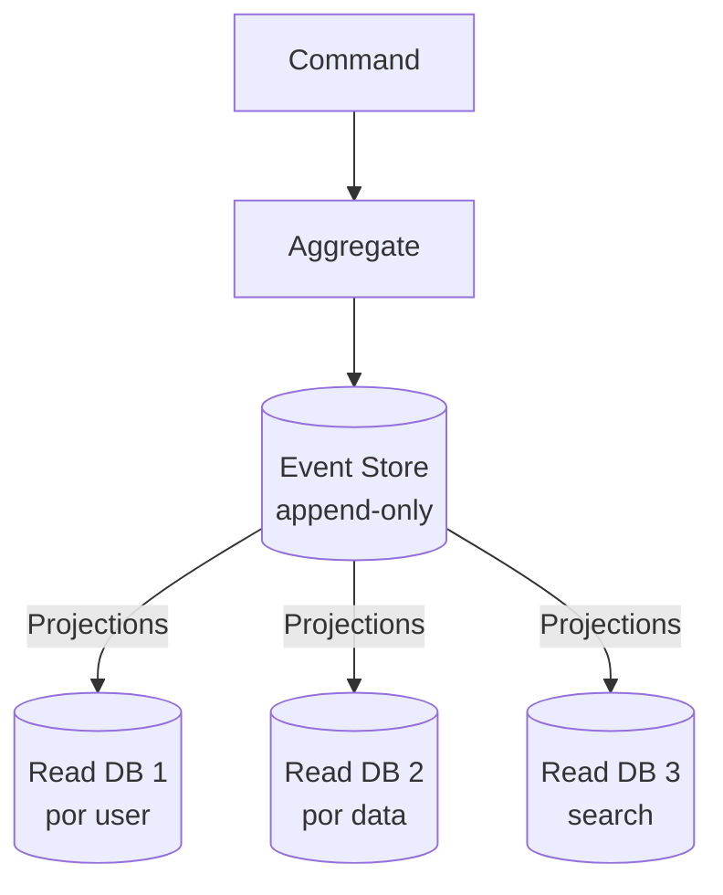

# CQRS (Command Query Responsibility Segregation)

## Objetivo

Compreender o padrão CQRS que separa modelos de leitura e escrita, entendendo quando combiná-lo com Event Sourcing, os trade-offs de consistência eventual, e como implementá-lo em Go.

---

## Pré-requisitos

- [Event Sourcing](04-event-sourcing.md)
- [Database per Service](01-database-per-service.md)
- Conceitos de Domain-Driven Design

---

## Conceitos Fundamentais

### O Problema

Em sistemas CRUD tradicionais, o mesmo modelo é usado para leitura e escrita. Isso cria conflitos:

- **Escrita** precisa de validações complexas, invariantes de negócio, normalização
- **Leitura** precisa de denormalização, JOINs, agregações, paginação
- Otimizar para um prejudica o outro

### A Solução: CQRS

Separar completamente o **modelo de escrita (Command)** do **modelo de leitura (Query)**.



### CQRS sem Event Sourcing

CQRS **não exige** Event Sourcing. A forma mais simples:



### CQRS com Event Sourcing

A combinação mais poderosa (e complexa):



---

## Funcionamento Interno

### Command Side

```go
// Commands são imperativos — "faça isso"
type CreateOrderCommand struct {
    UserID   string
    Items    []OrderItem
    Address  ShippingAddress
}

// Command Handler: valida e gera eventos
func (h *OrderHandler) Handle(cmd CreateOrderCommand) error {
    // 1. Validação
    if len(cmd.Items) == 0 { return ErrEmptyOrder }
    
    // 2. Business rules
    if !h.userService.IsActive(cmd.UserID) { return ErrInactiveUser }
    
    // 3. Gera eventos (não altera estado diretamente)
    event := OrderCreatedEvent{...}
    
    // 4. Persiste (event store ou banco)
    return h.repository.Save(event)
}
```

### Query Side

```go
// Queries são declarativas — "me dê isso"
type GetOrdersByUserQuery struct {
    UserID   string
    Page     int
    PageSize int
}

// Query Handler: lê do read model (denormalizado)
func (h *OrderQueryHandler) Handle(q GetOrdersByUserQuery) ([]OrderView, error) {
    // Lê diretamente do read model (sem JOINs, sem lógica de negócio)
    return h.readDB.FindOrdersByUser(q.UserID, q.Page, q.PageSize)
}
```

### Projeção (Syncing Read Model)

```go
// Projection: consome eventos e atualiza read model
func (p *OrderProjection) Handle(event DomainEvent) error {
    switch e := event.(type) {
    case OrderCreatedEvent:
        // Insere no read model (denormalizado)
        return p.readDB.Upsert(OrderView{
            OrderID:  e.OrderID,
            UserName: e.UserName, // já denormalizado!
            Total:    e.Total,
            Status:   "created",
        })
    case OrderShippedEvent:
        return p.readDB.UpdateStatus(e.OrderID, "shipped")
    }
    return nil
}
```

---

## Casos de Uso

### Stack Overflow — CQRS para Performance

Stack Overflow usa write model normalizado para criar perguntas/respostas e read model denormalizado (com todos os dados pré-computados) para exibir páginas. O resultado: renderização de página em <50ms.

### Event Store (Banco de Dados) — CQRS Nativo

EventStoreDB é projetado para CQRS + Event Sourcing, com projections nativas que materializam views a partir do event stream.

---

## Vantagens

1. **Performance de leitura**: Read model otimizado para cada query
2. **Escalabilidade independente**: Escalar leitura sem afetar escrita
3. **Modelos otimizados**: Cada lado usa o modelo ideal
4. **Flexibilidade**: Múltiplos read models para diferentes queries
5. **Combinação com Event Sourcing**: Audit trail + views otimizadas

---

## Desvantagens

1. **Complexidade**: Dois modelos, sincronização, eventual consistency
2. **Consistência eventual**: Read model pode estar desatualizado
3. **Duplicação de dados**: Read model duplica dados do write model
4. **Infraestrutura**: Mais bancos, mais deploys, mais monitoramento
5. **Overkill para CRUD**: Se o domínio é simples, CQRS é over-engineering

---

## Erros Comuns

### 1. CQRS para CRUD simples
Um cadastro de usuários com 5 campos não precisa de CQRS. O overhead não se justifica.

### 2. Esperar consistência imediata no read model
CQRS com eventual consistency significa que o read model pode não refletir a escrita mais recente. O usuário que acabou de criar um pedido pode não vê-lo imediatamente na listagem.

**Solução**: Após escrita, redirecione para uma leitura que vai direto ao write model (read-your-writes).

### 3. Não monitorar o lag da projeção
Se a projeção está 10 minutos atrasada, o read model mostra dados de 10 minutos atrás. Monitore o lag.

---

## Exemplos

### Exemplo: CQRS Simples em Go

```go
package main

import (
	"fmt"
	"sync"
	"time"
)

// --- Write Model ---
type Order struct {
	ID     string
	UserID string
	Items  []string
	Total  float64
	Status string
}

type WriteStore struct {
	orders map[string]Order
	mu     sync.RWMutex
}

// --- Read Model (Denormalizado) ---
type OrderView struct {
	OrderID   string
	UserName  string // denormalizado — não precisa JOIN com UserService
	ItemCount int
	Total     float64
	Status    string
	CreatedAt time.Time
}

type ReadStore struct {
	views map[string][]OrderView // por userID
	mu    sync.RWMutex
}

// --- CQRS Mediator ---
type OrderCQRS struct {
	writeStore *WriteStore
	readStore  *ReadStore
	users      map[string]string // userID → userName
}

func NewOrderCQRS() *OrderCQRS {
	return &OrderCQRS{
		writeStore: &WriteStore{orders: make(map[string]Order)},
		readStore:  &ReadStore{views: make(map[string][]OrderView)},
		users:      map[string]string{"USR-1": "Alice", "USR-2": "Bob"},
	}
}

// Command: CreateOrder (escrita)
func (c *OrderCQRS) CreateOrder(id, userID string, items []string, total float64) {
	// Write model: normalizado, com validações
	order := Order{ID: id, UserID: userID, Items: items, Total: total, Status: "created"}
	c.writeStore.mu.Lock()
	c.writeStore.orders[id] = order
	c.writeStore.mu.Unlock()
	fmt.Printf("[Write] Order %s criado\n", id)

	// Projeção: atualiza read model (assíncrono em produção)
	go c.projectOrder(order)
}

func (c *OrderCQRS) projectOrder(order Order) {
	time.Sleep(10 * time.Millisecond) // simula async
	view := OrderView{
		OrderID:   order.ID,
		UserName:  c.users[order.UserID],
		ItemCount: len(order.Items),
		Total:     order.Total,
		Status:    order.Status,
		CreatedAt: time.Now(),
	}
	c.readStore.mu.Lock()
	c.readStore.views[order.UserID] = append(c.readStore.views[order.UserID], view)
	c.readStore.mu.Unlock()
	fmt.Printf("[Projection] Order %s projetado no read model\n", order.ID)
}

// Query: GetUserOrders (leitura — sem JOINs!)
func (c *OrderCQRS) GetUserOrders(userID string) []OrderView {
	c.readStore.mu.RLock()
	defer c.readStore.mu.RUnlock()
	return c.readStore.views[userID]
}

func main() {
	fmt.Println("=== CQRS: Separação de Leitura e Escrita ===\n")

	cqrs := NewOrderCQRS()

	// Escrita (Command side)
	cqrs.CreateOrder("ORD-1", "USR-1", []string{"Teclado", "Mouse"}, 349.90)
	cqrs.CreateOrder("ORD-2", "USR-1", []string{"Monitor"}, 1599.00)
	cqrs.CreateOrder("ORD-3", "USR-2", []string{"Headset"}, 299.00)

	time.Sleep(50 * time.Millisecond) // espera projeções

	// Leitura (Query side — denormalizado, sem JOINs)
	fmt.Println("\n--- Pedidos da Alice (read model denormalizado) ---")
	for _, v := range cqrs.GetUserOrders("USR-1") {
		fmt.Printf("  %s | %s | %d itens | R$%.2f | %s\n",
			v.OrderID, v.UserName, v.ItemCount, v.Total, v.Status)
	}
}
```

---

## Exercícios

### Exercício 1 — Read Models Múltiplos
Implemente 3 read models diferentes para o mesmo write model de pedidos: por usuário, por status, e por data.

### Exercício 2 — Read-Your-Writes
Implemente a estratégia de read-your-writes para que o usuário sempre veja sua escrita mais recente.

### Exercício 3 — CQRS + Event Sourcing
Combine o Event Sourcing do tópico anterior com CQRS: eventos alimentam projeções que mantêm read models.

---

## Projeto Prático

### Dashboard Analytics com CQRS

**Objetivo**: API de e-commerce com write model normalizado e 3 read models: dashboard do vendedor, listagem de pedidos do comprador, analytics em tempo real.

---

## Perguntas de Entrevista

### Nível Senior

**P: Quando CQRS vale a pena?**
R: Quando read e write têm requisitos muito diferentes: escrita precisa de validação complexa e consistência forte, leitura precisa de alta performance com dados denormalizados. Exemplos: dashboards, e-commerce (catálogo vs carrinho), analytics. **Não** vale para CRUDs simples.

### Nível Staff

**P: Como lidar com eventual consistency em CQRS para UX?**
R: (1) **Read-your-writes**: após escrita, redirecionar para leitura do write model. (2) **Optimistic UI**: atualizar a UI imediatamente e reconciliar quando o read model atualizar. (3) **Polling/SSE**: notificar o cliente quando o read model foi atualizado. (4) **Versioning**: incluir version no response da escrita e aguardar o read model atingir essa version.

---

## Referências

1. **Artigo**: Fowler, M. *CQRS* — martinfowler.com
2. **Artigo**: Young, G. *CQRS Documents*
3. **Livro**: Vernon, V. (2013). *Implementing Domain-Driven Design*
4. **Tópicos relacionados**: [Event Sourcing](04-event-sourcing.md) | [Database per Service](01-database-per-service.md)
