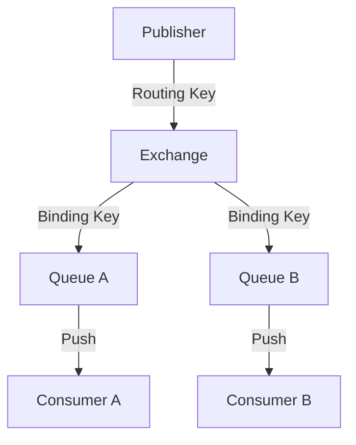

# 01. Introdução à Mensageria Assíncrona e RabbitMQ (AMQP)

## Objetivo
Ao final deste capítulo, você será capaz de explicar as vantagens de desacoplamento temporal e espacial da mensageria assíncrona, descrever os componentes do protocolo AMQP 0-9-1 (Exchanges, Bindings, Queues), e implementar fluxos robustos de publicação e consumo de mensagens com tratamento manual de confirmações (ACKs) e filas de erro (Dead Letter Exchanges) usando RabbitMQ em Kotlin.

---

## Motivação
Nos módulos anteriores, exploramos a comunicação síncrona ponto a ponto via REST e gRPC. Embora eficientes, essas tecnologias impõem um **acoplamento temporal rígido**: se o `PaymentService` precisa notificar o `NotificationService` sobre cada transação realizada e a rede oscilar ou o serviço de notificação ficar lento, o fluxo de pagamentos inteiro degrada ou falha. 

Para construir sistemas de alta resiliência e escala, precisamos de um mecanismo onde um serviço possa disparar uma mensagem declarando que um evento ocorreu ("Transação Criada") e continuar seu processamento local imediatamente, sem se importar se o destinatário está ativo naquele milissegundo ou onde ele está localizado. A solução para esse acoplamento é o uso de **Message Brokers** assíncronos baseados no protocolo AMQP, como o **RabbitMQ**.

---

## Pré-requisitos
* [Módulo 2: Concorrência e IPC (Inter-Process Communication)](./../02-concurrency-ipc/README.md).

---

## Conceitos Fundamentais

### 1. Desacoplamento Espacial e Temporal
A mensageria assíncrona altera fundamentalmente a topologia física da comunicação distribuída:
* **Desacoplamento Espacial**: O emissor (Publisher) não precisa saber o endereço IP físico, a porta ou mesmo a identidade dos receptores (Consumers). Ele apenas envia a mensagem para um ponto lógico de entrada (Exchange).
* **Desacoplamento Temporal**: O emissor e o receptor não precisam estar online simultaneamente. Se o consumidor estiver offline por manutenção, as mensagens se acumulam com segurança no broker e são processadas assim que o consumidor reiniciar, eliminando falhas em cascata.

---

### 2. A Arquitetura do Protocolo AMQP 0-9-1
O RabbitMQ é baseado no padrão aberto **AMQP (Advanced Message Queuing Protocol)**. Seu modelo de funcionamento físico é composto por cinco componentes essenciais:



1. **Publisher (Emissor)**: Aplicação que produz e envia mensagens para o broker.
2. **Exchange (Roteador)**: Ponto de entrada que recebe as mensagens do Publisher e decide para quais filas direcioná-las baseado em regras de roteamento (Bindings) e chaves de roteamento (Routing Keys).
3. **Queue (Fila)**: Buffer FIFO persistente que armazena as mensagens em disco ou memória até que sejam consumidas.
4. **Binding (Ligação)**: Regra de relacionamento que vincula uma Exchange a uma Fila.
5. **Consumer (Receptor)**: Aplicação que assina uma fila e processa as mensagens.

---

### 3. Tipos de Exchanges (Roteamento)
O roteamento de mensagens é flexível baseado no tipo de Exchange definido:
* **Direct Exchange**: Direciona a mensagem para a fila cuja *Binding Key* seja exatamente idêntica à *Routing Key* enviada pelo Publisher. Ideal para filas de tarefas diretas.
* **Fanout Exchange**: Ignora totalmente as Routing Keys e copia a mensagem para **todas** as filas vinculadas a ela (padrão Publish-Subscribe clássico).
* **Topic Exchange**: Direciona mensagens com base em correspondência de padrões curingas entre a Routing Key e a Binding Key. O caractere `*` substitui exatamente uma palavra; o caractere `#` substitui zero ou mais palavras (ex: Routing Key `br.financeiro.pagamentos` casa com Binding Key `br.#`).

---

### 4. Ciclo de Confirmação e Resiliência
Para garantir que dados não sejam perdidos no trânsito físico, o AMQP adota confirmações em duas etapas:
* **Publisher Confirms**: O broker confirma ao Publisher que recebeu a mensagem e a salvou no disco.
* **Consumer Acknowledgements (ACK/NACK)**:
  * **ACK**: O consumidor sinaliza ao broker que processou a mensagem com sucesso. O broker deleta a mensagem da fila.
  * **NACK/REJECT**: O consumidor sinaliza que falhou ao processar. O broker pode reencaminhar a mensagem para a fila (requeue) ou direcioná-la a uma fila de erro.
  * **Auto-ACK (Perigoso)**: O broker assume a mensagem como entregue no microssegundo em que a envia pelo socket do consumidor. Se a aplicação do consumidor sofrer crash no meio do processamento, a mensagem é perdida para sempre.

---

## Funcionamento Interno

### Dead Letter Exchange (DLX)
Uma DLX é uma Exchange normal configurada para receber mensagens que falharam no processamento por:
1. Rejeição explícita do consumidor (`basic.nack` ou `basic.reject`) com a opção de `requeue = false`.
2. Expiração de tempo de vida da mensagem (TTL - *Time-To-Live*).
3. Estouro de limite de tamanho da fila física do broker.

Associar uma DLX e sua respectiva fila de erro (Dead Letter Queue - DLQ) evita loops infinitos de retries que bloqueiam o processamento de mensagens saudáveis na fila principal.

---

## Arquitetura
O RabbitMQ adota o modelo **Push-based**: o broker mantém conexões TCP persistentes abertas com os consumidores e empurra (*push*) mensagens de forma proativa conforme elas chegam. Para evitar que um consumidor lento seja inundado por mensagens e estoure a memória RAM, define-se a propriedade **Prefetch Count** (limite de mensagens em trânsito não confirmadas por canal).

---

## Exemplos

### Configuração e Publicação de Mensagens no RabbitMQ com Spring AMQP (Kotlin)
Abaixo, configuramos uma estrutura de fila resiliente associada a uma Dead Letter Exchange e enviamos um evento financeiro estruturado.

```kotlin
// ARQUIVO: RabbitMqConfiguration.kt
package com.distribuidos.mensageria

import org.springframework.amqp.core.*
import org.springframework.context.annotation.Bean
import org.springframework.context.annotation.Configuration

@Configuration
class RabbitMqConfiguration {

    companion object {
        const val TRANSACTION_EXCHANGE = "payment.transaction.exchange"
        const val TRANSACTION_QUEUE = "payment.transaction.queue"
        const val TRANSACTION_DLX = "payment.transaction.dlx"
        const val TRANSACTION_DLQ = "payment.transaction.dlq"
        const val ROUTING_KEY = "transaction.created"
    }

    // Declaração da Dead Letter Exchange (DLX)
    @Bean
    fun deadLetterExchange(): TopicExchange = TopicExchange(TRANSACTION_DLX)

    // Declaração da Fila de Erro (DLQ)
    @Bean
    fun deadLetterQueue(): Queue = QueueBuilder.durable(TRANSACTION_DLQ).build()

    // Liga a DLQ a DLX
    @Bean
    fun deadLetterBinding(): Binding = BindingBuilder
        .bind(deadLetterQueue())
        .to(deadLetterExchange())
        .with("#")

    // Declaração da Fila Principal com argumentos vinculando-a a DLX em caso de erro
    @Bean
    fun mainQueue(): Queue = QueueBuilder.durable(TRANSACTION_QUEUE)
        .withArgument("x-dead-letter-exchange", TRANSACTION_DLX)
        .withArgument("x-dead-letter-routing-key", "transaction.error")
        .build()

    // Declaração da Exchange Principal
    @Bean
    fun mainExchange(): TopicExchange = TopicExchange(TRANSACTION_EXCHANGE)

    // Vincula a Fila Principal a Exchange Principal
    @Bean
    fun mainBinding(): Binding = BindingBuilder
        .bind(mainQueue())
        .to(mainExchange())
        .with(ROUTING_KEY)
}
```

```kotlin
// ARQUIVO: TransactionEventPublisher.kt
package com.distribuidos.mensageria

import org.springframework.amqp.rabbit.core.RabbitTemplate
import org.springframework.stereotype.Service

@Service
class TransactionEventPublisher(
    private val rabbitTemplate: RabbitTemplate
) {
    fun publishTransactionEvent(transactionId: String, amount: Double) {
        val payload = "{\"transactionId\":\"$transactionId\",\"amount\":$amount}"
        
        // Envia a mensagem associando a Routing Key apropriada
        rabbitTemplate.convertAndSend(
            RabbitMqConfiguration.TRANSACTION_EXCHANGE,
            RabbitMqConfiguration.ROUTING_KEY,
            payload
        )
        println("[PUBLISHER] Evento enviado para a Exchange: $payload")
    }
}
```

### Consumidor com Confirmação Manual (Manual ACK) em Kotlin
O consumidor abaixo gerencia explicitamente a confirmação da mensagem, garantindo que em caso de exceções o item seja encaminhado para a DLQ.

```kotlin
// ARQUIVO: TransactionEventConsumer.kt
package com.distribuidos.mensageria

import com.rabbitmq.client.Channel
import org.springframework.amqp.core.Message
import org.springframework.amqp.rabbit.annotation.RabbitListener
import org.springframework.stereotype.Component

@Component
class TransactionEventConsumer {

    @RabbitListener(
        queues = [RabbitMqConfiguration.TRANSACTION_QUEUE],
        ackMode = "MANUAL" // Desativa a confirmação automática
    )
    fun onMessage(message: Message, channel: Channel) {
        val deliveryTag = message.messageProperties.deliveryTag
        val body = String(message.body)
        
        try {
            println("[CONSUMER] Processando mensagem da fila: $body")
            
            // Simula uma falha intencional de validação para teste de DLQ
            if (body.contains("\"amount\":-")) {
                throw IllegalArgumentException("Valor negativo inválido!")
            }

            // Confirmação Manual (Sucesso)
            channel.basicAck(deliveryTag, false)
            println("[CONSUMER] ACK enviado para a mensagem $deliveryTag")
            
        } catch (e: Exception) {
            println("[CONSUMER] Erro no processamento. Encaminhando para DLQ...")
            
            // Rejeita a mensagem explicitamente e impede o requeue automático (direciona para a DLX)
            channel.basicNack(deliveryTag, false, false)
        }
    }
}
```

---

## Casos de Uso
* **Nubank**: Utiliza message brokers para desacoplar a realização de compras no cartão de crédito dos sistemas secundários (como geração de pontos de fidelidade, disparo de notificações push no celular e geração de relatórios de faturamento). A compra é aprovada em frações de segundo de forma síncrona; os eventos associados são distribuídos e executados assincronamente por filas.
* **Uso Geral da Indústria**: Filas de tarefas em segundo plano (background tasks) com ferramentas como Celery em Python baseadas em RabbitMQ.

---

## Quando Utilizar RabbitMQ
* Sistemas que exigem roteamento de mensagens complexo, dinâmico e flexível (Topic/Headers routing).
* Filas de tarefas de processamento onde cada mensagem deve ser consumida e deletada por um único trabalhador disponível (Competiting Consumers).

---

## Quando Não Utilizar RabbitMQ
* Pipelines de processamento de Big Data que exigem vazão massiva de milhões de eventos por segundo (Kafka é mais indicado).
* Cenários onde os consumidores precisam reler e reproduzir mensagens históricas gravadas no broker (RabbitMQ deleta dados pós-ACK).

---

## Vantagens
* **Roteamento Avançado**: Roteamento dinâmico sem alteração de código da aplicação.
* **Garantia de Entrega**: Mecanismos robustos de ACKs/NACKs e persistência física em disco.
* **Push Model**: Baixa latência de recebimento, pois o consumidor não precisa ficar pesquisando a fila (*polling*).

---

## Desvantagens
* **Perda de Histórico**: Mensagens confirmadas somem do broker.
* **Limitação de Escala**: O RabbitMQ armazena as mensagens em estruturas de dados em memória do Erlang para indexação rápida. Filas muito longas afetam diretamente o uso de memória do servidor do RabbitMQ, degradando sua performance.

---

## Comparações

### Comunicação Síncrona vs. Assíncrona

| Dimensão | Síncrona (REST/gRPC) | Assíncrona (Mensageria) |
|---|---|---|
| **Acoplamento Temporal** | Forte (ambos devem estar ativos) | Desacoplado (independente de tempo) |
| **Ponto Único de Falha** | Alto risco de cascata | Isolado (mensagens aguardam na fila) |
| **Vazão sob Pico** | Degradação imediata | Amortecimento (fila segura a carga) |
| **Latência percebida** | Menor (resposta instantânea) | Maior (consistência eventual) |

---

## Erros Comuns
1. **Ativar Auto-ACK em Filas Críticas**: Deixar o parâmetro `ackMode` como `AUTO` (ou `NONE` no RabbitMQ básico). Em caso de estouro de memória da aplicação do consumidor no meio da execução, a mensagem é perdida de forma irrecuperável.
2. **Infinite Requeue Loop**: Em caso de erro de processamento, rejeitar a mensagem enviando `basic.nack(deliveryTag, false, true)` (requeue ativo). Se o erro for de validação de dados inválidos (ex: string em campo numérico), o consumidor travará processando a mesma mensagem inválida em loop infinito, consumindo $100\%$ da CPU da máquina.

---

## Projeto Prático
No projeto **FinTech Ledger**, desacoplamos a emissão de comprovantes de transferências.
Quando uma transação de transferência é realizada com sucesso no Ledger, publicamos um evento assíncrono `TransferProcessedEvent` na Exchange do RabbitMQ para que o serviço de e-mail e notificações o consuma e gere o comprovante em background.

```kotlin
// ARQUIVO: TransactionEventGateway.kt
package com.distribuidos.projeto.gateway

import com.distribuidos.projeto.TransactionResult
import org.springframework.amqp.rabbit.core.RabbitTemplate

class TransactionEventGateway(
    private val rabbitTemplate: RabbitTemplate
) {
    fun notifyTransactionProcessed(result: TransactionResult.Success) {
        val message = """
            {
              "transactionId": "${result.transactionId}",
              "timestamp": ${result.timestamp},
              "status": "PROCESSED"
            }
        """.trimIndent()

        rabbitTemplate.convertAndSend(
            "payment.transaction.exchange",
            "transaction.created",
            message
        )
    }
}
```

---

## Exercícios

### Básico
1. Qual a diferença prática de roteamento entre uma Exchange do tipo **Fanout** e uma **Topic** no RabbitMQ?
2. Por que o uso de Auto-ACK é considerado perigoso no design de sistemas financeiros?

### Intermediário
3. Configure conceitualmente uma estrutura de filas no RabbitMQ onde mensagens enviadas para a exchange `notification.exchange` com a routing key `sms.*` vão para a fila `sms.queue`, e mensagens com routing key `email.*` vão para a fila `email.queue`. Desenhe o mapeamento de bindings necessário.

### Avançado
4. Escreva uma classe de consumidor em Kotlin que implemente uma **Políticas de Retry Local com Limite de Tentativas** antes de encaminhar a mensagem para a Dead Letter Queue (DLQ). O consumidor deve usar a propriedade de cabeçalhos de mensagem (`messageProperties.headers`) para ler e incrementar um contador `x-retry-count`. Se o contador atingir 3 tentativas, chame `channel.basicNack(deliveryTag, false, false)` para despachar a mensagem permanentemente para a DLQ.

---

## Perguntas de Entrevista
1. **O que é o "Competing Consumers Pattern" (Padrão de Consumidores Concorrentes) e como o prefetch count ajuda a balancear o processamento de mensagens no RabbitMQ?**
   * *Resposta esperada*: O Competing Consumers Pattern ocorre quando múltiplas instâncias de um serviço consumidor assinam a mesma fila de mensagens. O broker distribui as mensagens entre os consumidores ativos de forma alternada (Round Robin) para paralelizar o processamento. O prefetch count define o número máximo de mensagens não confirmadas (sem ACK) que o broker pode empurrar para um consumidor específico de uma única vez. Configurar um prefetch count (ex: prefetch = 1) garante que o broker envie uma mensagem por vez para cada consumidor. Se um consumidor receber uma tarefa pesada que demore segundos, ele processará apenas aquela mensagem, permitindo que as outras mensagens da fila sejam entregues a consumidores que estão ociosos, otimizando a vazão do cluster.

2. **Como o RabbitMQ garante a durabilidade de mensagens e filas em caso de reinicialização completa ou queda de energia do servidor físico do broker?**
   * *Resposta esperada*: A durabilidade depende de três configurações explícitas e combinadas: a **Fila** deve ser declarada como durável (`QueueBuilder.durable()`), a **Exchange** deve ser declarada como durável e a **Mensagem** de publicação deve ser marcada com o modo de entrega persistente (`DeliveryMode.PERSISTENT`). Quando essas três condições são atendidas, o RabbitMQ grava a mensagem no seu log físico persistente em disco (WAL) antes de confirmar o recebimento ao Publisher. Se o servidor do broker cair, ao reiniciar, ele lê os metadados e os logs de mensagens físicas em disco, restaurando as filas e as mensagens não consumidas.

---

## Resumo
* A mensageria assíncrona desacopla sistemas no tempo e espaço, permitindo amortecimento de carga e maior tolerância a falhas físicas.
* O protocolo AMQP roteia mensagens de Publishers para Filas usando Exchanges baseadas em regras de Bindings.
* Garantir durabilidade física e utilizar confirmações manuais (ACKs) de mensagens integradas a Dead Letter Exchanges são práticas fundamentais para sistemas transacionais financeiros.

---

## Próximo Capítulo
No [Capítulo 02: Apache Kafka e Logs de Commit Distribuídos](./02-apache-kafka.md), analisaremos um paradigma de mensageria diferente focado em alta vazão, partições imutáveis persistentes em disco e modelo Pull-based com o Apache Kafka.

---

## Referências
* **RabbitMQ Tutorials**: [Official RabbitMQ tutorials](https://www.rabbitmq.com/getstarted.html)
* **AMQP 0-9-1 Specification**: [Official AMQP specification](https://www.rabbitmq.com/resources/specs/amqp0-9-1.pdf)
* **Enterprise Integration Patterns**, Gregor Hohpe. Capítulo 3: *Messaging Channels*.
