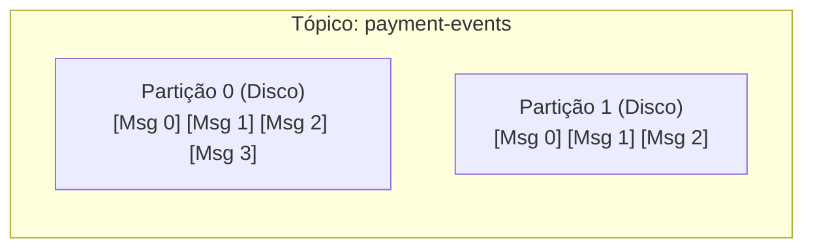
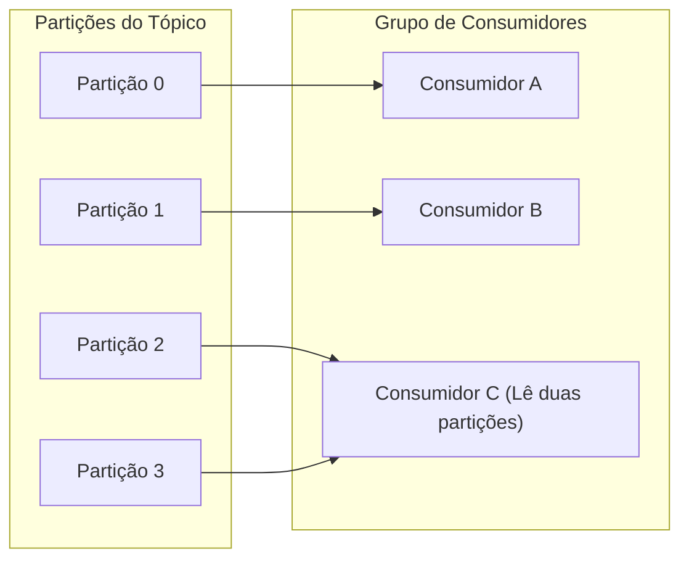

# 02. Apache Kafka e Logs de Commit Distribuídos

## Objetivo
Ao final deste capítulo, você será capaz de conceituar a arquitetura de Logs de Commit Distribuídos do Apache Kafka, explicar a relação física entre Tópicos, Partições e Consumidores, descrever os mecanismos internos de *Offsets*, *Consumer Groups* e replicação baseada em ISR (*In-Sync Replicas*), e implementar produtores e consumidores de alta performance em Kotlin.

---

## Motivação
No capítulo anterior, estudamos o RabbitMQ, que segue o paradigma de filas inteligentes e consumidores simples (mensagens apagadas pós-ACK). Essa abordagem é ideal para roteamentos complexos e filas de tarefas simples. 

Porém, em sistemas financeiros globais ou plataformas de processamento de streaming de eventos (como Uber ou Netflix, que geram bilhões de eventos de localização e telemetria por segundo), o RabbitMQ torna-se um gargalo de memória. Além disso, e se precisarmos reprocessar transações financeiras passadas para corrigir um bug de auditoria? No RabbitMQ, as mensagens históricas sumiram.

Para resolver a necessidade de **altíssima vazão**, **escalabilidade linear** e **imutabilidade histórica**, a indústria adota o **Apache Kafka**, que substitui o modelo de filas clássico pelo modelo de **Log de Commit Distribuído persistente**.

---

## Pré-requisitos
* [Módulo 3, Capítulo 01: Introdução à Mensageria Assíncrona e RabbitMQ (AMQP)](./01-rabbitmq-amqp.md).

---

## Conceitos Fundamentais

### 1. O que é um Log de Commit?
Um Log de Commit é a estrutura de dados mais simples da computação: uma sequência ordenada e imutável de registros anexados estritamente no final (*append-only*). O log é gravado de forma puramente sequencial e persistente no disco físico.
No Apache Kafka, as mensagens não são deletadas quando são consumidas. Elas permanecem no disco por um período determinado (ex: 7 dias) ou até a partição atingir um tamanho limite, permitindo que os consumidores leiam os dados em seu próprio ritmo e revejam o histórico de eventos sempre que necessário.

---

### 2. Tópicos, Partições e Escala Horizontal
Um **Tópico** no Kafka é a categoria lógica à qual as mensagens são enviadas. Para obter escalabilidade horizontal real, cada tópico é fisicamente dividido em uma ou mais **Partições** distribuídas entre os servidores do cluster (Brokers).



* **Ordem**: A garantia de ordenação estrita das mensagens ocorre **apenas no nível de uma única partição**. Não existe ordenação global entre partições diferentes em um tópico.
* **Particionamento por Chave**: Ao enviar uma mensagem, o Produtor pode associar uma chave (ex: `accountId`). O Kafka faz o hash dessa chave e direciona a mensagem sempre para a mesma partição, garantindo que eventos daquela conta específica sejam lidos de forma estritamente sequencial pelo consumidor.

---

### 3. Consumidores e Grupos de Consumidores (Consumer Groups)
* **Offset**: Cada mensagem dentro de uma partição recebe um número sequencial único e incremental chamado de *Offset*. O consumidor rastreia qual mensagem está lendo apenas armazenando um ponteiro numérico (o seu offset de leitura).
* **Consumer Group**: Um conjunto de consumidores cooperando para ler um tópico. Cada partição de um tópico é assinada por **exatamente um** consumidor do grupo.
  * Se o número de consumidores for menor que o número de partições, alguns consumidores lerão de múltiplas partições.
  * Se o número de consumidores for maior que o número de partições, as instâncias excedentes ficarão completamente ociosas.
  * **Unidade de Concorrência**: O número de partições de um tópico define o limite máximo de escalabilidade de consumo paralelo do grupo de consumidores.



---

### 4. Rebalanceamento de Grupo (Consumer Group Rebalance)
Quando um consumidor entra ou sai do grupo (ou cai física/logicamente), o Kafka redistribui o mapeamento de partições entre os consumidores ativos. Esse processo de remapeamento é chamado de **Rebalance**.
* **Impacto**: Durante um rebalanceamento, os consumidores costumam parar temporariamente de consumir mensagens (fase *stop-the-world*), o que pode elevar a latência do pipeline em produção.

---

## Funcionamento Interno

### 1. Consumo baseado em PULL
Diferente do RabbitMQ (que empurra mensagens via Push), o Kafka adota o modelo **Pull-based**: o consumidor periodicamente solicita mensagens ao broker (`kafkaConsumer.poll()`).
* **Vantagem**: O consumidor dita seu próprio ritmo de processamento. Se a aplicação sofrer gargalo, ela não é inundada; ela apenas demora mais para fazer o próximo poll, amortecendo picos de carga.

### 2. Otimização de Performance Física (Zero-Copy)
O Kafka grava logs sequenciais em disco e atinge vazão gigabit por segundo utilizando duas técnicas do sistema operacional:
* **Uso do Page Cache**: Em vez de gerenciar cache de memória complexo na JVM (Heap), o Kafka delega o cache para o Page Cache nativo do sistema operacional.
* **Chamada de Sistema sendfile (Zero-Copy)**: Ao enviar dados do arquivo de log em disco para a rede, o Kafka instrui o sistema operacional a copiar os bytes diretamente do buffer do disco para a placa de rede no nível do kernel, sem copiar os bytes para a memória da JVM do espaço do usuário. Isso economiza processamento e contexto de CPU.

---

## Arquitetura e Consistência (ISR e acks)
Para cada partição, um broker é eleito como **Leader** e os outros atuam como **Followers**. Todas as escritas e leituras passam estritamente pelo líder. Os followers replicam o log do líder passivamente.
* **ISR (In-Sync Replicas)**: O grupo de réplicas que estão perfeitamente sincronizadas com o líder (sem atraso de mensagens significativo).
* **Parâmetro `acks` do Produtor**:
  * `acks = 0`: O produtor considera a mensagem enviada no microssegundo em que joga os bytes no socket de rede. Altíssima vazão, sem garantia de entrega física.
  * `acks = 1`: O produtor aguarda a confirmação de escrita em disco apenas do líder da partição. Risco de perda de dados se o líder cair antes da replicação.
  * `acks = all` (ou `-1`): O produtor aguarda a gravação física no líder e em **todas as réplicas ativas na lista de ISR**. Garante durabilidade máxima a custo de latência de escrita.

---

## Exemplos

### Produtor Kafka em Kotlin
Abaixo, configuramos e implementamos um produtor Kafka focado em durabilidade máxima (`acks = all`) que publica transações financeiras utilizando a ID da conta como chave de partição.

```kotlin
// ARQUIVO: TransactionProducer.kt
package com.distribuidos.kafka

import org.apache.kafka.clients.producer.KafkaProducer
import org.apache.kafka.clients.producer.ProducerConfig
import org.apache.kafka.clients.producer.ProducerRecord
import org.apache.kafka.common.serialization.StringSerializer
import java.util.Properties

class TransactionProducer(bootstrapServers: String) {
    private val producer: KafkaProducer<String, String>

    init {
        val props = Properties().apply {
            put(ProducerConfig.BOOTSTRAP_SERVERS_CONFIG, bootstrapServers)
            put(ProducerConfig.KEY_SERIALIZER_CLASS_CONFIG, StringSerializer::class.java.name)
            put(ProducerConfig.VALUE_SERIALIZER_CLASS_CONFIG, StringSerializer::class.java.name)
            
            // Garantias físicas de resiliência e ordenação
            put(ProducerConfig.ACKS_CONFIG, "all") // Aguarda confirmação de todo o ISR
            put(ProducerConfig.RETRIES_CONFIG, 3) // Tenta reenviar em caso de oscilação
            put(ProducerConfig.MAX_IN_FLIGHT_REQUESTS_PER_CONNECTION, 1) // Garante ordenação sequencial
        }
        producer = KafkaProducer(props)
    }

    fun sendTransaction(accountId: String, payload: String) {
        // Envia a ID da conta como chave física de particionamento
        val record = ProducerRecord("payment-transactions", accountId, payload)
        
        producer.send(record) { metadata, exception ->
            if (exception != null) {
                println("[PRODUCER] Erro no envio físico: ${exception.message}")
            } else {
                println("[PRODUCER] Enviado com sucesso! Partição: ${metadata.partition()}, Offset: ${metadata.offset()}")
            }
        }
    }

    fun close() {
        producer.close()
    }
}
```

### Consumidor Kafka com Loop de Leitura (Poll Loop) e Commit Manual
O consumidor abaixo executa um loop de processamento puxando dados do broker e realizando a gravação manual de offsets apenas após a execução com sucesso.

```kotlin
// ARQUIVO: TransactionConsumer.kt
package com.distribuidos.kafka

import org.apache.kafka.clients.consumer.ConsumerConfig
import org.apache.kafka.clients.consumer.KafkaConsumer
import org.apache.kafka.common.serialization.StringDeserializer
import java.time.Duration
import java.util.Properties

class TransactionConsumer(bootstrapServers: String, groupId: String) {
    private val consumer: KafkaConsumer<String, String>

    init {
        val props = Properties().apply {
            put(ConsumerConfig.BOOTSTRAP_SERVERS_CONFIG, bootstrapServers)
            put(ConsumerConfig.GROUP_ID_CONFIG, groupId)
            put(ConsumerConfig.KEY_DESERIALIZER_CLASS_CONFIG, StringDeserializer::class.java.name)
            put(ConsumerConfig.VALUE_DESERIALIZER_CLASS_CONFIG, StringDeserializer::class.java.name)
            
            // Controle manual de commit de offsets
            put(ConsumerConfig.ENABLE_AUTO_COMMIT_CONFIG, "false")
            put(ConsumerConfig.AUTO_OFFSET_RESET_CONFIG, "earliest") // Lê do início do log caso seja um grupo novo
        }
        consumer = KafkaConsumer(props)
    }

    fun startListening() {
        consumer.subscribe(listOf("payment-transactions"))
        println("[CONSUMER] Ouvindo tópico 'payment-transactions'...")

        try {
            while (true) {
                // Puxa mensagens bloqueando a execução por no máximo 1 segundo
                val records = consumer.poll(Duration.ofSeconds(1))
                
                for (record in records) {
                    println("[CONSUMER] Processando evento. Chave: ${record.key()}, Valor: ${record.value()}")
                    // Simulação de processamento de negócio complexo...
                }

                if (!records.isEmpty) {
                    // Commit manual síncrono do offset atualizado das partições consumidas
                    consumer.commitSync()
                    println("[CONSUMER] Offsets confirmados manualmente no Broker.")
                }
            }
        } finally {
            consumer.close()
        }
    }
}
```

---

## Casos de Uso
* **Nubank**: O Kafka é o backbone de eventos de toda a arquitetura de microserviços. Cada transação em tempo real no cartão ou Pix gera eventos em tópicos do Kafka, que alimentam pipelines de detecção de fraude de milissegundos, sistemas de limites de cartões e auditoria regulatória.
* **LinkedIn**: Criadores originais do Kafka (Jay Kreps et al.) utilizam a ferramenta para rastrear cliques, métricas de conexões e rastreabilidade de dados do portal de forma massiva.

---

## Quando Utilizar Apache Kafka
* Pipelines de dados e eventos com volume massivo de requisições.
* Necessidade de reproduzir dados históricos ou auditoria detalhada de logs imutáveis (Event Sourcing).
* Cenários de múltiplos consumidores que precisam ler os mesmos eventos históricos em ritmos e propósitos diferentes.

---

## Quando Não Utilizar Apache Kafka
* Aplicações de pequeno porte que exigem filas simples de tarefas sem interesse em reprocessar dados históricos.
* Casos que dependem de roteamento de chaves complexo ou dinâmico mudando a cada mensagem (RabbitMQ é ideal).
* Sistemas que requerem a remoção instantânea física da mensagem do broker pós-processamento.

---

## Vantagens
* **Vazão Extrema**: Escalabilidade linear adicionando partições e brokers.
* **Persistência Imutável**: Logs duráveis gravados em disco garantem auditoria total.
* **Modelo Pull**: Impede o afogamento de consumidores lentos por sobrecarga.

---

## Desvantagens
* **Complexidade Operacional**: Exige infraestrutura de coordenação robusta (Apache ZooKeeper ou modo KRaft).
* **Sem Roteamento Avançado**: Roteamento dinâmico complexo deve ser programado na aplicação consumidora.

---

## Comparações

### RabbitMQ vs. Apache Kafka

| Característica | RabbitMQ | Apache Kafka |
|---|---|---|
| **Paradigma** | Fila de Mensagens inteligente | Log de Commit Distribuído imutável |
| **Comportamento Pós-Consumo**| Mensagem é apagada | Mensagem permanece no log (TTL) |
| **Modelo de Consumo** | Push-based (Broker empurra) | Pull-based (Consumidor puxa) |
| **Garantia de Ordenação** | Difícil sob múltiplos consumidores | Garantido no nível da Partição |
| **Vazão de dados** | Média (limitada por RAM do cluster) | Altíssima (limite físico de escrita de disco/rede) |

---

## Erros Comuns
1. **Ativar Auto-Commit de Offsets**: Habilitar `enable.auto.commit=true` em serviços críticos. O consumidor faz o commit automático em background a cada X segundos. Se a aplicação lançar uma exceção de banco de dados e cair logo após fazer o poll, os offsets serão comitados mesmo sem o processamento de negócio ter ocorrido, gerando perda silenciosa de transações.
2. **Definir Poucas Partições no Início**: Criar tópicos com apenas 1 partição. Isso limita a concorrência do seu grupo de consumidores a apenas 1 instância ativa; instâncias extras de pods em produção ficarão completamente ociosas.

---

## Projeto Prático
No projeto **FinTech Ledger**, projetamos a publicação de eventos em stream.
Substituímos o adaptador do RabbitMQ por um emissor Kafka. O fluxo de criação de débito de transações do Ledger gera eventos ordenados pela chave da ID do pagador, assegurando que o extrato do pagador seja sempre atualizado na ordem cronológica correta.

```kotlin
// ARQUIVO: TransactionKafkaGateway.kt
package com.distribuidos.projeto.gateway

import com.distribuidos.projeto.TransactionResult
import org.apache.kafka.clients.producer.KafkaProducer
import org.apache.kafka.clients.producer.ProducerRecord

class TransactionKafkaGateway(
    private val producer: KafkaProducer<String, String>
) {
    fun emitTransactionEvent(accountId: String, result: TransactionResult.Success) {
        val eventPayload = """
            {
              "transactionId": "${result.transactionId}",
              "accountId": "$accountId",
              "amount": 0.0,
              "type": "DEBIT",
              "timestamp": ${result.timestamp}
            }
        """.trimIndent()

        // Garante que todas as mensagens da mesma conta fiquem na mesma partição ordenadas
        val record = ProducerRecord("ledger-transactions", accountId, eventPayload)
        producer.send(record)
    }
}
```

---

## Exercícios

### Básico
1. Por que a ordenação de mensagens no Apache Kafka é garantida apenas no nível de partição e não do tópico como um todo?
2. O que acontece com instâncias excedentes de consumidores em um *Consumer Group* se o número de instâncias for superior ao número de partições do tópico assinado?

### Intermediário
3. Considere que você possui um tópico com 4 partições e um Consumer Group com 2 instâncias (Consumidor A e B). Explique detalhadamente o processo físico e o comportamento de consumo caso uma nova instância (Consumidor C) seja adicionada ao grupo.

### Avançado
4. Escreva uma classe de consumidor em Kotlin que implemente o tratamento de **Rebalanceamento Controlado** usando a interface `ConsumerRebalanceListener` do Kafka. Ao detectar que partições serão revogadas do seu consumidor ativo durante um rebalanceamento, o código deve forçar a gravação imediata síncrona dos offsets em andamento (`commitSync`) das partições afetadas para evitar consumo duplicado de dados no novo consumidor.

---

## Perguntas de Entrevista
1. **Como o Apache Kafka atinge performance de escrita gigabit no disco e por que o disco sequencial não é o gargalo físico lento que a maioria dos desenvolvedores imagina?**
   * *Resposta esperada*: O Kafka atinge essa performance gravando dados de forma estritamente sequencial (append-only) no final de arquivos de log. Gravações sequenciais em disco físico de metal (HDD) ou estado sólido (SSD) são extremamente rápidas e performáticas, com velocidade comparável ao acesso de memória RAM, pois evitam o movimento mecânico de busca de cabeçote ou buscas de blocos aleatórios complexos. Além disso, o Kafka faz uso agressivo do Page Cache do sistema operacional (toda escrita e leitura é feita primeiramente em memória física RAM sob cache do SO) e utiliza a técnica de Zero-Copy (chamada `sendfile` do SO kernel) para transmitir dados do disco diretamente para o canal do socket de rede sem passar pelo espaço do usuário da JVM, economizando ciclos de processamento de CPU e evitando context switches pesados.

2. **Explique a relação entre o parâmetro `min.insync.replicas` do Broker do Kafka e o parâmetro `acks=all` do Produtor. Como a configuração incorreta desses valores viola as garantias físicas de durabilidade de dados?**
   * *Resposta esperada*: O parâmetro do produtor `acks=all` exige que a confirmação de sucesso de gravação seja enviada apenas após a mensagem ser persistida no líder da partição e em todas as réplicas que estão ativas na lista de sincronia (ISR) naquele momento. Contudo, se a lista de ISR contiver apenas 1 nó (o próprio líder que está online, enquanto todos os seguidores caíram), a gravação com `acks=all` terá sucesso gravando em apenas um nó, resultando em perda de dados se esse nó isolado falhar logo em seguida. Para evitar isso, configuramos o parâmetro `min.insync.replicas` no broker (ex: `min.insync.replicas=2`). Se a lista de ISR contiver menos nós do que esse limite, o broker recusará a escrita e retornará erro ao produtor. A combinação de `acks=all` e `min.insync.replicas=2` (em um tópico com fator de replicação 3) garante que pelo menos 2 nós gravaram o dado no disco antes de confirmar o sucesso ao cliente, assegurando durabilidade física contra queda repentina de servidores.

---

## Resumo
* Apache Kafka organiza a mensageria como logs de commit persistentes, sequenciais e imutáveis em disco.
* Partições são a unidade de escalabilidade horizontal e paralelismo em tópicos, garantindo ordem temporal estrita apenas localmente.
* A replicação robusta depende da configuração de ISR e do parâmetro `acks` do produtor aliado a limites mínimos de ISR no broker para garantir durabilidade física de transações financeiras.

---

## Próximo Capítulo
No [Capítulo 03: Atomicidade na Publicação com o Padrão Outbox](./03-messaging/03-outbox-pattern.md), resolveremos o principal problema de confiabilidade em sistemas orientados a eventos: como garantir que a gravação no banco de dados local e a publicação de eventos no Kafka/RabbitMQ aconteçam de forma atômica e indissociável.

---

## Referências
* **Apache Kafka Documentation**: [Official Kafka docs](https://kafka.apache.org/documentation/)
* **Designing Data-Intensive Applications**, Martin Kleppmann. Capítulo 11: *Stream Processing* (Seção sobre *Partitioned Logs*).
* **Kafka: The Definitive Guide**, Gwen Shapira, Todd Palino, Rajini Sivaram, Krit Petty.
