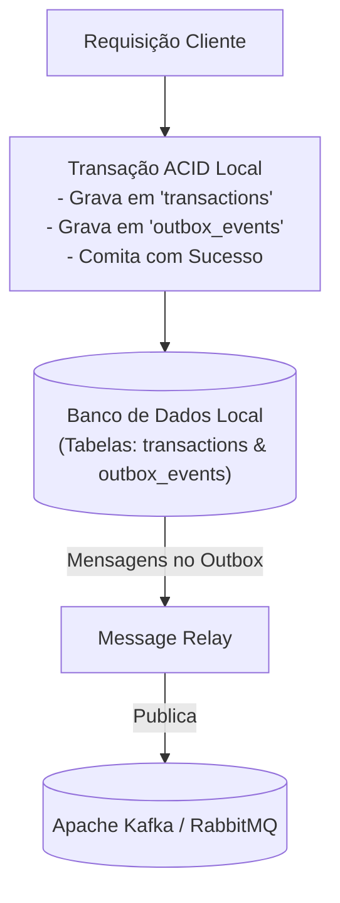

# 03. Atomicidade na Publicação com o Padrão Outbox

## Objetivo
Ao final deste capítulo, você será capaz de detalhar o problema clássico da escrita dupla (*Dual-Write Problem*) em sistemas distribuídos, explicar o funcionamento do padrão arquitetural **Transactional Outbox** para garantir atomicidade entre persistência local e publicação de mensagens, e implementar um fluxo completo contendo persistência transacional e um retransmissor de mensagens (*Message Relay*) em Kotlin.

---

## Motivação
Em uma arquitetura orientada a eventos, uma operação padrão em qualquer microserviço é atualizar seu estado local e notificar o resto do ecossistema sobre essa alteração. Por exemplo, no nosso serviço de Ledger:
1. Debitamos USD 100.00 da conta do cliente e persistimos essa alteração no banco de dados relacional.
2. Publicamos um evento `PaymentProcessed` no Apache Kafka ou RabbitMQ para que o serviço de entrega libere o produto.

Se o banco de dados local comitar com sucesso, mas o broker de mensageria cair ou a rede física oscilar antes da publicação, o evento é perdido: o cliente é cobrado, mas o produto nunca é entregue. Por outro lado, se invertermos a ordem e publicarmos o evento antes de comitar no banco, e o banco falhar por violação de restrição de saldo logo em seguida, o produto será enviado sem que o cliente tenha pago. 

Tentar resolver isso usando transações distribuídas (como 2PC - *Two-Phase Commit*) introduz alta latência e pontos únicos de falha físicos. Para garantir a atomicidade sem comprometer a performance, a indústria adota o padrão **Transactional Outbox**.

---

## Pré-requisitos
* [Módulo 3, Capítulo 02: Apache Kafka e Logs de Commit Distribuídos](./02-apache-kafka.md).
* Noções sobre o funcionamento de transações locais ACID (conceito de `@Transactional` do Spring Boot).

---

## Conceitos Fundamentais

### 1. O Problema da Escrita Dupla (Dual-Write Problem)
O problema da escrita dupla ocorre quando uma aplicação precisa atualizar dois sistemas de armazenamento independentes e heterogêneos (ex: um banco de dados relacional e um broker de mensagens) de forma indissociável (tudo ou nada), sem a existência de um coordenador de transação global unificado. Como não há memória compartilhada entre o PostgreSQL e o Apache Kafka, garantir a atomicidade física direta dessas duas escritas separadas é impossível.

---

### 2. O Padrão Transactional Outbox
A essência do padrão é simples: **aproveitar as garantias ACID locais do próprio banco de dados relacional do microserviço**.

Em vez de enviar a mensagem diretamente para o message broker externo durante a requisição do usuário, a aplicação realiza duas gravações no seu próprio banco de dados local, envelopadas em uma **única transação de banco de dados local**:
1. Salva o registro de dados principal na tabela de negócio (ex: grava a transferência na tabela `transactions`).
2. Insere a mensagem correspondente em uma tabela auxiliar de controle chamada **Outbox** (Caixa de Saída) localizada no mesmo banco de dados.

Como ambas as escritas ocorrem sob o escopo da mesma transação ACID local, temos a garantia absoluta do banco de dados de que ou ambas as escritas são persistidas com sucesso física e logicamente, ou nenhuma delas será gravada (atomicidade).



---

### 3. O Retransmissor de Mensagens (Message Relay)
Uma vez que os eventos estão salvos com segurança na tabela Outbox local, um componente secundário assíncrono (o Message Relay) lê os eventos pendentes da tabela e os publica no message broker.

Existem duas abordagens principais na indústria para implementar o Message Relay:

#### 3.1. Polling Publisher (Retransmissor por Varredura)
* **Mecanismo**: Uma thread rodando em background varre periodicamente a tabela Outbox buscando registros com status `PENDENTE` (ex: a cada 200 milissegundos), publica as mensagens no broker e atualiza o status dos registros para `ENVIADO` (ou os deleta).
* **Trade-off**: Extremamente simples de implementar e funciona em qualquer banco de dados. *Limitação*: Adiciona consultas constantes de leitura de disco (*polling*) no banco, o que pode degradar a performance do banco sob alta escala, além de introduzir uma pequena latência no disparo do evento.

#### 3.2. Transaction Log Mining (Mineração de Log) / Change Data Capture (CDC)
* **Mecanismo**: Ferramentas especializadas (como o **Debezium**) leem diretamente o log de transações sequencial do banco de dados relacional (o WAL no PostgreSQL ou binlog no MySQL) em nível de sistema de arquivos. O CDC captura cada operação de inserção física na tabela Outbox e dispara a mensagem no Kafka instantaneamente.
* **Trade-off**: Latência quase nula e impacto zero de CPU na base de dados de produção (sem consultas SQL de polling). *Limitação*: Exige configuração de infraestrutura complexa e suporte específico do banco de dados.

---

## Funcionamento Interno
O padrão Outbox garante a entrega de mensagens com a semântica **At-Least-Once (Pelo menos uma vez)**:
1. O Message Relay lê o evento do Outbox e tenta publicar no Kafka.
2. Se a publicação falhar ou a rede oscilar antes da confirmação, o Message Relay tentará enviar novamente no próximo ciclo.
3. Se o Kafka receber e gravar a mensagem, mas a conexão cair antes de confirmar de volta para o Message Relay, o Relay manterá a mensagem com status `PENDENTE` no banco e a enviará de novo na próxima varredura.
4. **Resultado**: O Kafka receberá a mesma mensagem duplicada. O consumidor **deve** ser preparado para ignorar duplicatas (padrão Receptor Idempotente).

---

## Exemplos

### 1. Gravação Transacional Principal em Kotlin/Spring
Abaixo, criamos a gravação de saldo e do evento outbox sob o escopo de uma única transação física gerenciada pelo JPA/Spring Boot.

```kotlin
// ARQUIVO: OutboxEvent.kt
package com.distribuidos.outbox

import java.time.Instant
import java.util.UUID

// Representação física da tabela de Outbox
data class OutboxEvent(
    val id: UUID = UUID.randomUUID(),
    val aggregateType: String,
    val aggregateId: String,
    val eventType: String,
    val payload: String, // Mensagem serializada em JSON/Protobuf
    var status: String = "PENDING",
    val createdAt: Instant = Instant.now()
)
```

```kotlin
// ARQUIVO: LedgerServiceOutbox.kt
package com.distribuidos.outbox

import org.springframework.stereotype.Service
import org.springframework.transaction.annotation.Transactional
import java.util.UUID

@Service
class LedgerServiceOutbox(
    private val transactionRepository: FakeTransactionRepository,
    private val outboxRepository: FakeOutboxRepository
) {

    // A anotação garante que o JPA inicie e comite a transação ACID local unificada
    @Transactional
    fun processTransfer(from: String, to: String, amount: Double): UUID {
        val transactionId = UUID.randomUUID()
        
        // 1. Gravação na Tabela de Negócio local
        transactionRepository.save(from, to, amount, transactionId)

        // 2. Criação do evento correspondente em formato string JSON
        val eventPayload = """
            {"transactionId":"$transactionId","from":"$from","to":"$to","amount":$amount}
        """.trimIndent()

        val outboxEvent = OutboxEvent(
            aggregateType = "LedgerTransaction",
            aggregateId = transactionId.toString(),
            eventType = "TRANSACTION_COMPLETED",
            payload = eventPayload
        )

        // 3. Gravação na Tabela de Outbox local (mesma transação física)
        outboxRepository.save(outboxEvent)

        return transactionId
    }
}
```

### 2. Message Relay por Varredura (Polling Publisher) com Virtual Threads
O código a seguir implementa o retransmissor executado assincronamente em background.

```kotlin
// ARQUIVO: PollingMessageRelay.kt
package com.distribuidos.outbox

import org.apache.kafka.clients.producer.KafkaProducer
import org.apache.kafka.clients.producer.ProducerRecord
import java.util.concurrent.Executors
import java.util.concurrent.TimeUnit

class PollingMessageRelay(
    private val outboxRepository: FakeOutboxRepository,
    private val producer: KafkaProducer<String, String>,
    private val topicName: String
) {
    private val scheduler = Executors.newSingleThreadScheduledExecutor()

    fun start() {
        // Executa a varredura periodicamente a cada 500 milissegundos
        scheduler.scheduleWithFixedDelay({
            try {
                publishPendingEvents()
            } catch (e: Exception) {
                println("[RELAY] Erro na varredura: ${e.message}")
            }
        }, 0, 500, TimeUnit.MILLISECONDS)
    }

    private fun publishPendingEvents() {
        // 1. Busca eventos pendentes
        val pendingEvents = outboxRepository.findPending()

        for (event in pendingEvents) {
            val record = ProducerRecord(topicName, event.aggregateId, event.payload)
            
            try {
                // 2. Publica no Kafka bloqueando para obter confirmação (garantia síncrona)
                producer.send(record).get() 
                
                // 3. Atualiza o status local para sucesso
                event.status = "SENT"
                outboxRepository.updateStatus(event.id, "SENT")
                
                println("[RELAY] Evento comitado no Kafka e marcado como SENT no banco: ${event.id}")
            } catch (e: Exception) {
                println("[RELAY] Falha ao publicar evento ${event.id} no Kafka. Ficará pendente para o próximo ciclo.")
                break // Para a execução deste ciclo para evitar concorrência ou reordenação
            }
        }
    }

    fun stop() {
        scheduler.shutdown()
    }
}
```

---

## Casos de Uso
* **Nubank**: Adota amplamente CDC (Change Data Capture) com Debezium acoplado ao log de transações do banco de dados (WAL) para capturar alterações e publicá-las no Apache Kafka de forma confiável e com zero acoplamento em nível de código de aplicação, garantindo consistência eventual robusta entre serviços.
* **E-commerce**: Salvar o pedido no banco de dados local do serviço de compras e disparar assincronamente a reserva de estoque via mensageria Outbox.

---

## Quando Utilizar
* Cenários onde a atualização do estado local e o disparo de eventos de alteração associados são **críticos de negócio** e não podem falhar ou divergir de forma alguma.
* Arquiteturas orientadas a eventos que operam sob semântica de entrega *at-least-once*.

---

## Quando Não Utilizar
* Eventos efêmeros que não são vinculados a alterações de estados persistentes locais da aplicação (ex: log simples de cliques de telemetria do usuário na tela).
* Quando a inconsistência eventual de dados pontual é aceitável pelo negócio (ex: atualizar a imagem de perfil do usuário e notificar via rede rápida simples com risco mínimo de perda aceitável).

---

## Vantagens
* **Atomicidade Garantida**: Sem dependência de coordenadores de transações distribuídas pesados.
* **Resiliência a Falhas do Broker**: Se o Kafka cair por 2 horas, os pagamentos continuam sendo aceitos normalmente e gravados no banco. O Message Relay enviará os eventos acumulados em lote assim que o broker retornar.
* **Desacoplamento de CPU**: A thread principal da requisição do cliente responde rápido; a chamada lenta de rede para o broker é feita assincronamente.

---

## Desvantagens
* **Entrega Duplicada**: O retransmissor pode duplicar eventos em caso de oscilações na escrita de status, exigindo receptores idempotentes.
* **Complexidade Extra**: Introduz mais tabelas locais e gerenciamento operacional de threads em segundo plano ou infraestrutura de CDC.

---

## Comparações

### Polling Publisher vs. CDC (Change Data Capture)

| Característica | Polling Publisher | CDC (Mineração de Log) |
|---|---|---|
| **Complexidade** | Baixa (apenas código Java/SQL simples) | Alta (infraestrutura de ferramentas adicionais) |
| **Carga de CPU no Banco**| Média/Alta (consultas SQL `SELECT` constantes) | Mínimo/Nulo (leitura de arquivos de log do SO) |
| **Latência do Evento** | Vinculada ao intervalo de delay (médio) | Instantânea (milissegundos) |
| **Alteração de Código** | Necessário programar o loop | Zero alteração (leitura externa de infraestrutura) |

---

## Erros Comuns
1. **Deletar/Atualizar o Outbox na mesma Thread da Requisição**: Tentar fazer a chamada de rede ao Kafka na thread principal da requisição e, se der sucesso, remover o outbox. Isso reintroduz o acoplamento de latência e quebra o objetivo de resiliência a quedas do broker.
2. **Ignorar o Isolamento de Transação no Message Relay**: Múltiplas instâncias do Message Relay executando simultaneamente em clusters e lendo os mesmos eventos pendentes da tabela Outbox sem controle de trava lógica (Locks/Optimistic concurrency), gerando publicação de dezenas de mensagens duplicadas. O correto é usar concorrência otimista ou travas de registro (`SELECT FOR UPDATE SKIP LOCKED` no PostgreSQL).

---

## Projeto Prático
No projeto **FinTech Ledger**, integramos o padrão Outbox à nossa API de transferências.
Quando a transação de transferência ocorre, persistimos a transação na tabela em memória e geramos um registro de evento na nossa tabela Outbox simulada. Um serviço secundário rodando com Virtual Threads realiza a varredura e dispara os eventos para o adaptador do Kafka de forma assíncrona.

```kotlin
// ARQUIVO: OutboxRelayService.kt
package com.distribuidos.projeto.outbox

import com.distribuidos.projeto.TransactionResult
import com.distribuidos.projeto.gateway.TransactionKafkaGateway
import java.util.concurrent.Executors
import java.util.concurrent.TimeUnit

class OutboxRelayService(
    private val outboxRepository: LocalOutboxRepository,
    private val kafkaGateway: TransactionKafkaGateway
) {
    private val executor = Executors.newSingleThreadScheduledExecutor()

    fun startRelay() {
        executor.scheduleWithFixedDelay({
            try {
                val pending = outboxRepository.fetchPending()
                for (event in pending) {
                    // Simulação de resultado de sucesso mapeado do outbox
                    val result = TransactionResult.Success(event.aggregateId, event.createdAt.toEpochMilli())
                    
                    // Dispara de forma assíncrona para o Kafka
                    kafkaGateway.emitTransactionEvent(event.aggregateId, result)
                    
                    // Atualiza status local
                    outboxRepository.markAsSent(event.id)
                }
            } catch (e: Exception) {
                println("[PROJETO-OUTBOX] Falha ao varrer outbox: ${e.message}")
            }
        }, 0, 200, TimeUnit.MILLISECONDS)
    }

    fun stop() {
        executor.shutdown()
    }
}
```

---

## Exercícios

### Básico
1. Explique o conceito de "Escrita Dupla" e o perigo que ela representa para a consistência lógica de sistemas de microserviços.
2. Por que transações distribuídas baseadas no protocolo 2PC (Two-Phase Commit) são frequentemente evitadas em sistemas de alta escala modernos?

### Intermediário
3. Projete e descreva detalhadamente a estrutura de colunas e tipos de dados de uma tabela física `outbox_events` otimizada para um banco de dados relacional PostgreSQL.

### Avançado
4. Escreva uma classe Message Relay em Kotlin que utilize a instrução SQL simulada `SELECT FOR UPDATE SKIP LOCKED` para permitir que **múltiplas instâncias simultâneas do Relay** executem a varredura da tabela Outbox sem competir pelos mesmos registros nem gerar duplicidade excessiva de mensagens.

---

## Perguntas de Entrevista
1. **O Padrão Outbox garante que mensagens nunca sejam publicadas de forma duplicada no broker em caso de falha de rede? Justifique.**
   * *Resposta esperada*: Não. O padrão Outbox garante a atomicidade de gravação local e a entrega com semântica *At-Least-Once* (pelo menos uma vez). A eliminação total de duplicações na rede física é impossível. Se o Message Relay ler o evento pendente da tabela Outbox, publicá-lo com sucesso no Kafka, mas perder a conexão ou travar antes de conseguir comitar a atualização de status do evento para `SENT` no banco de dados local, no próximo ciclo de varredura (ou após a reinicialização do Relay), o evento pendente será reenviado. Portanto, duplicadas ocorrerão inevitavelmente em cenários de falhas de rede. A corretude final do sistema depende estritamente de garantir que os receptores das mensagens implementem a lógica de idempotência.

2. **Como a ferramenta de CDC Debezium lê dados do WAL (Write-Ahead Log) do PostgreSQL de forma contínua sem travar a escrita física do banco de dados principal de produção?**
   * *Resposta esperada*: O PostgreSQL grava sequencialmente todas as alterações físicas no arquivo WAL (*Write-Ahead Log*) antes de aplicá-las nos arquivos de blocos de tabelas em disco para garantir durabilidade. O Debezium conecta-se ao PostgreSQL utilizando o protocolo de replicação nativa lógica do próprio banco (usando um slot de replicação lógico). O banco de dados envia a stream de decodificação lógica de bytes gravados no WAL diretamente para o Debezium na rede de forma assíncrona. Como a leitura é feita de forma assíncrona baseada nos arquivos de log sequenciais já comitados no disco (ou buffers de memória do kernel de replicação), o Debezium não compete por locks lógicos de tabelas, não interfere nas transações ativas dos clientes de produção e consome recursos mínimos do processador do banco de dados.

---

## Resumo
* O problema da escrita dupla corrompe a consistência de sistemas de eventos devido a falhas físicas parciais inevitáveis na rede.
* O padrão Transactional Outbox resolve o Dual-Write integrando o registro de eventos no banco de dados local sob a mesma transação ACID de negócio da aplicação.
* Message Relays varrem o banco (Polling Publisher) ou escutam logs físicos (CDC) para propagar eventos garantindo entrega *at-least-once*.

---

## Próximo Capítulo
No [Capítulo 04: Concorrência em Mensageria com Receptores Idempotentes](./03-messaging/04-idempotency-receiver.md), fecharemos o ciclo de confiabilidade assíncrona. Estudaremos como proteger o nosso serviço consumidor de receber e reprocessar eventos duplicados gerados pela entrega *at-least-once* do Outbox.

---

## Referências
* **Transactional Outbox Pattern**: [Microservices.io description](https://microservices.io/patterns/data/transactional-outbox.html)
* **Designing Data-Intensive Applications**, Martin Kleppmann. Capítulo 11: *Stream Processing* (Seção sobre *Change Data Capture*).
* **Debezium Documentation**: [Change Data Capture tool](https://debezium.io/documentation/)