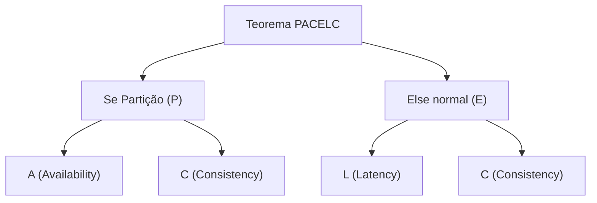

# 01. O Teorema CAP e PACELC na Tomada de Decisão Arquitetural

## Objetivo
Ao final deste capítulo, você será capaz de explicar formalmente as definições de Consistência (Linearizabilidade), Disponibilidade e Tolerância a Partições de acordo com a formalização matemática do Teorema CAP, aplicar a extensão do Teorema PACELC a trade-offs de latência em cenários normais de rede, e classificar bancos de dados da indústria de acordo com seus comportamentos sob falha e sob operação estável.

---

## Motivação
Quando projetamos uma aplicação de banco de dados rodando em um único servidor, a consistência é mantida de forma trivial pelas travas de memória e do sistema operacional. Porém, se quisermos que nosso serviço de `LedgerService` atenda a milhões de requisições de débito com alta disponibilidade, precisamos replicar o banco de dados em múltiplos servidores físicos.

Se o Nó A em São Paulo e o Nó B em Frankfurt possuem réplicas do saldo da conta de um cliente, o que acontece quando o cliente deposita USD 100.00 em São Paulo? 
* Se respondermos "sucesso" imediatamente (para ter baixa latência), o Nó B em Frankfurt ficará com o saldo desatualizado por alguns milissegundos.
* Se bloquearmos a resposta até que Frankfurt confirme a gravação (para ter consistência forte), a latência do depósito subirá drasticamente. 
* E se o cabo submarino que liga os continentes for rompido (partição de rede)? Nós bloqueamos depósitos no Nó B (CP) ou permitimos que dados fiquem divergentes temporariamente (AP)? 

O **Teorema CAP** e a sua extensão **PACELC** fornecem as leis físicas matemáticas necessárias para balizar essas decisões arquiteturais críticas de negócio.

---

## Pré-requisitos
* [Módulo 1: Fundamentos e Limitações Físicas](./../01-foundations/README.md).

---

## Conceitos Fundamentais

### 1. O Teorema CAP (Teorema de Brewer)
Enunciado por Eric Brewer em 2000 e formalizado matematicamente por Seth Gilbert e Nancy Lynch em 2002, o Teorema CAP estabelece que um sistema de dados distribuído na rede não pode garantir simultaneamente mais de duas das seguintes propriedades:

#### 1.1. Consistency (Consistência - Linearizabilidade)
* **Definição Estrita**: Gilbert e Lynch definem consistência em CAP estritamente como **Linearizabilidade** (Consistência Externa). Ela exige que exista uma ordem global de tempo na qual todas as operações de leitura e escrita parecem ser executadas de forma instantânea em um único objeto de dados. Se uma escrita terminou com sucesso no Nó A, qualquer leitura subsequente (no tempo físico global) em qualquer nó da rede **deve** retornar o valor gravado ou um valor mais recente.

#### 1.2. Availability (Disponibilidade)
* **Definição Estrita**: Exige que toda requisição recebida por um nó não faltoso na rede retorne uma resposta de sucesso (sem erro) e sem atraso infinito. 
* *Nota*: Retornar erro (ex: `HTTP 500` ou timeout) para garantir a consistência viola a propriedade de disponibilidade em nível de Teorema CAP.

#### 1.3. Partition Tolerance (Tolerância a Partição)
* **Definição Estrita**: O sistema continua a operar apesar de omissões físicas ou atrasos arbitrários de mensagens na rede que dividem os nós em subgrupos isolados.

---

### 2. A Escolha Inevitável: CP vs. AP
Como a rede física está sujeita a falhas (partições de rede são fatos físicos incontornáveis do universo), a propriedade **P (Tolerância a Partição) não é negociável**. Você não pode escolher "CA". Sob uma partição de rede física ativa, a única escolha de design disponível é entre:
* **CP (Consistency / Partition Tolerance)**: O sistema preserva a consistência forte (linearizabilidade). Para isso, os nós isolados do lado menor da partição recusam requisições de escrita e leitura, retornando erro para garantir que informações obsoletas ou divergentes não sejam expostas.
* **AP (Availability / Partition Tolerance)**: O sistema prioriza responder com sucesso ao cliente a qualquer custo. Nós isolados aceitam escritas e respondem leituras localmente, gerando divergência física temporária que precisará ser reconciliada futuramente (consistência eventual).

---

### 3. A Extensão PACELC (Teorema de Abadi)
Formulado por Daniel Abadi em 2012, o Teorema PACELC expande o CAP ao observar que o CAP foca apenas no comportamento sob falhas (partições de rede). No entanto, partições são raras; os sistemas de produção passam $99.9\%$ do tempo operando sob **condições estáveis normais**. O PACELC mapeia os trade-offs desse período normal:

Se houver partição (**P**artition), o trade-off é entre **A**vailability e **C**onsistência;
**E**lse (Senão - em condições estáveis normais), o trade-off é entre **L**atency (Latência) e **C**onsistência.



#### Classificações PACELC de Bancos de Dados
1. **PC/EC (ex: Google Spanner, CockroachDB, MongoDB)**: Sob partição, priorizam consistência (C); sob operação normal, ainda esperam confirmação de réplicas antes de responder para garantir consistência (C) ao custo de maior latência (L).
2. **PA/EL (ex: Apache Cassandra, Amazon DynamoDB)**: Sob partição, respondem localmente priorizando disponibilidade (A); sob operação normal, retornam dados do nó local imediatamente (L) aceitando ler dados obsoletos temporários (consistência eventual).

---

## Funcionamento Interno
Sob uma partição de rede que divide o cluster em dois lados:

```mermaid
flowchart TD
    subgraph L1["Lado 1 (Líder)"]
        A["Nó A (Escrita Ok)"]
    end

    subgraph L2["Lado 2 (Isolado)"]
        B["Nó B (Sem contato)"]
    end

    A -.- x|Cabo Rompido / Partição Física| x -.- B
    
    C1["[Cliente 1]"] -->|Escrita| A
    C2["[Cliente 2]"] -->|Leitura| B
```

* Se o sistema for **AP**: O Cliente 1 grava `x = 2` no Nó A. O Cliente 2 lê `x` no Nó B e recebe `x = 1` (valor desatualizado). O Nó B responde com sucesso mantendo a disponibilidade (A) ao custo de dados inconsistentes.
* Se o sistema for **CP**: O Cliente 2 tenta ler no Nó B. Como o Nó B sabe que perdeu contato com o Nó A (líder), ele recusa a leitura retornando um erro imediato para garantir que o Cliente 2 não tome decisões de negócios com base em dados obsoletos.

---

## Arquitetura
Ao projetar a arquitetura de dados da aplicação, devemos mapear as restrições:
* **Fronteiras Críticas (Transacionais)**: Saldo financeiro, reserva de ingressos, inventário crítico. Exigem comportamento **CP/EC** para evitar anomalias como saques acima do limite permitido ou overselling.
* **Fronteiras Não-Críticas (Colaborativas/Feeds)**: Likes de redes sociais, histórico de navegação, comentários. Podem operar sob modelo **AP/EL** para otimizar latência e escala de gravação rápida.

---

## Exemplos

### Simulação em Kotlin de Comportamento CP vs. AP de Réplicas sob Partição
O código abaixo demonstra um simulador conceitual de nó de dados replicado. Podemos simular a quebra de comunicação física da rede e observar como o nó se comporta sob as estratégias CP (recusa com erro) e AP (responde valor obsoleto).

```kotlin
// ARQUIVO: ReplicatedNode.kt
package com.distribuidos.cap

class ReplicatedNode(
    val nodeId: String,
    private val mode: DatabaseMode
) {
    private var localData: String = "Valor Inicial"
    private var isNetworkPartitioned: Boolean = false

    fun setPartitionState(partitioned: Boolean) {
        this.isNetworkPartitioned = partitioned
    }

    fun updateValueLocal(newValue: String) {
        this.localData = newValue
    }

    // Operação de Leitura simulando o comportamento sob partição
    fun readValue(): ReadResult {
        return if (isNetworkPartitioned) {
            when (mode) {
                DatabaseMode.CP -> {
                    // Comportamento CP: Falha ao invés de expor dados inconsistentes
                    ReadResult.Error("Erro CAP: Nó isolado da rede. Operação bloqueada para consistência.")
                }
                DatabaseMode.AP -> {
                    // Comportamento AP: Responde localmente com sucesso ao custo de expor dado obsoleto
                    ReadResult.Success(localData, isStale = true)
                }
            }
        } else {
            ReadResult.Success(localData, isStale = false)
        }
    }
}

enum class DatabaseMode { CP, AP }

sealed class ReadResult {
    data class Success(val data: String, val isStale: Boolean) : ReadResult()
    data class Error(val reason: String) : ReadResult()
}
```

```kotlin
// ARQUIVO: CapSimulatorMain.kt
package com.distribuidos.cap

fun main() {
    // 1. Instancia dois nós simulando comportamento CP
    val cpNode = ReplicatedNode("SP-01", DatabaseMode.CP)
    
    // 2. Instancia dois nós simulando comportamento AP
    val apNode = ReplicatedNode("FRA-01", DatabaseMode.AP)

    println("=== Operação Normal ===")
    println("CP Node: ${cpNode.readValue()}")
    println("AP Node: ${apNode.readValue()}")

    // 3. Simula a ocorrência de uma partição de rede física
    cpNode.setPartitionState(true)
    apNode.setPartitionState(true)

    // Simula que o outro lado da rede recebeu uma atualização de escrita na partição ("Valor Novo")
    // mas os nós isolados SP-01 e FRA-01 não puderam sincronizar por causa do cabo rompido.
    
    println("\n=== Sob Partição de Rede ===")
    
    // O nó CP recusa a leitura para evitar ler o estado obsoleto
    when (val res = cpNode.readValue()) {
        is ReadResult.Success -> println("CP Node: ${res.data}")
        is ReadResult.Error -> println("CP Node recusou leitura: ${res.reason}")
    }

    // O nó AP prioriza disponibilidade e responde o valor antigo (isStale = true)
    when (val res = apNode.readValue()) {
        is ReadResult.Success -> println("AP Node respondeu valor antigo (Obsoleto): '${res.data}' (Stale = ${res.isStale})")
        is ReadResult.Error -> println("AP Node recusou leitura: ${res.reason}")
    }
}
```

---

## Casos de Uso
* **Google Spanner**: O Spanner é classificado na prática como um banco de dados **CP/EC** altamente consistente. O Google escolheu consistência forte em todas as operações de dados. Para mitigar o problema do trade-off de latência do PACELC, eles investiram em hardware especial (TrueTime com GPS e relógios atômicos redundantes nos datacenters), reduzindo a incerteza de latência física e garantindo transações globais extremamente rápidas.
* **Apache Cassandra**: É um banco de dados projetado nativamente para ser **AP/EL**. Ele permite que você configure o nível de consistência por requisição (ex: ler em apenas uma réplica para latência ultra-rápida, ou ler em quórum de réplicas para consistência).

---

## Quando Utilizar CP (Consistency + Partition Tolerance)
* Sistemas transacionais de negócios onde a acurácia dos dados é absoluta (saldos, controle de estoque, transferências). Expor dados incorretos gera perdas financeiras diretas.

---

## Quando Utilizar AP (Availability + Partition Tolerance)
* Sistemas de alta escala onde a indisponibilidade total gera prejuízos de marca superiores a inconsistências temporárias de milissegundos (feeds de postagens, contadores de likes, carrinhos de compras simples).

---

## Vantagens
* **Linearizabilidade (CP)**: Modelo mental de desenvolvimento extremamente simples para a equipe, pois o banco de dados sempre reflete a verdade única global.
* **Vazão e Latência (AP)**: Gravações e leituras são imediatas, sem espera por confirmações remotas de rede.

---

## Desvantagens
* **Bloqueios e Timeout (CP)**: Oscilações leves na rede podem fazer requisições falharem em cascata para o cliente final.
* **Complexidade na Reconciliação (AP)**: Exige que a aplicação lide com concorrência complexa de dados conflitantes (*Conflict Resolution*).

---

## Comparações

### CAP vs. ACID

> [!CAUTION]
> **Erro de Nomenclatura Clássico**: O "C" de ACID e o "C" de CAP **não significam a mesma coisa**!
> * No **ACID**, a Consistência significa integridade de regras de esquema (ex: chaves estrangeiras válidas, restrições de validação de tabela).
> * No **CAP**, a Consistência significa **Linearizabilidade** (garantia de leitura da última escrita no tempo global da rede).

| Característica | Teorema CAP | Teorema PACELC |
|---|---|---|
| **Foco de Falha** | Apenas em presença de Partições de rede | Sob Partições **E** em operação normal |
| **Opções principais** | CP ou AP | PC/EC, PA/EL, PC/EL, PA/EC |
| **Dimensão Latência** | Ignorada na definição estrita | Central no trade-off de operação normal |

---

## Erros Comuns
1. **Ignorar o Trade-off de Latência (PACELC)**: Assumir que o banco de dados distribuído é perfeitamente consistente sem perceber que essa garantia adiciona latência em todas as requisições normais da aplicação (pois ela deve aguardar a confirmação de rede de múltiplas réplicas antes de responder ao cliente).
2. **Confiar em Bancos NoSQL AP para Lógicas Financeiras**: Utilizar Cassandra ou MongoDB sem controle rigoroso de escrita e leitura de quórum para decrementar saldo de contas bancárias, resultando em saques simultâneos acima do saldo permitido.

---

## Projeto Prático
No projeto **FinTech Ledger**, estabelecemos a nossa decisão de design de dados orientada ao Teorema CAP.
O nosso Ledger deve agir sob o modo **CP** (Consistência e Tolerância a Partição). Se houver quebra de comunicação de rede no cluster do Ledger, nós recusaremos o processamento de novos débitos no nó isolado ao invés de expor saldo incorreto, garantindo a integridade dos livros-razão financeiros.

```kotlin
// ARQUIVO: CapLedgerValidator.kt
package com.distribuidos.projeto.cap

import com.distribuidos.projeto.TransactionResult
import java.util.UUID

class CapLedgerValidator(
    private val isPartitioned: Boolean
) {
    fun executeDebit(accountId: String, amount: Double): TransactionResult {
        // Garantia de consistência CP: Se estiver sob partição física, recusa a operação
        if (isPartitioned) {
            return TransactionResult.Failed("Operação abortada para segurança de dados: Banco em modo de proteção de Consistência (CP).")
        }

        // Simulação de transação executada com sucesso sob rede estável
        return TransactionResult.Success(UUID.randomUUID().toString(), System.currentTimeMillis())
    }
}
```

---

## Exercícios

### Básico
1. Por que é fisicamente impossível projetar um sistema distribuído de banco de dados classificado como "CA" (Consistency & Availability) em redes de longa distância (WAN)?
2. Explique a diferença de significado entre o "C" de ACID e o "C" do Teorema CAP.

### Intermediário
3. Defina os termos da equação do Teorema **PACELC** e classifique qual o comportamento esperado de um banco de dados MongoDB operando em modo de escrita majoritária (*Replica Set Write Concern: majority*).

### Avançado
4. Considere o paper de Gilbert e Lynch de 2002. Escreva um ensaio curto (1 página) detalhando a prova de impossibilidade de consistência e disponibilidade simultâneas sob partição de rede assíncrona, focando no raciocínio das mensagens mutuamente exclusivas que não conseguem atravessar as bordas da partição.

---

## Perguntas de Entrevista
1. **O Teorema CAP diz que só podemos escolher 2 de 3 propriedades. No entanto, por que a formulação clássica "2 de 3" é considerada enganosa por projetistas de sistemas e qual a forma correta de apresentar o teorema aos tomadores de decisão técnica?**
   * *Resposta esperada*: A formulação "2 de 3" é enganosa porque dá a falsa impressão de que a Tolerância a Partição (P) é uma escolha opcional de design que o desenvolvedor pode ignorar para obter simultaneamente Consistência (C) e Disponibilidade (A). Na realidade física de sistemas em rede, partições são falhas inevitáveis causadas por hardware ou atrasos de pacotes que ocorrem de forma involuntária. Portanto, a Tolerância a Partição (P) é obrigatória. A forma correta de apresentar o teorema é: o desenvolvedor deve decidir como o sistema se comportará **quando** (e não *se*) uma partição física de rede ocorrer. A escolha real é binária sob falha: priorizar a Consistência absoluta bloqueando acessos (CP) ou priorizar a Disponibilidade total retornando dados locais possivelmente desatualizados (AP).

2. **Como o teorema PACELC nos ajuda a decidir entre o Cassandra e o Google Spanner para um sistema de catálogo de produtos de comércio eletrônico global onde a latência de página afeta diretamente as conversões de vendas?**
   * *Resposta esperada*: O catálogo de produtos é um sistema de leitura intensa onde a latência baixa de exibição de página do site é fundamental para a conversão de vendas; ler um preço ou descrição com alguns milissegundos de atraso de replicação é aceitável pelo negócio (consistência eventual). O Cassandra é classificado como **PA/EL**: sob partição, prioriza disponibilidade; sob operação estável normal, prioriza baixa latência de resposta, o que garante carregamento de página ultra-rápido para o usuário final. O Spanner é classificado como **PC/EC**: sob operação estável normal, ele prioriza consistência forte global, o que exige que transações passem por processos de validação de consenso e commit, adicionando latência em todas as leituras geograficamente distantes. Portanto, para o catálogo de produtos, o Cassandra (PA/EL) é arquiteturalmente superior devido ao requisito de performance e latência em operação estável.

---

## Resumo
* Teorema CAP prova a impossibilidade de consistência linearizável e disponibilidade total simultâneas sob partições de rede física.
* A Tolerância a Partição (P) é um fato físico, limitando o design sob falhas à escolha de comportamento CP ou AP.
* Teorema PACELC expande o CAP integrando o trade-off de Latência vs. Consistência na ausência de partições.

---

## Próximo Capítulo
No [Capítulo 02: Replicação Baseada em Líder (Leader-Follower)](./02-leader-follower-replication.md), entraremos nos mecanismos físicos de sincronização de réplicas de dados, analisando os modelos de replicação síncrona e assíncrona baseados em nós líderes e seguidores.

---

## Referências
* **Designing Data-Intensive Applications**, Martin Kleppmann. Capítulo 9: *Consistency and Consensus* (Seção sobre *Linearizability and CAP*).
* **Brewer's Conjecture and the Feasibility of Consistent, Available, Partition-Tolerant Web Services**, Seth Gilbert e Nancy Lynch (2002). ACM SIGACT News.
* **Consistency Tradeoffs in Modern Distributed Database System Design**, Daniel J. Abadi (2012). Computer.
