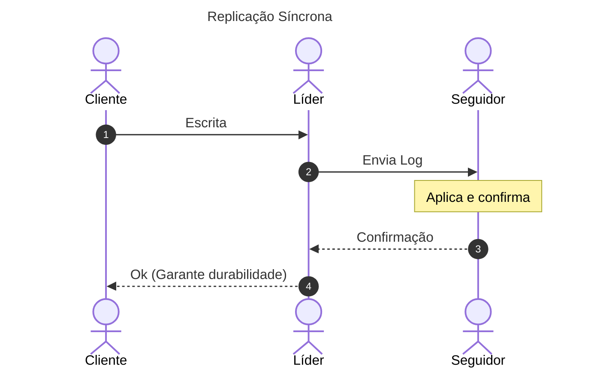
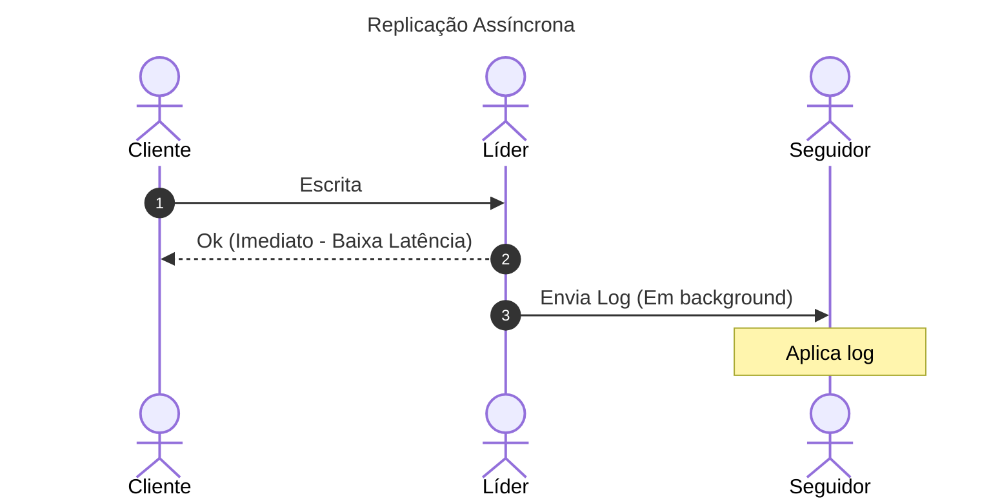

# 02. Replicação Baseada em Líder (Leader-Follower)

## Objetivo
Ao final deste capítulo, você será capaz de conceituar a arquitetura de replicação baseada em líder, analisar os trade-offs físicos de durabilidade e latência entre replicação síncrona e assíncrona, descrever os riscos e mitigações do processo de *Failover* automático e *Split-Brain*, e comparar os três formatos físicos de logs de replicação.

---

## Motivação
Armazenar dados em um único servidor é um risco físico intolerável para qualquer sistema corporativo. Se o disco rígido queimar ou o datacenter inundar, os dados históricos são destruídos. Para obter tolerância a falhas, precisamos replicar a informação em múltiplos servidores físicos distintos.

O padrão de arquitetura de dados mais consolidado e utilizado na indústria (adotado pelo PostgreSQL, MySQL, Redis, MongoDB) é a **Replicação Baseada em Líder** (também conhecida como *Active-Passive*). Entender a mecânica interna de como os dados são transmitidos do líder para os seguidores, e o que acontece quando o líder falha, é fundamental para qualquer engenheiro que opere bancos de dados em nuvem.

---

## Pré-requisitos
* [Módulo 4, Capítulo 01: O Teorema CAP e PACELC na Tomada de Decisão Arquitetural](./01-cap-pacelc-theorems.md).

---

## Conceitos Fundamentais

### 1. Definição de Replicação baseada em Líder
Neste modelo, determinamos papéis físicos distintos para os nós do banco de dados:
* **Leader (Líder / Primário)**: O único nó autorizado a receber requisições de escrita do cliente. O líder altera seu estado local e gera um log com essa modificação.
* **Followers (Seguidores / Réplicas / Secundários)**: Nós que operam em modo somente leitura (*read-only*). Eles recebem o log de alterações do líder e o aplicam localmente na mesma ordem temporal, mantendo suas cópias sincronizadas.

---

### 2. Sincronismo da Replicação: Síncrona vs. Assíncrona





#### 2.1. Replicação Síncrona
* **Mecanismo**: O líder recebe a escrita do cliente, grava localmente, encaminha a alteração para a réplica síncrona e aguarda que a réplica confirme que persistiu os dados em disco antes de retornar a resposta de sucesso ao cliente.
* **Trade-off**: Garante que o dado está salvo em pelo menos duas máquinas físicas simultaneamente (durabilidade máxima). *Desvantagem*: Alta latência para o cliente (soma do tempo de trânsito de rede físico). Se a réplica cair, a escrita no líder fica bloqueada temporariamente.

#### 2.2. Replicação Assíncrona
* **Mecanismo**: O líder grava localmente e responde imediatamente "sucesso" ao cliente. Em background (de forma assíncrona), ele envia os logs de alterações para as réplicas.
* **Trade-off**: Latência baixíssima de escrita. *Desvantagem*: Risco de perda de dados. Se o líder sofrer crash permanente antes que o log assíncrono chegue à réplica, a escrita comitada ao cliente é perdida física e permanentemente.

#### 2.3. Replicação Semi-síncrona (Configuração Real da Indústria)
* Um seguidor é mantido como síncrono e os outros como assíncronos. Se o seguidor síncrono ficar lento ou cair, o líder converte temporariamente um seguidor assíncrono para síncrono, mantendo a durabilidade mínima sem bloquear a escrita.

---

### 3. Tratamento de Falhas e Failover
* **Queda do Seguidor (Catch-up recovery)**: Quando o seguidor reinicia, ele lê o seu offset do último log processado localmente e solicita ao líder todas as mensagens geradas durante o período em que esteve fora.
* **Queda do Líder (Failover)**: Processo de eleição de um novo líder a partir das réplicas ativas:
  1. **Detecção**: O monitor local de batimentos cardíacos sinaliza o crash do líder (timeout estourado).
  2. **Eleição**: As réplicas remanescentes elegem a réplica que possui o log mais atualizado (maior offset).
  3. **Reconfiguração**: O sistema de DNS/Roteamento é atualizado para direcionar novas escritas de clientes para o novo líder eleito. O líder antigo, caso retorne da falha, é reconfigurado para agir como seguidor.

---

### 4. O Problema do Split-Brain
Ocorre quando uma partição de rede isola o líder do resto do cluster. Se as réplicas isoladas do outro lado assumirem que o líder morreu (devido a timeout de heartbeats), elas elegerão um novo líder. 

Agora o sistema possui **dois líderes ativos** recebendo escritas de clientes diferentes. Quando a rede voltar, tentar juntar as escritas conflitantes corromperá as contas dos clientes.

* **Fencing (Bloqueio)**: Técnica para garantir que o líder antigo seja impedido fisicamente de aceitar requisições (desligando a tomada física da máquina via IPMI/STONITH - *Shoot The Other Node In The Head*), ou definindo quóruns mínimos de votação.

---

### 5. Formatos Físicos de Logs de Replicação
Como a informação é codificada para trânsito:
1. **Statement-based Replication (Baseada em Instruções)**:
   * O líder envia as instruções SQL idênticas (`INSERT`, `UPDATE`) para os seguidores.
   * *Risco*: Instruções não-determinísticas (ex: `NOW()`, `RAND()`, `UUID()`) gerarão valores diferentes no líder e no seguidor, quebrando a consistência do banco.
2. **Write-Ahead Log (WAL) Shipping**:
   * O líder envia a stream binária direta do seu arquivo WAL (bytes de baixo nível de blocos de disco).
   * *Risco*: O log é fortemente acoplado ao motor interno do banco. Se você atualizar a versão do banco de dados no seguidor, ele não conseguirá mais interpretar o WAL binário antigo do líder, exigindo atualizações sincronizadas complexas.
3. **Logical Log Replication (Baseada em Linhas)**:
   * O líder envia eventos lógicos representando alterações por linha (`Row-based`). O log descreve qual valor foi inserido ou modificado em termos lógicos estruturados.
   * *Vantagem*: Totalmente desacoplado dos motores internos do disco físico, facilitando atualizações de versão parciais e permitindo exportar dados para ferramentas externas via CDC.

---

## Funcionamento Interno
O log de replicação sequencial funciona como uma fila imutável local onde o líder atua como produtor físico e cada seguidor mantém seu próprio ponteiro de leitura.

---

## Exemplos

### Simulação em Kotlin de Replicação Síncrona vs. Assíncrona
Abaixo, simulamos a gravação local em um nó líder e o envio da atualização para as réplicas associadas sob os modos síncrono (aguarda confirmação física) e assíncrono (envio em background).

```kotlin
// ARQUIVO: LeaderFollowerSimulator.kt
package com.distribuidos.replicação

import kotlinx.coroutines.*
import java.util.concurrent.ConcurrentHashMap
import java.util.UUID

class FollowerReplica(val name: String, private val networkDelayMillis: Long) {
    private val replicaData = ConcurrentHashMap<String, String>()

    suspend fun applyUpdate(key: String, value: String): Boolean {
        // Simula o trânsito físico da rede até a réplica
        delay(networkDelayMillis)
        replicaData[key] = value
        println("[$name] Alteração aplicada: $key = $value")
        return true
    }
}

class LeaderNode(
    private val followers: List<FollowerReplica>,
    private val mode: ReplicationMode
) {
    private val databaseState = ConcurrentHashMap<String, String>()
    private val scope = CoroutineScope(Dispatchers.Default)

    fun write(key: String, value: String): Boolean = runBlocking {
        // 1. Gravação local no líder
        databaseState[key] = value
        println("[LÍDER] Gravação local realizada: $key = $value")

        when (mode) {
            ReplicationMode.SYNCHRONOUS -> {
                // Modo Síncrono: Aguarda a confirmação de rede de todos os seguidores
                val jobs = followers.map { follower ->
                    async { follower.applyUpdate(key, value) }
                }
                jobs.awaitAll() // Bloqueia a resposta ao cliente até todos confirmarem
                println("[LÍDER] Gravação confirmada por todos os seguidores síncronos.")
            }
            ReplicationMode.ASYNCHRONOUS -> {
                // Modo Assíncrono: Responde ao cliente imediatamente e envia em background
                followers.forEach { follower ->
                    scope.launch {
                        follower.applyUpdate(key, value)
                    }
                }
                println("[LÍDER] Sucesso retornado ao cliente. Replicação assíncrona iniciada em background.")
            }
        }
        true
    }
}

enum class ReplicationMode { SYNCHRONOUS, ASYNCHRONOUS }

fun main() {
    val replica1 = FollowerReplica("Follower-01-SP", 100)
    val replica2 = FollowerReplica("Follower-02-FRA", 800) // Réplica distante
    val replicas = listOf(replica1, replica2)

    println("=== Simulação: Replicação SÍNCRONA ===")
    val syncLeader = LeaderNode(replicas, ReplicationMode.SYNCHRONOUS)
    val timeSync = kotlin.system.measureTimeMillis {
        syncLeader.write("saldo-conta-01", "1500.00")
    }
    println("Tempo total de escrita síncrona: ${timeSync}ms (bloqueado pelo nó mais lento)\n")

    println("=== Simulação: Replicação ASSÍNCRONA ===")
    val asyncLeader = LeaderNode(replicas, ReplicationMode.ASYNCHRONOUS)
    val timeAsync = kotlin.system.measureTimeMillis {
        asyncLeader.write("saldo-conta-02", "5000.00")
    }
    println("Tempo total de escrita assíncrona: ${timeAsync}ms (resposta instantânea)")

    // Aguarda conclusão do background job assíncrono para o console mostrar a saída
    Thread.sleep(1000)
}
```

---

## Casos de Uso
* **PostgreSQL**: Utiliza o envio físico de logs binários (WAL) via Streaming Replication. Ele pode ser configurado em modo síncrono ou assíncrono para atender diferentes trade-offs de durabilidade corporativa.
* **MySQL**: Oferece replicação baseada em linhas lógicas (Row-Based Replication) enviando eventos binários estruturados (binlog).
* **Redis**: Adota replicação assíncrona simples para manter réplicas somente leitura de cache e consultas rápidas descentralizadas.

---

## Quando Utilizar Replicação baseada em Líder
* Sistemas de leitura intensa (*read-heavy*) onde a consistência eventual de leitura nas réplicas é tolerável.
* Necessidade de tolerância a falhas física direta de hardware com processo de failover simples.

---

## Quando Não Utilizar Replicação baseada em Líder
* Sistemas com escrita massiva de dados (*write-heavy*). Como todas as escritas obrigatoriamente afunilam no único líder ativo, a escalabilidade de gravação é limitada à capacidade daquela única máquina física.

---

## Vantagens
* **Simplicidade de Consistência de Escrita**: Como há apenas um líder, evitam-se conflitos simultâneos de gravação de dados.
* **Escalabilidade de Leitura**: Permite adicionar dezenas de réplicas seguidores somente leitura para distribuir a carga de consultas.

---

## Desvantagens
* **Líder como Gargalo de Escrita**: Incapaz de escalar escritas horizontalmente de forma simples.
* **Complexidade do Failover**: Alto risco de Split-Brain e perda de dados em caso de quedas do líder durante a replicação assíncrona.

---

## Comparações

### Síncrona vs. Assíncrona

| Característica | Síncrona | Assíncrona |
|---|---|---|
| **Latência de Escrita** | Alta (soma dos RTTs das réplicas) | Baixíssima (resposta imediata) |
| **Garantia de Durabilidade** | Total (salvo em múltiplos nós) | Parcial (risco de perda no crash do líder) |
| **Impacto de Queda do Seguidor** | Bloqueia escritas novas no líder | Nenhum impacto imediato |

---

## Erros Comuns
1. **Falso Failover por Timeout Curto**: Configurar o timeout de batimentos cardíacos do líder muito curto (ex: 1 segundo). Sob uma sobrecarga temporária de rede ou de CPU do servidor líder (como um GC longo), o monitor assumirá incorretamente que o líder morreu, disparará a eleição desnecessária de um novo líder e gerará o catastrófico cenário de Split-Brain se o líder original ainda estiver operando.
2. **Promover Réplica Assíncrona Atrasada**: Efetuar failover elegendo um seguidor assíncrono que estava com alto delay de replicação (*replication lag*), resultando em perda massiva de dados comitados ao usuário.

---

## Projeto Prático
No projeto **FinTech Ledger**, simulamos um cluster com 1 Líder de escrita e 1 Seguidor somente leitura.
O `PaymentService` direcionará escritas de transações estritamente para o Líder; o serviço de relatórios consultará o saldo no Seguidor assíncrono, permitindo que vejamos o efeito do atraso de replicação (*replication lag*).

```kotlin
// ARQUIVO: ReplicatedLedgerSystem.kt
package com.distribuidos.projeto.replicação

import com.distribuidos.projeto.TransactionResult
import java.util.UUID

class ReplicatedLedgerSystem {
    private val leaderBalance = mutableMapOf("conta-01" to 1000.0)
    private val followerBalance = mutableMapOf("conta-01" to 1000.0)

    // Simula a escrita síncrona no líder e replicação assíncrona no seguidor
    fun processDebit(accountId: String, amount: Double) {
        val current = leaderBalance[accountId] ?: 0.0
        if (current >= amount) {
            leaderBalance[accountId] = current - amount
            println("[LÍDER-LEDGER] Débito processado: conta $accountId, novo saldo: ${leaderBalance[accountId]}")

            // Simula o envio assíncrono (background delay) da atualização para a réplica
            Thread {
                Thread.sleep(500) // Latência simulada de 500ms de replicação física
                followerBalance[accountId] = current - amount
                println("[SEGUIDOR-LEDGER] Replicação concluída: conta $accountId, novo saldo: ${followerBalance[accountId]}")
            }.start()
        }
    }

    fun readBalanceFromFollower(accountId: String): Double {
        return followerBalance[accountId] ?: 0.0
    }
}
```

---

## Exercícios

### Básico
1. Qual a responsabilidade do nó Líder e dos nós Seguidores na arquitetura de dados baseada em líder?
2. Por que a replicação assíncrona pode resultar em perda de dados caso o líder sofra crash definitivo?

### Intermediário
3. Considere que o líder sofreu uma queda permanente e o processo de failover elegeu o seguidor mais atualizado como novo líder. O líder antigo reinicia e tenta aceitar novas requisições de escrita. Explique o problema físico e descreva como a técnica de *Fencing* previne essa anomalia.

### Avançado
4. Escreva uma classe controladora de replicação em Kotlin que implemente o modelo de **Replicação Semi-Síncrona**. O controlador deve gerenciar uma lista de 3 seguidores. Ao receber uma escrita, ela deve garantir a replicação síncrona em pelo menos 1 seguidor disponível; se o seguidor síncrono falhar por timeout de 200ms, converta dinamicamente o próximo seguidor assíncrono da lista para síncrono, completando a escrita sem travar o processamento global.

---

## Perguntas de Entrevista
1. **O que é o fenômeno do "Replication Lag" (Atraso de Replicação) em sistemas assíncronos e como ele afeta a experiência do usuário sob o padrão Read-After-Write (Ler após Escrever)?**
   * *Resposta esperada*: O Replication Lag é o atraso de tempo físico necessário para que um log de alteração de dados gerado no nó líder seja transmitido pela rede e aplicado em um nó seguidor. Sob replicação assíncrona, esse atraso é imprevisível. O padrão Read-After-Write exige que, se um usuário alterar seus próprios dados (ex: atualizar seu perfil ou transferir dinheiro) e recarregar a página, ele deve ver as suas próprias alterações imediatamente. Se a escrita for feita no líder e, em seguida, o carregamento de página (leitura) for direcionado para um seguidor que está atrasado (com alto replication lag), o usuário verá os dados antigos (como se sua alteração tivesse sumido), causando frustração e suporte indevido. Para mitigar, devemos garantir que leituras de dados alterados pelo próprio usuário logado sejam direcionadas temporariamente para o líder por um período de tempo, ou rastrear o offset da última alteração no cliente e apenas ler de réplicas que já atingiram pelo menos aquele offset.

2. **Por que a replicação baseada em Statement-based Replication (Instruções) é problemática na presença de gatilhos (triggers) de banco de dados e funções não-determinísticas?**
   * *Resposta esperada*: A replicação por instruções envia as queries originais escritas em SQL para serem executadas novamente do zero nos seguidores. Se a query usar funções como `NOW()`, o seguidor gerará o timestamp do momento de sua própria execução local, resultando em dados diferentes do líder. Além disso, se a tabela possuir Gatilhos (Triggers) locais ou chaves primárias baseadas em auto-incremento concorrente, a ordem física de execução concorrente de múltiplas threads de escrita no seguidor pode diferir ligeiramente da do líder, resultando em auto-incrementos divergentes e quebra catastrófica de integridade das chaves estrangeiras de dados relacionados. Por isso, a indústria prefere a replicação lógica ou por WAL binário.

---

## Resumo
* A replicação baseada em líder centraliza escritas no nó primário e distribui leituras entre réplicas secundárias.
* A replicação síncrona prioriza durabilidade a custo de latência; a assíncrona prioriza latência rápida a custo de risco de perda de dados.
* O processo de Failover elege um novo líder sob queda do primário, exigindo travas de isolamento (Fencing) para evitar Split-Brain.

---

## Próximo Capítulo
No [Capítulo 03: Particionamento (Sharding) de Dados](./03-data-sharding.md), estudaremos como contornar os limites de capacidade de escrita de um único nó líder dividindo e distribuindo fisicamente as tabelas do banco de dados em múltiplos servidores através de chaves de partição.

---

## Referências
* **Designing Data-Intensive Applications**, Martin Kleppmann. Capítulo 5: *Replication* (Seção sobre *Single-Leader Replication*).
* **Distributed Systems**, Andrew S. Tanenbaum. Capítulo 7: *Consistency and Replication*.
* **PostgreSQL Documentation**: *High Availability, Load Balancing, and Replication*.
