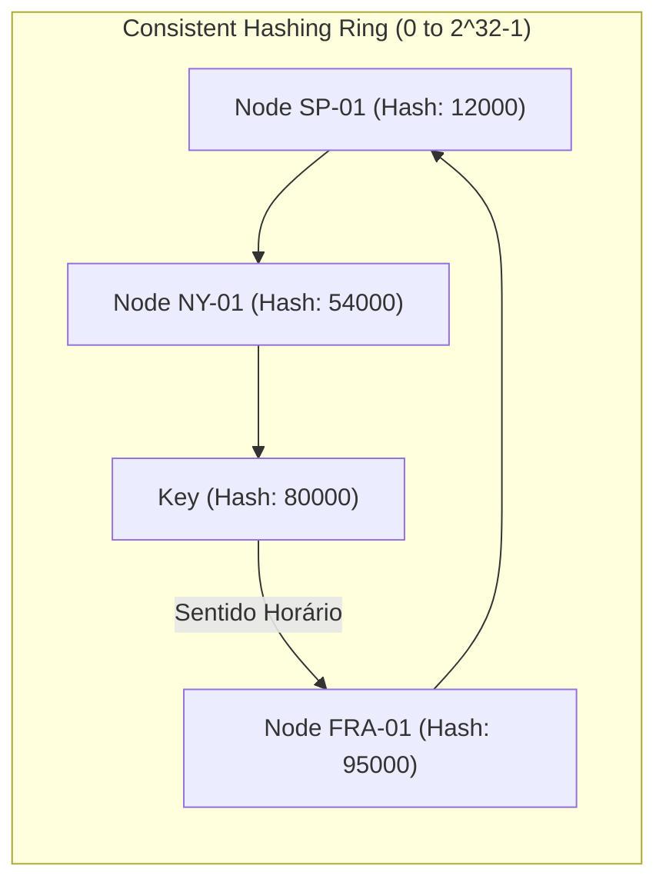

# 03. Particionamento (Sharding) de Dados

## Objetivo
Ao final deste capítulo, você será capaz de conceituar o padrão de particionamento de dados (Sharding) e sua finalidade para escalabilidade horizontal de escrita e armazenamento, diferenciar as estratégias de particionamento (por Faixa de Chaves, por Hash de Chave e Consistent Hashing), explicar o funcionamento de um anel de *Consistent Hashing* com nós virtuais, e analisar os limites físicos de consultas cruzadas (*Scatter-Gather*) e índices secundários.

---

## Motivação
No capítulo anterior, estudamos a replicação baseada em líder. Ela nos permite tolerar falhas de hardware e escalar a leitura de dados adicionando réplicas somente leitura. Contudo, a replicação possui um limite físico intransponível: **todas as escritas devem passar obrigatoriamente pelo único líder ativo**. Se a vazão de transações de escrita do Ledger ultrapassar a capacidade de disco e CPU daquela única máquina líder, o sistema colapsará.

Além disso, e se o volume total de transações históricas for de 50 Terabytes, excedendo o limite de armazenamento físico de um único servidor do banco de dados? 

Para contornar os limites físicos de escrita e armazenamento de um único nó, a indústria adota o **Particionamento** (conhecido na camada de aplicação como **Sharding**). Em vez de manter todo o banco de dados em cada servidor, dividimos a base em blocos menores independentes e distribuímos esses blocos entre servidores diferentes no cluster.

---

## Pré-requisitos
* [Módulo 4, Capítulo 02: Replicação Baseada em Líder (Leader-Follower)](./02-leader-follower-replication.md).

---

## Conceitos Fundamentais

### 1. Definição de Particionamento (Sharding)
Particionamento é o processo de dividir um grande conjunto de dados (como uma tabela de banco de dados) em partes menores e independentes chamadas **Partições** (ou *Shards*). 
* **Escala Horizontal**: Cada partição é armazenada e operada por um nó físico diferente. Isso permite escalar escritas linearmente: se adicionarmos mais nós ao cluster, o tráfego de escritas é distribuído entre os novos nós.
* **Relação com Replicação**: Particionamento e Replicação são usualmente combinados. Cada partição é replicada em múltiplos nós para tolerância a falhas. Um nó pode ser o líder da Partição 1 e seguidor da Partição 2 ao mesmo tempo.

---

### 2. Estratégias de Particionamento

#### 2.1. Particionamento por Faixa de Chaves (Key Range Partitioning)
* **Mecanismo**: Os dados são ordenados e divididos por faixas contínuas de valores de chaves (ex: Partição 1 guarda chaves de A a C; Partição 2 de D a F).
* **Vantagem**: Facilita consultas de faixa (*range queries*). Se você solicitar `SELECT * WHERE key BETWEEN B e E`, a aplicação só precisará consultar a Partição 1 e 2.
* **Desvantagem (Hotspots)**: Se a distribuição de uso real das chaves for desigual (ex: todas as requisições forem de chaves iniciando com a letra D), uma única partição ficará sobrecarregada física e termicamente enquanto as outras ficam ociosas.

#### 2.2. Particionamento por Hash de Chave (Hash Partitioning)
* **Mecanismo**: Aplica-se uma função Hash sobre a chave do registro para gerar um número pseudo-aleatório distribuído uniformemente. O nó é selecionado aplicando o resto da divisão pelo número de nós *N*:

$$
\text{Nó ID} = \text{hash}(\text{chave}) \pmod N
$$

* **Vantagem**: Distribuição de dados perfeitamente equilibrada entre os servidores, eliminando hotspots.
* **Desvantagem**: Perda total da capacidade de consultas de faixa eficientes. Chaves sequenciais (ex: `1`, `2`, `3`) serão espalhadas por nós totalmente diferentes na rede.
* **O Problema de Rebalanceamento (*N* dinâmico)**: Se o número de nós *N* mudar (adicionar ou remover um servidor do cluster), o resultado do cálculo do módulo muda para quase todas as chaves existentes. Isso força a migração física de quase todo o banco de dados entre os servidores na rede, gerando lentidão extrema e consumo de banda de rede.

---

### 3. Consistent Hashing (Espalhamento Consistente)
Consistent Hashing é a técnica matemática desenvolvida para mitigar a movimentação massiva de dados quando nós entram ou saem do cluster.
* **O Anel de Hash (Hash Ring)**: A função hash mapeia valores em um intervalo circular (ex: de 0 a 2³² - 1). Imagine esse intervalo como um anel fechado.
* **Mapeamento de Nós**: Os servidores do cluster são mapeados no anel aplicando o hash do seus nomes/IPs.
* **Mapeamento de Chaves**: A chave do registro é mapeada no mesmo anel. O registro é armazenado no **primeiro nó encontrado percorrendo o anel no sentido horário** a partir da posição do hash da chave.
* **Nós Virtuais (Virtual Nodes / Vnodes)**: Para evitar distribuição desigual de dados no anel, cada servidor físico é mapeado em múltiplas posições fictícias diferentes do anel (ex: 256 nós virtuais por nó físico).
* **Vantagem de Escala**: Ao adicionar um novo nó físico, apenas uma pequena fração de chaves no anel é migrada para o novo nó; a maior parte das chaves permanece exatamente onde estava, minimizando a transferência de dados pela rede física.



---

### 4. Consultas Cruzadas (Scatter-Gather) e Índices Secundários
* **Índice Primário**: Mapeamento direto da chave de partição. A requisição vai direto para o nó que guarda aquela chave específica (latência mínima).
* **Índice Secundário Local (Document-partitioned)**:
  * Cada partição mantém seus próprios índices secundários para os registros locais.
  * **Problema**: Se você fizer uma busca usando o índice secundário (ex: `SELECT * WHERE status = 'ACTIVE'`), o roteador não saberá em qual partição o dado está. Ele deve disparar a query para **todas as partições do cluster concorrentemente** e agrupar os resultados. Essa operação é chamada de **Scatter-Gather** (Espalhar e Reunir) e é extremamente cara em termos de CPU e conexões de rede em clusters grandes.
* **Índice Secundário Global (Term-partitioned)**:
  * Cria-se um índice secundário global que também é particionado de forma independente em outro nó.
  * **Problema**: Gravações tornam-se lentas e complexas, pois atualizar um dado exige atualizar a partição do registro e a partição do índice global assincronamente.

---

## Funcionamento Interno
O cálculo matemático do Consistent Hashing percorre o anel localizando o primeiro nó físico correspondente através de buscas binárias eficientes organizadas em árvores equilibradas de busca (BST/TreeMap) em memória RAM no roteador da aplicação.

---

## Exemplos

### Implementação de um Anel de Consistent Hashing com Nós Virtuais em Kotlin
O exemplo abaixo implementa o anel conceitual, permitindo adicionar servidores físicos, criar nós virtuais distribuídos e resolver chaves de registros de dados deterministicamente no sentido horário.

```kotlin
// ARQUIVO: ConsistentHashRing.kt
package com.distribuidos.sharding

import java.security.MessageDigest
import java.util.TreeMap

class ConsistentHashRing(
    private val numberOfReplicas: Int // Número de nós virtuais por nó físico
) {
    // TreeMap armazena a ordenação natural das posições (Hashes) no anel circular
    private val circle = TreeMap<Long, String>()

    // Função de Hash MD5 simples convertida para inteiro de 32 bits sem sinal
    private fun hash(key: String): Long {
        val md = MessageDigest.getInstance("MD5")
        val bytes = md.digest(key.toByteArray())
        // Converte os primeiros 4 bytes em um número Long de 32 bits
        return ((bytes[3].toLong() and 0xFF) shl 24) or
               ((bytes[2].toLong() and 0xFF) shl 16) or
               ((bytes[1].toLong() and 0xFF) shl 8) or
               (bytes[0].toLong() and 0xFF)
    }

    fun addNode(node: String) {
        for (i in 0 until numberOfReplicas) {
            // Cria identificador único para o nó virtual
            val vNodeName = "$node-vnode-$i"
            val hashVal = hash(vNodeName)
            circle[hashVal] = node
            println("[RING] Nó virtual '$vNodeName' adicionado na posição hash: $hashVal")
        }
    }

    fun removeNode(node: String) {
        for (i in 0 until numberOfReplicas) {
            val vNodeName = "$node-vnode-$i"
            val hashVal = hash(vNodeName)
            circle.remove(hashVal)
        }
    }

    // Retorna o nó físico responsável pela chave percorrendo o anel no sentido horário
    fun getNode(key: String): String {
        if (circle.isEmpty()) return "NO_NODE_AVAILABLE"
        
        val hashVal = hash(key)
        
        // Busca a cauda do TreeMap a partir do hash da chave (sentido horário)
        val tailMap = circle.tailMap(hashVal)
        
        // Se a cauda estiver vazia, significa que passamos do final do anel. 
        // O sentido horário nos joga de volta para o primeiro nó do início do TreeMap.
        val nodeHash = if (tailMap.isEmpty()) circle.firstKey() else tailMap.firstKey()
        
        return circle[nodeHash]!!
    }
}

fun main() {
    val ring = ConsistentHashRing(numberOfReplicas = 3)
    
    // Adiciona 3 nós físicos ao cluster
    ring.addNode("DB-NODE-SP")
    ring.addNode("DB-NODE-FRA")
    ring.addNode("DB-NODE-NY")

    val keys = listOf("conta-10023", "conta-88992", "conta-44551", "conta-00122")
    
    println("\n=== Resolução de Particionamento de Chaves ===")
    for (k in keys) {
        val targetNode = ring.getNode(k)
        println("Chave '$k' direcionada para o servidor físico: $targetNode")
    }

    println("\n=== Removendo Nó DB-NODE-NY do Cluster ===")
    ring.removeNode("DB-NODE-NY")
    for (k in keys) {
        val targetNode = ring.getNode(k)
        println("Chave '$k' agora direcionada para: $targetNode")
    }
}
```

---

## Casos de Uso
* **Apache Cassandra**: Utiliza partições e consistente hashing de forma nativa. O token de partição de cada chave de registro determina em qual nó do cluster Cassandra os dados primários residem.
* **Elasticsearch**: Divide índices textuais de busca em *Shards* independentes distribuídos em servidores. Consultas que não especificam o shard ID disparam Scatter-Gather em todo o cluster para fundir o ranking das buscas.

---

## Quando Utilizar Particionamento
* O volume de gravação/segundo excede o limite físico do melhor barramento de escrita e disco de um único servidor.
* O tamanho do banco de dados completo consome mais espaço do que a capacidade de disco de uma única máquina.

---

## Quando Não Utilizar Particionamento
* Aplicações relacionais complexas que dependem fortemente de lógicas de junção de tabelas (`JOIN`). Executar um JOIN cruzando shards localizados em servidores diferentes na rede exige transferir tabelas inteiras pela rede para a memória da aplicação, resultando em performance inaceitável.

---

## Vantagens
* **Escalabilidade Teórica Infinita**: Permite crescer as gravações horizontalmente adicionando máquinas físicas baratas.
* **Isolamento de Falha**: Se a Partição 1 cair, a Partição 2 continua operando e aceitando escritas normalmente.

---

## Desvantagens
* **Complexidade de Junção (Cross-Shard Joins)**: Perda da capacidade relacional de JOIN nativo do banco.
* **Consultas Scatter-Gather Lentas**: Consultas sem a chave de partição são custosas para a infraestrutura.

---

## Comparações

### Estratégias de Particionamento

| Dimensão | Key Range (Faixa) | Hash de Chave (Mod *N*) | Consistent Hashing |
|---|---|---|---|
| **Distribuição** | Irregular (risco de hotspots) | Perfeitamente uniforme | Uniforme (com nós virtuais) |
| **Consultas de Faixa** | Nativo e eficiente | Ineficiente (Scatter-gather) | Ineficiente (Scatter-gather) |
| **Movimentação no Redimensionamento** | Média | Quase 100% dos dados migram | Mínima (apenas fração $1/N$ migra) |

---

## Erros Comuns
1. **Escolher uma Chave de Partição com Baixa Cardinalidade**: Escolher uma chave que possua poucos valores possíveis (ex: `status_pagamento`, que pode ser apenas `APPROVED` ou `REJECTED`). Isso agrupará milhões de dados em apenas duas partições físicas, gerando hotspots severos e inviabilizando a escalabilidade de novas máquinas adicionadas.
2. **Consultar Sem a Chave de Partição em Loops**: Fazer queries no banco relacional dentro de laços de repetição omitindo a chave do shard, forçando o roteador a fazer centenas de Scatter-Gathers concorrentes e congestionando a rede interna.

---

## Projeto Prático
No projeto **FinTech Ledger**, aplicamos o conceito de Sharding para escalabilidade de contas.
Dividimos as contas correntes em 3 servidores de Ledger independentes (`LedgerNode`). O roteador da API de pagamentos aplicará o algoritmo de hash simplificado sobre o `accountId` para rotear os débitos para a instância do nó correspondente de forma transparente.

```kotlin
// ARQUIVO: ShardedLedgerRouter.kt
package com.distribuidos.projeto.sharding

import com.distribuidos.projeto.TransactionResult
import java.util.UUID

class LedgerNode(val nodeId: String) {
    private val balances = mutableMapOf<String, Double>()
    
    fun getBalance(accountId: String): Double = balances[accountId] ?: 0.0
    
    fun credit(accountId: String, amount: Double) {
        balances[accountId] = getBalance(accountId) + amount
    }
}

class ShardedLedgerRouter(private val nodes: List<LedgerNode>) {

    // Roteia deterministicamente a conta baseada no módulo do tamanho do cluster
    private fun getTargetNode(accountId: String): LedgerNode {
        val hash = accountId.hashCode()
        // Garante valor positivo para o cálculo do resto
        val index = (hash and Int.MAX_VALUE) % nodes.size
        return nodes[index]
    }

    fun getAccountBalance(accountId: String): Double {
        val node = getTargetNode(accountId)
        println("[ROUTER] Roteando LEITURA da conta $accountId para o nó: ${node.nodeId}")
        return node.getBalance(accountId)
    }

    fun applyCredit(accountId: String, amount: Double): TransactionResult {
        val node = getTargetNode(accountId)
        println("[ROUTER] Roteando ESCRITA da conta $accountId para o nó: ${node.nodeId}")
        node.credit(accountId, amount)
        return TransactionResult.Success(UUID.randomUUID().toString(), System.currentTimeMillis())
    }
}
```

---

## Exercícios

### Básico
1. Qual o problema de rebalanceamento de dados gerado pela estratégia de Hash Modulo *N* simples quando o número de nós *N* do cluster é alterado?
2. Explique o papel dos Nós Virtuais (*Vnodes*) no anel de Consistent Hashing.

### Intermediário
3. Considere um sistema de e-commerce que precisa particionar as tabelas `orders` (pedidos) e `order_items` (itens do pedido). Sugira uma chave de partição eficaz para ambas as tabelas que permita que consultas de visualização de detalhes de compras do usuário não exijam operações de Scatter-Gather. Justifique a sua escolha arquitetural.

### Avançado
4. Modifique a classe `ConsistentHashRing` apresentada neste capítulo para coletar e medir a porcentagem exata de dados que precisam ser migrados fisicamente quando o cluster passa de 3 nós para 4 nós. Simule um dicionário de 1.000 chaves aleatórias em memória e calcule quantas delas mudaram de nó físico responsável após a adição do quarto nó. O resultado deve comprovar matematicamente a eficiência do Consistent Hashing em comparação com a redistribuição total do Hash Modulo *N*.

---

## Perguntas de Entrevista
1. **O que é o fenômeno de "Hotspot" de partição em bancos de dados distribuídos e como chaves baseadas em carimbos de tempo sequenciais (como ID auto-incremental ou data atual) criam esse problema?**
   * *Resposta esperada*: Um Hotspot ocorre quando uma única partição física do cluster recebe quase todo o tráfego de gravação ou leitura de dados, gerando gargalos de I/O de disco e CPU naquele nó específico enquanto as outras máquinas ficam ociosas. Se utilizarmos uma chave de partição baseada em tempo sequencial (como data `YYYY-MM-DD` ou ID incremental), como os valores são gerados em ordem contínua temporal, todas as gravações do microssegundo atual cairão sempre na mesma faixa de chave atualizada. No caso de partição por faixa de chaves (Key Range), isso significa que todas as gravações atingirão sempre a mesma partição ativa (a partição final do dia/id atual). O cluster falha em distribuir a carga concorrente de escritas no tempo. A mitigação é usar hashes de chaves de negócios ou adicionar um sufixo aleatório (salting) à chave de tempo para espalhar os dados entre diferentes partições.

2. **Explique a diferença de custo operacional e latência de rede entre índices secundários locais (Document-partitioned) e índices secundários globais (Term-partitioned) em consultas distribuídas.**
   * *Resposta esperada*: Índices secundários locais dividem as referências do índice estritamente dentro da própria partição que armazena os dados primários. A gravação é muito barata e transacional rápida local, mas leituras sem a chave de partição primária exigem Scatter-Gather (o roteador deve consultar todas as partições do cluster paralelamente e juntar as listas na memória do cliente, elevando a latência). Índices secundários globais agrupam os metadados do índice em uma estrutura independente que também é particionada por chaves do índice secundário. A leitura é instantânea (o roteador vai direto ao nó que guarda o índice secundário de interesse), mas gravações tornam-se lentas e de alta complexidade, pois atualizar um único registro de dado primário exige que o banco relacional atualize a partição do registro e faça chamadas de rede para atualizar a partição do índice global concorrentemente, demandando transações distribuídas (2PC) ou consistência eventual tolerante a falhas na escrita.

---

## Resumo
* Sharding divide o banco de dados em partições menores distribuídas horizontalmente entre nós físicos para suportar limites de escrita e disco de uma máquina única.
* Consistent Hashing organiza os nós e chaves em um anel de hash circular, minimizando a migração física de registros durante o redimensionamento do cluster.
* A busca sem a chave de partição primária exige consultas Scatter-Gather em todas as partições do cluster, representando custos severos de infraestrutura distribuída.

---

## Próximo Capítulo
No [Capítulo 04: Consistência Eventual e Anomalias de Replicação](./04-eventual-consistency-anomalies.md), finalizaremos o estudo de dados distribuídos analisando as consequências práticas da replicação assíncrona na aplicação e mapeando as anomalias lógicas experimentadas pelos usuários finais (como leitura de dados obsoletos e inversão de ordem causal).

---

## Referências
* **Designing Data-Intensive Applications**, Martin Kleppmann. Capítulo 6: *Partitioning*.
* **Consistent Hashing and Random Trees: Distributed Caching Protocols for Relieving Hot Spots on the World Wide Web**, David Karger, Eric Lehman, Tom Leighton, Rina Panigrahy, Matthew Levine, Daniel Lewin (1997). ACM Symposium on Theory of Computing.
* **Cassandra Architecture Documentation**: [Data Partitioning in Cassandra](https://cassandra.apache.org/doc/latest/cassandra/architecture/dynamo.html).