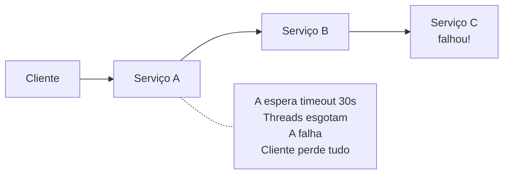
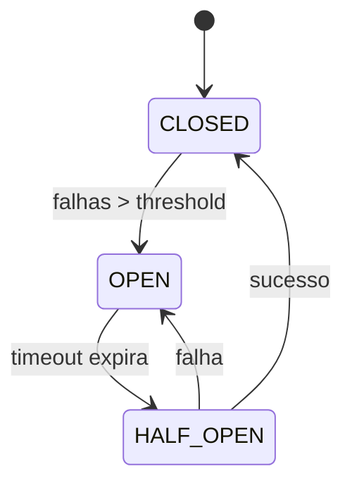

# Circuit Breaker

## Objetivo

Compreender o padrão Circuit Breaker para proteção contra cascata de falhas em sistemas distribuídos, seus estados (Closed, Open, Half-Open), e como implementá-lo em Go.

---

## Pré-requisitos

- [Síncrono vs Assíncrono](../02-communication/01-synchronous-vs-asynchronous.md)
- [REST e gRPC](../02-communication/02-rest-and-grpc.md)
- Conceitos de tolerância a falhas

---

## Conceitos Fundamentais

### O Problema: Cascata de Falhas

Quando um serviço downstream falha, sem proteção os callers continuam enviando requests que vão falhar, consumindo recursos (threads, conexões, memória) e propagando a falha para cima.



### A Solução: Circuit Breaker

Inspirado em disjuntores elétricos — "abre o circuito" quando detecta falhas, impedindo chamadas desnecessárias.



**Estados**:
- **Closed**: Normal. Requests passam. Falhas são contadas.
- **Open**: Circuito aberto. Requests são rejeitados imediatamente (fail-fast). Sem esperar timeout.
- **Half-Open**: Permite um número limitado de requests "teste". Se suceder → Closed. Se falhar → Open.

---

## Funcionamento Interno

### Parâmetros de Configuração

| Parâmetro | Descrição | Valor Típico |
|-----------|-----------|-------------|
| **Failure Threshold** | Número de falhas para abrir | 5 falhas |
| **Success Threshold** | Sucessos em half-open para fechar | 3 sucessos |
| **Timeout** | Tempo em open antes de half-open | 30 segundos |
| **Window** | Janela de tempo para contar falhas | 60 segundos |

---

## Casos de Uso

### Netflix — Hystrix (aposentado, padrão vive)

Netflix criou o Hystrix como circuit breaker para seus ~700 microserviços. Um serviço de recomendações falhando não deve derrubar o player de vídeo. Hoje, o padrão persiste no Resilience4j (Java) e em service meshes como Istio.

---

## Vantagens

1. **Fail-fast**: Evita esperar timeout em serviços que já estão fora
2. **Proteção contra cascata**: Falha contida no serviço que falhou
3. **Auto-recovery**: Half-open permite detectar recuperação automaticamente
4. **Preserva recursos**: Não desperdiça threads/conexões em chamadas que vão falhar

---

## Desvantagens

1. **Configuração delicada**: Thresholds errados causam false positives (abre sem necessidade) ou false negatives (não abre quando deveria)
2. **Complexidade de teste**: Difícil testar transições de estado em ambiente de desenvolvimento
3. **Fallback necessário**: O que retornar quando o circuito está aberto?

---

## Erros Comuns

### 1. Threshold muito baixo
2 falhas em 1 segundo abre o circuito — pode ser apenas spike de latência, não falha real.

### 2. Sem fallback
Circuito aberto sem fallback retorna erro 503 para o usuário. Implemente fallback: cache, valor default, graceful degradation.

### 3. Não monitorar estado do circuit breaker
Se o circuito está permanentemente aberto, há um problema maior. Alerte quando o circuito abre.

---

## Exemplos

### Exemplo: Circuit Breaker em Go

```go
package main

import (
	"errors"
	"fmt"
	"sync"
	"time"
)

type State int
const (
	StateClosed State = iota
	StateOpen
	StateHalfOpen
)
func (s State) String() string { return [...]string{"CLOSED", "OPEN", "HALF-OPEN"}[s] }

type CircuitBreaker struct {
	state            State
	failureCount     int
	successCount     int
	failureThreshold int
	successThreshold int
	timeout          time.Duration
	lastFailureTime  time.Time
	mu               sync.Mutex
}

func NewCircuitBreaker(failThreshold, successThreshold int, timeout time.Duration) *CircuitBreaker {
	return &CircuitBreaker{
		state: StateClosed, failureThreshold: failThreshold,
		successThreshold: successThreshold, timeout: timeout,
	}
}

func (cb *CircuitBreaker) Execute(fn func() error) error {
	cb.mu.Lock()
	if cb.state == StateOpen {
		if time.Since(cb.lastFailureTime) > cb.timeout {
			cb.state = StateHalfOpen
			cb.successCount = 0
			fmt.Printf("  ⚡ Circuit: OPEN → HALF-OPEN (testando...)\n")
		} else {
			cb.mu.Unlock()
			return fmt.Errorf("circuit breaker OPEN: requisição rejeitada (fail-fast)")
		}
	}
	cb.mu.Unlock()

	err := fn()

	cb.mu.Lock()
	defer cb.mu.Unlock()
	if err != nil {
		cb.failureCount++
		cb.lastFailureTime = time.Now()
		if cb.state == StateHalfOpen || cb.failureCount >= cb.failureThreshold {
			cb.state = StateOpen
			fmt.Printf("  🔴 Circuit: → OPEN (falhas: %d)\n", cb.failureCount)
		}
		return err
	}

	if cb.state == StateHalfOpen {
		cb.successCount++
		if cb.successCount >= cb.successThreshold {
			cb.state = StateClosed
			cb.failureCount = 0
			fmt.Printf("  🟢 Circuit: HALF-OPEN → CLOSED (recuperado!)\n")
		}
	} else {
		cb.failureCount = 0 // reset on success in closed state
	}
	return nil
}

func main() {
	fmt.Println("=== Circuit Breaker ===\n")
	cb := NewCircuitBreaker(3, 2, 2*time.Second)

	callService := func(shouldFail bool) {
		err := cb.Execute(func() error {
			if shouldFail { return errors.New("service unavailable") }
			return nil
		})
		if err != nil {
			fmt.Printf("  ✗ Erro: %v\n", err)
		} else {
			fmt.Printf("  ✓ Sucesso\n")
		}
	}

	fmt.Println("--- Chamadas com falha (abre circuito) ---")
	for i := 0; i < 4; i++ { callService(true) }

	fmt.Println("\n--- Circuito aberto (fail-fast) ---")
	callService(false) // rejeitado imediatamente

	fmt.Println("\n--- Esperando timeout (2s) ---")
	time.Sleep(2100 * time.Millisecond)

	fmt.Println("\n--- Half-open (testando recuperação) ---")
	callService(false) // sucesso
	callService(false) // sucesso → fecha circuito

	fmt.Println("\n--- Circuito fechado (normal) ---")
	callService(false)
}
```

---

## Exercícios

### Exercício 1 — Adicione Fallback
Modifique o circuit breaker para aceitar uma função de fallback que é chamada quando o circuito está aberto.

### Exercício 2 — Sliding Window
Implemente contagem de falhas com sliding window (últimos 60 segundos) em vez de contador absoluto.

---

## Projeto Prático

Implementar circuit breaker como middleware HTTP em Go, aplicável a qualquer `http.Client`.

---

## Perguntas de Entrevista

### Nível Senior

**P: Explique os estados do Circuit Breaker e por que o Half-Open é importante.**
R: Closed: normal, falhas contadas. Open: requests rejeitados imediatamente (fail-fast), evitando cascata. Half-Open: após timeout, permite requests teste para verificar se o serviço se recuperou. Sem half-open, o circuito ficaria aberto para sempre ou precisaria de intervenção manual.

---

## Referências

1. **Livro**: Nygard, M. (2018). *Release It!*, Cap. 5 — Stability Patterns
2. **Artigo**: Fowler, M. *CircuitBreaker* — martinfowler.com
3. **Go lib**: [sony/gobreaker](https://github.com/sony/gobreaker)
4. **Tópicos relacionados**: [Retry e Backoff](02-retry-and-backoff.md) | [Bulkhead](03-bulkhead-pattern.md) | [Timeout](04-timeout-and-deadline-propagation.md)
