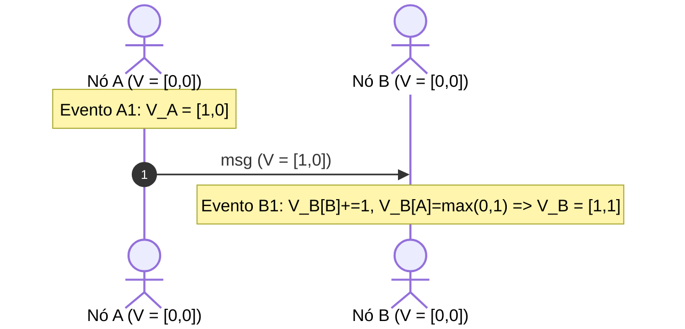

# 01. Tempo Lógico e Ordenação Causal (Lamport & Vector Clocks)

## Objetivo
Ao final deste capítulo, você será capaz de explicar os limites de sincronização de relógios físicos locais, conceituar a relação *Happened-Before* ($\to$) de Leslie Lamport, calcular e rastrear eventos usando *Lamport Timestamps* e *Vector Clocks*, e projetar mecanismos de desambiguação de escritas simultâneas em Kotlin.

---

## Motivação
Nos módulos anteriores, estudamos como replicar e particionar dados. Mas e se dois clientes tentarem atualizar a mesma conta bancária simultaneamente em réplicas separadas por uma partição de rede? 

Muitos desenvolvedores tentam resolver isso gravando a hora de parede ($System.currentTimeMillis()$) no banco de dados e escolhendo o valor que tiver o maior timestamp (lógica *Last-Write-Wins - LWW*). Contudo, como vimos, relógios físicos sofrem deriva. Se o relógio do Nó A estiver adiantado por apenas 20 milissegundos em relação ao Nó B, escritas antigas do Nó A podem sobrescrever de forma invisível dados legítimos mais novos do Nó B.

Para ordenar transações financeiras ou estados de réplicas de forma confiável, não podemos confiar no tempo de relógio de parede. Precisamos de **Tempo Lógico** para determinar quem causou o quê.

---

## Pré-requisitos
* [Módulo 1: Fundamentos e Limitações Físicas](./../01-foundations/README.md).

---

## Conceitos Fundamentais

### 1. A Relação Happened-Before (Aconteceu Antes: $\to$)
Formulada por Leslie Lamport em seu paper de 1978, a relação Happened-Before (representada pelo símbolo $\to$) define uma ordem parcial de eventos em um sistema distribuído sem depender de relógios físicos.

A relação $\to$ é regida por três regras estritas:
1. **Ordem Local**: Se os eventos $a$ e $b$ ocorrem dentro do mesmo processo, e $a$ ocorre antes de $b$, então $a \to b$.
2. **Envio e Recebimento**: Se o evento $a$ é o envio de uma mensagem por um processo, e o evento $b$ é o recebimento dessa mesma mensagem por outro processo, então $a \to b$.
3. **Transitividade**: Se $a \to b$ e $b \to c$, então $a \to c$.

#### Concorrência ($\parallel$)
Se não podemos afirmar que $a \to b$ nem que $b \to a$ através das regras acima, dizemos que os eventos $a$ e $b$ são **concorrentes** (representado por $a \parallel b$). Isso significa que eles ocorreram de forma independente, sem que um tivesse conhecimento ou influenciasse o outro.

---

### 2. Relógios Lógicos de Lamport (Lamport Timestamps)
Um Relógio de Lamport é um contador numérico inteiro associado a cada processo. O algoritmo garante a propriedade:
$$\text{Se } a \to b, \text{ então } L(a) < L(b)$$

#### Algoritmo de Incremento e Transição
1. Cada nó inicializa seu relógio local $L = 0$.
2. Antes de executar um evento local, o nó incrementa seu relógio: $L = L + 1$.
3. Ao enviar uma mensagem, o nó anexa o valor do seu relógio $L$ atualizado no payload.
4. Ao receber uma mensagem com o carimbo $L_{\text{msg}}$, o nó receptor atualiza seu relógio local fazendo:
$$L_{\text{local}} = \max(L_{\text{local}}, L_{\text{msg}}) + 1$$

* **Limitação Física**: Os relógios de Lamport geram uma ordenação total artificial. Se $L(a) < L(b)$, **não podemos inferir que $a \to b$**. Os eventos podem ser perfeitamente concorrentes e ter carimbos ordenados de forma arbitrária pelo algoritmo.

---

### 3. Relógios Vetoriais (Vector Clocks)
Diferente de Lamport, os Relógios Vetoriais permitem detectar se dois eventos são causais ou concorrentes ($a \parallel b$).
Um Relógio Vetorial para um cluster de $N$ nós é um vetor de inteiros de tamanho $N$, representado por $V$.

#### Algoritmo de Atualização
1. Cada nó inicializa seu vetor com zeros: $V = [0, 0, \dots, 0]$.
2. Antes de um evento local, o nó $i$ incrementa sua própria entrada no vetor: $V[i] = V[i] + 1$.
3. Ao enviar uma mensagem, o nó $i$ anexa seu vetor $V$ na mensagem.
4. Ao receber uma mensagem contendo $V_{\text{msg}}$, o nó receptor $j$:
   * Incrementa sua própria entrada: $V[j] = V[j] + 1$.
   * Atualiza as outras entradas pegando o máximo elemento a elemento:
$$\forall k \neq j, \quad V[k] = \max(V[k], V_{\text{msg}}[k])$$

#### Comparação de Vetores
* $V(a) < V(b) \iff \forall k, V(a)[k] \le V(b)[k]$ e pelo menos um elemento é estritamente menor. Indica que $a$ causou causou $b$ ($a \to b$).
* Se nem $V(a) \le V(b)$ nem $V(b) \le V(a)$, os eventos $a$ e $b$ são **concorrentes** ($a \parallel b$). Indica conflito de dados que deve ser resolvido.



---

## Funcionamento Interno
Em bancos de dados NoSQL de escrita livre (AP), como o Cassandra ou Dynamo, os relógios vetoriais são anexados como metadados a cada chave de registro. Quando escritas paralelas acontecem sob partição de rede, o banco armazena múltiplos valores conflitantes associados a vetores concorrentes (chamados de *siblings*). Quando a partição de rede cai, o cliente lê os siblings e aplica a reconciliação.

---

## Exemplos

### 1. Implementação de Lamport Timestamp em Kotlin
```kotlin
// ARQUIVO: LamportClock.kt
package com.distribuidos.consenso

import kotlin.math.max

class LamportClock {
    private var counter: Long = 0

    @Synchronized
    fun tick(): Long {
        counter++
        return counter
    }

    @Synchronized
    fun update(msgTime: Long): Long {
        counter = max(counter, msgTime) + 1
        return counter
    }

    fun getValue(): Long = counter
}
```

### 2. Implementação de Relógio Vetorial em Kotlin
O código abaixo implementa a criação de vetores, incremento local, atualização ao receber e a função de comparação para identificar concorrência ou causalidade.

```kotlin
// ARQUIVO: VectorClock.kt
package com.distribuidos.consenso

import kotlin.math.max

class VectorClock(private val nodeId: String) {
    // Armazena a contagem de eventos por Nó ID
    private val clockMap = mutableMapOf<String, Long>()

    init {
        clockMap[nodeId] = 0
    }

    @Synchronized
    fun tick() {
        val current = clockMap[nodeId] ?: 0
        clockMap[nodeId] = current + 1
    }

    @Synchronized
    fun getCopy(): Map<String, Long> {
        return clockMap.toMap()
    }

    @Synchronized
    fun merge(incomingClock: Map<String, Long>) {
        // Incrementa a entrada local antes de fundir o estado do recebimento
        tick()
        
        // Funde os vetores obtendo o valor máximo elemento a elemento
        val allKeys = clockMap.keys + incomingClock.keys
        for (key in allKeys) {
            val localVal = clockMap[key] ?: 0L
            val incomingVal = incomingClock[key] ?: 0L
            clockMap[key] = max(localVal, incomingVal)
        }
    }

    companion object {
        // Retorna a relação de tempo entre dois relógios vetoriais
        fun compare(v1: Map<String, Long>, v2: Map<String, Long>): ClockRelationship {
            var v1Greater = false
            var v2Greater = false

            val allKeys = v1.keys + v2.keys
            for (key in allKeys) {
                val val1 = v1[key] ?: 0L
                val val2 = v2[key] ?: 0L

                if (val1 > val2) v1Greater = true
                if (val2 > val1) v2Greater = true
            }

            return when {
                v1Greater && !v2Greater -> ClockRelationship.GREATER
                v2Greater && !v1Greater -> ClockRelationship.LESSER
                !v1Greater && !v2Greater -> ClockRelationship.EQUAL
                else -> ClockRelationship.CONCURRENT // Conflito/Paralelo
            }
        }
    }
}

enum class ClockRelationship { LESSER, GREATER, EQUAL, CONCURRENT }
```

```kotlin
// ARQUIVO: VectorClockMain.kt
package com.distribuidos.consenso

fun main() {
    val nodeA = VectorClock("Nó-A")
    val nodeB = VectorClock("Nó-B")

    // Evento local no Nó-A
    nodeA.tick() // V_A = [A:1]

    // Nó A envia mensagem para Nó B
    val messagePayloadClock = nodeA.getCopy()

    // Nó B recebe e funde a mensagem
    nodeB.merge(messagePayloadClock) // V_B = [A:1, B:1]

    // Escrita concorrente independente no Nó-A
    nodeA.tick() // V_A = [A:2]

    // Escrita concorrente independente no Nó-B
    nodeB.tick() // V_B = [A:1, B:2]

    // Compara os dois relógios vetoriais após as escritas independentes
    val relation = VectorClock.compare(nodeA.getCopy(), nodeB.getCopy())
    
    println("Vetor A: ${nodeA.getCopy()}")
    println("Vetor B: ${nodeB.getCopy()}")
    println("Relação Temporal: $relation") // Deve retornar CONCURRENT (Conflito!)
}
```

---

## Casos de Uso
* **Amazon Dynamo**: A arquitetura original do carrinho de compras do Dynamo utilizava Relógios Vetoriais. Se um cliente adicionasse um item em uma réplica e seu celular perdesse o sinal de rede, e depois ele excluísse o item de outra réplica, a base de dados Dynamo gerava dois siblings concorrentes. O app do cliente resolvia o conflito na próxima sincronização unindo as listas.
* **Editores de Texto Colaborativos (Google Docs/Figma)**: Utilizam relógios lógicos e causais integrados a algoritmos CRDT ou de Transformação Operacional para ordenar edições de caracteres simultâneas de usuários concorrentes.

---

## Quando Utilizar Relógios Lógicos
* Sistemas de armazenamento replicados multi-leader ou leaderless que exigem identificação e reconciliação de concorrência.
* Sistemas orientados a eventos que exigem ordenação causal estrita de mensagens independentemente de relógios físicos.

---

## Quando Não Utilizar Relógios Lógicos
* Sistemas relacionais ACID tradicionais com replicação baseada em líder único. Como todas as escritas afunilam no líder, o líder dita a ordenação de forma sequencial simples através do seu próprio log local de transações, eliminando a necessidade de vetores complexos.

---

## Vantagens
* **Consistência Sem Relógios Físicos**: Totalmente imune a derivas NTP ou problemas térmicos de cristais de quartzo.
* **Detecção Concorrente Nativa (Vector Clocks)**: Identifica de forma segura quando dados divergiram.

---

## Desvantagens
* **Crescimento de Metadados (Vector Clocks)**: O tamanho do vetor cresce proporcionalmente ao número de nós $N$ no cluster. Se o cluster possuir 10.000 nós de banco de dados, cada pequeno registro de dados terá que trafegar um vetor de 10.000 inteiros adicionais como cabeçalho na rede, consumindo largura de banda.

---

## Comparações

### Lamport Timestamps vs. Vector Clocks

| Característica | Lamport Timestamps | Vector Clocks |
|---|---|---|
| **Formato Físico** | Um número inteiro simples | Um vetor/map de inteiros |
| **Garantia de Causalidade** | Se $a \to b$, então $L(a) < L(b)$ | Se $a \to b$, então $V(a) < V(b)$ |
| **Garantia Inversa** | Não (se $L(a) < L(b)$, $a$ pode não ter causado $b$) | Sim ($V(a) < V(b) \implies a \to b$) |
| **Identifica Concorrência?** | Não (concorrentes recebem ordenação arbitrária) | Sim (identifica concorrência $a \parallel b$ na comparação) |

---

## Erros Comuns
1. **Assumir Causalidade dos Relógios de Lamport**: Utilizar o valor do relógio de Lamport simples para assumir que uma transação causou outra em auditorias de segurança. Duas operações concorrentes de clientes diferentes em nós separados receberão inteiros incrementais simples pelo algoritmo, dando a falsa impressão de causa e efeito.
2. **Ignorar Poda de Vetores (Vector Clock Pruning)**: Deixar os relógios vetoriais crescerem infinitamente mapeando IDs de nós de clientes temporários ou pods efêmeros do Kubernetes. Deve-se expirar entradas inativas de nós do vetor periodicamente.

---

## Projeto Prático
No projeto **FinTech Ledger**, integramos os Relógios Vetoriais para gerenciar transações concorrentes na nossa simulação de banco multi-líder.
Se duas atualizações de saldo concorrentes forem efetuadas em réplicas isoladas, o Ledger detectará a concorrência através dos vetores e registrará os dois saldos divergentes como um conflito de concorrência pendente de auditoria manual.

```kotlin
// ARQUIVO: CollaborativeLedgerRecord.kt
package com.distribuidos.projeto.consenso

import com.distribuidos.grpc.BalanceResponse
import java.util.UUID

data class LedgerValue(
    val balance: Double,
    val vectorClock: Map<String, Long>
)

class CollaborativeLedgerRecord {
    private val values = mutableListOf<LedgerValue>()

    fun writeValue(newBalance: Double, clientClock: Map<String, Long>) {
        synchronized(this) {
            // Remove quaisquer valores obsoletos que foram causalmente superados pelo novo vetor
            val iterator = values.iterator()
            var isNewValueConcurrent = true
            
            while (iterator.hasNext()) {
                val existing = iterator.next()
                val relation = VectorClock.compare(clientClock, existing.vectorClock)
                
                if (relation == ClockRelationship.GREATER) {
                    // O novo valor causou a superação do antigo. Remove o antigo.
                    iterator.remove()
                    isNewValueConcurrent = false
                } else if (relation == ClockRelationship.LESSER) {
                    // O novo valor é obsoleto (já existe algo mais novo). Ignora o novo.
                    return
                }
            }

            // Grava o novo valor
            values.add(LedgerValue(newBalance, clientClock))
        }
    }

    fun getValues(): List<LedgerValue> = values
}
```

---

## Exercícios

### Básico
1. Qual o limite físico dos relógios de tempo de parede (físicos) em redes distribuídas?
2. Defina o conceito de eventos concorrentes ($a \parallel b$) de acordo com Leslie Lamport.

### Intermediário
3. Considere três processos ($P_1, P_2, P_3$). $P_1$ executa evento local ($e_{11}$), envia mensagem $m_1$ para $P_2$. $P_2$ recebe $m_1$ ($e_{21}$), executa evento local ($e_{22}$), envia $m_2$ para $P_3$. $P_3$ recebe $m_2$ ($e_{31}$). Calcule manualmente os carimbos de tempo lógico de Lamport para cada evento e verifique se a relação Happened-Before é preservada.

### Avançado
4. Escreva uma classe de reconciliação de carrinho de compras em Kotlin que receba dois relógios vetoriais concorrentes e mescle a lista de itens de forma idempotente (ex: unindo os itens de ambos os carrinhos conflitantes). Crie um cenário de simulação que comprove a corretude do merge.

---

## Perguntas de Entrevista
1. **Se os relógios vetoriais crescem linearmente de tamanho à medida que novos nós são adicionados ao cluster, como grandes bancos de dados de produção da indústria (ex: Riak ou Cassandra) escalam essa infraestrutura sem consumir toda a banda de rede em metadados?**
   * *Resposta esperada*: Bancos de dados distribuídos implementam políticas de **poda de relógios vetoriais (Vector Clock Pruning)**. Eles definem limites máximos de tamanho para o vetor (ex: limitar a no máximo 10 ou 50 entradas de nós históricos). Quando o vetor atinge o limite, a entrada mais antiga (baseada em carimbos de tempo de descarte) é removida do vetor. Embora a poda introduza uma pequena probabilidade de o banco confundir causalidade com concorrência temporária (podendo reintroduzir o LWW - Last-Write-Wins acidentalmente em cenários extremos), ela é um trade-off prático essencial para conter o consumo de rede e armazenamento físico de metadados em clusters de grande escala.

2. **Explique a diferença entre a relação de tempo lógico de Lamport e o algoritmo TrueTime API do Google Spanner. Por que o TrueTime consegue garantir consistência linearizável externa sem relógios lógicos?**
   * *Resposta esperada*: Os relógios lógicos de Lamport ordenam eventos baseados estritamente na causabilidade de mensagens trocadas lógicas, não permitindo comparar a precedência temporal de dois eventos independentes que nunca se comunicaram. O TrueTime do Spanner utiliza tempo físico real global. Ele contorna a deriva física equipando todos os datacenters do Google com relógios atômicos de césio e receptores GPS redundantes. O TrueTime não retorna a hora exata da parede como um valor único, mas como um **intervalo de incerteza do relógio físico** $[t.\text{earliest}, t.\text{latest}]$, garantindo que o erro máximo de sincronização global ($\epsilon$) seja menor que alguns milissegundos. Ao realizar uma transação de escrita, o Spanner aguarda propositalmente a janela de tempo de erro expirar (Commit Wait) antes de comitar a transação ao cliente, assegurando fisicamente que qualquer transação futura no tempo físico global receberá um timestamp maior, garantindo linearizabilidade externa global.

---

## Resumo
* Relógios físicos locais sofrem deriva térmica imprevisível, sendo ineficientes para ordenar transações distribuídas consistentes.
* Happened-Before ($\to$) define a relação de causalidade e concorrência parcial de eventos distribuídos de forma segura.
* Relógios Vetoriais superam os de Lamport permitindo detectar concorrência e conflitos de dados a custo de crescimento de metadados vetoriais.

---

## Próximo Capítulo
No [Capítulo 02: Introdução ao Problema do Consenso e Impossibilidade FLP](./02-consensus-problem-flp.md), avançaremos para o problema do acordo unânime em computação distribuída, estudando a teoria do Consenso e a famosa prova de impossibilidade matemática de Fischer, Lynch e Paterson.

---

## Referências
* **Time, Clocks, and the Ordering of Events in a Distributed System**, Leslie Lamport (1978). Communications of the ACM.
* **Designing Data-Intensive Applications**, Martin Kleppmann. Capítulo 9: *Consistency and Consensus* (Seção sobre *Detecting Concurrent Writes*).
* **Distributed Systems**, Maarten van Steen. Capítulo 6: *Coordination*.
