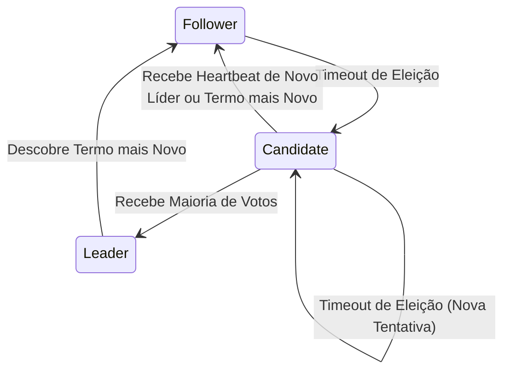

# 03. Algoritmo de Consenso Raft: Eleição de Líder

## Objetivo
Ao final deste capítulo, você será capaz de detalhar a máquina de estados finita do algoritmo Raft, explicar o papel dos Termos lógicos como relógios causais de época, descrever o funcionamento das chamadas *RequestVote RPC*, e implementar a lógica de eleição de líder e timeouts randomizados em Kotlin.

---

## Motivação
No capítulo anterior, estudamos a complexidade teórica do consenso e como contornar o Teorema FLP utilizando timeouts. Em 2014, Diego Ongaro e John Ousterhout publicaram o algoritmo **Raft**, projetado especificamente para ser compreensível e fácil de implementar em comparação com o antigo e complexo Multi-Paxos.

O Raft divide o consenso em dois subproblemas independentes. O primeiro subproblema é a **Eleição de Líder**: garantir que, a qualquer momento, exista exatamente um único líder ativo no cluster para coordenar as atualizações. Se esse líder cair, o cluster deve detectar a falha de forma autônoma e eleger um novo líder sem gerar conflitos de Split-Brain. Compreender essa máquina de estados é essencial para projetar sistemas tolerantes a falhas.

---

## Pré-requisitos
* [Módulo 5, Capítulo 02: Introdução ao Problema do Consenso e Impossibilidade FLP](./02-consensus-problem-flp.md).

---

## Conceitos Fundamentais

### 1. Os Três Estados do Nó Raft
Em um cluster rodando Raft, cada nó pode assumir apenas um de três papéis físicos a cada instante:
1. **Follower (Seguidor)**: Estado inicial passivo. O nó apenas responde a requisições de outros nós (líderes ou candidatos) e não inicia chamadas. Se não receber heartbeats antes de estourar seu timeout, converte-se em Candidato.
2. **Candidate (Candidato)**: Estado temporário de eleição. O nó incrementa o termo, vota em si mesmo e envia requisições de votos (*RequestVote*) para os outros nós do cluster.
3. **Leader (Líder)**: O nó gerencia todas as escritas dos clientes e envia batimentos cardíacos periódicos (*AppendEntries* vazios) para manter as réplicas ativas e inibir novas eleições.

---

### 2. O Conceito de Termos (Terms)
O Raft divide o tempo de execução em **Termos** (ou épocas) numerados sequencialmente com inteiros incrementais.
* **Relógio Lógico**: Os termos atuam como relógios lógicos de Lamport no Raft. Eles permitem que nós identifiquem informações obsoletas (ex: se um líder antigo retornar de uma falha enviando uma mensagem com o Termo 2, mas o cluster já estiver no Termo 3, o líder antigo é rejeitado instantaneamente e forçado a se converter em seguidor).

---

### 3. A Máquina de Estados de Transição



* **Follower ──► Candidate**: Ocorre se o timeout de eleição expirar sem heartbeats.
* **Candidate ──► Leader**: Ocorre se o candidato obtiver votos de uma maioria simples do cluster ($Q = \lfloor N/2 \rfloor + 1$).
* **Candidate ──► Follower**: Ocorre se o candidato descobrir que outro nó já foi eleito líder com termo igual ou superior, ou receber um pacote com termo mais novo.
* **Leader ──► Follower**: Ocorre se o líder ativo descobrir uma mensagem com termo superior ao seu.

---

### 4. Chamada de RPC RequestVote
Para solicitar votos, um Candidato dispara concorrentemente para todos os nós a chamada `RequestVote` contendo os seguintes argumentos:
* `term`: O termo atual do candidato.
* `candidateId`: O identificador único do candidato.
* `lastLogIndex`: O índice do último registro de log do candidato.
* `lastLogTerm`: O termo do último registro de log do candidato.

#### Regras para Concessão de Votos
Um nó seguidor $A$ concede seu voto para o candidato $B$ se, e somente se:
1. O termo de $B$ for maior ou igual ao termo atual de $A$.
2. O nó $A$ ainda não tiver votado em ninguém no termo atual (`votedFor` nulo ou igual a $B$).
3. O log do candidato $B$ for pelo menos tão atualizado quanto o log de $A$ (verificação de segurança de log).

---

### 5. Timeouts de Eleição Randomizados (Randomized Timeouts)
Para evitar que múltiplos nós seguidores virem candidatos exatamente no mesmo instante físico e dividam os votos igualmente (impedindo que qualquer um obtenha maioria), o Raft adota **timeouts de eleição randomizados** (ex: sorteados individualmente entre 150 e 300 milissegundos). 
* Isso garante que um nó estoure seu timeout primeiro, vire candidato e obtenha a maioria dos votos antes que os outros nós entrem em eleição.

---

## Funcionamento Interno
O loop de eleição roda em segundo plano, monitorando o relógio do sistema de forma segura na JVM por meio de agendamentos e cancelamentos de tarefas assíncronas.

---

## Exemplos

### Máquina de Estados e Processamento do RequestVote RPC em Kotlin
O código abaixo implementa a lógica central de transição de estados e validação de regras de concessão de voto do Raft.

```kotlin
// ARQUIVO: RaftNodeState.kt
package com.distribuidos.raft

enum class NodeState { FOLLOWER, CANDIDATE, LEADER }

data class RequestVoteArgs(
    val term: Long,
    val candidateId: String,
    val lastLogIndex: Long,
    val lastLogTerm: Long
)

data class RequestVoteReply(
    val term: Long,
    val voteGranted: Boolean
)

class RaftNode(
    val nodeId: String,
    private val peers: List<String>
) {
    var currentTerm: Long = 0
        private set
    var votedFor: String? = null
        private set
    var state: NodeState = NodeState.FOLLOWER
        private set

    // Representação simulada do log de commits
    private var lastLogIndex: Long = 0
    private var lastLogTerm: Long = 0

    // Processa a requisição de voto recebida de outro nó candidato
    @Synchronized
    fun handleRequestVote(args: RequestVoteArgs): RequestVoteReply {
        // Regra 1: Se o termo recebido for menor que o termo atual, recusa o voto
        if (args.term < currentTerm) {
            return RequestVoteReply(currentTerm, false)
        }

        // Regra 2: Se o termo recebido for maior, atualiza seu termo local e volta a ser Follower
        if (args.term > currentTerm) {
            convertToFollower(args.term)
        }

        // Regra 3: Valida a concessão do voto
        val canVote = (votedFor == null || votedFor == args.candidateId)
        val isLogUpToDate = (args.lastLogTerm > lastLogTerm) || 
                            (args.lastLogTerm == lastLogTerm && args.lastLogIndex >= lastLogIndex)

        return if (canVote && isLogUpToDate) {
            votedFor = args.candidateId
            println("[$nodeId] Voto CONCEDIDO ao candidato ${args.candidateId} no Termo $currentTerm")
            RequestVoteReply(currentTerm, true)
        } else {
            println("[$nodeId] Voto RECUSADO ao candidato ${args.candidateId} no Termo $currentTerm")
            RequestVoteReply(currentTerm, false)
        }
    }

    @Synchronized
    fun startElection() {
        state = NodeState.CANDIDATE
        currentTerm++ // Incrementa o termo local
        votedFor = nodeId // Vota em si mesmo
        println("[$nodeId] Iniciou eleição! Estado = CANDIDATE, Termo = $currentTerm")
        
        // Em um sistema real, o nó dispararia concorrentemente chamadas gRPC para todos os peers...
    }

    @Synchronized
    fun convertToFollower(newTerm: Long) {
        state = NodeState.FOLLOWER
        currentTerm = newTerm
        votedFor = null
        println("[$nodeId] Convertido para FOLLOWER no Termo $currentTerm")
    }

    @Synchronized
    fun convertToLeader() {
        state = NodeState.LEADER
        println("[$nodeId] ELEITO LÍDER do cluster no Termo $currentTerm!")
    }
}
```

---

## Casos de Uso
* **HashiCorp Consul**: Utiliza uma implementação de Raft para eleição de líder e coordenação de dados de metadados e registros de serviços.
* **CockroachDB**: Utiliza o Raft para replicar e ordenar dados lógicos de linhas de tabelas relacionais em escala global (dividido em múltiplos grupos de consenso menores, padrão *Multi-Raft*).

---

## Quando Utilizar Eleição de Líder do Raft
* Desenvolvimento de bancos de dados distribuídos fortemente consistentes ou sistemas de arquivos tolerantes a falhas.
* Criação de serviços de controle e plano de coordenação de clusters (*control planes*).

---

## Quando Não Utilizar Eleição de Líder do Raft
* Em aplicações web tradicionais ou microsserviços simples de negócio. O failover do banco de dados relacional e a consistência forte do log devem ser delegados a ferramentas prontas de mercado (como Kubernetes e PostgreSQL replication) ao invés de implementar o algoritmo Raft manualmente em código de aplicação.

---

## Vantagens
* **Consistência Sem Furos**: Garante matematicamente a existência de no máximo um líder legítimo ativo por termo.
* **Segurança Integrada**: O líder eleito tem a garantia de possuir o log de transações mais atualizado.

---

## Desvantagens
* **Complexidade do Timeout**: Configurar de forma incorreta os limites dos timeouts randomizados em redes lentas pode travar as eleições permanentemente.

---

## Comparações

### Estados do Nó Raft

| Estado | Ativo/Passivo | Responde a escritas? | Dispara RPCs? |
|---|---|---|---|
| **Follower** | Passivo | Não (redireciona para o líder) | Não |
| **Candidate** | Ativo (temporário) | Não | Sim (*RequestVote*) |
| **Leader** | Ativo | Sim | Sim (*AppendEntries* / Heartbeats) |

---

## Erros Comuns
1. **Timeouts Fixos Idênticos**: Definir o mesmo timeout de eleição de 200ms para todos os nós. Isso fará com que todos os nós virem candidatos simultaneamente, dividam os votos e travem o cluster em eleições infinitas divididas. A randomização é um pilar obrigatório do Raft.
2. **Ignorar Atualização de Termo**: Esquecer de redefinir o campo `votedFor` para nulo ao receber uma chamada com termo superior, fazendo com que o nó vote incorretamente baseado no histórico antigo de votação.

---

## Projeto Prático
No projeto **FinTech Ledger**, implementamos a simulação do loop de eleição do Raft.
Cada LedgerNode iniciará um loop corrotina de timeout randomizado. Se o líder simulado cair, as réplicas em memória do Ledger rodarão a eleição e elegerão o novo nó líder de forma autônoma.

```kotlin
// ARQUIVO: ReplicatedRaftLedger.kt
package com.distribuidos.projeto.raft

import com.distribuidos.raft.NodeState
import com.distribuidos.raft.RaftNode
import kotlinx.coroutines.*
import kotlin.random.Random

class RaftLedgerNodeSimulator(
    val nodeId: String,
    private val peers: List<String>
) {
    val raftNode = RaftNode(nodeId, peers)
    private var lastHeartbeatTime = System.currentTimeMillis()

    fun receiveHeartbeat() {
        lastHeartbeatTime = System.currentTimeMillis()
        if (raftNode.state != NodeState.FOLLOWER) {
            raftNode.convertToFollower(raftNode.currentTerm)
        }
    }

    fun startTimeoutLoop(scope: CoroutineScope) {
        scope.launch {
            while (isActive) {
                // Sorteia timeout de eleição entre 300ms e 600ms
                val electionTimeout = Random.nextLong(300, 600)
                delay(100)
                
                val elapsed = System.currentTimeMillis() - lastHeartbeatTime
                if (elapsed > electionTimeout && raftNode.state != NodeState.LEADER) {
                    println("[$nodeId] Timeout estourado ($elapsed ms)! Iniciando processo eleitoral...")
                    raftNode.startElection()
                    // Em simulação real, coletaria votos dos peers...
                }
            }
        }
    }
}
```

---

## Exercícios

### Básico
1. Qual a finalidade dos *Termos lógicos* (logical terms) no algoritmo Raft?
2. Descreva o comportamento de um nó no estado **Candidate** quando ele recebe uma mensagem de heartbeat de um líder legítimo com termo igual ao seu.

### Intermediário
3. Desenhe um diagrama de transição de estados completo do Raft, mapeando todas as condições e chamadas de RPC que forçam um nó a migrar de estado.

### Avançado
4. Escreva um programa em Kotlin que crie 3 instâncias de `RaftNode` em threads separadas simulando um canal de rede local básico (através de referências diretas de classes). Implemente concorrentemente a votação de quórum completa da chamada `RequestVote`. O programa deve simular a queda física do líder e comprovar que as réplicas restantes conseguem eleger um novo líder legítimo através da maioria de votos em poucos milissegundos.

---

## Perguntas de Entrevista
1. **O que é uma "Eleição Dividida" (Split Vote) no Raft, como ela prejudica a terminação (Liveness) do consenso e de que forma o Raft resolve esse problema usando aleatoriedade?**
   * *Resposta esperada*: Uma Eleição Dividida ocorre quando múltiplos nós seguidores decidem iniciar uma eleição aproximadamente no mesmo instante físico. Cada nó vota em si mesmo e envia solicitações de votos para os outros nós. Em um cluster de 3 nós, se o Nó A e o Nó B virarem candidatos ao mesmo tempo, o Nó A votará em si e o Nó B votará em si. O Nó C (seguidor) concederá voto apenas ao primeiro que chegar. Como resultado, nenhum candidato conseguirá obter a maioria simples exigida de 2 votos. A eleição termina em empate e expira por timeout, iniciando uma nova rodada de eleição. Esse loop de empates recorrentes impede que um líder seja eleito, travando o progresso do cluster (perda de Liveness). O Raft resolve isso usando **timeouts de eleição randomizados** (geralmente entre 150ms e 300ms). A randomização espalha os instantes de disparo das eleições de cada nó no tempo físico, garantindo estatisticamente que um nó sempre estoure seu timeout primeiro, vire candidato e consiga coletar votos de maioria de quórum antes que outros nós iniciem suas próprias eleições.

2. **Durante o processamento do RequestVote RPC, por que o Raft exige que um nó receptor verifique a propriedade de "Segurança de Log" (Log-Up-To-Date) antes de conceder seu voto a um candidato? O que aconteceria se essa validação fosse omitida?**
   * *Resposta esperada*: A regra de segurança do Raft garante que o líder eleito em qualquer termo sempre possua **todos os registros de logs já comitados em termos anteriores**. Para garantir isso, o nó seguidor só concede o voto se o candidato tiver um log pelo menos tão atualizado quanto o seu próprio log local (avaliado comparando o termo do último registro de log e, em caso de empate, o índice do log). Se omitirmos essa validação, réplicas que estiveram offline por muito tempo (com logs obsoletos) poderiam ser eleitas líderes. Ao assumir a liderança, esse líder obsoleto sobrescreveria indevidamente os logs consistentes e já comitados de transações financeiras de outras réplicas atualizadas, violando a consistência dos dados históricos e gerando perda de transações legítimas confirmadas.

---

## Resumo
* Raft organiza o consenso dividindo-o em eleição de líder e replicação de logs.
* Nós transitam dinamicamente entre os estados de Follower, Candidate e Leader guiados por termos lógicos.
* A eleição confiável exige a coleta de maioria simples (quórum) via chamadas RPC RequestVote e utiliza timeouts de eleição randomizados para evitar empates divididos.

---

## Próximo Capítulo
No [Capítulo 04: Algoritmo de Consenso Raft: Replicação de Logs](./04-raft-log-replication.md), finalizaremos a ementa do Módulo 5 estudando como o líder eleito distribui as escritas, realiza commits em quórum e sincroniza logs conflitantes nas réplicas.

---

## Referências
* **In Search of an Understandable Consensus Algorithm (Extended Version)**, Diego Ongaro e John Ousterhout (2014). Stanford University.
* **Designing Data-Intensive Applications**, Martin Kleppmann. Capítulo 9: *Consistency and Consensus* (Seção sobre *Epoch Numbers and Quorums*).
* **The Raft Consensus Website**: [Interactive visualization and papers](https://raft.github.io/).
