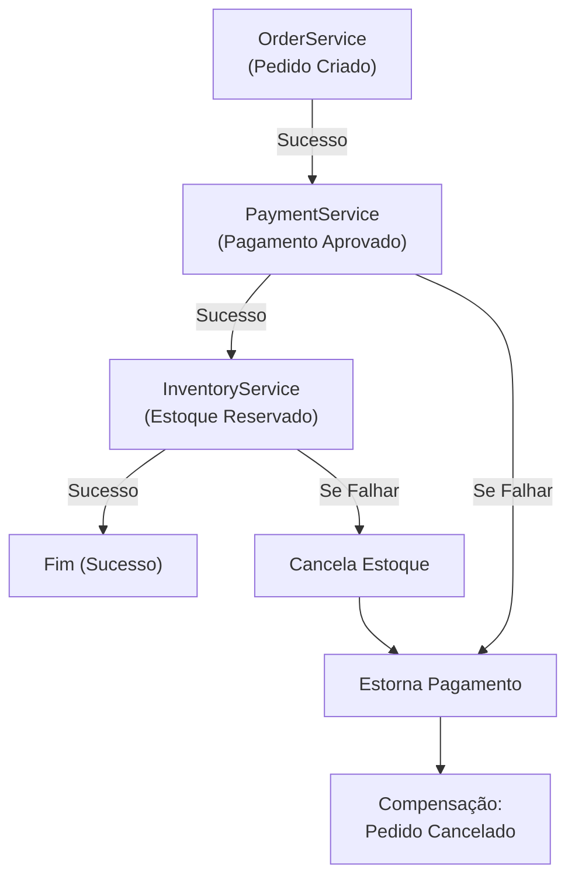

# 01. O Padrão Saga: Coreografia

## Objetivo
Ao final deste capítulo, você será capaz de explicar as limitações de transações atômicas distribuídas (protocolo 2PC) em arquiteturas de microserviços, descrever o funcionamento do padrão **Saga baseado em Coreografia**, projetar e implementar transações locais associadas a ações compensatórias, e analisar os desafios de depuração e rastreabilidade de fluxos coreografados.

---

## Motivação
Nos módulos anteriores, estudamos a consistência em nível de banco de dados e algoritmos de consenso (Raft). Porém, no mundo real das arquiteturas corporativas baseadas em microserviços, uma única transação de negócios (como a compra de um produto em um e-commerce) envolve múltiplos sistemas físicos e bancos de dados independentes:
1. O **Serviço de Pedidos** registra a compra.
2. O **Serviço de Pagamentos** cobra o cartão de crédito do cliente.
3. O **Serviço de Estoque** reserva o produto físico.

Tentar coordenar esses três serviços usando transações ACID distribuídas (como XA ou *Two-Phase Commit - 2PC*) exige travar registros em todos os bancos de dados simultaneamente na rede. Se o Serviço de Estoque demorar 5 segundos para responder, os bancos de Pedidos e Pagamentos ficarão bloqueados, gerando lentidão extrema e indisponibilidade total (violação do CAP/PACELC).

Para garantir a consistência final de negócios em alta escala, a indústria adota o **Padrão Saga**. Em vez de travas síncronas globais, dividimos a transação distribuída em uma sequência de **transações locais assíncronas**.

---

## Pré-requisitos
* [Módulo 3: Mensageria e Comunicação Assíncrona](./../03-messaging/README.md).
* [Módulo 4, Capítulo 01: O Teorema CAP e PACELC](./../04-replication-consistency/01-cap-pacelc-theorems.md).

---

## Conceitos Fundamentais

### 1. Limitações do Two-Phase Commit (2PC) em Microserviços
O protocolo 2PC exige que um coordenador pergunte a todos os nós se eles estão prontos para comitar (Fase de Preparação) e, após todos confirmarem, envie o comando final (Fase de Commit). 
* **Acoplamento Físico**: Se qualquer nó ficar lento ou inacessível, todo o cluster trava suas escritas mantendo locks ativos nos bancos de dados locais.
* **Incompatibilidade NoSQL**: Muitos bancos de dados modernos de alta escala (Cassandra, DynamoDB) não possuem suporte nativo a transações XA/2PC, impossibilitando sua adoção em ecossistemas heterogêneos.

---

### 2. O Padrão Saga
Uma Saga é um padrão arquitetural que modela uma transação distribuída como uma sequência de **transações locais independentes** em cada microserviço participante. 
* **Transação Local**: Cada serviço realiza sua gravação física local no seu banco de dados e publica um evento de sucesso (ou falha) na mensageria. O próximo serviço escuta o evento e executa sua respectiva transação local.
* **Consistência Eventual**: O sistema não é consistente a cada instante. Mas se todos os passos completarem, a consistência de negócios é atingida ao final.

---

### 3. Ações Compensatórias (Compensating Transactions)
E se o passo 1 (Pedido) e o passo 2 (Pagamento) funcionarem, mas o passo 3 (Reserva de Estoque) falhar por falta de itens físicos? Como não há rollback automático global entre bancos separados, a Saga deve executar **Transações Compensatórias** para desfazer logicamente os efeitos colaterais dos passos anteriores:
* O Serviço de Estoque publica um evento de falha.
* O Serviço de Pagamentos escuta essa falha e executa o estorno (*refund*) no cartão do cliente.
* O Serviço de Pedidos escuta a falha e marca o pedido como `CANCELADO`.

> [!IMPORTANT]
> **Definição de Compensação**: Uma transação compensatória é uma ação lógica de desfazer (ex: fazer um depósito de estorno para compensar um débito anterior). Ela deve ser projetada para ser **idempotente**, pois pode ser retransmitida pela mensageria sob falhas.

---

### 4. Saga baseada em Coreografia (Choreography)
Na abordagem por Coreografia, não existe um coordenador centralizado ou ponto único de decisão. Os microserviços interagem de forma puramente descentralizada, reagindo a eventos publicados nos tópicos da mensageria (como no Kafka ou RabbitMQ).



* **Happy Path (Fluxo de Sucesso)**:
  1. `OrderService` cria pedido pendente e emite `OrderCreatedEvent`.
  2. `PaymentService` consome o evento, cobra o cliente e emite `PaymentApprovedEvent`.
  3. `InventoryService` consome o evento, reserva itens no depósito físico e emite `InventoryReservedEvent`. A Saga encerra com sucesso.

* **Failure Path (Fluxo de Falha com Compensação)**:
  1. `OrderService` cria pedido e emite `OrderCreatedEvent`.
  2. `PaymentService` cobra o cliente e emite `PaymentApprovedEvent`.
  3. `InventoryService` tenta reservar itens, mas descobre que o estoque zerou. Ele emite `InventoryFailedEvent`.
  4. `PaymentService` escuta `InventoryFailedEvent` e realiza o estorno financeiro no banco, emitindo `PaymentRefundedEvent`.
  5. `OrderService` escuta `InventoryFailedEvent` e marca o pedido local como `CANCELADO`.

---

## Funcionamento Interno
Cada microserviço é responsável por persistir localmente o estado de suas transações locais associadas a um ID de correlação global (*Correlation ID* ou *Trace ID*) que acompanha todos os eventos da Saga, permitindo rastrear o fluxo completo em sistemas de logs centralizados.

---

## Exemplos

### Simulação em Kotlin de Saga Coreografada com Ações Compensatórias
O código abaixo simula os fluxos de sucesso e de falhas com compensação lógica descentralizada de forma pura.

```kotlin
// ARQUIVO: ChoreographedSagaSimulator.kt
package com.distribuidos.saga

import java.util.UUID

// Eventos que trafegam na mensageria
data class OrderEvent(val sagaId: UUID, val orderId: String, val amount: Double)
data class PaymentEvent(val sagaId: UUID, val orderId: String, val success: Boolean)
data class InventoryEvent(val sagaId: UUID, val orderId: String, val success: Boolean)

class OrderService(private val eventBus: MockEventBus) {
    private val ordersDb = mutableMapOf<String, String>() // ID -> Status

    fun createOrder(orderId: String, amount: Double) {
        val sagaId = UUID.randomUUID()
        ordersDb[orderId] = "PENDING"
        println("[ORDER-SERVICE] Pedido $orderId criado com status PENDING. Saga ID: $sagaId")
        
        // Emite evento inicial
        eventBus.publishOrderCreated(OrderEvent(sagaId, orderId, amount))
    }

    fun handleInventoryFailed(sagaId: UUID, orderId: String) {
        // Ação compensatória final local
        ordersDb[orderId] = "CANCELLED"
        println("[ORDER-SERVICE] COMPENSAÇÃO APLICADA: Pedido $orderId marcado como CANCELLED.")
    }

    fun handleInventorySuccess(sagaId: UUID, orderId: String) {
        ordersDb[orderId] = "COMPLETED"
        println("[ORDER-SERVICE] Pedido $orderId atualizado para COMPLETED.")
    }
}

class PaymentService(private val eventBus: MockEventBus) {
    fun processPayment(event: OrderEvent) {
        // Simulação de negócio de cobrança
        val paymentSuccess = event.amount < 1000.0 // Falha compras acima de USD 1000
        
        if (paymentSuccess) {
            println("[PAYMENT-SERVICE] Pagamento aprovado de USD ${event.amount} para o Pedido ${event.orderId}")
            eventBus.publishPaymentApproved(PaymentEvent(event.sagaId, event.orderId, true))
        } else {
            println("[PAYMENT-SERVICE] Falha de limite financeiro para o Pedido ${event.orderId}")
            eventBus.publishPaymentFailed(PaymentEvent(event.sagaId, event.orderId, false))
        }
    }

    fun refundPayment(sagaId: UUID, orderId: String) {
        // Ação compensatória local
        println("[PAYMENT-SERVICE] COMPENSAÇÃO APLICADA: Estorno efetuado no cartão para Pedido $orderId.")
    }
}

class InventoryService(private val eventBus: MockEventBus) {
    fun reserveInventory(event: PaymentEvent) {
        // Simulação de reserva física de itens (Simula falha aleatória de item sem estoque)
        val hasStock = event.orderId != "item-indisponivel"

        if (hasStock) {
            println("[INVENTORY-SERVICE] Estoque reservado com sucesso para Pedido ${event.orderId}")
            eventBus.publishInventorySuccess(InventoryEvent(event.sagaId, event.orderId, true))
        } else {
            println("[INVENTORY-SERVICE] Erro: Sem estoque físico para o pedido ${event.orderId}")
            eventBus.publishInventoryFailed(InventoryEvent(event.sagaId, event.orderId, false))
        }
    }
}

// Canal físico centralizado simulado
class MockEventBus {
    lateinit var orderService: OrderService
    lateinit var paymentService: PaymentService
    lateinit var inventoryService: InventoryService

    fun publishOrderCreated(event: OrderEvent) {
        paymentService.processPayment(event)
    }

    fun publishPaymentApproved(event: PaymentEvent) {
        inventoryService.reserveInventory(event)
    }

    fun publishPaymentFailed(event: PaymentEvent) {
        orderService.handleInventoryFailed(event.sagaId, event.orderId)
    }

    fun publishInventorySuccess(event: InventoryEvent) {
        orderService.handleInventorySuccess(event.sagaId, event.orderId)
    }

    fun publishInventoryFailed(event: InventoryEvent) {
        // Notifica serviços anteriores para ativarem suas compensações locais
        paymentService.refundPayment(event.sagaId, event.orderId)
        orderService.handleInventoryFailed(event.sagaId, event.orderId)
    }
}

fun main() {
    val bus = MockEventBus()
    val order = OrderService(bus)
    val payment = PaymentService(bus)
    val inventory = InventoryService(bus)
    
    bus.orderService = order
    bus.paymentService = payment
    bus.inventoryService = inventory

    println("=== Caso 1: Fluxo de Sucesso ===")
    order.createOrder("ped-001", 150.0)

    println("\n=== Caso 2: Falha e Acionamento de Compensações ===")
    // "item-indisponivel" forçará falha no passo 3 (estoque) acionando estorno no passo 2 (pagamento)
    order.createOrder("item-indisponivel", 200.0)
}
```

---

## Casos de Uso
* **Uber**: O fluxo de solicitação de corrida envolve criar a viagem no serviço de viagens, faturar a corrida no serviço de pagamentos e despachar o motorista no serviço de despacho. A Uber utiliza Sagas assíncronas para garantir que, se nenhum motorista aceitar a corrida após 5 minutos, a Saga de cancelamento seja disparada estornando a pré-autorização de cartão de crédito de forma transparente.
* **E-commerce Globais**: Processamento de pedidos de grandes varejistas (Amazon, Magazine Luiza).

---

## Quando Utilizar Saga por Coreografia
* Sagas curtas e simples (de 2 a 4 passos de transações locais).
* Equipes descentralizadas e independentes que não querem depender de um orquestrador central mantido por outro time.

---

## Quando Não Utilizar Saga por Coreografia
* Sagas complexas contendo muitos passos e lógica condicional avançada de negócios (ex: mais de 5 passos). Sem um coordenador, o fluxo torna-se um "emaranhado de eventos" (spaghetti architecture), dificultando visualizar quais serviços respondem a quais mensagens e rastrear em qual etapa a transação falhou em produção.

---

## Vantagens
* **Sem Ponto Único de Falha**: Não existe um orquestrador central gargalo ou gargalo de escalabilidade.
* **Desacoplamento de Desenvolvimento**: Serviços adicionais podem se plugar ao fluxo simplesmente assinando eventos existentes, sem alterar regras do código central.

---

## Desvantagens
* **Complexidade de Entendimento**: Dificuldade de compreender o fluxo completo de transação apenas analisando o código de um microserviço.
* **Risco de Loops Cíclicos de Eventos**: Erros de design onde o Serviço A reage ao Serviço B, que reage ao Serviço A, gerando loops infinitos de disparos de eventos de compensação na rede.

---

## Comparações

### 2PC (Two-Phase Commit) vs. Padrão Saga

| Característica | 2PC (Transação Distribuída) | Padrão Saga (Consistência Eventual) |
|---|---|---|
| **Garantia de Consistência** | Forte (ACID Global) | Eventual (BASE) |
| **Bloqueio de Recursos** | Sim (locks ativos até o commit final) | Não (locks apenas na transação local rápida) |
| **Escalabilidade física** | Baixa (limitada por latências de rede) | Altíssima (assíncrona e desacoplada) |
| **Facilidade de Código** | Automático pelo framework de XA | Complexo (compensações lógicas explícitas) |

---

## Erros Comuns
1. **Compensações Não-Idempotentes**: Implementar ações compensatórias simples do tipo `debitar(amount)`. Se o evento for retransmitido devido a retries automáticos da rede do Kafka/RabbitMQ, a compensação rodará duas vezes, gerando cobranças incorretas de contabilidade.
2. **Ignorar IDs de Correlação (Correlation IDs)**: Disparar mensagens na coreografia sem um cabeçalho comum de identificação único da transação distribuída, impossibilitando rastrear logs e rastreabilidade (*tracing*) em produção.

---

## Projeto Prático
No projeto **FinTech Ledger**, projetamos a simulação do fluxo de limite de crédito coreografado.
Ao iniciar uma transferência no Ledger, o `LimitService` valida e debita o limite diário da conta do cliente e emite o evento `LimitReservedEvent`. O `LedgerService` escuta e aplica o débito. Se o Ledger rejeitar a operação por saldo insuficiente de saldo, o `LimitService` receberá o evento de falha e executará a ação compensatória de devolver o limite reservado daquele cliente de forma assíncrona.

```kotlin
// ARQUIVO: ChoreographedLedgerSaga.kt
package com.distribuidos.projeto.saga

import com.distribuidos.projeto.TransactionResult
import java.util.UUID

class LimitService {
    private val limits = mutableMapOf("conta-01" to 500.0)

    fun reserveLimit(accountId: String, amount: Double): Boolean {
        val current = limits[accountId] ?: 0.0
        return if (current >= amount) {
            limits[accountId] = current - amount
            println("[LIMIT-SERVICE] Limite diário reservado: conta $accountId, limite restante: ${limits[accountId]}")
            true
        } else {
            false
        }
    }

    // Ação compensatória acionada sob falha do Ledger
    fun restoreLimitCompensate(accountId: String, amount: Double) {
        val current = limits[accountId] ?: 0.0
        limits[accountId] = current + amount
        println("[LIMIT-SERVICE] COMPENSAÇÃO: Limite devolvido para conta $accountId, novo limite: ${limits[accountId]}")
    }
}
```

---

## Exercícios

### Básico
1. Por que transações baseadas no protocolo 2PC (Two-Phase Commit) prejudicam a escalabilidade física e disponibilidade de ecossistemas de microserviços?
2. Defina o conceito de "Transação Compensatória" no padrão Saga.

### Intermediário
3. Imagine uma Saga coreografada de reserva de passagens aéreas e hotel. Desenhe um diagrama de sequência UML detalhado ilustrando o fluxo de falha caso a reserva de hotel seja recusada por indisponibilidade de quartos físicos.

### Avançado
4. Escreva um programa simulador completo em Kotlin onde 3 microserviços comunicam-se de forma assíncrona coreografada usando corrotinas de Kotlin (simulando filas de mensageria). O programa deve simular falhas em diferentes etapas e verificar se todas as ações compensatórias são devidamente ativadas e concluídas de forma consistente.

---

## Perguntas de Entrevista
1. **O padrão Saga garante o isolamento transacional (o "I" de ACID) no nível do cluster? Como o fenômeno de "Leituras Sujas" (Dirty Reads) se manifesta em Sagas e como a aplicação deve tratar essa vulnerabilidade lógica de negócios?**
   * *Resposta esperada*: Não. O padrão Saga baseia-se em consistência eventual e **não garante isolamento transacional em nível global**. Como cada microserviço comita sua transação local imediatamente no banco de dados, os efeitos parciais de uma Saga em andamento são visíveis para outras transações paralelas (Leitura Suja). Por exemplo, se o Passo 1 comitar o Pedido e o Passo 2 comitar o Pagamento, outro processo paralelo de auditoria lerá que o pagamento está aprovado, mesmo que a Saga venha a falhar no Passo 3 e seja estornada segundos depois. Para mitigar essa falta de isolamento, a aplicação deve adotar defesas de design como:
     * **Semantic Lock**: Marcar os registros locais como estados transitórios bloqueados (ex: `PENDING_APPROVAL` ou `RESERVING`). A aplicação impede que outras regras críticas de negócio operem sobre registros nesse estado pendente até a conclusão ou cancelamento final da Saga.
     * **Pessimistic updates / Compensations awareness**: Projetar a lógica de negócios para tolerar reversões, aceitando que o saldo pode flutuar de forma compensatória.

2. **Como o uso de UUIDs como Correlation IDs e a integração com sistemas de Rastreamento Distribuído (como Jaeger ou Zipkin) resolvem o problema de depuração (debugging) de Sagas baseadas em Coreografia de alta escala em produção?**
   * *Resposta esperada*: Em Sagas por coreografia de alta escala, centenas de milhares de eventos trafegam de forma assíncrona e desordenada pelos tópicos do Kafka/RabbitMQ. Se um pedido de cliente falhar silenciosamente no meio do caminho, depurar a causa lendo logs isolados de múltiplos servidores é impossível. Ao iniciar a Saga, geramos um UUID único global que atua como `Correlation ID` (ou `Trace ID`). Esse ID é obrigatoriamente injetado nos cabeçalhos de todas as mensagens e gravado em todos os logs de banco de dados e arquivos de logs de execução dos microserviços. Ferramentas de rastreamento distribuído (como OpenTelemetry/Jaeger) interceptam esses metadados nos sockets e reconstroem de forma visual toda a árvore de causa e efeito da transação distribuída, exibindo a latência e erros de cada salto de serviço, permitindo localizar instantaneamente qual nó causou a falha ou o atraso da transação.

---

## Resumo
* O padrão Saga substitui transações atômicas pesadas de rede (2PC) por sequências de transações locais assíncronas de consistência eventual.
* Transações Compensatórias desfazem logicamente o estado alterado em serviços anteriores sob falhas da Saga, devendo ser projetadas de forma idempotente.
* A Coreografia realiza o fluxo de forma puramente descentralizada baseada em eventos, sendo ideal para Sagas curtas mas complexa de rastrear sem Correlation IDs robustos.

---

## Próximo Capítulo
No [Capítulo 02: O Padrão Saga: Orquestração e Ações Compensatórias](./02-saga-orchestration.md), estudaremos a alternativa centralizada de Sagas: o padrão baseado em Orquestração, analisando o papel do coordenador de processos (*Saga Execution Coordinator*) e a mitigação da complexidade de controle de fluxos heterogêneos.

---

## Referências
* **Sagas**, Hector Garcia-Molina e Kenneth Salem (1987). ACM SIGMOD Record.
* **Designing Data-Intensive Applications**, Martin Kleppmann. Capítulo 12: *The Future of Data Systems* (Seção sobre *Distributed Transactions in Practice*).
* **Microservices Patterns: With examples in Java**, Chris Richardson. Capítulo 4: *Managing transactions with sagas*.