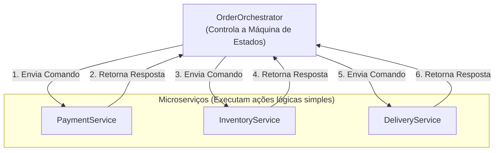

# 02. O Padrão Saga: Orquestração e Ações Compensatórias

## Objetivo
Ao final deste capítulo, você será capaz de conceituar a arquitetura de Saga baseada em Orquestração, projetar o papel e as responsabilidades do Coordenador de Execução de Saga (*Saga Execution Coordinator - SEC*), modelar transições de estados persistentes no orquestrador e programar fluxos transacionais com reversão centralizada em Kotlin.

---

## Motivação
No capítulo anterior, estudamos a Saga baseada em Coreografia. Embora seja uma abordagem desacoplada e descentralizada, sob fluxos de negócios complexos (ex: check-out de compras envolvendo regras condicionais de cupons, pontuação de programas de fidelidade, múltiplas transportadoras físicas e análises de fraude), a Coreografia rapidamente se transforma em um "emaranhado de eventos" (*event-spaghetti*). Torna-se muito difícil para as equipes de engenharia entenderem o fluxo completo de transação, depurarem erros parciais de produção ou alterarem as etapas de negócios.

Para centralizar a lógica de fluxo de trabalho (*workflow*) e tornar as transações distribuídas visíveis e auditáveis de forma simples, a indústria adota a **Saga baseada em Orquestração**.

---

## Pré-requisitos
* [Módulo 6, Capítulo 01: O Padrão Saga: Coreografia](./01-saga-choreography.md).

---

## Conceitos Fundamentais

### 1. Saga baseada em Orquestração (Orchestration)
Nesta abordagem, centralizamos a coordenação de todo o fluxo de trabalho em um único componente especializado chamado **Orchestrator** (ou *Saga Execution Coordinator - SEC*).
* **Mecanismo**: Os microserviços participantes da Saga tornam-se passivos em relação ao fluxo. Eles não sabem quais serviços vêm antes ou depois no processo. Eles apenas expõem endpoints de comandos locais (ex: `reservarEstoque()`) e respondem diretamente ao Orquestrador se o comando teve sucesso ou falha.
* **O Orquestrador**: Toma todas as decisões de controle de fluxo de forma sequencial. Ele diz quem deve executar o que e decide quando acionar as ações compensatórias sob falha de algum participante.



---

### 2. O Coordenador de Execução de Saga (SEC)
O SEC atua como uma máquina de estados finitos persistente. Para tolerar falhas de infraestrutura (ex: se o próprio container do Orquestrador sofrer crash no meio da transação), o SEC deve gravar o progresso atual da Saga em seu banco de dados persistente local antes de enviar comandos de rede para os participantes (padrão *State Log*).
* Ao reiniciar de um crash, o SEC lê seu diário de estados e retoma as transações distribuídas pendentes ou inicia as compensações de onde parou.

---

### 3. Motores de Fluxo de Trabalho Modernos (Workflow Engines)
Embora possamos programar Orquestradores simples em código personalizado da aplicação, a indústria adota ferramentas consolidadas de mercado para gerenciar Sagas complexas de produção:
* **Temporal.io**: Motor moderno de workflows baseado em código imperativo estruturado em Java, Go ou TypeScript. Ele garante persistência durável de threads de execução (liveness resiliente a quedas de servidores).
* **Netflix Conductor**: Orquestrador microserviços de alta escala baseado em definições JSON.
* **Camunda**: Orquestrador baseado no padrão BPMN visual.

---

## Funcionamento Interno
O Orquestrador envia comandos assíncronos via tópicos dedicados (ex: fila `payment-commands`) e assina filas de respostas (ex: fila `payment-replies`), usando o ID de correlação para reassociar a resposta ao fluxo correspondente.

---

## Exemplos

### Implementação de um Orquestrador de Saga em Kotlin
O código a seguir simula a classe centralizada `OrderSagaOrchestrator` coordenada através de uma máquina de estados simples.

```kotlin
// ARQUIVO: OrchestratedSagaSimulator.kt
package com.distribuidos.saga

import java.util.UUID

enum class SagaState { CREATED, PAYMENT_PENDING, INVENTORY_PENDING, COMPLETED, COMPENSATING, FAILED }

data class SagaContext(
    val sagaId: UUID,
    val orderId: String,
    val amount: Double,
    var state: SagaState = SagaState.CREATED
)

class OrderSagaOrchestrator(
    private val paymentClient: MockPaymentClient,
    private val inventoryClient: MockInventoryClient
) {
    private val sagaStore = mutableMapOf<UUID, SagaContext>()

    fun startSaga(orderId: String, amount: Double) {
        val sagaId = UUID.randomUUID()
        val context = SagaContext(sagaId, orderId, amount)
        sagaStore[sagaId] = context
        
        println("[ORCHESTRATOR] Iniciando Saga $sagaId para o Pedido $orderId. Estado: ${context.state}")
        
        // Passo 1: Dispara comando de pagamento
        context.state = SagaState.PAYMENT_PENDING
        println("[ORCHESTRATOR] Passo 1: Enviando comando de pagamento para Pedido $orderId")
        paymentClient.requestPayment(sagaId, amount) { success ->
            handlePaymentResponse(sagaId, success)
        }
    }

    private fun handlePaymentResponse(sagaId: UUID, success: Boolean) {
        val context = sagaStore[sagaId] ?: return
        
        if (success) {
            println("[ORCHESTRATOR] Pagamento aprovado com sucesso para Saga $sagaId.")
            // Passo 2: Dispara comando de estoque
            context.state = SagaState.INVENTORY_PENDING
            println("[ORCHESTRATOR] Passo 2: Enviando comando de reserva de estoque para Pedido ${context.orderId}")
            inventoryClient.requestInventory(sagaId, context.orderId) { invSuccess ->
                handleInventoryResponse(sagaId, invSuccess)
            }
        } else {
            // Falha no passo 1: Não há o que compensar ainda, apenas falha a Saga
            context.state = SagaState.FAILED
            println("[ORCHESTRATOR] SAGA FALHOU: Falha no pagamento. Saga encerrada.")
        }
    }

    private fun handleInventoryResponse(sagaId: UUID, success: Boolean) {
        val context = sagaStore[sagaId] ?: return

        if (success) {
            context.state = SagaState.COMPLETED
            println("[ORCHESTRATOR] SAGA FINALIZADA COM SUCESSO! Pedido ${context.orderId} concluído.")
        } else {
            println("[ORCHESTRATOR] Falha no estoque detectada. Iniciando compensações lógicas...")
            context.state = SagaState.COMPENSATING
            
            // Aciona compensações em ordem inversa
            paymentClient.requestRefund(sagaId, context.amount) {
                context.state = SagaState.FAILED
                println("[ORCHESTRATOR] SAGA REVERTIDA (COMPENSADA) COM SUCESSO no banco.")
            }
        }
    }
}

// Clientes simulados de chamadas assíncronas simples
class MockPaymentClient {
    fun requestPayment(sagaId: UUID, amount: Double, callback: (Boolean) -> Unit) {
        val success = amount < 1000.0 // Falha pagamentos de grande valor
        callback(success)
    }

    fun requestRefund(sagaId: UUID, amount: Double, callback: () -> Unit) {
        println("[PAYMENT-CLIENT] Executando compensação: Estorno efetuado de USD $amount.")
        callback()
    }
}

class MockInventoryClient {
    fun requestInventory(sagaId: UUID, orderId: String, callback: (Boolean) -> Unit) {
        val hasStock = orderId != "item-esgotado"
        callback(hasStock)
    }
}

fun main() {
    val payment = MockPaymentClient()
    val inventory = MockInventoryClient()
    val orchestrator = OrderSagaOrchestrator(payment, inventory)

    println("=== Caso 1: Sucesso ===")
    orchestrator.startSaga("ped-123", 450.0)

    println("\n=== Caso 2: Falha no Estoque acionando Compensação ===")
    orchestrator.startSaga("item-esgotado", 600.0)
}
```

---

## Casos de Uso
* **Netflix**: Utiliza o Netflix Conductor para orquestrar fluxos pesados de encode de vídeos, onde a conclusão do encode de áudio deve aguardar o encode de vídeo, disparando notificações apenas ao término.
* **Temporal.io**: Utilizado pela Uber, Stripe e Nubank para gerenciar lógicas transacionais complexas de negócios que exigem garantias rígidas de passos e durações de tempo longos.

---

## Quando Utilizar Saga por Orquestração
* Transações distribuídas complexas contendo muitos passos (5 ou mais participantes).
* Quando o fluxo de negócios envolve lógicas condicionais, loops ou decisões centralizadas.
* Necessidade de expor o progresso das transações em painéis de auditoria operacional simples.

---

## Quando Não Utilizar Saga por Orquestração
* Fluxos curtos com poucos passos. Introduzir um orquestrador central adiciona overhead de latência extra e complexidade desnecessária de banco de dados para a equipe gerenciar.

---

## Vantagens
* **Visibilidade Central**: Toda a lógica de negócios e as regras de controle do fluxo residem em um único código legível no orquestrador.
* **Sem Loops Cíclicos**: Como há um coordenador central decidindo as etapas, elimina-se o risco de loops infinitos de eventos concorrentes.
* **Desacoplamento de Participantes**: Microserviços não precisam assinar eventos uns dos outros, conhecendo apenas os comandos que recebem do orquestrador.

---

## Desvantagens
* **Ponto Único de Falha**: Se o orquestrador cair e não possuir resiliência de estado no banco, toda a operação da empresa trava.
* **Gargalo de Escrita**: Todas as interações trafegam pelo orquestrador, adicionando hops extras de rede e potenciais problemas de vazão.

---

## Comparações

### Coreografia vs. Orquestração

| Característica | Coreografia | Orquestração |
|---|---|---|
| **Coordenação** | Descentralizada (baseada em Eventos) | Centralizada (Orquestrador/SEC) |
| **Pontos de Falha** | Distribuído | Único (Orquestrador) |
| **Conhecimento do Fluxo**| Espalhado pelos serviços | Centralizado no código do orquestrador |
| **Uso Recomendado** | Fluxos simples (2 a 4 passos) | Fluxos complexos (5+ passos e condicionais) |

---

## Erros Comuns
1. **Colocar Regras de Domínio no Orquestrador**: Tentar validar regras de estoque ou calcular impostos dentro do código do orquestrador. O orquestrador deve agir apenas como coordenador de roteamento físico; as regras de negócio devem residir exclusivamente dentro de seus respectivos microserviços.
2. **Orquestrador Sem Persistência**: Implementar a máquina de estados em memória do orquestrador em produção. Se o servidor sofrer reboot, todas as transações em andamento ficarão perdidas no limbo, gerando inconsistências severas de negócios nas bases das réplicas.

---

## Projeto Prático
No projeto **FinTech Ledger**, integramos a Saga Orquestrada na nossa API de transferências financeiras interbancárias.
Criamos o `TransferOrchestrator` que executa quatro etapas transacionais locais: 
1. Reserva o limite no `LimitService`.
2. Efetua o débito na conta local no `LedgerService`.
3. Efetua o crédito no banco de destino através da chamada gRPC.
Se o crédito falhar por timeout ou recusa do banco externo, o Orquestrador comanda as compensações revertendo o débito local e restaurando o limite do cliente de forma consistente.

```kotlin
// ARQUIVO: TransferOrchestrator.kt
package com.distribuidos.projeto.saga

import com.distribuidos.projeto.TransactionResult
import java.util.UUID

class TransferOrchestrator(
    private val limitService: LimitService,
    private val ledgerBalance: MutableMap<String, Double>
) {
    fun executeTransfer(from: String, to: String, amount: Double): TransactionResult {
        val sagaId = UUID.randomUUID()
        println("[ORCHESTRATOR] Iniciando Saga de Transferência Interbancária: $sagaId")

        // Passo 1: Reserva limite diário
        val limitOk = limitService.reserveLimit(from, amount)
        if (!limitOk) {
            return TransactionResult.Failed("Limite diário excedido.")
        }

        // Passo 2: Executa débito local
        var debitSuccess = false
        val current = ledgerBalance[from] ?: 0.0
        if (current >= amount) {
            ledgerBalance[from] = current - amount
            debitSuccess = true
            println("[ORCHESTRATOR] Passo 2: Débito efetuado no Ledger local de $from. Novo saldo: ${ledgerBalance[from]}")
        }

        if (!debitSuccess) {
            // Falha: Compensa o limite
            limitService.restoreLimitCompensate(from, amount)
            return TransactionResult.Failed("Saldo insuficiente no Ledger local.")
        }

        // Passo 3: Chamada externa para banco destino (Simula falha física de timeout de rede)
        val targetBankSuccess = amount < 5000.0 // Transferências acima de 5000 falham externamente

        if (targetBankSuccess) {
            println("[ORCHESTRATOR] Passo 3: Crédito efetuado com sucesso no banco externo para $to.")
            return TransactionResult.Success(sagaId.toString(), System.currentTimeMillis())
        } else {
            // Falha física: Aciona as compensações em ordem inversa
            println("[ORCHESTRATOR] Falha no banco de destino externo! Iniciando reversões de segurança...")
            
            // Reverte Passo 2: Devolve dinheiro
            val currentBal = ledgerBalance[from] ?: 0.0
            ledgerBalance[from] = currentBal + amount
            println("[ORCHESTRATOR] COMPENSAÇÃO: Saldo do Ledger devolvido para $from. Novo saldo: ${ledgerBalance[from]}")
            
            // Reverte Passo 1: Devolve limite
            limitService.restoreLimitCompensate(from, amount)

            return TransactionResult.Failed("Transação recusada pelo banco externo de destino.")
        }
    }
}
```

---

## Exercícios

### Básico
1. Qual o papel do Coordenador de Execução de Saga (SEC) na abordagem por Orquestração?
2. Por que o orquestrador de Saga precisa registrar seu estado de progresso em um banco de dados persistente antes de disparar comandos de rede?

### Intermediário
3. Projete as transições de estados de uma máquina de estados do orquestrador de compra de pacotes turísticos (reserva voo, reserva hotel, aluguel de carro). Desenhe a máquina de estados ilustrando os fluxos de sucesso e reversão completa.

### Avançado
4. Escreva uma classe orquestradora resiliente em Kotlin que simule falha física no próprio processo do orquestrador (simulando interrupção de thread). O orquestrador deve ler seu estado de progresso simulado em um banco de dados em memória e demonstrar que consegue **retomar o fluxo de compensações ou commits exatamente do ponto de interrupção**, garantindo a consistência final das contas.

---

## Perguntas de Entrevista
1. **Como a ferramenta Temporal.io garante a resiliência durável de fluxos de trabalho (Workflow Durability) sem exigir que o desenvolvedor programe explicitamente a escrita manual de estados da Saga a cada passo de execução no banco de dados?**
   * *Resposta esperada*: O Temporal.io utiliza a técnica de **Event Sourcing de Workflow e Replay**. Em vez de exigir que o desenvolvedor grave manualmente o estado físico da máquina de estados do orquestrador, a SDK do Temporal intercepta todas as chamadas críticas de rede executadas pelo código do workflow (chamadas chamadas de *Activities*). O Temporal Server registra essas chamadas e seus respectivos resultados em um log de eventos histórico central. Se o servidor que roda o código do orquestrador sofrer crash, o Temporal spawna o workflow em outra máquina saudável e executa o código novamente desde o início (Replay). Durante o Replay, a SDK intercepta as chamadas de Activities já executadas e retorna instantaneamente as respostas salvas no log histórico de eventos sem disparar chamadas de rede reais redundantes, reconstruindo o estado exato da thread da JVM de forma transparente até o ponto de interrupção, onde retoma a execução normal.

2. **Como a separação de responsabilidades (Separation of Concerns) é afetada negativamente quando desenvolvedores programam lógicas de negócios internas do domínio dentro de classes orquestradoras e como prevenir esse antipadrão?**
   * *Resposta esperada*: Quando colocamos lógicas de negócios (ex: cálculo de juros ou regras de descontos de cupons) dentro do orquestrador, geramos acoplamento indevido e vazamento de domínio, transformando o orquestrador em um monólito de orquestração logicamente dependente de alterações constantes. Isso impede que os serviços individuais evoluam de forma independente. Para prevenir, o orquestrador deve seguir o princípio de "Inteligência nos Endpoints, Roteamento Burro". Ele deve apenas definir a ordem cronológica de passos físicos da transação e gerenciar as chamadas de rede e tratamento de erros. A validação lógica, cálculos e atualizações de domínio devem ocorrer exclusivamente dentro dos endpoints e limites dos microserviços de negócios, que apenas retornam respostas do tipo sucesso/erro para o orquestrador de fluxo.

---

## Resumo
* A Saga por Orquestração utiliza um coordenador centralizado (SEC) para controlar toda a máquina de estados da transação distribuída de forma legível e ordenada.
* O SEC deve persistir seu estado operacional em diários de log físicos locais para tolerar falhas de hardware no próprio orquestrador.
* Orquestração é indicada para transações longas e complexas, evitando emaranhados de eventos e simplificando o rastreamento em produção.

---

## Próximo Capítulo
No [Capítulo 03: Introdução a Event Sourcing e CQRS](./03-event-sourcing-cqrs.md), encerraremos o Módulo 6 estudando os padrões avançados de persistência baseados em logs de eventos imutáveis (Event Sourcing) e separação de modelos de escrita e leitura de dados (CQRS).

---

## Referências
* **Netflix Conductor Architecture**: [Official Netflix design documentation](https://conductor.netflix.com/).
* **Temporal.io Concepts**: [Workflows and Activities model](https://docs.temporal.io/concepts/).
* **Enterprise Integration Patterns**, Gregor Hohpe. Capítulo 6: *Integration Patterns: Process Manager*.