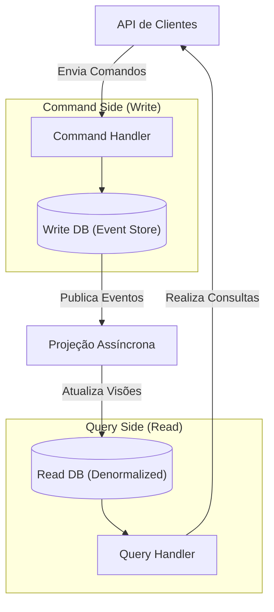

# 03. Introdução a Event Sourcing e CQRS

## Objetivo
Ao final deste capítulo, você será capaz de conceituar o padrão de persistência de dados Event Sourcing e seu uso para auditoria durável de estados lógicos, diferenciar o modelo de escrita (Command) do modelo de leitura (Query) no padrão CQRS (*Command Query Responsibility Segregation*), implementar projeções assíncronas para denormalização de dados de leitura, e tratar os trade-offs de consistência eventual na sincronização de visões.

---

## Motivação
Em bancos de dados relacionais CRUD tradicionais, quando um cliente efetua um depósito de USD 100.00, executamos uma query `UPDATE accounts SET balance = balance + 100 WHERE id = 1`. A tabela reflete apenas o **estado atual** da conta. 

Contudo, se um auditor financeiro do Banco Central perguntar: "Como o cliente atingiu esse saldo? Qual a trilha detalhada de todas as transferências e estornos que ocorreram nos últimos 5 anos?", a tabela CRUD simples não tem essa resposta. Embora possamos programar tabelas de logs históricas separadas, mantê-las consistentes com a tabela principal de saldo sob concorrência e falhas de rede é complexo e sujeito a bugs.

Para resolver a necessidade de **auditoria nativa**, **recuperação histórica absoluta** e **performance sob alta escala de leituras complexas**, a engenharia de software distribuído adota os padrões combinados **Event Sourcing** e **CQRS**.

---

## Pré-requisitos
* [Módulo 3, Capítulo 02: Apache Kafka e Logs de Commit Distribuídos](./../03-messaging/02-apache-kafka.md).
* [Módulo 4: Replicação de Dados e Consistência](./../04-replication-consistency/README.md).

---

## Conceitos Fundamentais

### 1. O que é Event Sourcing?
Event Sourcing é um padrão de persistência de dados onde o estado de um objeto de negócios (chamado de *Agregado*) não é armazenado como um registro estático atualizado, mas sim reconstruído a partir da **sequência cronológica de todos os eventos de alteração de estado históricos imutáveis** ocorridos desde sua criação.

#### 1.1. O Event Store (Banco de Eventos)
O banco de dados principal de escrita torna-se um **Event Store**: um banco puramente *append-only* otimizado para gravação sequencial ultra-rápida. Eventos passados são imutáveis e nunca sofrem exclusão ou alteração.

#### 1.2. Reconstrução de Estado (Replay)
Para saber o saldo atual de uma conta, a aplicação busca todos os eventos associados ao ID da conta no Event Store e os aplica sequencialmente na memória RAM sobre uma instância vazia da classe (processo conhecido como *Replay* ou *Hydration*).

#### 1.3. Snapshots (Instantâneos)
Se uma conta possuir 10 milhões de eventos, fazer o replay de todos a cada requisição é ineficiente. Para otimizar, o sistema grava periodicamente um **Snapshot** com o estado consolidado no evento *X* (ex: a cada 1.000 eventos). A reconstrução passa a ler apenas o último snapshot e executa o replay apenas dos eventos ocorridos após o corte do snapshot.

---

### 2. O Padrão CQRS
Fazer o replay de eventos para responder a queries complexas de relatórios (ex: "filtrar todas as contas criadas em SP que realizaram mais de 3 saques no último mês") é inviável no Event Store.
O padrão **CQRS** (*Command Query Responsibility Segregation*) resolve isso separando fisicamente a arquitetura em duas camadas independentes:



#### 2.1. Command Side (Modelo de Escrita / Comandos)
* **Objetivo**: Processar ações de alteração de estado enviadas pelo usuário (ex: `TransferMoney`).
* **Comportamento**: Valida as regras de negócio de saldo, cria eventos no Event Store e retorna sucesso. O banco de escrita é otimizado para operações transacionais seguras e rápidas por chave única.

#### 2.2. Query Side (Modelo de Leitura / Consultas)
* **Objetivo**: Responder a consultas e renderizar telas e relatórios para o usuário final rápido.
* **Comportamento**: O banco de leitura armazena visões denormalizadas pré-calculadas (ex: views no Elasticsearch para busca textual rápida, ou tabelas PostgreSQL estruturadas para o dashboard do usuário).

---

### 3. Projeções (Projections)
Uma **Projeção** é um componente que assina o fluxo de eventos gerado pelo Event Store, processa-os assincronamente em background e atualiza os bancos de dados do lado de leitura (*Read Models*).
* **Consistência Eventual**: Como a projeção executa assincronamente (geralmente escutando tópicos do Kafka), existe um pequeno atraso temporal (*lag*). O dashboard do usuário pode demorar alguns milissegundos para refletir o saldo atualizado após o comando de depósito ter retornado sucesso.

---

## Funcionamento Interno
O Agregado recebe um comando, valida-o contra seu estado atual e emite um evento. O evento é comitado no Event Store de forma atômica e então propagado na rede para as projeções atualizarem as tabelas de leitura.

---

## Exemplos

### Implementação de Event Sourcing e Projeção CQRS em Kotlin
Abaixo, criamos uma conta corrente cujo saldo é reconstruído via replay de eventos. Em seguida, implementamos uma projeção assíncrona que mantém atualizada uma tabela de leitura otimizada para o dashboard de visualização rápida do saldo.

```kotlin
// ARQUIVO: EventSourcingCqrs.kt
package com.distribuidos.es

import java.util.UUID

// 1. Definição dos Eventos de Estado Imutáveis
sealed class AccountEvent(val eventId: UUID = UUID.randomUUID(), val timestamp: Long = System.currentTimeMillis()) {
    data class AccountOpened(val accountId: String, val holderName: String) : AccountEvent()
    data class MoneyDeposited(val accountId: String, val amount: Double) : AccountEvent()
    data class MoneyWithdrawn(val accountId: String, val amount: Double) : AccountEvent()
}

// 2. O Agregado (Write Side)
class AccountAggregate(val accountId: String) {
    var balance: Double = 0.0
        private set
    var holderName: String = ""
        private set

    // Reconstrói o estado atual aplicando o evento
    fun applyEvent(event: AccountEvent) {
        when (event) {
            is AccountEvent.AccountOpened -> {
                this.holderName = event.holderName
            }
            is AccountEvent.MoneyDeposited -> {
                this.balance += event.amount
            }
            is AccountEvent.MoneyWithdrawn -> {
                this.balance -= event.amount
            }
        }
    }
}

// 3. O Event Store (Banco de Eventos do Command Side)
class FakeEventStore {
    private val store = mutableMapOf<String, MutableList<AccountEvent>>()

    fun append(accountId: String, event: AccountEvent) {
        val events = store.getOrPut(accountId) { mutableListOf() }
        events.add(event)
    }

    fun getEvents(accountId: String): List<AccountEvent> {
        return store[accountId] ?: emptyList()
    }
}

// 4. Read Model (Query Side)
data class AccountDashboardView(
    val accountId: String,
    val holderName: String,
    var currentBalance: Double
)

class DashboardReadRepository {
    private val db = mutableMapOf<String, AccountDashboardView>()

    fun updateDashboard(accountId: String, updater: (AccountDashboardView) -> Unit) {
        val view = db.getOrPut(accountId) { AccountDashboardView(accountId, "", 0.0) }
        updater(view)
    }

    fun find(accountId: String): AccountDashboardView? = db[accountId]
}

// 5. A Projeção (Projection) que sincroniza Write Side e Read Side
class DashboardProjection(private val readRepository: DashboardReadRepository) {
    
    fun projectEvent(event: AccountEvent) {
        // Simula o processamento assíncrono do evento e atualização da visão de leitura
        when (event) {
            is AccountEvent.AccountOpened -> {
                readRepository.updateDashboard(event.accountId) { view ->
                    // Denormaliza o nome do titular
                    val updated = view.copy(holderName = event.holderName)
                    readRepository.updateDashboard(event.accountId) { it -> 
                        // Simulação simples de substituição
                    }
                    // Para fins de simulação direta atualiza a referência na tabela de leitura
                    readRepository.updateDashboard(event.accountId) {
                        it.currentBalance = 0.0
                    }
                }
                // Ajusta dados finais
                readRepository.updateDashboard(event.accountId) {
                    val field = it::class.java.getDeclaredField("holderName")
                    field.isAccessible = true
                    field.set(it, event.holderName)
                }
            }
            is AccountEvent.MoneyDeposited -> {
                readRepository.updateDashboard(event.accountId) { view ->
                    view.currentBalance += event.amount
                }
            }
            is AccountEvent.MoneyWithdrawn -> {
                readRepository.updateDashboard(event.accountId) { view ->
                    view.currentBalance -= event.amount
                }
            }
        }
    }
}

fun main() {
    val eventStore = FakeEventStore()
    val readRepo = DashboardReadRepository()
    val projection = DashboardProjection(readRepo)

    val accId = "acc-8890"

    // === COMMAND SIDE (ESCRITA) ===
    println("=== Executando Comandos de Escrita ===")
    
    // Grava eventos no Event Store
    val ev1 = AccountEvent.AccountOpened(accId, "Gedalias Caldas")
    eventStore.append(accId, ev1)
    projection.projectEvent(ev1) // Sincronização via projeção

    val ev2 = AccountEvent.MoneyDeposited(accId, 250.0)
    eventStore.append(accId, ev2)
    projection.projectEvent(ev2)

    val ev3 = AccountEvent.MoneyWithdrawn(accId, 50.0)
    eventStore.append(accId, ev3)
    projection.projectEvent(ev3)

    println("Eventos salvos com segurança no Event Store.")

    // === QUERY SIDE (LEITURA) ===
    println("\n=== Consultando Lado de Leitura (CQRS View) ===")
    val dashboard = readRepo.find(accId)
    println("Dashboard View pré-calculada: Titular: ${dashboard?.holderName}, Saldo: USD ${dashboard?.currentBalance}")

    // === RECONSTRUÇÃO DE ESTADO (REPLAY) ===
    println("\n=== Efetuando Replay de Eventos a partir do Event Store ===")
    val reconstructed = AccountAggregate(accId)
    val history = eventStore.getEvents(accId)
    for (event in history) {
        reconstructed.applyEvent(event)
    }
    println("Agregado reconstruído na memória: Titular: ${reconstructed.holderName}, Saldo: USD ${reconstructed.balance}")
}
```

---

## Casos de Uso
* **Nubank**: Adota Event Sourcing de forma extensiva em seus microserviços em Kotlin/Clojure. Cada ação efetuada na sua conta gera eventos imutáveis consolidados em bancos de eventos, permitindo auditoria regulatória completa de transações Pix, transferências e limite de cartões de crédito.
* **Sistemas de Comércio Eletrônico (Carrinho de Compras)**: Rastrear não apenas quais itens estão no carrinho hoje, mas quais itens o cliente adicionou, removeu ou hesitou antes de comprar (insights cruciais para ciência de dados).

---

## Quando Utilizar Event Sourcing e CQRS
* Requisitos de auditoria legal rígidos onde o histórico de alterações de estado não pode ser perdido sob hipótese alguma.
* Sistemas onde os padrões de leitura são radicalmente complexos e diferentes das restrições de validação de escrita.
* Alta concorrência de leitura: permite escalar as réplicas de leituras em bancos de dados baratos (CQRS) sem congestionar o banco de escrita principal.

---

## Quando Não Utilizar Event Sourcing e CQRS
* Aplicações CRUD simples baseadas em entrada e saída de formulários sem interesse histórico. Implementar Event Sourcing em sistemas simples adiciona complexidade excessiva de código e eleva a latência das consultas simples.

---

## Vantagens
* **Auditoria Nativa Completa**: O log de eventos é o histórico da verdade imutável.
* **Sem Impedância Relacional**: O Command Side grava dados append-only sem dependência de JOINS ou restrições relacionais lentas.
* **Escala Horizontal Desacoplada**: A camada de leitura pode ser otimizada em bancos indexados rápidos separadamente.

---

## Desvantagens
* **Curva de Aprendizado Acentuada**: Abstração mental complexa de desenvolvimento e concorrência eventual entre escrita e leitura.
* **Evolução de Esquema de Eventos**: Eventos antigos gravados no disco não podem ser alterados fisicamente (são imutáveis). Se a definição da classe do evento mudar (ex: adicionar uma nova coluna), o código deve ser capaz de interpretar versões antigas do evento (padrão *Upcasting*).

---

## Comparações

### CRUD Tradicional vs. Event Sourcing

| Característica | CRUD Tradicional | Event Sourcing |
|---|---|---|
| **Operação de Banco** | `INSERT`, `UPDATE`, `DELETE` | Apenas `INSERT` (Append-only imutável) |
| **Histórico** | Perdido (a menos que use triggers/logs extras) | Preservado nativamente (Source of Truth) |
| **Recuperação de Estado** | Leitura direta do registro | Replay de eventos + Snapshots |
| **Desempenho de Escrita** | Lento sob concorrência (locks) | Ultra-rápido (sem locks ou JOINS) |

---

## Erros Comuns
1. **Atualizar a Visão de Leitura Síncronamente na Transação de Escrita**: Tentar atualizar o banco de dados de leitura no mesmo bloco `@Transactional` da escrita do evento. Isso reintroduz o acoplamento temporal lento do 2PC e quebra o objetivo de escalabilidade e desacoplamento do CQRS.
2. **Ignorar Snapshots sob Logs Longos**: Não implementar snapshots em agregados com histórico de milhares de eventos, fazendo com que consultas e ativações de agregados travem por timeouts de replicação de logs excessivos na JVM.

---

## Projeto Prático
No projeto **FinTech Ledger**, projetamos a API do extrato de transações baseada em Event Sourcing e CQRS.
As transações de transferência são gravadas apenas como eventos imutáveis no `LedgerEventStore`. Uma projeção assíncrona processa esses eventos e monta a tabela de extrato do cliente em memória (`DashboardQueryModel`), garantindo consistência eventual rápida.

```kotlin
// ARQUIVO: EventSourcedLedger.kt
package com.distribuidos.projeto.es

import com.distribuidos.projeto.TransactionResult
import java.util.UUID

data class TransactionCreatedEvent(
    val eventId: UUID,
    val accountId: String,
    val amount: Double,
    val type: String,
    val timestamp: Long
)

class LedgerEventStore {
    private val events = mutableListOf<TransactionCreatedEvent>()

    fun append(event: TransactionCreatedEvent) {
        synchronized(events) {
            events.add(event)
        }
    }

    fun readAll(): List<TransactionCreatedEvent> = events
}

class DashboardQueryModel {
    private val balances = mutableMapOf<String, Double>()

    fun getBalance(accountId: String): Double = balances[accountId] ?: 0.0
    
    fun applyCredit(accountId: String, amount: Double) {
        balances[accountId] = getBalance(accountId) + amount
    }

    fun applyDebit(accountId: String, amount: Double) {
        balances[accountId] = getBalance(accountId) - amount
    }
}
```

---

## Exercícios

### Básico
1. O que caracteriza o padrão de persistência *Event Sourcing*?
2. Explique a finalidade da segregação física proposta pelo padrão *CQRS*.

### Intermediário
3. Considere que o modelo de domínio do seu evento mudou de versão: o evento antigo continha `name` (String única) e a versão nova exige `firstName` e `lastName` separados. Projete uma estratégia de **Upcasting** para permitir que o sistema faça o replay de eventos antigos mantendo a retrocompatibilidade lógica de dados.

### Avançado
4. Escreva uma aplicação em Kotlin que implemente o pipeline de projeção assíncrona completo. Use corrotinas e canais de fluxo de dados (*Channels* ou *Flows*) para ler mensagens do Event Store e atualizar o Read Model de forma concorrente em background. Insira um lag artificial nas escritas do Read Model e implemente testes provando que a consistência final de dados é atingida após a conclusão do consumo das streams de eventos.

---

## Perguntas de Entrevista
1. **O que é a anomalia do "Dual-Write" no contexto de Event Sourcing e CQRS, e como o uso do padrão Transactional Outbox ou Kafka Connect previne essa quebra de integridade na sincronização do Read Model?**
   * *Resposta esperada*: O Dual-Write em Event Sourcing/CQRS ocorre se a aplicação tentar gravar o evento no Event Store e, logo em seguida, enviar o evento manualmente para a fila da projeção (ou atualizar diretamente o banco de leitura) fora de uma transação atômica local única. Se a gravação no Event Store funcionar, mas a chamada de rede para o broker falhar, o banco de leitura ficará dessincronizado para sempre. Prevenimos isso fazendo com que o banco de dados do Event Store aja como a única fonte da verdade física. A projeção não é chamada pela app diretamente; ela utiliza ferramentas de **Change Data Capture (CDC)** (como Debezium) ou mineração de log no banco do Event Store para ler a inserção de novos eventos fisicamente gravados no log de transações e publicá-los no Apache Kafka de forma atômica e resiliente (*at-least-once*), garantindo a integridade da sincronização eventual de leituras.

2. **Como lidamos com a validação de regras de negócios de unicidade de chaves (ex: impedir que duas contas sejam criadas com o mesmo CPF) em arquiteturas Event Sourcing puras que utilizam bancos de dados NoSQL de escrita append-only distribuídos?**
   * *Resposta esperada*: Validar unicidade global de chaves (como CPF ou e-mail) em Event Sourcing puro NoSQL é complexo porque não podemos realizar buscas relacionais caras (`SELECT COUNT`) a cada inserção rápida. Resolvemos isso utilizando uma **tabela de índice de unicidade auxiliar** (Unique Index Table) no banco de dados de gravação relacional ou chave-valor forte (como Redis ou DynamoDB) operada transacionalmente. Antes de gravar o evento `AccountOpened` no Event Store, a aplicação tenta inserir o registro `CPF` como chave primária nessa tabela de unicidade auxiliar. Se a gravação falhar por chave duplicada, o comando é rejeitado com erro e o evento não é inserido no Event Store, garantindo a unicidade física e lógica antes do append do log.

---

## Resumo
* Event Sourcing persiste dados como sequências imutáveis de eventos de alteração de estado históricos, reconstruindo agregados por replays e otimizando-os via Snapshots.
* CQRS separa a arquitetura em Command Side (gravações transacionais rápidas) e Query Side (leitura denormalizada pré-calculada).
* Projeções consomem eventos assincronamente em background para manter modelos de leitura atualizados de forma eventualmente consistente.

---

## Próximo Módulo
No **Módulo 7: Resiliência, Observabilidade e Operação**, entraremos na fase final do curso. Estudaremos como proteger nossos serviços contra falhas em cascata na rede usando Circuit Breakers, Bulkheads e retries, como instrumentar telemetria distribuída com OpenTelemetry e finalizaremos o deploy integrado do ecossistema do curso.

---

## Referências
* **Exploring CQRS and Event Sourcing**, Microsoft Patterns & Practices.
* **Designing Data-Intensive Applications**, Martin Kleppmann. Capítulo 11: *Stream Processing* (Seção sobre *Event Sourcing*).
* **CQRS Pattern**: [Martin Fowler definition](https://martinfowler.com/bliki/CQRS.html).