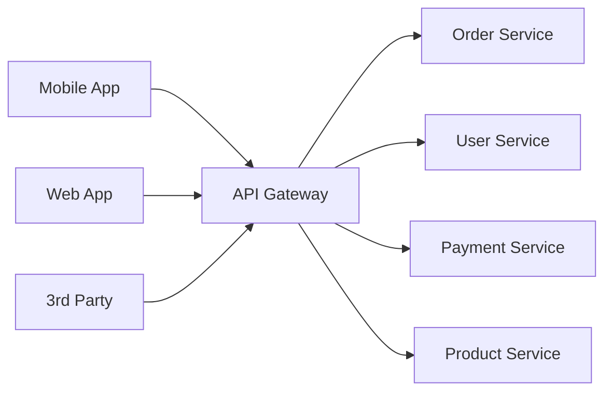
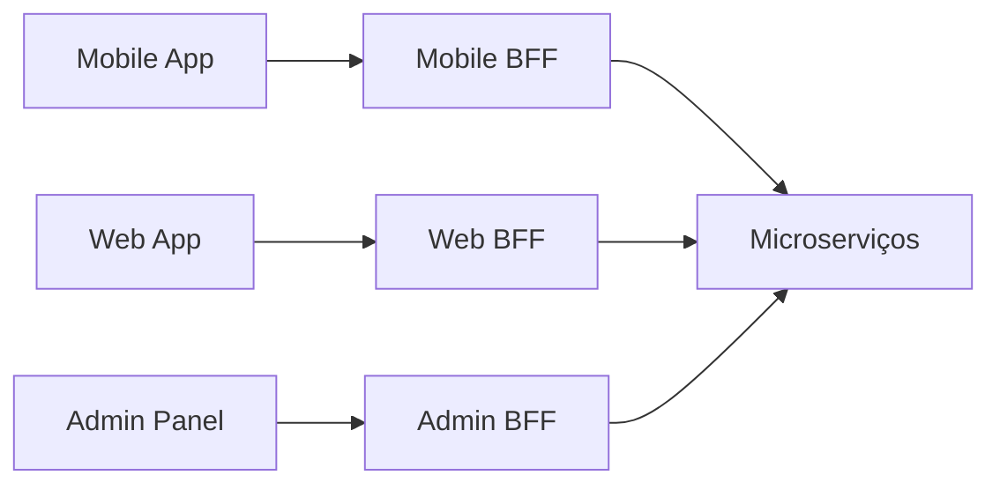

# API Gateway

## Objetivo
Compreender o papel do API Gateway como ponto de entrada único para microserviços, funcionalidades (roteamento, autenticação, rate limiting, agregação), e comparar soluções como Kong, Envoy, AWS API Gateway e Nginx.

---
## Pré-requisitos
- [Service Discovery](01-service-discovery.md)
- [REST e gRPC](../02-communication/02-rest-and-grpc.md)

---
## Conceitos Fundamentais

### O que é um API Gateway?

Ponto de entrada **único** para clientes, que roteia requests para microserviços internos.

### Funcionalidades

| Funcionalidade | Descrição |
|---------------|-----------|
| **Routing** | Roteia `/orders/*` → OrderService, `/users/*` → UserService |
| **Authentication** | Valida JWT/OAuth2 antes de encaminhar |
| **Rate Limiting** | Controla taxa de requisições por cliente |
| **SSL Termination** | Decripta HTTPS no gateway, HTTP interno |
| **Request Aggregation** | Combina respostas de múltiplos serviços em uma |
| **Protocol Translation** | REST externo → gRPC interno |
| **Caching** | Cache de respostas frequentes |
| **Logging/Tracing** | Ponto central de observabilidade |

### Backend for Frontend (BFF)

Em vez de um único gateway, criar um gateway **por tipo de cliente**:

Cada BFF otimiza payload e endpoints para seu cliente.

### Soluções

| Gateway | Tipo | Destaques |
|---------|------|-----------|
| **Kong** | Open-source | Plugins extensíveis, Lua, PostgreSQL |
| **Envoy** | Proxy L7 | Alto performance, gRPC nativo, Istio sidecar |
| **AWS API Gateway** | Managed | Serverless, Lambda integration |
| **Nginx** | Proxy/LB | Estável, battle-tested, configuração simples |
| **Traefik** | Cloud-native | Auto-discovery, Docker/K8s nativo |

---
## Erros Comuns
1. **Gateway fat**: Colocar lógica de negócio no gateway. Ele deve ser stateless e focado em cross-cutting concerns.
2. **Single point of failure**: Gateway sem redundância. Deploy em múltiplas instâncias com load balancer na frente.
3. **Não versionar a API**: `/v1/orders` → `/v2/orders`. O gateway facilita versionamento via routing.

---
## Perguntas de Entrevista
### Nível Senior
**P: Quais os riscos de usar um API Gateway?**
R: (1) SPOF: se o gateway cai, tudo cai. Mitigação: múltiplas instâncias + LB. (2) Bottleneck: todo tráfego passa por ele. Mitigação: escalar horizontalmente, cache. (3) Latência adicional: mais um hop de rede. Mitigação: colocação próxima aos serviços. (4) Complexidade operacional: mais um componente para operar, monitorar e fazer deploy.

---
## Referências
1. **Livro**: Richardson, C. (2018). *Microservices Patterns*, Cap. 8 — API Gateway
2. **Kong**: [konghq.com](https://konghq.com)
3. **Envoy**: [envoyproxy.io](https://www.envoyproxy.io)
4. **Tópicos relacionados**: [Service Discovery](01-service-discovery.md) | [Rate Limiting](../05-scalability/05-rate-limiting.md) | [Service Mesh](03-service-mesh.md)
