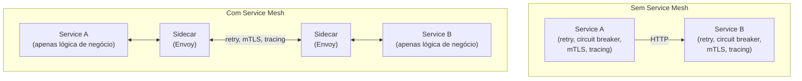

# Service Mesh

## Objetivo

Compreender o que é um Service Mesh, como ele abstrai a comunicação serviço-a-serviço via sidecar proxies, e quando Istio ou Linkerd são necessários versus quando são over-engineering.

---

## Pré-requisitos

- [Service Discovery](01-service-discovery.md)
- [API Gateway](02-api-gateway.md)
- [Circuit Breaker](../04-resilience/01-circuit-breaker.md)
- Conceitos de Kubernetes (pods, deployments)

---

## Conceitos Fundamentais

### O Problema

Em uma arquitetura de microserviços, cada serviço precisa implementar:

- mTLS (segurança)
- Retry + Circuit Breaker (resiliência)
- Load Balancing (distribuição)
- Distributed Tracing (observabilidade)
- Rate Limiting (proteção)

Implementar tudo isso em **cada serviço, em cada linguagem** é duplicação massiva e propensa a erros.

### A Solução: Service Mesh

Mover toda a lógica de comunicação para uma **camada de infraestrutura** que roda ao lado de cada serviço (sidecar proxy).



### Arquitetura

```mermaid
flowchart TD
    CP["Control Plane<br>(Istiod / linkerd)<br><br>- Configuração<br>- Certificados (mTLS)<br>- Políticas<br>- Service Discovery"]
    
    subgraph Data Plane [Data Plane (Sidecar Proxies)]
        direction LR
        P_A["Pod A: [App][Envoy]"]
        P_B["Pod B: [App][Envoy]"]
        P_C["Pod C: [App][Envoy]"]
    end
    
    CP -->|configura| Data Plane
```

- **Control Plane**: Cérebro do mesh. Distribui configuração, gerencia certificados, define políticas.
- **Data Plane**: Sidecar proxies (geralmente **Envoy**) que interceptam todo tráfego de rede do pod.

### Funcionalidades

| Funcionalidade | Descrição | Sem Mesh |
|---------------|-----------|----------|
| **mTLS automático** | Encriptação e autenticação entre todos os serviços | Implementar em cada serviço |
| **Traffic Management** | Canary deployments, traffic splitting, mirroring | Load balancer + feature flags |
| **Resiliência** | Retry, circuit breaker, timeout — configurados via YAML | Implementar em cada serviço |
| **Observabilidade** | Métricas, traces, logs — automaticamente coletados | Instrumentar cada serviço |
| **Authorization** | Políticas de acesso (quem pode chamar quem) | Implementar em cada serviço |
| **Rate Limiting** | Controle de taxa por serviço | Implementar em cada serviço |

### Istio vs Linkerd

| Aspecto | Istio | Linkerd |
|---------|-------|---------|
| **Proxy** | Envoy (C++) | linkerd2-proxy (Rust) |
| **Complexidade** | Alta (muitos CRDs, configuração) | Baixa (simple by design) |
| **Performance overhead** | ~3-5ms de latência por hop | ~1ms de latência por hop |
| **Features** | Completo (traffic mgmt, security, observability) | Essencial (mTLS, observability, retry) |
| **Memória por sidecar** | ~50-100MB | ~10-20MB |
| **Curva de aprendizado** | Íngreme | Suave |
| **Comunidade** | Google/IBM, maior ecossistema | Buoyant, CNCF graduated |
| **Quando usar** | Requisitos complexos de traffic management | mTLS + observabilidade "out of the box" |

---

## Funcionamento Interno

### Como o Sidecar Intercepta o Tráfego

Em Kubernetes com Istio, o sidecar é **injetado automaticamente** em cada pod:

```yaml
# Istio injeta o sidecar Envoy automaticamente (mutating webhook)
apiVersion: apps/v1
kind: Deployment
metadata:
  name: order-service
  labels:
    app: order
spec:
  template:
    metadata:
      labels:
        app: order
        # istio-injection: enabled (no namespace)
    spec:
      containers:
      - name: order
        image: order-service:v1
        ports:
        - containerPort: 8080
      # Istio injeta automaticamente:
      # - name: istio-proxy
      #   image: envoy
      #   ...
```

**Como funciona internamente**:
1. Istio configura **iptables** no pod para redirecionar todo tráfego TCP para o Envoy sidecar
2. O serviço faz HTTP para `http://payment-service:8080` (como se não houvesse mesh)
3. Iptables captura o tráfego e redireciona para o Envoy local (porta 15001)
4. Envoy aplica políticas (mTLS, retry, circuit breaker)
5. Envoy encaminha para o Envoy do pod destino
6. Envoy do destino decripta mTLS e entrega para o serviço


### Traffic Management com Istio

```yaml
# Canary deployment: 90% para v1, 10% para v2
apiVersion: networking.istio.io/v1alpha3
kind: VirtualService
metadata:
  name: order-service
spec:
  hosts:
  - order-service
  http:
  - route:
    - destination:
        host: order-service
        subset: v1
      weight: 90
    - destination:
        host: order-service
        subset: v2
      weight: 10
    retries:
      attempts: 3
      perTryTimeout: 2s
    timeout: 10s
```

```yaml
# Circuit Breaker via DestinationRule
apiVersion: networking.istio.io/v1alpha3
kind: DestinationRule
metadata:
  name: order-service
spec:
  host: order-service
  trafficPolicy:
    connectionPool:
      tcp:
        maxConnections: 100
      http:
        h2UpgradePolicy: DEFAULT
        http1MaxPendingRequests: 50
        http2MaxRequests: 100
    outlierDetection:
      consecutive5xxErrors: 5
      interval: 30s
      baseEjectionTime: 30s
      maxEjectionPercent: 50
```

### mTLS Automático

```mermaid
flowchart TD
    subgraph Sem mesh
        direction LR
        A1[App A] -->|HTTP texto claro| B1[App B]
    end
    
    subgraph Com mesh (mTLS automático)
        direction LR
        A2[App A] --> EA[Envoy A]
        EA -->|"TLS (X.509)"| EB[Envoy B]
        EB --> B2[App B]
    end
```

---

## Casos de Uso

### Airbnb — Istio para Migração

Airbnb usou Istio para migrar gradualmente de monolito para microserviços. Traffic splitting permitiu enviar 1% do tráfego para o novo serviço e aumentar gradualmente, com rollback automático se a error rate aumentasse.

### eBay — Envoy sem Istio

eBay usa Envoy diretamente como sidecar proxy sem o control plane do Istio, mantendo controle mais granular e evitando a complexidade do Istio. Demonstra que sidecar proxy ≠ Istio.

### Monzo (banco digital UK) — Linkerd

Monzo adotou Linkerd por sua simplicidade e baixo overhead. mTLS automático foi o driver principal — compliance PCI-DSS exige encriptação entre serviços que processam dados de cartão.

---

## Vantagens

1. **Zero code changes**: Resiliência, segurança e observabilidade sem alterar o código da aplicação
2. **mTLS automático**: Encriptação e autenticação transparentes
3. **Observabilidade grátis**: Métricas golden signals e distributed tracing automaticamente
4. **Traffic management**: Canary deployments, A/B testing, fault injection via YAML
5. **Políticas uniformes**: Mesmas regras de segurança e resiliência para todos os serviços
6. **Language agnostic**: Funciona com qualquer linguagem (o proxy é externo ao processo)

---

## Desvantagens

1. **Complexidade operacional**: Mais componentes para deploy, monitorar e debugar
2. **Latência adicional**: Cada hop passa por 2 proxies (~2-10ms total)
3. **Consumo de recursos**: Cada sidecar consome CPU e memória (~50MB por pod com Istio)
4. **Curva de aprendizado**: Istio tem centenas de configurações e CRDs
5. **Debugging mais difícil**: Rede é transparente mas problemas no proxy são opacos
6. **Overkill para poucos serviços**: Se você tem 3-5 serviços, libraries no código são mais simples

---

## Erros Comuns

### 1. Adotar service mesh com 5 serviços
Service mesh justifica o overhead quando você tem dezenas/centenas de serviços, múltiplas linguagens, e requisitos de segurança (mTLS, compliance). Com 5 serviços em Go, implementar retry e circuit breaker no código é mais simples.

### 2. "Istio resolve tudo"
Istio facilita comunicação, mas não resolve problemas de domínio (bounded contexts errados, sagas mal implementadas, schema evolution). Service mesh é infraestrutura, não arquitetura.

### 3. Não monitorar o mesh
O control plane e os sidecars precisam de monitoramento próprio. Se o Istiod cai, novos pods não recebem certificados e configuração.

### 4. Ignorar o overhead de latência
2-5ms por hop parece pouco, mas em uma cadeia de 10 serviços são 20-50ms extras. Para sistemas latency-sensitive, isso importa.

### 5. mTLS parcial
Se nem todos os pods têm sidecar (namespace sem injection), o tráfego entre mesh e non-mesh pode falhar com mTLS strict. Use permissive mode durante a migração.

---

## Exemplos

### Exemplo: Quando Usar vs Não Usar Service Mesh

```
✅ USE Service Mesh quando:
  - 20+ microserviços em produção
  - Múltiplas linguagens (Go, Java, Python, Node)
  - Compliance exige mTLS (PCI-DSS, SOC2, HIPAA)
  - Precisa de canary deployments sofisticados
  - Time de platform/infra para operar o mesh
  - Observabilidade consistente entre todos os serviços

❌ NÃO USE Service Mesh quando:
  - <10 serviços (overhead não se justifica)
  - Uma única linguagem (use libraries nativas)
  - Latência ultra-baixa é crítica (trading, gaming)
  - Time pequeno sem expertise em Kubernetes
  - Prototyping ou MVP
```

---

## Exercícios

### Exercício 1 — Análise de Trade-offs
Sua empresa tem 15 microserviços em Go, rodando em Kubernetes. O CTO quer adotar Istio. Argumente a favor e contra, considerando: tamanho do time (8 devs), requisitos de compliance (nenhum específico), e latência (p99 < 200ms).

### Exercício 2 — Istio vs Linkerd
Compare Istio e Linkerd para os seguintes cenários e recomende um:
1. Startup com 20 serviços, time de 5 devs, sem experiência com mesh
2. Empresa financeira com 100 serviços, compliance PCI-DSS, traffic splitting complexo
3. Plataforma IoT com 50 serviços, latência < 50ms

### Exercício 3 — Design sem Mesh
Implemente mTLS, retry e circuit breaker em Go **sem** service mesh. Compare a complexidade com a configuração YAML do Istio equivalente.

---

## Projeto Prático

### Service Mesh Simulado em Go

**Objetivo**: Implementar um "sidecar proxy" simplificado em Go que adiciona funcionalidades de mesh a qualquer servidor HTTP.

**Requisitos**:
1. Proxy HTTP que intercepta tráfego (roda na mesma rede do serviço)
2. Adiciona headers de tracing automaticamente (`X-Request-ID`, `X-Trace-ID`)
3. Implementa retry automático (configurable via env vars)
4. Implementa circuit breaker
5. Coleta métricas (requests/s, latência, error rate)
6. Endpoint `/proxy/metrics` para métricas do sidecar
7. Configuração via YAML (similar ao Istio VirtualService)

**Critérios de sucesso**:
- O serviço alvo não precisa de nenhuma modificação
- O proxy adiciona observabilidade e resiliência automaticamente
- Demonstrar com 3 serviços comunicando via proxies

---

## Perguntas de Entrevista

### Nível Pleno

**P: O que é um Service Mesh?**
R: É uma camada de infraestrutura dedicada para comunicação serviço-a-serviço. Funciona via sidecar proxies (geralmente Envoy) que são injetados ao lado de cada serviço, interceptando todo tráfego de rede. O mesh gerencia mTLS, retry, circuit breaker, load balancing, e coleta métricas e traces — tudo sem alterar o código da aplicação. Exemplos: Istio e Linkerd.

### Nível Senior

**P: Quando um Service Mesh é overkill?**
R: Quando o número de serviços é pequeno (<10), quando todos usam a mesma linguagem (Go tem excelentes libraries de resiliência), quando não há requisitos de compliance para mTLS, e quando o time não tem expertise para operar Kubernetes + mesh. O overhead operacional de um mesh (control plane, sidecars, configuração) precisa ser justificado pelo número de problemas que ele resolve.

### Nível Staff

**P: Compare sidecar proxy (Istio/Linkerd) com eBPF-based mesh (Cilium). Qual o futuro?**
R: **Sidecar** (Envoy): cada pod tem um proxy, que adiciona latência (~2-5ms/hop) e consumo de memória (~50MB/pod). Vantagem: opera em user space, funcionalidades ricas (L7 routing, traffic splitting). **eBPF** (Cilium): opera no kernel do Linux, intercepta tráfego sem proxy user-space, eliminando overhead de latência e memória. Desvantagem: funcionalidades L7 ainda limitadas, requer kernel recente (5.10+). O futuro provavelmente é **hybrid**: eBPF para L4 (mTLS, observabilidade básica) e sidecar opcional para L7 avançado (traffic splitting, fault injection). O Istio já experimenta com Ambient Mesh (sem sidecar) que usa ztunnel (L4) + waypoint proxy (L7 sob demanda).

---

## Referências

1. **Istio**: [istio.io](https://istio.io)
2. **Linkerd**: [linkerd.io](https://linkerd.io)
3. **Envoy**: [envoyproxy.io](https://www.envoyproxy.io)
4. **Livro**: Morgan, W. (2022). *Linkerd: Up and Running*
5. **Artigo**: [Service Mesh Manifesto](https://buoyant.io/service-mesh-manifesto)
6. **Cilium**: [cilium.io](https://cilium.io)
7. **Tópicos relacionados**: [Service Discovery](01-service-discovery.md) | [API Gateway](02-api-gateway.md) | [Circuit Breaker](../04-resilience/01-circuit-breaker.md) | [Distributed Tracing](../06-observability/01-distributed-tracing.md)
