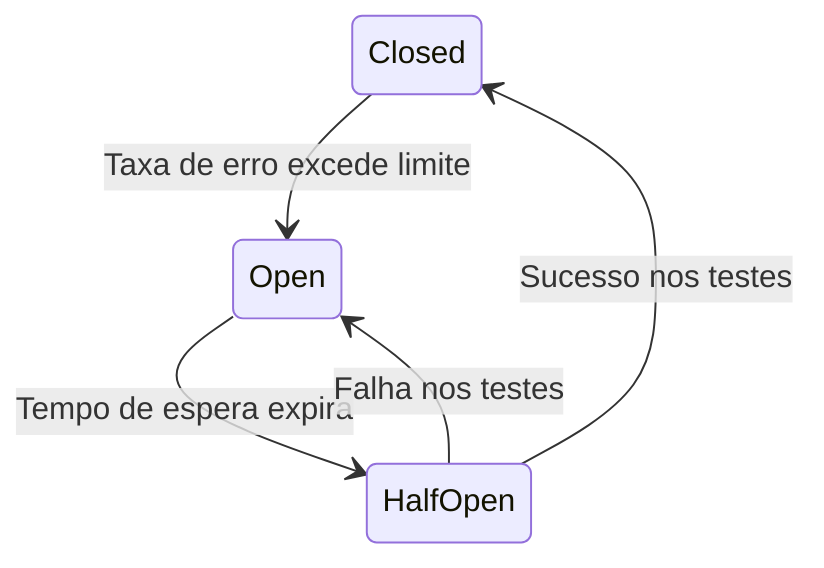

# 01. Padrões de Resiliência Distribuída (Circuit Breaker, Bulkhead, Retry)

## Objetivo
Ao final deste capítulo, você será capaz de conceituar o fenômeno da falha em cascata em redes distribuídas, explicar o funcionamento da máquina de estados do padrão **Circuit Breaker** (Fechado, Aberto e Meio-Aberto), aplicar o padrão **Bulkhead** para isolamento de recursos físicos, e projetar loops de **Retry com Backoff Exponencial e Jitter** em Kotlin.

---

## Motivação
Em redes distribuídas de grande porte, falhas físicas em nós ou conexões são estatisticamente comuns. Se o microserviço de Ledger do nosso banco digital ficar temporariamente lento devido a um GC longo na JVM ou sobrecarga de disco, as requisições enviadas pelo Gateway de Pagamentos começarão a se acumular na rede.

Se o Gateway não possuir proteções contra lentidão externa, as threads de execução dele ficarão bloqueadas aguardando respostas que nunca chegam. Em poucos segundos, o pool de threads do Gateway se esgotará, impedindo a entrada de qualquer outra requisição de clientes (mesmo aquelas não relacionadas ao Ledger). A falha de um único serviço periférico propagou-se de forma invisível e derrubou o sistema completo (fenômeno conhecido como **Falha em Cascata**).

Para criar arquiteturas robustas auto-regenerativas, devemos implementar padrões de **Resiliência Distribuída**.

---

## Pré-requisitos
* [Módulo 2, Capítulo 03: Concorrência na JVM com Virtual Threads](./../02-concurrency-ipc/03-jvm-virtual-threads.md).

---

## Conceitos Fundamentais

### 1. Falha em Cascata (Cascading Failure)
Uma falha em cascata ocorre quando a falha em um único componente gera sobrecargas em cascata em outros componentes vizinhos da rede. A causa raiz costuma ser o bloqueio indefinido de conexões físicas ou threads de CPU na espera de chamadas de rede que sofrem lentidão, esgotando recursos vitais da infraestrutura.

---

### 2. O Padrão Circuit Breaker (Disjuntor)
Inspirado nos disjuntores elétricos residenciais (que desarmam para proteger os circuitos sob sobrecarga de corrente), o Circuit Breaker envolve chamadas a serviços externos em um wrapper de proteção. Ele atua sob três estados lógicos:



1. **Closed (Fechado - Operação Normal)**: As requisições passam normalmente. O disjuntor monitora as taxas de erro e tempo de resposta das chamadas (usando uma janela deslizante). Se a taxa de falhas ultrapassar o limite (ex: $50\%$ de falhas nas últimas 100 chamadas), o disjuntor desarma mudando para o estado **Aberto**.
2. **Open (Aberto - Bloqueio/Falha Rápida)**: O disjuntor impede chamadas reais de rede ao serviço lento. Qualquer requisição do cliente falha instantaneamente (*Fail-Fast*) com erro mapeado (ou retorna um valor padrão de fallback), protegendo a rede contra saturação e dando tempo para o serviço externo se recuperar.
3. **Half-Open (Meio-Aberto - Testes)**: Após transcorrer um período de tempo (ex: 30 segundos no estado aberto), o disjuntor migra para o estado Meio-Aberto. Ele permite a passagem de poucas requisições de teste.
   * Se os testes falharem, o disjuntor volta para o estado **Aberto** redefinindo o temporizador.
   * Se os testes tiverem sucesso, o disjuntor volta para o estado **Fechado**, restabelecendo a operação normal.

---

### 3. O Padrão Bulkhead (Compartimentalização)
Inspirado nas paredes de compartimentação física de navios (que impedem que o navio inteiro afunde caso o casco sofra um rompimento localizado de água), o Bulkhead isola recursos em pools separados.
* **Isolamento**: Se dividirmos as threads de rede da nossa aplicação em pools independentes (ex: 20 threads apenas para chamadas ao Ledger, e 80 threads apenas para buscas de catálogo de produtos), se o Ledger cair, apenas as 20 threads do pool específico serão bloqueadas. As outras 80 threads do catálogo continuam operando normalmente sem contágio físico de recursos.

---

### 4. Retry com Backoff Exponencial e Jitter
Tentar reenviar uma requisição imediatamente após uma falha é útil para oscilações rápidas de rede, mas perigoso se o serviço externo estiver caindo por sobrecarga. Se centenas de nós dispararem retries imediatos de forma sincronizada, eles causarão o fenômeno do **Thundering Herd** (Efeito Manada), derrubando a infraestrutura que estava tentando se recuperar.

Para mitigar isso, retries devem adotar:
* **Exponential Backoff**: O atraso entre as tentativas subsequentes cresce de forma exponencial (ex: 1s, 2s, 4s, 8s...).
* **Jitter (Ruído Aleatório)**: Adiciona um atraso aleatório pequeno à fórmula do backoff para dessincronizar as chamadas das instâncias de clientes na rede:
$$\text{Delay} = (\text{Base} \times 2^{\text{tentativa}}) + \text{Random Jitter}$$

---

## Funcionamento Interno
As bibliotecas de resiliência modernas (como o **Resilience4j** na JVM) utilizam estruturas de dados não-bloqueantes de janela deslizante baseadas em filas circulares em memória para calcular taxas de falhas em milissegundos sem adicionar overhead de travas nas threads de negócio.

---

## Exemplos

### 1. Simulação Conceitual de Máquina de Estados de Circuit Breaker em Kotlin
```kotlin
// ARQUIVO: CustomCircuitBreaker.kt
package com.distribuidos.resiliencia

import java.time.Instant

class CustomCircuitBreaker(
    private val failureRateThreshold: Double = 0.5,
    private val openStateDurationMillis: Long = 1000
) {
    private var state = BreakerState.CLOSED
    private var failureCount = 0
    private var callCount = 0
    private var lastStateChangeTime = Instant.now().toEpochMilli()

    enum class BreakerState { CLOSED, OPEN, HALF_OPEN }

    @Synchronized
    fun executeCall(action: () -> Boolean): Boolean {
        // Valida expiração de tempo no estado Aberto
        if (state == BreakerState.OPEN) {
            val elapsed = Instant.now().toEpochMilli() - lastStateChangeTime
            if (elapsed > openStateDurationMillis) {
                state = BreakerState.HALF_OPEN
                lastStateChangeTime = Instant.now().toEpochMilli()
                println("[BREAKER] Tempo de repouso concluído. Migrando para HALF_OPEN. Testando serviço...")
            } else {
                println("[BREAKER] Chamada rejeitada instantaneamente (FAIL-FAST) no modo OPEN.")
                return false
            }
        }

        // Executa a chamada real
        val success = try {
            action()
        } catch (e: Exception) {
            false
        }

        callCount++
        if (!success) failureCount++

        val failureRate = failureCount.toDouble() / callCount

        when (state) {
            BreakerState.CLOSED -> {
                if (callCount >= 4 && failureRate >= failureRateThreshold) {
                    state = BreakerState.OPEN
                    lastStateChangeTime = Instant.now().toEpochMilli()
                    println("[BREAKER] Taxa de erro de ${failureRate * 100}% superou limite! DESARMADO -> OPEN.")
                }
            }
            BreakerState.HALF_OPEN -> {
                if (success) {
                    state = BreakerState.CLOSED
                    failureCount = 0
                    callCount = 0
                    println("[BREAKER] Testes passaram! Reestabelecido -> CLOSED.")
                } else {
                    state = BreakerState.OPEN
                    lastStateChangeTime = Instant.now().toEpochMilli()
                    println("[BREAKER] Falha no teste HALF_OPEN! Retornando -> OPEN.")
                }
            }
            else -> {}
        }

        return success
    }
}
```

### 2. Loop de Retry com Backoff Exponencial e Jitter em Kotlin
```kotlin
// ARQUIVO: ResilientRetry.kt
package com.distribuidos.resiliencia

import kotlinx.coroutines.delay
import kotlin.random.Random

suspend fun <T> retryWithBackoffAndJitter(
    maxAttempts: Int = 3,
    baseDelayMillis: Long = 100,
    maxDelayMillis: Long = 1000,
    block: suspend () -> T
): T {
    var attempt = 1
    while (true) {
        try {
            return block()
        } catch (e: Exception) {
            if (attempt >= maxAttempts) {
                throw e
            }
            
            // Cálculo do Backoff Exponencial com Jitter aleatório
            val expDelay = baseDelayMillis * (1 shl (attempt - 1)) // 1 shl X calcula 2^X
            val jitter = Random.nextLong(0, baseDelayMillis)
            val finalDelay = minOf(expDelay + jitter, maxDelayMillis)

            println("[RETRY] Tentativa $attempt falhou. Aguardando ${finalDelay}ms antes de tentar novamente...")
            delay(finalDelay)
            attempt++
        }
    }
}
```

---

## Casos de Uso
* **Netflix**: Criadores do Hystrix (o primeiro grande framework de Circuit Breaker de microserviços), utilizam proteções em todas as APIs de roteamento. Se a recomendação de categorias de filmes de um usuário estiver lenta, o disjuntor abre e exibe uma lista genérica pré-calculada, protegendo a página inicial do site de ficar fora do ar.
* **Gateways de Pagamento (Stripe/Adyen)**: Implementam retries com Jitter estritos nas confirmações de webhooks.

---

## Quando Utilizar Padrões de Resiliência
* Obrigatoriamente em todas as chamadas de rede externas e integrações de microsserviços via HTTP/gRPC ou banco de dados.

---

## Quando Não Utilizar Padrões de Resiliência (Retries)
* Em operações que **não são idempotentes** sem mecanismos adequados de verificação. Fazer retries automáticos de um débito financeiro sem que o emissor possua desduplicação de IDs de transações gerará cobranças duplicadas indevidas ao cliente final.

---

## Vantagens
* **Tolerância a Falhas**: Evita paralisação total do ecossistema por quedas localizadas de servidores periféricos.
* **Auto-Regeneração**: O disjuntor testa e restabelece a conexão sozinho quando o parceiro normaliza.

---

## Desvantagens
* **Complexidade do Debug**: Dificuldade em identificar erros reais de negócios quando falhas rápidas (Circuit Breaker Open) ocultam a resposta do microserviço de destino.

---

## Comparações

### Padrões de Resiliência Distribuída

| Padrão | Problema Resolvido | Ação Efetuada |
|---|---|---|
| **Circuit Breaker** | Evita falhas em cascata e latências longas | Bloqueia chamadas de rede (Fail-Fast instantâneo) |
| **Bulkhead** | Esgotamento de threads locais | Divide recursos físicos em pools compartimentados |
| **Retry com Jitter** | Erros de oscilação transitória de rede | Reenvia pacotes com delays exponenciais dessincronizados |

---

## Erros Comuns
1. **timeouts Longos**: Deixar timeouts de conexão TCP abertos por 10 ou 30 segundos. Isso bloqueia threads locais da JVM por longos períodos antes de falhar, inviabilizando o benefício de proteção rápida do Circuit Breaker.
2. **Retries sem Backoff/Jitter**: Implementar loops de retry do tipo `while (fail) retry()` sem atrasos. Isso transforma o cliente em um motor de ataque DDoS voluntário contra o próprio servidor interno da empresa.

---

## Projeto Prático
No projeto **FinTech Ledger**, blindamos o gateway de envio de transações.
Integramos a chamada de débito do `PaymentGateway` ao `LedgerService` com o `CustomCircuitBreaker`. Se a rede local ou o Ledger simular lentidão (delays de corrotinas), o gateway passará a rejeitar cobranças de forma instantânea, respondendo ao usuário "Sistema em Manutenção" sem saturar as Virtual Threads do gateway.

```kotlin
// ARQUIVO: ResilientPaymentGateway.kt
package com.distribuidos.projeto.resiliencia

import com.distribuidos.projeto.TransactionResult
import com.distribuidos.resiliencia.CustomCircuitBreaker

class ResilientPaymentGateway(
    private val clientCall: () -> Boolean
) {
    private val breaker = CustomCircuitBreaker()

    fun processPaymentWithShield(): TransactionResult {
        val callSuccess = breaker.executeCall {
            clientCall()
        }

        return if (callSuccess) {
            TransactionResult.Success("tx-${System.currentTimeMillis()}", System.currentTimeMillis())
        } else {
            TransactionResult.Failed("Transação recusada: Canal de comunicação em modo de proteção temporária (Circuit Breaker).")
        }
    }
}
```

---

## Exercícios

### Básico
1. O que caracteriza o fenômeno de "Falha em Cascata" (Cascading Failure)?
2. Explique os três estados de funcionamento do disjuntor lógica no padrão *Circuit Breaker*.

### Intermediário
3. Considere que o disjuntor está no estado **Aberto** e o tempo de repouso expira. O que acontece com a próxima requisição enviada ao disjuntor e sob quais critérios ele migra para o estado Fechado ou Aberto novamente?

### Avançado
4. Escreva uma aplicação em Kotlin que crie 100 requisições simultâneas destinadas a um microserviço com delay médio variável. Implemente o isolamento do pool de threads usando a técnica do padrão **Bulkhead** por Semáforo ou pool de threads isolados, provando que uma pane no endpoint A não afeta de forma alguma o tempo de resposta do endpoint B.

---

## Perguntas de Entrevista
1. **O que é o fenômeno do "Thundering Herd" (Efeito Manada) e como a inclusão do "Jitter" (Ruído) nas fórmulas de retry com backoff previne falhas de infraestrutura sob alta concorrência de clientes de aplicativos móveis após a restauração de um serviço corporativo?**
   * *Resposta esperada*: O Thundering Herd ocorre quando um serviço centralizado importante cai e, após ser reestabelecido, recebe dezenas de milhares de conexões e tentativas de retries exatamente no mesmo microssegundo de forma sincronizada por parte de instâncias de clientes em background. O backoff exponencial simples afasta os tempos de retries, mas de forma uniforme (ex: todos os clientes tentarão reenvio em exatamente 2 segundos). O Jitter adiciona um fator aleatório de dessincronização física na latência do cálculo. Ao espalhar os retries em intervalos ligeiramente diferentes (ex: Cliente A em 2.1s, Cliente B em 1.9s, Cliente C em 2.4s), garantimos que o fluxo de tráfego atinja o servidor como uma distribuição estável de carga ao invés de picos massivos de ondas concorrentes, permitindo que a infraestrutura gerencie o retorno do serviço com sucesso.

2. **Como configuramos limites de Janela Deslizante baseada em tempo (Time-based Sliding Window) vs Janela Deslizante baseada em contagem (Count-based Sliding Window) no Resilience4j, e sob quais cenários operacionais de produção cada uma é mais eficiente?**
   * *Resposta esperada*: 
     * A janela deslizante baseada em contagem (Count-based) avalia a taxa de falha sobre os últimos $N$ registros de chamadas (ex: 100 chamadas). Ela é altamente eficiente em serviços de tráfego estável ou alta vazão de requisições por segundo.
     * A janela deslizante baseada em tempo (Time-based) avalia a taxa de falha sobre os últimos $T$ segundos (ex: 30 segundos), independentemente do número de requisições. Ela é recomendada para APIs de baixo volume de tráfego de negócio (como conciliação de faturamento de hora em hora). Se usássemos baseada em contagem em APIs de baixo tráfego, o disjuntor poderia demorar dias até atingir as 100 chamadas para decidir desarmar sob uma falha persistente de rede, prolongando a lentidão e violando a proteção.

---

## Resumo
* A falha em cascata propaga o esgotamento de recursos físicos locais de hardware (threads/conexões) por indisponibilidade de nós remotos.
* Circuit Breaker protege a infraestrutura por bloqueios lógicos Fail-Fast sob os estados Fechado, Aberto e Meio-Aberto.
* Retries de rede devem adotar Backoff Exponencial e Jitter aleatório para evitar a sobrecarga destrutiva do efeito Thundering Herd.

---

## Próximo Capítulo
No [Capítulo 02: Observabilidade Distribuída com OpenTelemetry](./02-opentelemetry-observability.md), estudaremos o monitoramento de sistemas de alta escala, detalhando a instrumentação de Métricas, Logs e Rastreamento Distribuído usando a especificação OpenTelemetry.

---

## Referências
* **Release It!: Design and Deploy Production-Ready Software**, Michael T. Nygard. Editora Pragmatic Bookshelf (Livro que introduziu os padrões Circuit Breaker e Bulkhead no desenvolvimento de software).
* **Resilience4j Documentation**: [Core concepts guides](https://resilience4j.readme.io/docs).
* **Exponential Backoff and Jitter**: [AWS Architecture blog post](https://aws.amazon.com/blogs/architecture/exponential-backoff-and-jitter/).
