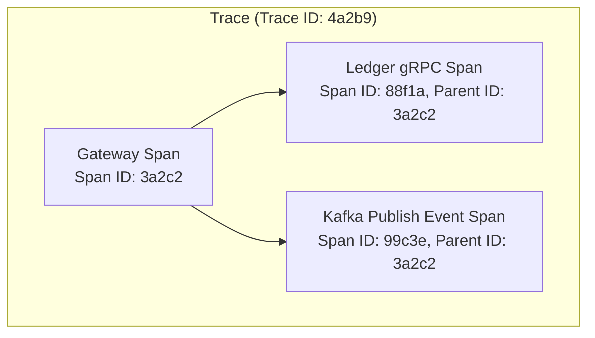

# 02. Observabilidade Distribuída com OpenTelemetry

## Objetivo
Ao final deste capítulo, você será capaz de conceituar os três pilares da observabilidade (Métricas, Logs e Rastreamento Distribuído), explicar o funcionamento da especificação OpenTelemetry (OTel) e a propagação de contextos W3C Trace Context, e projetar instrumentações de telemetria manual em gRPC e HTTP em Kotlin.

---

## Motivação
Em arquiteturas monolíticas tradicionais, quando ocorre uma falha em produção, depurar é simples: abrimos o arquivo de log do servidor e lemos o rastreamento da pilha (*stack trace*) da exceção.

Contudo, na nossa arquitetura distribuída FinTech Ledger, uma única requisição de transferência passa pelo Gateway, chama o Ledger via gRPC, publica um evento no Kafka, e atualiza o saldo e limites assincronamente. Se a transação der erro ou ficar lenta por 5 segundos, como localizamos o gargalo? O Gateway gravou seu log; o Ledger gravou outro em outra máquina; o consumidor do Kafka gravou um terceiro log distante. Sem uma forma de conectar essas execuções separadas, depurar vira um processo de tentativa e erro frustrante.

Para obter visibilidade absoluta sobre sistemas distribuídos complexos, precisamos de **Rastreamento Distribuído (Distributed Tracing)** através do padrão **OpenTelemetry**.

---

## Pré-requisitos
* [Módulo 2, Capítulo 02: Chamadas de Procedimento Remoto (gRPC)](./../02-concurrency-ipc/02-grpc-and-protobuf.md).
* [Módulo 6: Padrões de Transações Distribuídas](./../06-distributed-patterns/README.md).

---

## Conceitos Fundamentais

### 1. Definição de Observabilidade (Observability)
A observabilidade é a capacidade de deduzir o estado lógico e físico interno de um sistema analisando apenas as suas saídas externas (telemetria). Ela difere do monitoramento simples: o monitoramento avisa *quando* um sistema falhou (ex: "CPU > 90%"); a observabilidade ajuda a explicar *por que* ele falhou de forma inédita.

---

### 2. Os Três Pilares da Observabilidade
* **Métricas**: Agregações numéricas cronológicas estruturadas (ex: taxa de erro por segundo, uso de memória da JVM, latência de p99). Excelentes para dashboards operacionais rápidos (Prometheus/Grafana).
* **Logs**: Registros textuais estruturados de um evento pontual no tempo (ex: JSON contendo mensagem de erro).
* **Traces (Rastreamentos)**: O ciclo de vida completo de uma requisição trafegando pelas bordas físicas dos microserviços na rede. Um Trace é composto por múltiplos **Spans**.



---

### 3. OpenTelemetry (OTel)
O OpenTelemetry é um projeto do CNCF (Cloud Native Computing Foundation) que padroniza a coleta e transmissão de telemetria na indústria. Ele define:
* **OTel API**: Especificação semântica e interfaces de código imutáveis que você utiliza para instrumentar seu código Kotlin/Java.
* **OTel SDK**: A implementação física que envia os dados coletados.
* **OTel Collector**: Um proxy independente que recebe, filtra e exporta os dados de telemetria para ferramentas finais de mercado (como Prometheus, Jaeger, Grafana Mimir ou Datadog).

---

### 4. Propagação de Contexto (Context Propagation) e W3C Trace Context
Para que múltiplos microserviços associem seus Spans ao mesmo Trace ID unificado, eles devem propagar o metadado na rede (Context Propagation). O padrão do consórcio W3C define a inclusão de cabeçalhos de rede chamados `traceparent`:

```
   traceparent: 00-4bf92f3577b34da6a3ce929d0e0e4736-00f067aa0ba902b7-01
                │  └──────────────┬───────────────┘ └───────┬──────┘ └─┬┘
             Versão            Trace ID                  Span ID     Flags
```

* **Inject (Injeção)**: O microserviço cliente escreve o `traceparent` nos cabeçalhos HTTP, gRPC Metadata ou cabeçalhos de mensagens do Kafka antes de enviar.
* **Extract (Extração)**: O microserviço servidor lê o `traceparent` dos cabeçalhos, reconstrói o contexto em memória e spawna novos Spans como filhos (*Child Spans*) daquele Parent ID.

---

## Funcionamento Interno
O OpenTelemetry utiliza variáveis locais de thread isoladas (`ThreadLocal`) na JVM clássica (ou escopos de corrotinas no Kotlin) para manter o contexto do Span ativo acessível em qualquer classe do código sem a necessidade de passar o Span explicitamente como argumento de método.

---

## Exemplos

### Propagação Manual de Contexto W3C Trace Context em Kotlin
O código abaixo demonstra um interceptor conceitual de gRPC/HTTP simulado que realiza a injeção do cabeçalho W3C `traceparent` no cliente e sua respectiva extração e inicialização de Span Filho no servidor.

```kotlin
// ARQUIVO: OpenTelemetrySimulator.kt
package com.distribuidos.observabilidade

import java.util.UUID

data class TraceContext(
    val traceId: String,
    val spanId: String
)

class MockOtelTracker {
    private var currentContext: TraceContext? = null

    fun startRootTrace(): TraceContext {
        val ctx = TraceContext(
            traceId = UUID.randomUUID().toString().replace("-", ""),
            spanId = UUID.randomUUID().toString().substring(0, 16).replace("-", "")
        )
        currentContext = ctx
        println("[OTel-API] Iniciado root trace. Trace ID: ${ctx.traceId}, Span ID: ${ctx.spanId}")
        return ctx
    }

    // Injeta o contexto W3C nos cabeçalhos de rede HTTP
    fun injectHeaders(headers: MutableMap<String, String>) {
        val ctx = currentContext ?: return
        // Formato padrão W3C traceparent: 00-traceId-spanId-flags
        headers["traceparent"] = "00-${ctx.traceId}-${ctx.spanId}-01"
        println("[OTel-API] Injetado cabeçalho traceparent: ${headers["traceparent"]}")
    }

    // Extrai o contexto e inicializa Span filho local
    fun extractAndStartChildSpan(headers: Map<String, String>) {
        val traceparent = headers["traceparent"]
        if (traceparent != null && traceparent.startsWith("00-")) {
            val parts = traceparent.split("-")
            val parentTraceId = parts[1]
            val parentSpanId = parts[2]
            
            // Cria Span filho mantendo o mesmo Trace ID
            val childSpanId = UUID.randomUUID().toString().substring(0, 16).replace("-", "")
            currentContext = TraceContext(parentTraceId, childSpanId)
            
            println("[OTel-API] Span Filho iniciado. Trace ID: $parentTraceId, Span ID: $childSpanId (Parent: $parentSpanId)")
        } else {
            // Se não veio cabeçalho, inicializa novo root trace
            startRootTrace()
        }
    }

    fun getCurrentContext(): TraceContext? = currentContext
}

fun main() {
    val tracker = MockOtelTracker()
    val httpHeaders = mutableMapOf<String, String>()

    println("=== MICROSERVIÇO A (CLIENTE) ===")
    // 1. Inicia o rastreamento no ponto de entrada
    tracker.startRootTrace()
    
    // 2. Injeta o trace context para envio via rede física
    tracker.injectHeaders(httpHeaders)

    println("\n=== TRÂNSITO FÍSICO DE REDE ===")
    println("Cabeçalhos trafegados: $httpHeaders")

    println("\n=== MICROSERVIÇO B (SERVIDOR) ===")
    val serverTracker = MockOtelTracker()
    // 3. Servidor recebe a requisição, extrai o contexto e vincula o Span filho
    serverTracker.extractAndStartChildSpan(httpHeaders)
}
```

---

## Casos de Uso
* **Nubank**: Utiliza o OpenTelemetry para integrar todas as métricas e traces de seus microsserviços rodando no Kubernetes para um pipeline unificado do Grafana Tempo e Prometheus, permitindo depurar gargalos de latência de transações PIX em tempo real.
* **Uber**: Desenvolveu originalmente o **Jaeger** (uma das ferramentas mais populares de visualização de traces distribuídos) para gerenciar o rastreamento das viagens e despacho de motoristas.

---

## Quando Utilizar OpenTelemetry
* Absolutamente obrigatório em qualquer arquitetura baseada em microserviços que operem de forma distribuída na rede.

---

## Quando Não Utilizar OpenTelemetry (Traces Manuais complexos)
* Em aplicações legadas monolíticas de pequeno porte. Embora métricas e logs estruturados simples continuem sendo úteis, a complexidade operacional de coletar e armazenar logs de traces distribuídos volumosos é desnecessária se não houver saltos de rede física inter-processo.

---

## Vantagens
* **Padronização na Indústria**: Livre-se de acoplamento de fornecedores proprietários (*vendor lock-in*). Você pode trocar o Jaeger pelo Datadog alterando apenas uma linha do arquivo de configurações do Collector.
* **Mapeamento de Causa Raiz**: Encontre o nó exato que gerou a falha em pipelines longos em segundos.

---

## Desvantagens
* **Custo de Armazenamento**: Armazenar 100% de todos os spans de bilhões de requisições consome centenas de Terabytes de disco. Exige configuração de **Amostragem (Sampling)** (ex: coletar apenas 1% das queries normais e 100% das falhas).

---

## Comparações

### Métricas vs. Logs vs. Traces

| Dimensão | Métricas | Logs | Traces |
|---|---|---|---|
| **Formato** | Numérico Agregado | Texto Estruturado (JSON) | Árvore de Spans acoplados |
| **Custo de Disco** | Baixo e constante | Alto (proporcional ao tráfego) | Altíssimo (exige amostragem) |
| **Objetivo** | Monitoramento e alertas | Detalhe de evento único | Jornada da requisição na rede |

---

## Erros Comuns
1. **Quebrar a Propagação sobre Thread Pools ou Virtual Threads**: Executar chamadas assíncronas paralelas ou loops de corrotinas na JVM sem propagar o escopo do contexto OTel, fazendo com que os Spans filhos criados no segundo plano fiquem "órfãos" (sem vinculação ao Trace ID original).
2. **Instrumentar Loops de Alto Desempenho (High-Frequency)**: Gravar Spans manuais dentro de laços de repetição de milhares de interações matemáticas. Isso consome mais tempo de CPU da JVM processando o rastreamento do que executando o algoritmo real, degradando drasticamente o desempenho.

---

## Projeto Prático
No projeto **FinTech Ledger**, instrumentamos o nosso adaptador gRPC.
Escrevemos o interceptor gRPC Kotlin `ClientTraceInterceptor` que injeta o Trace ID nos metadados de envio gRPC antes do Gateway disparar o pagamento, e o `ServerTraceInterceptor` que extrai no Ledger, assegurando a visibilidade completa da transação nos logs consolidados.

```kotlin
// ARQUIVO: GrpcTraceInterceptors.kt
package com.distribuidos.projeto.observabilidade

import io.grpc.*
import java.util.UUID

object GrpcTraceContext {
    val TRACE_PARENT_KEY: Metadata.Key<String> = Metadata.Key.of("traceparent", Metadata.ASCII_STRING_MARSHALLER)
}

class ClientTraceInterceptor(private val traceId: String) : ClientInterceptor {
    override fun <ReqT : Any?, RespT : Any?> interceptCall(
        method: MethodDescriptor<ReqT, RespT>?,
        callOptions: CallOptions?,
        next: Channel?
    ): ClientCall<ReqT, RespT> {
        return object : ForwardingClientCall.SimpleForwardingClientCall<ReqT, RespT>(
            next?.newCall(method, callOptions)
        ) {
            override fun start(responseListener: Listener<RespT>?, headers: Metadata?) {
                // Injeta o cabeçalho nos metadados de envio gRPC
                headers?.put(GrpcTraceContext.TRACE_PARENT_KEY, "00-$traceId-spanId-01")
                super.start(responseListener, headers)
            }
        }
    }
}

class ServerTraceInterceptor : ServerInterceptor {
    override fun <ReqT : Any?, RespT : Any?> interceptCall(
        call: ServerCall<ReqT, RespT>?,
        headers: Metadata?,
        next: ServerCallHandler<ReqT, RespT>?
    ): ServerCall.Listener<ReqT> {
        val traceparent = headers?.get(GrpcTraceContext.TRACE_PARENT_KEY)
        if (traceparent != null) {
            println("[SERVER-GRPC] Contexto de trace extraído com sucesso: $traceparent")
        } else {
            println("[SERVER-GRPC] Nenhum contexto de trace recebido. Span raiz iniciado.")
        }
        return next?.startCall(call, headers) ?: object : ServerCall.Listener<ReqT>() {}
    }
}
```

---

## Exercícios

### Básico
1. Qual a diferença conceitual entre monitoramento e observabilidade?
2. Explique a diferença de papéis entre *Trace ID* e *Span ID* no rastreamento distribuído.

### Intermediário
3. Analise o cabeçalho W3C `traceparent: 00-4bf92f3577b34da6a3ce929d0e0e4736-00f067aa0ba902b7-01` e identifique a versão, o Trace ID, o Span ID e as Flags ativas.

### Avançado
4. Escreva uma aplicação em Kotlin rodando com corrotinas de forma assíncrona. Implemente a propagação manual do contexto OpenTelemetry utilizando as interfaces reais da SDK da API do OpenTelemetry da JVM (incluindo as classes `OpenTelemetry`, `Tracer` e `Span`). Prove, por meio de logs, que a relação causal de herança dos Spans é preservada mesmo quando executada em Threads e contextos paralelos do Loom/Corrotinas.

---

## Perguntas de Entrevista
1. **O que é "Amostragem Baseada em Cabeçalho" (Head-based Sampling) vs "Amostragem Baseada em Cauda" (Tail-based Sampling) no OpenTelemetry Collector e quais os trade-offs de desempenho e custo de armazenamento envolvidos em produção?**
   * *Resposta esperada*: 
     * **Head-based Sampling**: A decisão de coletar ou descartar um Trace é tomada no início (na "cabeça") da transação distribuída (ex: no Gateway de entrada). Se a taxa for 1%, o Gateway anexa a flag de coleta apenas a 1% dos traceparents. Isso é extremamente performático porque serviços subsequentes nem geram ou enviam Spans para a rede, economizando banda de rede e processamento local. O trade-off é que você pode perder anomalias raras que acontecem no final do fluxo em requisições que não foram selecionadas no início.
     * **Tail-based Sampling**: A decisão é tomada no final (na "cauda") do fluxo. O OTel Collector armazena temporariamente em buffers de memória RAM todos os Spans de todas as requisições até o trace completo encerrar. Se detectar que algum Span falhou com exceção ou demorou mais que 2 segundos, ele grava o Trace completo; se for uma chamada de sucesso rápida normal, ele a descarta. Isso garante $100\%$ de visibilidade sobre todas as falhas a custo de alta demanda de processamento de CPU e memória RAM nos nós do Collector.

2. **Como a propagação do contexto de traces distribuídos W3C é feita através de filas assíncronas do Apache Kafka utilizando os Kafka Record Headers sem violar a especificação binária da serialização do payload da mensagem (ex: Avro ou Protobuf)?**
   * *Resposta esperada*: O gRPC e o HTTP trafegam dados em metadados textuais nativos (cabeçalhos de protocolo). No Apache Kafka, as mensagens possuem uma estrutura dividida em duas seções físicas: os **Record Headers** (metadados estruturados de chave-valor baseados em array de bytes) e o **Record Value** (o payload binário da mensagem em Avro/Protobuf). Para propagar o trace context no Kafka sem interferir no payload de negócios, o produtor OTel injeta o traceparent W3C na coleção de Record Headers da mensagem. O consumidor do Kafka extrai o traceparent da coleção de headers antes de desserializar o payload binário do Value, iniciando o Span consumidor vinculado ao trace pai e mantendo a integridade sem requerer nenhuma alteração no esquema do Protobuf/Avro de negócios.

---

## Resumo
* A observabilidade apoia-se no tripé de Métricas, Logs estruturados e Traces distribuídos para fornecer rastreabilidade profunda.
* OpenTelemetry padroniza a instrumentação desvinculando o código da infraestrutura de análise por meio da propagação de contextos W3C Trace Context.
* A telemetria resiliente exige cuidado com pools assíncronos e a adoção de estratégias de amostragem inteligentes para controlar os custos físicos de disco do cluster.

---

## Próximo Capítulo
No [Capítulo 03: Orquestração e Deploy Resiliente no Kubernetes](./03-kubernetes-orchestration.md), migraremos para a infraestrutura operacional de containers. Estudaremos como modelar o ciclo de vida resiliente de microsserviços no Kubernetes aplicando Liveness/Readiness Probes, limites físicos de recursos de CPU/RAM e estratégias de implantação resilientes.

---

## Referências
* **Observability Engineering: Achieving Production-Ready Modern Systems**, Charity Majors, Liz Fong-Jones, George Miranda. Editora O'Reilly Media.
* **OpenTelemetry Specification**: [W3C Trace Context specifications](https://www.w3c.org/TR/trace-context/).
* **Grafana OpenTelemetry Guide**: [Distributed tracing architecture overview](https://grafana.com/docs/).
