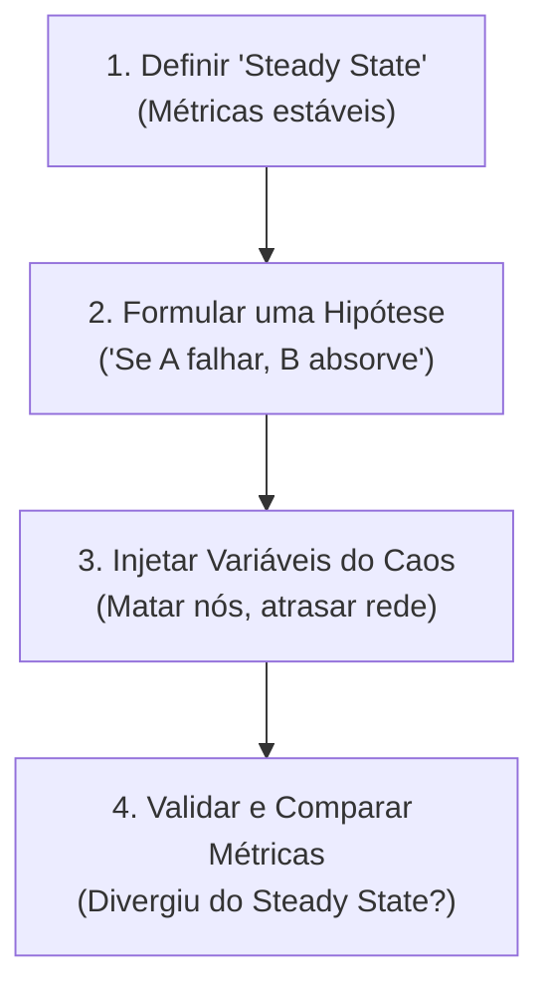

# 04. Testes de Robustez com Chaos Engineering

## Objetivo
Ao final deste capítulo, você será capaz de conceituar a disciplina de Engenharia de Caos (Chaos Engineering) e seus princípios fundamentais, estruturar experimentos científicos de injeção de falhas distribuídas seguindo o método científico, gerenciar e mitigar o raio de ação (*Blast Radius*) de testes de robustez, e projetar scripts de simulação de falhas e análise de métricas em Kotlin.

---

## Motivação
Desenvolvemos uma arquitetura robusta para o nosso Ledger. Adotamos mensageria assíncrona, desduplicação de eventos, replicação por consenso Raft, Circuit Breakers e deploy orquestrado em Kubernetes. No papel, o sistema é tolerante a falhas.

Mas como podemos ter certeza absoluta de que, quando o cabo de rede de um rack do nosso datacenter for rompido no meio da Black Friday, as travas de segurança e os failovers automáticos funcionarão exatamente como planejado? Confiar apenas em testes unitários ou de integração em ambiente local é insuficiente, pois eles não simulam as falhas parciais complexas, latências variáveis e comportamentos imprevisíveis de redes reais de larga escala.

Para validar a resiliência física do sistema sob condições turbulentas de produção de forma proativa, a indústria adota a **Engenharia de Caos**.

---

## Pré-requisitos
* [Módulo 7, Capítulo 01: Padrões de Resiliência Distribuída](./01-resilience-patterns.md).
* [Módulo 7, Capítulo 03: Orquestração e Deploy Resiliente no Kubernetes](./03-kubernetes-orchestration.md).

---

## Conceitos Fundamentais

### 1. O que é Engenharia de Caos?
Engenharia de Caos é a disciplina de realizar experimentos controlados em um sistema de software distribuído a fim de construir confiança na capacidade do sistema de suportar condições turbulentas em produção.
* **Proatividade**: O objetivo é encontrar fraquezas latentes na arquitetura (timeouts incorretos, falhas de failover, configurações de disco falhas) de forma proativa, antes que elas causem indisponibilidades reais para os clientes.

---

### 2. O Método Científico do Experimento de Caos
A execução de um teste de Engenharia de Caos deve seguir estritamente o método científico, composto por quatro etapas definidas:



#### 2.1. Definir o "Steady State" (Estado Estável)
Identificar métricas de comportamento normal do negócio que comprovem que o sistema está saudável (ex: "taxa de transferências finalizadas com sucesso > 99.9%", "latência p99 < 150ms").

#### 2.2. Formular a Hipótese
Criar uma afirmação causal baseada no design do sistema (ex: "Se um dos nós seguidores do Ledger sofrer crash definitivo, o sistema manterá a taxa de transferências finalizadas acima de 99.9% e o quórum de consenso Raft continuará operando sem indisponibilidade para o usuário final").

#### 2.3. Introduzir Variáveis do Caos (Falhas Reais)
Injetar falhas físicas ou lógicas simuladas representativas de incidentes reais:
* Derrubar instâncias de servidores (*process killing*).
* Introduzir latências ou perdas de pacotes artificiais nas conexões de rede (*packet loss/latency*).
* Sobrecargar recursos de hardware (injetar CPU a 100% ou encher o disco).
* Induzir partições físicas de rede (*network partitioning*).

#### 2.4. Analisar e Aprender
Comparar o estado do sistema durante o caos com o Steady State original.
* Se a hipótese for confirmada: o sistema é robusto contra essa falha.
* Se a hipótese falhar (ex: a queda do nó fez o cluster inteiro parar de aceitar pagamentos): uma fraqueza de design foi revelada. Corrigimos a falha lógicas e rodamos o experimento novamente.

---

### 3. O Raio de Ação (Blast Radius)
O Blast Radius é o limite máximo de impacto que um experimento de caos pode causar no sistema de produção real.
* **Começar Pequeno**: Sempre iniciamos experimentos em ambientes de staging. 
* **Expansão Controlada**: Quando o sistema comprovar resiliência em staging, avançamos para produção. Mas iniciamos injetando a falha em apenas uma pequena fração do cluster (ex: matar 1 pod de 50 ativos) em horários de baixo tráfego.
* **Botão de Rollback (Abort Trigger)**: O experimento **deve** conter um gatilho de interrupção automático de segurança. Se o teste de caos começar a degradar a experiência real de usuários finais fora do limite tolerado, o injetor de caos para imediatamente e o sistema retorna ao estado normal.

---

### 4. Ferramentas da Indústria
* **Chaos Monkey (Netflix)**: A ferramenta pioneira que derruba aleatoriamente instâncias de microserviços em produção para forçar os engenheiros a desenharem serviços resilientes e auto-regenerativos.
* **Chaos Mesh / LitmusChaos**: Motores modernos de engenharia de caos integrados de forma nativa ao Kubernetes, permitindo injetar falhas de rede, CPU, e partições em nível de pods usando recursos declarativos.
* **Toxiproxy (Shopify)**: Um proxy de rede TCP programável para simular latências dinâmicas e perdas de conexões em conexões de banco de dados e mensageria.

---

## Funcionamento Interno
As ferramentas de caos aplicam falhas de rede física injetando dinamicamente regras de roteamento e bloqueio de IPs nos filtros de pacotes nativos do kernel Linux usando a ferramenta **iptables** ou o utilitário **tc** (*traffic control*).

---

## Exemplos

### Simulação de Injeção de Caos e Teste de Robustez em Kotlin
O código abaixo demonstra um script de simulação científica. Ele define um Steady State (latência e taxa de sucesso do Ledger), cria uma thread executando pagamentos continuamente e uma thread de caos que simula a queda repentina do Ledger Leader. O script analisa se a camada de resiliência e failover (Circuit Breaker) consegue absorver a falha.

```kotlin
// ARQUIVO: ChaosExperimentSimulator.kt
package com.distribuidos.chaos

import kotlinx.coroutines.*
import java.util.concurrent.atomic.AtomicBoolean
import java.util.concurrent.atomic.AtomicInteger

class SimulatedLedgerSystem {
    val isLeaderOnline = AtomicBoolean(true)
    private val responseTimeMillis = 10L

    fun executeDebit(): Boolean {
        if (!isLeaderOnline.get()) {
            throw RuntimeException("Falha física de conexão: Líder Offline.")
        }
        Thread.sleep(responseTimeMillis)
        return true
    }
}

class ChaosExperimentRunner {
    private val ledger = SimulatedLedgerSystem()
    private val successCount = AtomicInteger(0)
    private val totalRequests = AtomicInteger(0)
    private val scope = CoroutineScope(Dispatchers.Default)

    fun runExperiment() = runBlocking {
        println("=== 1. DEFININDO STEADY STATE (Normal) ===")
        println("Esperado: 100% de sucesso nas transações sob rede saudável.")

        // Inicia disparos contínuos de requisições de clientes
        val clientJob = scope.launch {
            while (isActive) {
                totalRequests.incrementAndGet()
                try {
                    val success = ledger.executeDebit()
                    if (success) successCount.incrementAndGet()
                } catch (e: Exception) {
                    // Sem tratamento de resiliência: falha vaza direto
                }
                delay(50) // Nova chamada a cada 50ms
            }
        }

        delay(500) // Deixa rodar no modo normal por 500ms
        println("Transações processadas no Steady State: ${totalRequests.get()}, Sucesso: ${successCount.get()}")

        println("\n=== 2. INJETANDO VARIÁVEL DO CAOS ===")
        println("[CHAOS-INJECTOR] Matando o nó Líder do Ledger...")
        ledger.isLeaderOnline.set(false)

        delay(500) // Mantém a falha ativa por 500ms

        println("\n=== 3. AUDITANDO IMPACTO DO CAOS ===")
        clientJob.cancelAndJoin() // Para os disparos de testes

        val finalTotal = totalRequests.get()
        val finalSuccess = successCount.get()
        val successRate = (finalSuccess.toDouble() / finalTotal) * 100

        println("Total de chamadas do experimento: $finalTotal")
        println("Total de sucessos: $finalSuccess")
        println("Taxa de Sucesso final sob falha: ${"%.2f".format(successRate)}%")
        
        if (successRate < 99.9) {
            println("[RESULTADO] HIPÓTESE REJEITADA! A falha do líder quebrou a integridade do negócio. Fragilidade revelada.")
        } else {
            println("[RESULTADO] HIPÓTESE CONFIRMADA! O sistema mitigou a falha com sucesso.")
        }
    }
}

fun main() {
    val runner = ChaosExperimentRunner()
    runner.runExperiment()
}
```

---

## Casos de Uso
* **Netflix**: Executa o Chaos Monkey de forma ininterrupta em todos os seus datacenters de produção. Os desenvolvedores são obrigados a codificar assumindo que qualquer servidor de vídeo ou microsserviço de autenticação de conta pode ser desligado de forma abrupta a qualquer hora do dia.
* **Instituições Financeiras (Game Days)**: Nubank e grandes bancos globais organizam "Game Days" programados, onde engenheiros injetam cenários reais de desastre (ex: simular a perda de uma região inteira da nuvem AWS) em ambientes de simulação integrados para validar se os Circuit Breakers, Outboxes e replicação Raft conseguem reestabelecer o funcionamento do banco sem perda física de dados.

---

## Quando Utilizar Engenharia de Caos
* Sistemas distribuídos que já implementaram padrões de resiliência e redundância física e que desejam validar a eficácia real destas proteções sob estresse.

---

## Quando Não Utilizar Engenharia de Caos
* Sistemas frágeis que você **sabe** que falharão. Injetar caos em um ecossistema sem Circuit Breakers ou sem replicação é inútil e gerará indisponibilidades óbvias. Corrija as fragilidades conhecidas antes de rodar os testes de caos.
* Sem ferramentas de observabilidade robustas (Prometheus/Grafana/OpenTelemetry). Sem telemetria, você estará injetando falhas "às cegas", sem conseguir medir se o sistema manteve o Steady State ou onde ocorreu a falha.

---

## Vantagens
* **Visibilidade Proativa**: Encontre vulnerabilidades lógicas de rede ocultas antes do cliente final.
* **Mudança Cultural**: Obriga a equipe de engenharia a adotar padrões de tolerância a falhas na primeira linha de código de qualquer serviço.

---

## Desvantagens
* **Custo Operacional**: Exige tempo de desenvolvimento dedicado para planejar, monitorar e executar os testes com segurança.
* **Risco de Danos Real**: Experimentos mal planejados em produção podem estourar o Blast Radius planejado, gerando prejuízos de indisponibilidade reais para os clientes.

---

## Comparações

### Testes Tradicionais vs. Engenharia de Caos

| Dimensão | Testes Unitários/Integração | Engenharia de Caos |
|---|---|---|
| **Abordagem** | Verificação determinística baseada em entradas | Investigação empírica baseada em hipóteses |
| **Ambiente ideal** | Local / Pipeline CI/CD | Staging integrado / Produção controlada |
| **Falhas testadas** | Esperadas (erros de inputs, nulos) | Inesperadas (latência física, queda de nós) |
| **Foco** | Corretude de linhas de código | Robustez sistêmica sob condições turbulentas |

---

## Erros Comuns
1. **Começar Direto em Produção**: Injetar falhas graves de rede em produção na primeira semana de adoção da Engenharia de Caos, gerando indisponibilidades desastrosas. O progresso deve ser gradual (Local $\to$ Staging $\to$ Game Days controlados $\to$ Produção automatizada).
2. **Ignorar o Rollback Automatizado**: Iniciar um teste de perda de pacotes de rede sem possuir um script rápido para reverter as regras do iptables, mantendo o cluster fora do ar por horas.

---

## Projeto Prático
No projeto **FinTech Ledger**, projetamos a simulação do nosso script final de Injeção de Caos.
O script `ChaosInjector` simulará um ataque contínuo de indisponibilidade no nosso cluster Ledger (alternando o estado de partição física do Raft e adicionando latências de rede nas conexões do Gateway de Pagamentos). Mostraremos como a combinação de Raft (safety de quórum), Outbox (publicação de mensagens diferida) e Circuit Breaker (Fail-Fast sob lentidão) mantém as transferências consistentes de forma resiliente ao caos.

```kotlin
// ARQUIVO: LedgersChaosInjector.kt
package com.distribuidos.projeto.chaos

import com.distribuidos.projeto.resiliencia.ResilientPaymentGateway
import kotlinx.coroutines.*
import java.util.concurrent.atomic.AtomicBoolean

class LedgersChaosInjector(
    private val isNetworkHealthy: AtomicBoolean,
    private val gateway: ResilientPaymentGateway
) {
    private val scope = CoroutineScope(Dispatchers.Default)

    fun startChaosSimulation() {
        // 1. Thread de Injeção de Caos: Alterna a saúde da rede física a cada 300ms
        scope.launch {
            while (isActive) {
                delay(300)
                val current = isNetworkHealthy.get()
                isNetworkHealthy.set(!current)
                println("[CHAOS-INJECTOR] Chave de rede alterada! Saudável = ${isNetworkHealthy.get()}")
            }
        }

        // 2. Thread de Negócios: Cliente tentando efetuar pagamentos continuamente
        scope.launch {
            for (i in 1..10) {
                delay(100)
                val result = gateway.processPaymentWithShield()
                println("[CLIENTE-API] Resposta da transação $i: $result")
            }
        }
    }
}
```

---

## Exercícios

### Básico
1. O que é Engenharia de Caos?
2. Explique a relevância do conceito de *Blast Radius* (Raio de Ação) no planejamento de testes de caoticidade.

### Intermediário
3. Formule uma hipótese científica para um experimento de caos cujo objetivo seja validar a resiliência do pool de conexões do banco de dados relacional de um microserviço sob indisponibilidade parcial de rede.

### Avançado
4. Escreva uma classe de simulação de rede TCP em Kotlin que atue como um proxy (semelhante ao Toxiproxy). O proxy deve receber requisições de soquetes locais e encaminhá-las ao serviço de destino introduzindo latência variável dinâmica controlada e perda de pacotes pseudo-aleatória configuráveis via propriedades. Demonstre que sua aplicação consumidora consegue sobreviver ao proxy instável usando padrões de timeout e retry.

---

## Perguntas de Entrevista
1. **Por que a Engenharia de Caos é considerada uma disciplina científica empírica baseada em hipóteses ao invés de um teste convencional de assertividade lógica?**
   * *Resposta esperada*: Assertividades lógicas convencionais (como testes unitários ou e2e) validam condições conhecidas e caminhos determinísticos programados no código pelo desenvolvedor. Em sistemas distribuídos complexos, o comportamento sistêmico emerge de interações dinâmicas imprevisíveis de centenas de nós rodando em paralelo sobre redes físicas instáveis. É impossível prever todas as permutações de falhas na codificação. A Engenharia de Caos adota o método científico empírico: definimos um comportamento estável mensurável (Steady State), postulamos uma hipótese lógica de resiliência baseada nas nossas proteções, injetamos perturbações físicas reais no sistema sob condições controladas de estresse e observamos se o comportamento emergente diverge ou não da hipótese inicial. O foco é descobrir "desconhecidos desconhecidos" (*unknown unknowns*) através da experimentação direta.

2. **Como o uso da ferramenta Chaos Mesh no Kubernetes permite simular uma falha do tipo "Network Partition" (Partição de Rede) entre réplicas seguidores do Raft sem alterar o código-fonte da aplicação JVM ou derrubar fisicamente os servidores de infraestrutura da nuvem?**
   * *Resposta esperada*: O Chaos Mesh utiliza os recursos de controle do próprio Kubernetes e do kernel Linux do nó que hospeda os containers. Para simular uma partição de rede física de forma transparente, o Chaos Mesh injeta dinamicamente regras de filtragem de pacotes de rede (iptables) ou configura atrasos lógicos de tráfego usando a ferramenta Traffic Control (`tc`) dentro dos namespaces de rede específicos dos Pods afetados. Ele cria barreiras lógicas que rejeitam ou descartam todos os pacotes IP originados dos pods seguidores que tentam acessar o pod líder do Raft. Do ponto de vista da aplicação JVM do Ledger, a conexão física de rede simplesmente parece indisponível (timeouts de sockets comuns ocorrem), simulando perfeitamente o rompimento de um cabo ou queda de switches físicos, sem requerer modificações no código Kotlin ou reinicializações de servidores de infraestrutura.

---

## Resumo
* Engenharia de Caos valida a robustez sistêmica e auto-recuperação de sistemas distribuídos sob estresse proativo em produção.
* Experimentos de caos devem seguir o método científico formal definindo Steady State, hipótese, variáveis de perturbação e análise quantitativa de métricas.
* O controle de Blast Radius (raio de ação do teste) e o alinhamento de ferramentas de observabilidade e reversão de segurança automática (botão de abortar) são obrigatórios para mitigar riscos operacionais reais aos clientes.

---

## Referências
* **Chaos Engineering: System Resiliency in Practice**, Casey Rosenthal, Nora Jones. Editora O'Reilly Media (Autores que ajudaram a fundar e consolidar a disciplina na Netflix).
* **Principles of Chaos Engineering**: [Official manifesto website](https://principlesofchaos.org/).
* **Chaos Mesh Documentation**: [Kubernetes chaos injection mesh guides](https://chaos-mesh.org/docs/).
