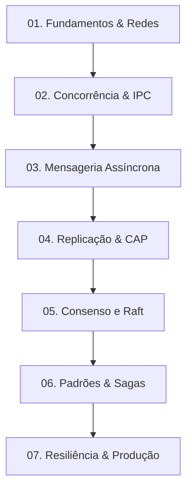

# Desenvolvimento de Sistemas Distribuídos

Bem-vindo ao curso completo de **Desenvolvimento de Sistemas Distribuídos**. Este material foi projetado e estruturado para levar você desde os conceitos fundamentais da computação em rede até o nível de profundidade e tomada de decisão arquitetural exigido de um **Staff Software Engineer**.

Nossa abordagem prioriza a compreensão profunda de conceitos físicos e teóricos (modelos de tempo, falhas, consistência e consenso) antes de mergulhar em ferramentas ou frameworks. Os exemplos práticos e o projeto unificado serão desenvolvidos progressivamente utilizando **Kotlin**, **Java** e **Spring Boot**.

---

## Por que estudar Sistemas Distribuídos?
Na era da computação em nuvem, Edge Computing e Big Data, praticamente qualquer sistema de software moderno com escala e relevância comercial é distribuído. Sistemas distribuídos nos permitem obter escalabilidade horizontal, resiliência física a desastres de datacenters inteiros e latência reduzida ao aproximar a computação do usuário final.

No entanto, sistemas distribuídos introduzem desafios severos:
1. **Falhas parciais inevitáveis**: Um componente pode falhar enquanto outros continuam rodando, e a rede pode sumir ou atrasar mensagens arbitrariamente.
2. **Ausência de relógio global**: Determinar a ordem cronológica exata de transações financeiras em servidores fisicamente separados é fisicamente impossível sem técnicas avançadas.
3. **Consistência de dados complexa**: Replicar informações entre servidores exige trade-offs diretos de performance, disponibilidade e garantia de dados (Teorema CAP/PACELC).

Dominar esse assunto capacita você a projetar arquiteturas estáveis e tomar decisões baseadas em trade-offs reais de engenharia, preparando-o para resolver problemas equivalentes aos encontrados em empresas globais de tecnologia (como Google, Netflix, Uber e Nubank).

---

## Roadmap do Curso

O aprendizado está organizado de forma estritamente progressiva. Cada módulo constrói a base necessária para o seguinte:

### [Módulo 1: Fundamentos e Limitações Físicas](./01-foundations/)
Introdução à computação distribuída, falácias da rede, modelos de tempo (síncrono/assíncrono) e modelos de falha físicos (crash-stop, crash-recovery, omissão).

### [Módulo 2: Concorrência e IPC (Inter-Process Communication)](./02-concurrency-ipc/)
Comunicação síncrona direta. Sockets, gRPC vs. REST, serialização binária (Protobuf vs. JSON) e concorrência local eficiente na JVM (Virtual Threads do Java 21).

### [Módulo 3: Mensageria e Comunicação Assíncrona](./03-messaging/)
Desacoplamento temporal e espacial. Message Brokers (RabbitMQ vs. Apache Kafka), padrão Outbox para atomicidade de eventos e tratamento de concorrência com receptores idempotentes.

### [Módulo 4: Replicação de Dados e Consistência](./04-replication-consistency/)
Armazenamento replicado. O Teorema CAP e PACELC, replicação de dados baseada em líder (*Leader-Follower*), particionamento (*Sharding*) e anomalias de consistência eventual.

### [Módulo 5: Tempo Lógico e Consenso Distribuído](./05-consensus/)
Como computadores em rede cooperam e decidem. Relógios de Lamport e Relógios Vetoriais. Estudo aprofundado e simulação em memória do algoritmo de consenso **Raft** (eleição de líder e replicação de logs).

### [Módulo 6: Padrões de Transações Distribuídas](./06-distributed-patterns/)
Garantia de consistência de negócios sem bloqueios distribuídos pesados. Padrão Saga (Orquestrada e Coreografada), tratamento de compensações financeiras, e introdução a Event Sourcing e CQRS.

### [Módulo 7: Resiliência, Observabilidade e Operação](./07-resilience-operations/)
Operando com confiança na nuvem. Padrões de resiliência (Circuit Breakers, Bulkheads, Retries com Jitter). Observabilidade com OpenTelemetry (Traces distributivos, métricas Prometheus e Grafana). Deploy containerizado em Kubernetes e Chaos Engineering.

---

## Como Utilizar este Material

1. **Monitore seu Progresso**: Utilize o arquivo [progress.md](./progress.md) para marcar as aulas estudadas e os checkpoints de exercícios concluídos.
2. **Consulte o Glossário**: O arquivo [glossary.md](./glossary.md) serve como dicionário rápido de consulta para termos em inglês ou siglas comuns (2PC, WAL, CDC, etc.).
3. **Siga a Ordem Recomendada**: O [roadmap.md](./roadmap.md) detalha a ementa de cada capítulo, seus pré-requisitos específicos e os marcos do projeto prático.
4. **Implemente o Projeto**: Cada módulo adiciona novas capacidades ao projeto prático de FinTech (Plataforma de Pagamentos e Ledger). Escreva o código em Kotlin/Java e execute localmente para consolidar os conhecimentos.
5. **Resolva os Exercícios**: Cada capítulo termina com exercícios (Básico, Intermediário, Avançado) e perguntas reais de entrevista técnica de Big Techs para testar seu conhecimento.