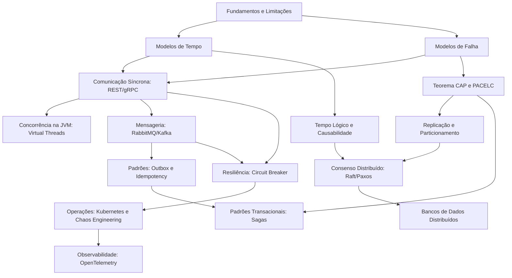

# Mapa de Dependências Conceituais

Este documento mapeia as dependências lógicas entre os diferentes tópicos do curso de Sistemas Distribuídos, auxiliando o estudante a entender quais bases teóricas são necessárias antes de avançar para conceitos complexos.

---

## 1. Grafo de Dependências (Mermaid)

---

## 2. Detalhamento de Pré-requisitos Críticos

### Por que aprender Relógios Lógicos antes de Consenso Distribuído?
* **Razão**: Algoritmos de consenso (Raft, Paxos) dependem de noções de liderança ordenada por termos (*terms* ou *epochs*) e indexação incremental de logs para decidir se uma réplica tem dados mais atualizados do que outra. Sem entender o conceito de causabilidade lógica (relação Happened-Before de Lamport), o estudante terá dificuldades para compreender o processo de eleição e segurança do Raft.

### Por que aprender o Padrão Outbox antes de Sagas?
* **Razão**: O padrão Saga coordena múltiplos serviços via mensagens assíncronas (especialmente na Saga Coreografada ou Orquestrada baseada em eventos). Se um serviço falhar ao salvar seu estado local e publicar o evento da próxima etapa (quebra de atomicidade local), a Saga inteira trava ou perde a consistência de forma irrecuperável. O padrão Outbox garante a publicação confiável e atômica desses eventos de transição.

### Por que aprender CAP/PACELC antes de Bancos de Dados Distribuídos?
* **Razão**: Bancos de dados distribuídos (Cassandra, Spanner, CockroachDB) são implementações físicas que tomam decisões fundamentais baseadas no CAP/PACELC. Tentar entender o particionamento do Cassandra ou as garantias de isolamento do Spanner sem a base do CAP resultará em memorização mecânica das ferramentas, ao invés de compreensão arquitetural real.
