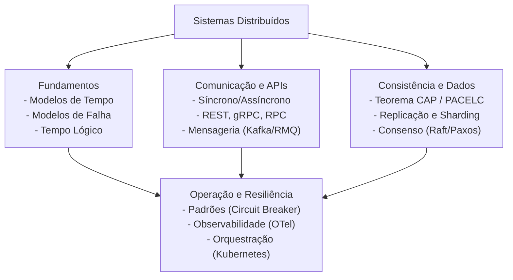

# Mapa de Conhecimento: Sistemas Distribuídos

Este mapa conceitual organiza o domínio de Sistemas Distribuídos em domínios de conhecimento, destacando conexões, pré-requisitos e classificações de profundidade (Essencial, Avançado, Opcional).

---

## 1. Estrutura de Domínios do Conhecimento

---

## 2. Detalhamento de Tópicos e Níveis

### Domínio A: Fundamentos Distribuídos (Essencial)
* **Conceitos**: Modelos de tempo (Síncrono/Assíncrono/Parcial), Modelos de falha (Crash-stop/Recovery/Byzantine), Relógios lógicos e causais (Lamport, Vector Clocks).
* **Pré-requisitos**: Programação básica (OOP), estruturas de dados locais.
* **Conexões**: Essencial para entender replicação, exclusão mútua e por que o consenso é difícil.

### Domínio B: Concorrência e Redes (Essencial)
* **Conceitos**: Sockets, Protocolos de transporte (TCP/UDP, QUIC), Serialização (JSON, Protobuf), Concorrência de execução na JVM (Threads de Plataforma, Virtual Threads).
* **Pré-requisitos**: Redes de computadores (modelo OSI/TCP-IP simplificado).
* **Conexões**: Alimenta diretamente o desenvolvimento de APIs (HTTP/gRPC) e integrações de rede.

### Domínio C: Comunicação entre Processos e APIs (Essencial)
* **Conceitos**: RPC de alta performance (gRPC), RESTful APIs, Mensageria orientada a eventos (RabbitMQ vs. Apache Kafka).
* **Pré-requisitos**: Domínio B (Redes e Concorrência).
* **Conexões**: Essencial para a construção física de serviços distribuídos independentes.

### Domínio D: Consistência, Replicação e Consenso (Avançado - Nível Staff)
* **Conceitos**: Teorema CAP, Teorema PACELC, Impossibilidade FLP, Replicação baseada em líder, Sharding/Particionamento, Algoritmos de Consenso (Paxos e Raft), Protocolos de Adesão (Gossip Protocol).
* **Pré-requisitos**: Domínio A (Fundamentos) e Domínio C (Mensageria).
* **Conexões**: Fundamental para entender o funcionamento interno de bancos de dados modernos e sistemas tolerantes a falhas.

### Domínio E: Padrões de Dados Distribuídos (Avançado)
* **Conceitos**: Padrão Outbox (para atomicidade de publicação), Receptor Idempotente, Padrão Saga (Orquestração e Coreografia), Event Sourcing, CQRS (Command Query Responsibility Segregation).
* **Pré-requisitos**: Domínio C (Comunicação/Mensageria) e noções de transações locais ACID.
* **Conexões**: Padrões chave para resolver consistência eventual na camada de aplicação de microserviços.

### Domínio F: Resiliência, Engenharia de Confiabilidade e Operações (Essencial a Avançado)
* **Conceitos**: Circuit Breaker, Retries com Backoff exponencial e Jitter, Bulkheads, Rate Limiters, Observabilidade (OpenTelemetry: Traces, Métricas, Logs), Chaos Engineering, Orquestração e Deploy em Kubernetes.
* **Pré-requisitos**: Domínio C (Comunicação) e conceitos de infraestrutura.
* **Conexões**: Garante a operação sustentável, monitorável e auto-regenerativa do sistema em produção.

---

## 3. Matriz de Classificação de Tópicos

| Tópico | Classificação | Nível Recomendado | Justificativa |
|---|---|---|---|
| **Sistemas Síncronos/Assíncronos** | Essencial | Iniciante | Base teórica de modelagem de sistemas de computação. |
| **Relógios Lógicos (Lamport/Vetor)**| Avançado | Intermediário | Necessário para entender replicação sem relógios físicos. |
| **REST e gRPC** | Essencial | Iniciante | Comunicação síncrona básica de microserviços. |
| **Mensageria (Kafka/RabbitMQ)** | Essencial | Intermediário | Comunicação assíncrona desacoplada na indústria. |
| **Outbox & Idempotency** | Essencial | Intermediário | Padrões de sobrevivência prática em microserviços. |
| **Sagas (Orquestrada/Coreografada)** | Avançado | Avançado / Staff | Coordenação de processos de negócio complexos em rede. |
| **Consenso (Paxos/Raft)** | Avançado (Staff) | Staff | Mecanismo interno de alta complexidade matemática e de código. |
| **Teorema CAP & PACELC** | Essencial | Intermediário | Modelo mental para tomada de decisão arquitetural diária. |
| **Virtual Threads (Loom)** | Opcional/Moderno | Intermediário | Otimização moderna de recursos na JVM. |
| **Byzantine Fault Tolerance** | Opcional | Avançado | Apenas para cenários de desconfiança mútua ou criptoativos. |
| **Chaos Engineering** | Avançado | Avançado | Testes de robustez física em produção. |
| **Rastreamento Distribuído (OTel)**| Essencial | Intermediário | Sem isso, é impossível debugar erros em produção distribuída. |
