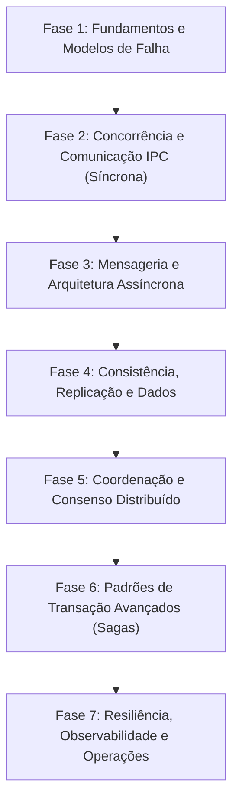

# Caminho de Aprendizagem (Learning Path)

Este documento define a trilha pedagógica recomendada para guiar o estudante desde os conceitos mais simples de concorrência e redes até a arquitetura avançada de sistemas distribuídos e algoritmos de consenso.

---

## Trilha de Estudo Recomendada

---

## Detalhamento das Fases

### Fase 1: Fundamentos e Limitações Físicas
* **Objetivo**: Quebrar a "ilusão da rede confiável". O estudante deve entender que a rede falha de formas imprevisíveis, que não existe relógio global e que falhas parciais são a regra, não a exceção.
* **Marcos de Conhecimento**:
  * Compreender a diferença teórica entre redes síncronas e assíncronas.
  * Classificar falhas (Crash-stop vs. Crash-recovery).
  * Entender por que relógios físicos locais geram inconsistências de concorrência.
* **Projeto Prático (Evolução)**: Modelagem mental e análise teórica de falhas em cenários de negócios simples.

### Fase 2: Comunicação Síncrona e APIs
* **Objetivo**: Ensinar como fazer processos rodando em sistemas operacionais separados conversarem de forma direta e estruturada.
* **Marcos de Conhecimento**:
  * Criar chamadas síncronas eficientes com gRPC e REST.
  * Entender o custo de CPU e rede na serialização (JSON vs. Protobuf).
  * Concorrência de execução na JVM (Platform Threads vs. Virtual Threads).
* **Projeto Prático (Evolução)**: Implementar duas aplicações Kotlin/Java Spring Boot independentes que se comunicam via gRPC/REST simulando um fluxo financeiro simples em memória.

### Fase 3: Comunicação Assíncrona e Mensageria
* **Objetivo**: Desacoplar serviços temporária e espacialmente utilizando Brokers de Mensageria (mensagens em filas/logs).
* **Marcos de Conhecimento**:
  * Diferenciar os modelos de consumo e roteamento do RabbitMQ e Apache Kafka.
  * Resolver a perda ou duplicação de mensagens com os padrões **Outbox** e **Idempotency**.
* **Projeto Prático (Evolução)**: Substituir chamadas síncronas diretas por mensageria. Criar uma tabela de Outbox para garantir que transações locais e envio de mensagens aconteçam atomicamente.

### Fase 4: O Problema dos Dados Distribuídos (Consistência)
* **Objetivo**: Compreender os trade-offs físicos de armazenar dados em mais de um servidor (replicação e particionamento).
* **Marcos de Conhecimento**:
  * Aplicar o Teorema CAP e PACELC a decisões arquiteturais de produção.
  * Compreender Replicação Baseada em Líder (*Leader-follower*) e Sharding (*Particionamento*).
  * Analisar problemas de leitura em réplicas de consistência eventual (lê-se dados antigos).
* **Projeto Prático (Evolução)**: Simular, em código puro (memória), um sistema replicado simples para demonstrar conflitos de concorrência por replicação assíncrona.

### Fase 5: Coordenação e Algoritmos de Consenso
* **Objetivo**: Ensinar como múltiplos servidores concordam em um único valor sem depender de um líder fixo vulnerável (consenso descentralizado tolerante a falhas).
* **Marcos de Conhecimento**:
  * Compreender a teoria de Relógios Lógicos (Lamport e Vetores de Clocks).
  * Estudo detalhado do funcionamento interno do algoritmo de consenso **Raft** (eleição de líder e replicação de logs).
* **Projeto Prático (Evolução)**: Implementar uma simulação simplificada em Kotlin/Java de uma eleição de líder e replicação de logs utilizando o algoritmo Raft em memória.

### Fase 6: Transações Distribuídas e Sagas
* **Objetivo**: Coordenar regras de negócio que abrangem múltiplos serviços com bancos independentes sem usar bloqueios distribuídos pesados (Locks/2PC).
* **Marcos de Conhecimento**:
  * Projetar fluxos de transação de longa duração usando o padrão **Saga Orquestrada** e **Saga Coreografada**.
  * Desenhar e programar ações compensatórias robustas.
* **Projeto Prático (Evolução)**: Implementar a Saga Orquestrada no fluxo financeiro do projeto prático (FinTech), assegurando o estorno e compensação em caso de falha de saldo.

### Fase 7: Tolerância a Falhas e Operações em Produção
* **Objetivo**: Tornar o sistema distribuído robusto sob estresse, falhas de infraestrutura e monitorável em tempo real.
* **Marcos de Conhecimento**:
  * Implementar resiliência com Circuit Breakers, Bulkheads e Rate Limiters.
  * Instrumentar e propagar telemetria usando OpenTelemetry (Rastreamento Distribuído, Métricas e Logs).
  * Orquestrar deploys em ambientes Kubernetes e aplicar Chaos Engineering.
* **Projeto Prático (Evolução)**: Envelopar os microserviços em imagens Docker, configurar arquivos YAML do Kubernetes, configurar painéis do Grafana para rastrear logs/traces com OpenTelemetry e aplicar testes de caos para derrubar nós.