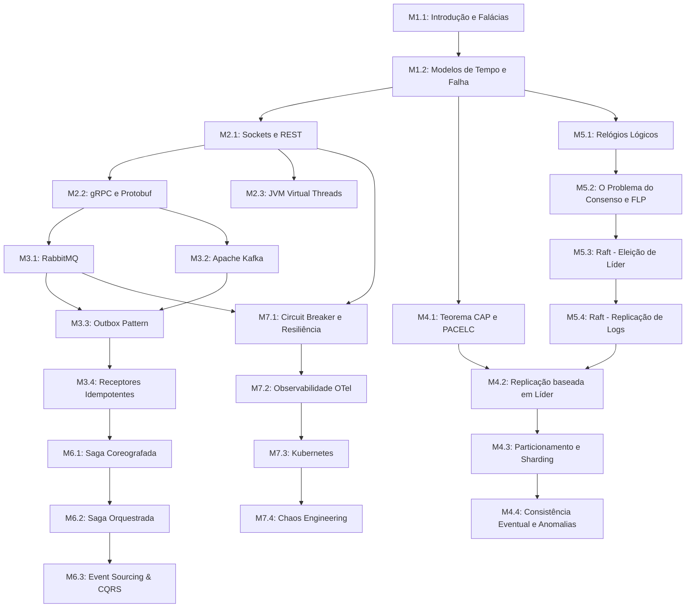

# Roadmap de Sistemas Distribuídos

Este documento define a ementa detalhada, a ordem recomendada de estudo, as dependências específicas de cada capítulo e as etapas de evolução do projeto prático unificado.

---

## 1. Grafo de Dependências dos Capítulos

---

## 2. Índice de Módulos e Capítulos

### Módulo 1: Fundamentos e Limitações Físicas
1. **[01. Introdução aos Sistemas Distribuídos e Falácias da Rede](./01-foundations/01-introduction-and-fallacies.md)**
   - *Dependências*: Nenhuma.
   - *Descrição*: Definição de sistemas distribuídos, motivações para escalabilidade horizontal e detalhamento das 8 falácias da computação em rede.
2. **[02. Modelos de Tempo e Modelos de Falha](./01-foundations/02-timing-and-failure-models.md)**
   - *Dependências*: [Capítulo 01](./01-foundations/01-introduction-and-fallacies.md).
   - *Descrição*: Sistemas síncronos, assíncronos e parcialmente síncronos. Classificação de falhas físicas de nós de Crash-Stop a Bizantino.

---

### Módulo 2: Concorrência e IPC (Inter-Process Communication)
3. **[01. Comunicação Síncrona: Sockets e APIs RESTful](./02-concurrency-ipc/01-sockets-and-rest.md)**
   - *Dependências*: [Capítulo 02](./01-foundations/02-timing-and-failure-models.md).
   - *Descrição*: Modelo físico de sockets TCP/UDP, protocolo HTTP e limites práticos de APIs REST de acoplamento forte.
4. **[02. Chamadas de Procedimento Remoto (gRPC) e Serialização com Protobuf](./02-concurrency-ipc/02-grpc-and-protobuf.md)**
   - *Dependências*: [Capítulo 01 de IPC](./02-concurrency-ipc/01-sockets-and-rest.md).
   - *Descrição*: Protocolo HTTP/2, multiplexação e desenvolvimento prático de contratos tipados gRPC com Protocol Buffers.
5. **[03. Concorrência Concorrente na JVM com Virtual Threads](./02-concurrency-ipc/03-jvm-virtual-threads.md)**
   - *Dependências*: [Capítulo 01 de IPC](./02-concurrency-ipc/01-sockets-and-rest.md).
   - *Descrição*: Threads leves do Project Loom (Java 21+), concorrência estruturada e economia de context switch em chamadas de I/O bloqueante.

---

### Módulo 3: Mensageria e Comunicação Assíncrona
6. **[01. Introdução à Mensageria Assíncrona e RabbitMQ (AMQP)](./03-messaging/01-rabbitmq-amqp.md)**
   - *Dependências*: [Capítulo 02 de IPC](./02-concurrency-ipc/02-grpc-and-protobuf.md).
   - *Descrição*: Modelo AMQP, pushes de filas dinâmicas, tratamento de confirmações de publicação e Dead Letter Exchanges.
7. **[02. Apache Kafka e Logs de Commit Distribuídos](./03-messaging/02-apache-kafka.md)**
   - *Dependências*: [Capítulo 02 de IPC](./02-concurrency-ipc/02-grpc-and-protobuf.md).
   - *Descrição*: Estrutura de partições sequenciais imutáveis, grupos de consumidores escaláveis, semânticas de consumo e rebalanceamento de partições.
8. **[03. Atomicidade na Publicação com o Padrão Outbox](./03-messaging/03-outbox-pattern.md)**
   - *Dependências*: [Capítulo 01 de Mensageria](./03-messaging/01-rabbitmq-amqp.md) ou [Capítulo 02](./03-messaging/02-apache-kafka.md).
   - *Descrição*: Como sincronizar escritas locais com disparos de eventos assíncronos usando a tabela Outbox no mesmo banco relacional local.
9. **[04. Concorrência em Mensageria com Receptores Idempotentes](./03-messaging/04-idempotency-receiver.md)**
   - *Dependências*: [Capítulo 03 de Mensageria](./03-messaging/03-outbox-pattern.md).
   - *Descrição*: Mitigação de entregas duplicadas at-least-once com chaves de controle de transação no receptor de eventos.

---

### Módulo 4: Replicação de Dados e Consistência
10. **[01. O Teorema CAP e PACELC na Tomada de Decisão Arquitetural](./04-replication-consistency/01-cap-pacelc-theorems.md)**
    - *Dependências*: [Capítulo 02 de Fundamentos](./01-foundations/02-timing-and-failure-models.md).
    - *Descrição*: Prova do Teorema CAP, teorema PACELC e análise de trade-offs reais de Latência vs. Consistência na ausência de falhas de rede.
11. **[02. Replicação Baseada em Líder (Leader-Follower)](./04-replication-consistency/02-leader-follower-replication.md)**
    - *Dependências*: [Capítulo 01 de Replicação](./04-replication-consistency/01-cap-pacelc-theorems.md).
    - *Descrição*: Replicação síncrona vs. assíncrona, failover automático de líder, split-brain e replicação lógica de instruções.
12. **[03. Particionamento (Sharding) de Dados](./04-replication-consistency/03-data-sharding.md)**
    - *Dependências*: [Capítulo 02 de Replicação](./04-replication-consistency/02-leader-follower-replication.md).
    - *Descrição*: Estratégias de particionamento (por faixa de chaves, hash de chaves, consistent hashing) e o problema de rebalanceamento de nós.
13. **[04. Consistência Eventual e Anomalias de Replicação](./04-replication-consistency/04-eventual-consistency-anomalies.md)**
    - *Dependências*: [Capítulo 02 de Replicação](./04-replication-consistency/02-leader-follower-replication.md).
    - *Descrição*: Anomalias práticas (Read-after-write, Monotonic Reads, Consistent Prefix Reads) e estratégias de mitigação no design da aplicação.

---

### Módulo 5: Tempo Lógico e Consenso Distribuído
14. **[01. Tempo Lógico e Ordenação Causal (Lamport & Vector Clocks)](./05-consensus/01-logical-clocks.md)**
    - *Dependências*: [Capítulo 02 de Fundamentos](./01-foundations/02-timing-and-failure-models.md).
    - *Descrição*: Relação Happened-Before, geração de carimbos de tempo lógico de Lamport, identificação de concorrência com relógios vetoriais.
15. **[02. Introdução ao Problema do Consenso e Impossibilidade FLP](./05-consensus/02-consensus-problem-flp.md)**
    - *Dependências*: [Capítulo 01 de Consenso](./05-consensus/01-logical-clocks.md).
    - *Descrição*: Propriedades formais do Consenso (Acordo, Validade, Terminação). Prova intuitiva do teorema de impossibilidade FLP.
16. **[03. Algoritmo de Consenso Raft: Eleição de Líder](./05-consensus/03-raft-leader-election.md)**
    - *Dependências*: [Capítulo 02 de Consenso](./05-consensus/02-consensus-problem-flp.md).
    - *Descrição*: Estados do Raft, timeouts randomizados de eleição, votação por quorum e segurança de eleição.
17. **[04. Algoritmo de Consenso Raft: Replicação de Logs](./05-consensus/03-raft-log-replication.md)**
    - *Dependências*: [Capítulo 03 de Consenso](./05-consensus/03-raft-leader-election.md).
    - *Descrição*: Máquina de Estados Replicada (SMR), reconciliação de logs conflitantes, High-Water Mark e confirmação de commits.

---

### Módulo 6: Padrões de Transações Distribuídas
18. **[01. O Padrão Saga: Coreografia](./06-distributed-patterns/01-saga-choreography.md)**
   - *Dependências*: [Capítulo 04 de Mensageria](./03-messaging/04-idempotency-receiver.md) e [Teorema CAP](./04-replication-consistency/01-cap-pacelc-theorems.md).
   - *Descrição*: Execução descentralizada orientada a eventos e regras de reversão por compensação local sem orquestrador.
19. **[02. O Padrão Saga: Orquestração e Ações Compensatórias](./06-distributed-patterns/02-saga-orchestration.md)**
   - *Dependências*: [Capítulo 01 de Sagas](./06-distributed-patterns/01-saga-choreography.md).
   - *Descrição*: Criação de máquina de estados centralizada para gerenciar fluxos complexos e regras de compensação.
20. **[03. Introdução a Event Sourcing e CQRS](./06-distributed-patterns/03-event-sourcing-cqrs.md)**
   - *Dependências*: [Capítulo 02 de Sagas](./06-distributed-patterns/02-saga-orchestration.md).
   - *Descrição*: Persistência orientada a eventos acumulados (Event Store) e separação de modelos de escrita rápida e consultas otimizadas.

---

### Módulo 7: Resiliência, Observabilidade e Operação
21. **[01. Padrões de Resiliência Distribuída (Circuit Breaker, Bulkhead, Retry)](./07-resilience-operations/01-resilience-patterns.md)**
   - *Dependências*: [Capítulo 01 de IPC](./02-concurrency-ipc/01-sockets-and-rest.md).
   - *Descrição*: Isolamento de chamadas lentas, fail-fast dinâmico, retries com jitter e economia de recursos computacionais locais.
22. **[02. Observabilidade Distribuída com OpenTelemetry](./07-resilience-operations/02-opentelemetry-observability.md)**
   - *Dependências*: [Capítulo 01 de Resiliência](./07-resilience-operations/01-resilience-patterns.md).
   - *Descrição*: Rastreamento distribuído (Traces e Spans), propagação de contexto W3C, métricas e logs estruturados em ambientes multi-serviços.
23. **[03. Orquestração e Deploy Resiliente no Kubernetes](./07-resilience-operations/03-kubernetes-orchestration.md)**
   - *Dependências*: [Capítulo 02 de Observabilidade](./07-resilience-operations/02-opentelemetry-observability.md).
   - *Descrição*: Configuração de pods, services, liveness/readiness probes, auto-scaling horizontal e tolerância a falhas na infraestrutura.
24. **[04. Testes de Robustez com Chaos Engineering](./07-resilience-operations/04-chaos-engineering.md)**
   - *Dependências*: [Capítulo 03 de Kubernetes](./07-resilience-operations/03-kubernetes-orchestration.md).
   - *Descrição*: Prática de introdução intencional de falhas (derrubar nós, injetar latência de rede artificial) para validar a resiliência do sistema distribuído.

---

## 3. Evolução do Projeto Prático (FinTech Ledger)

O estudante implementará uma **Plataforma Distribuída de Processamento de Pagamentos e Ledger Financeiro** de forma progressiva:

* **Módulo 2**: Construção de dois serviços monolíticos simples em Kotlin/Java (Serviço de Pagamentos e Serviço de Conta Corrente/Ledger) que expõem endpoints REST e contratos gRPC. A persistência será simulada puramente em memória usando estruturas Java básicas (`ConcurrentHashMap`, etc.), focando em concorrência na JVM.
* **Módulo 3**: Introdução de um broker simulado em memória (ou filas locais com interfaces limpas) para mover transações de forma assíncrona. O estudante implementará o padrão Outbox (gravando atomicamente a transação e o evento) e tratamento de idempotência no receptor para evitar pagamentos duplicados.
* **Módulo 4**: Simulação de replicação em memória. O estudante criará nós de leitura replicados e implementará cenários de inconsistência eventual (simulando atrasos físicos de rede) para ver como leituras em réplicas diferentes retornam saldos diferentes.
* **Módulo 5**: O estudante implementará o algoritmo Raft básico em memória do zero (Kotlin/Java) para simular uma eleição e replicação de log de transações financeiras imutáveis entre 3 nós, garantindo que o saldo seja consistente sob queda de 1 nó.
* **Módulo 6**: Implementação da transação complexa de transferência entre contas de bancos diferentes via Saga Orquestrada. O orquestrador gerenciará as chamadas e executará o estorno (compensação) caso o saldo do pagador seja debitado, mas o recebimento falhe no outro lado.
* **Módulo 7**: Integração com ferramentas físicas reais (PostgreSQL, Kafka, Redis, Docker, Kubernetes) como opcional e envelopamento do projeto com instrumentação OpenTelemetry. O estudante simulará falhas de pods no Kubernetes e verificará painéis de rastreamento distribuído no Grafana.