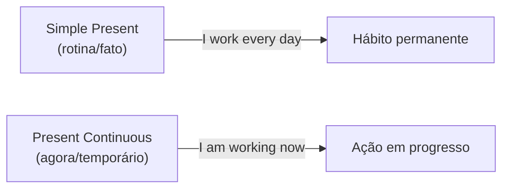

# Presente Contínuo (*Present Continuous*)

## Objetivo

Ao final deste tópico, o estudante será capaz de formar e usar o presente contínuo para descrever ações em progresso, situações temporárias e planos futuros, diferenciando-o do presente simples.

## Pré-requisitos

- [Verbo *To Be*](01-verb-to-be.md)
- [Pronomes Pessoais](02-personal-pronouns.md)
- [Simple Present](04-simple-present.md)

## Conceitos Fundamentais

### Quando usar o Present Continuous

| Uso | Exemplo | Tradução |
|-----|---------|----------|
| **Ação acontecendo agora** | I am studying English. | Eu estou estudando inglês. |
| **Situação temporária** | She is living in London. | Ela está morando em Londres. |
| **Planos futuros definidos** | We are meeting tomorrow. | Nós vamos nos encontrar amanhã. |
| **Tendência/mudança** | Prices are increasing. | Os preços estão subindo. |
| **Ação irritante (+ always)** | He is always losing his keys! | Ele está sempre perdendo as chaves! |

### Formação

Estrutura: **Sujeito + am/is/are + verbo-ing + complemento**

```
I am working.        → Eu estou trabalhando.
She is reading.      → Ela está lendo.
They are playing.    → Eles estão jogando.
```

### Regras de formação do -ing

| Regra | Verbo | + ing | Resultado |
|-------|-------|-------|-----------|
| Maioria: adicionar **-ing** | work | + ing | working |
| Termina em **-e**: remover -e | make | - e + ing | making |
| Termina em **-ie**: trocar por -y | die | - ie + ying | dying |
| CVC* (1 sílaba): dobrar consoante | run | + n + ing | running |
| CVC* (2+ sílabas, tônica final): dobrar | begin | + n + ing | beginning |
| CVC* (2+ sílabas, tônica NÃO final): não dobrar | visit | + ing | visiting |
| Termina em **-w**, **-x**, **-y**: não dobrar | play | + ing | playing |

> *CVC = Consoante-Vogal-Consoante (terminação do verbo)

#### Exemplos de formação

| Verbo | Forma -ing | Regra |
|-------|-----------|-------|
| eat | eating | regular |
| drink | drinking | regular |
| write | writing | remove -e |
| live | living | remove -e |
| sit | sitting | dobra consoante |
| swim | swimming | dobra consoante |
| lie | lying | -ie → -ying |
| tie | tying | -ie → -ying |
| show | showing | -w: não dobra |
| fix | fixing | -x: não dobra |

### Forma Afirmativa

```
I am (I'm) watching a movie.
You are (You're) learning English.
He is (He's) cooking dinner.
She is (She's) working from home.
It is (It's) raining outside.
We are (We're) having lunch.
They are (They're) playing soccer.
```

### Forma Negativa

Estrutura: **Sujeito + am/is/are + not + verbo-ing**

```
I'm not sleeping.            → Eu não estou dormindo.
She isn't working today.     → Ela não está trabalhando hoje.
They aren't listening.       → Eles não estão ouvindo.
```

### Forma Interrogativa

Estrutura: **Am/Is/Are + sujeito + verbo-ing?**

```
Are you studying?            → Você está estudando?
Is she coming to the party?  → Ela vem para a festa?
What are they doing?         → O que eles estão fazendo?
```

### Respostas Curtas

| Pergunta | Sim | Não |
|----------|-----|-----|
| Am I...? | Yes, you are. | No, you aren't. |
| Are you...? | Yes, I am. | No, I'm not. |
| Is she...? | Yes, she is. | No, she isn't. |
| Are they...? | Yes, they are. | No, they aren't. |

## Regras e Exceções

### Verbos que NÃO usam o Present Continuous (*Stative Verbs*)

Alguns verbos descrevem **estados**, não ações, e normalmente **não são usados** com -ing:

| Categoria | Verbos | Exemplo Correto |
|-----------|--------|-----------------|
| **Sentidos** | see, hear, smell, taste | I **see** a bird. (❌ I'm seeing) |
| **Opinião/Crença** | think, believe, know, understand | I **know** the answer. |
| **Emoção** | like, love, hate, want, need | She **loves** pizza. |
| **Posse** | have, own, belong | He **has** a car. |
| **Outros** | be, seem, mean, cost | It **costs** $10. |

> **Exceção**: Alguns desses verbos podem usar -ing quando têm **significado diferente**:
> - I **think** it's good. (opinião → estado)
> - I **am thinking** about the problem. (ação de refletir → progresso)
> - She **has** a car. (posse → estado)
> - She **is having** lunch. (ação de almoçar → progresso)

### Palavras-chave do Present Continuous

| Expressão | Tradução | Exemplo |
|-----------|----------|---------|
| now | agora | She is working **now**. |
| right now | agora mesmo | I'm studying **right now**. |
| at the moment | no momento | He's sleeping **at the moment**. |
| today | hoje | We're meeting **today**. |
| this week/month | esta semana/mês | I'm reading a new book **this week**. |
| currently | atualmente | She's **currently** living in London. |

## Comparações

### Simple Present vs. Present Continuous

| Simple Present | Present Continuous |
|---------------|-------------------|
| Rotina/hábito | Ação em progresso |
| I **drink** coffee every morning. | I **am drinking** coffee now. |
| She **works** at a bank. | She **is working** at the moment. |
| It **rains** a lot in January. | It **is raining** right now. |
| He **plays** tennis on Saturdays. | He **is playing** tennis now. |



## Pronúncia e Fonética

| Forma | Pronúncia |
|-------|-----------|
| -ing | /ɪŋ/ — "ing" (não "ingue"!) |
| working | /ˈwɜːrkɪŋ/ |
| doing | /ˈduːɪŋ/ |
| going | /ˈɡoʊɪŋ/ |

> **Erro comum de brasileiros**: pronunciar -ing como "ingue". O som /ŋ/ é nasal, sem o "gue" final.

## Erros Comuns

### 1. Usar Present Continuous para rotinas

- ❌ *I am working every day.* (rotina)
- ✅ *I work every day.* (Simple Present para rotina)
- ✅ *I am working right now.* (ação em progresso)

### 2. Usar -ing com stative verbs

- ❌ *I am knowing the answer.*
- ✅ *I know the answer.*

### 3. Esquecer o verbo *to be*

- ❌ *She working now.*
- ✅ *She **is** working now.*

### 4. Erros na formação do -ing

- ❌ *writeing* → ✅ *writing* (remove -e)
- ❌ *runing* → ✅ *running* (dobra consoante)
- ❌ *dieing* → ✅ *dying* (ie → y)

### 5. Pronunciar -ing como "ingue"

- ❌ /wɔːrkɪŋɡ/ "uórkingue"
- ✅ /wɜːrkɪŋ/ "uôrking"

## Exemplos

### Diálogo — Telefonema

```
A: Hi! What are you doing?
B: I'm watching a movie. And you?
A: I'm cooking dinner. Is Maria with you?
B: No, she isn't. She's working late today.
A: Oh, that's too bad. Are you coming to the party on Saturday?
B: Yes, I am! I'm looking forward to it.
```

### Diálogo — Situação temporária

```
A: Where are you living now?
B: I'm living in an apartment near the beach. But it's temporary.
   I'm looking for a house.
A: That's nice! Are you enjoying it?
B: Yes, I am. But my neighbors are always making noise!
```

## Exercícios

### Nível 1 — Forme o Present Continuous

1. She / read / a book → ______
2. They / play / soccer → ______
3. I / study / for the test → ______
4. He / not / work / today → ______
5. We / not / watch / TV → ______

### Nível 2 — Simple Present ou Present Continuous?

1. I ______ (study) English every day.
2. She ______ (cook) dinner right now.
3. He ______ (like) chocolate.
4. They ______ (play) tennis at the moment.
5. We ______ (go) to the beach every summer.
6. I ______ (read) a great book this week.

### Nível 3 — Traduza para o inglês

1. Ela está trabalhando agora.
2. Eu não estou dormindo.
3. O que você está fazendo?
4. Está chovendo lá fora.
5. Eles estão morando em Londres no momento.
6. Ela está sempre reclamando! (irritação)

### Gabarito

<details>
<summary>Clique para ver as respostas</summary>

**Nível 1**: 1) She is reading a book. 2) They are playing soccer. 3) I am studying for the test. 4) He is not working today. / He isn't working today. 5) We are not watching TV. / We aren't watching TV.

**Nível 2**: 1) study (rotina), 2) is cooking (agora), 3) likes (estado), 4) are playing (no momento), 5) go (todo verão), 6) am reading (esta semana — temporário)

**Nível 3**: 1) She is working now. 2) I'm not sleeping. 3) What are you doing? 4) It is raining outside. 5) They are living in London at the moment. 6) She is always complaining!

</details>

## Referências

- [Cambridge Dictionary — Present Continuous](https://dictionary.cambridge.org/grammar/british-grammar/present-continuous)
- [British Council — Present Continuous](https://learnenglish.britishcouncil.org/grammar/english-grammar-reference/present-continuous)
- Murphy, R. *Essential Grammar in Use*. Cambridge University Press. Units 3–4.
- [BBC Learning English — Present Continuous](https://www.bbc.co.uk/learningenglish/english/course/lower-intermediate/unit-2/tab/grammar)
