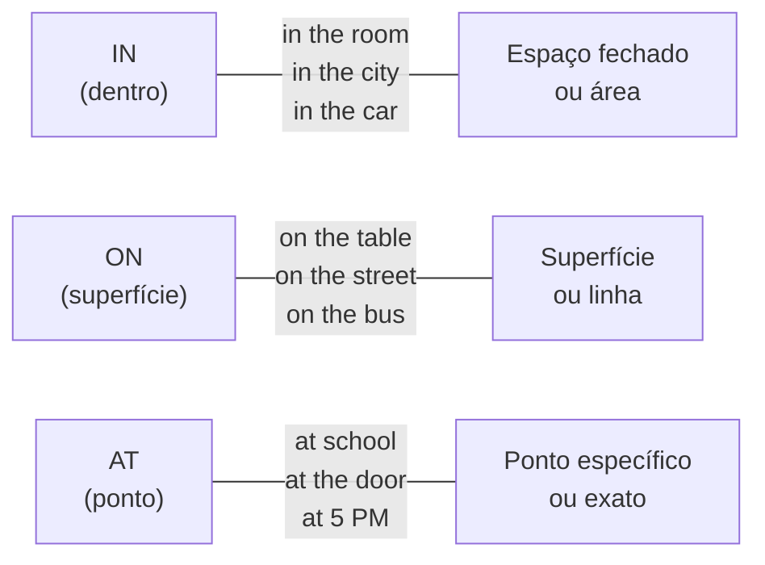

# Preposições de Lugar e Tempo (*Prepositions of Place and Time*)

## Objetivo

Ao final deste tópico, o estudante será capaz de usar corretamente as preposições *in*, *on*, *at* e outras preposições essenciais para indicar localização e tempo em inglês.

## Pré-requisitos

- [Verbo *To Be*](01-verb-to-be.md)
- [Simple Present](04-simple-present.md)

## Conceitos Fundamentais

### Preposições de Lugar

#### *In*, *On*, *At* — Lugar

| Preposição | Conceito | Exemplos |
|-----------|---------|----------|
| **in** | Dentro de / espaço fechado | in the room, in the box, in Brazil, in São Paulo, in the car |
| **on** | Sobre uma superfície / linha | on the table, on the wall, on the floor, on the bus, on Main Street |
| **at** | Ponto específico / localização | at the door, at the bus stop, at home, at work, at school |



#### Outras preposições de lugar

| Preposição | Significado | Exemplo | Tradução |
|-----------|-------------|---------|----------|
| **under** | embaixo de | The cat is under the table. | O gato está embaixo da mesa. |
| **between** | entre (dois) | The bank is between the bakery and the pharmacy. | O banco fica entre a padaria e a farmácia. |
| **next to** | ao lado de | She is sitting next to me. | Ela está sentada ao meu lado. |
| **behind** | atrás de | The garden is behind the house. | O jardim fica atrás da casa. |
| **in front of** | na frente de | The car is in front of the building. | O carro está na frente do prédio. |
| **near** | perto de | There's a park near my house. | Tem um parque perto da minha casa. |
| **above** | acima de | The clock is above the door. | O relógio está acima da porta. |
| **below** | abaixo de | The temperature is below zero. | A temperatura está abaixo de zero. |
| **opposite** | em frente a / do outro lado | The restaurant is opposite the bank. | O restaurante fica em frente ao banco. |

### Preposições de Tempo

#### *In*, *On*, *At* — Tempo

| Preposição | Conceito | Exemplos |
|-----------|---------|----------|
| **in** | Períodos longos | in January, in 2024, in summer, in the morning, in the afternoon, in the evening |
| **on** | Dias e datas | on Monday, on January 5th, on my birthday, on Christmas Day, on weekends |
| **at** | Horas e momentos pontuais | at 7 AM, at noon, at midnight, at night, at Christmas, at the moment |

> **Exceção importante**: *at night* (não ~~in the night~~), mas *in the morning/afternoon/evening*.

#### Resumo visual

| Preposição | Lugar | Tempo |
|-----------|-------|-------|
| **in** | Espaço fechado/área | Meses, anos, estações, partes do dia |
| **on** | Superfície | Dias, datas |
| **at** | Ponto específico | Horas, momentos |

#### Sem preposição (zero preposition)

Algumas expressões de tempo **não** usam preposição:

| Com preposição | Sem preposição |
|---------------|---------------|
| on Monday | ❌ |
| in the morning | ❌ |
| — | **this** morning |
| — | **last** week |
| — | **next** Monday |
| — | **every** day |
| — | **today**, **tomorrow**, **yesterday** |

```
❌ I'll see you on next Monday.
✅ I'll see you next Monday.

❌ She arrived at yesterday.
✅ She arrived yesterday.
```

## Regras e Exceções

### Regras especiais de *in*, *on*, *at*

#### Lugar

| Situação | Regra | Exemplo |
|----------|-------|---------|
| Países e cidades | **in** | in Brazil, in Tokyo |
| Ruas e avenidas | **on** | on Main Street, on Paulista Avenue |
| Endereços completos | **at** | at 42 Baker Street |
| Transporte público | **on** | on the bus, on the train, on the plane |
| Carro e táxi | **in** | in the car, in a taxi |
| Prédios (dentro) | **in** | in the building, in the office |
| Locais como função | **at** | at school, at work, at home, at the airport |

> **Por que *on the bus* mas *in the car*?**
> - *On*: transportes onde você pode ficar de pé e andar (bus, train, plane, ship)
> - *In*: veículos pequenos onde você está sentado (car, taxi)

#### Tempo

| Situação | Regra | Exemplo |
|----------|-------|---------|
| Hora exata | **at** | at 3:00, at 7:30 PM |
| Partes do dia | **in** | in the morning, in the afternoon |
| *Night* | **at** | at night (**exceção!**) |
| Dias da semana | **on** | on Tuesday |
| Datas | **on** | on March 15th |
| Meses | **in** | in December |
| Anos | **in** | in 2025 |
| Estações | **in** | in winter |
| Feriados | **at/on** | at Christmas (período), on Christmas Day (dia) |

### *At home* vs. *In my house*

| Expressão | Significado |
|-----------|-------------|
| **at home** | Em casa (conceito, função — o lugar onde se mora) |
| **in my house** | Dentro da minha casa (espaço físico) |

```
I'm at home. (Estou em casa — uso geral)
The keys are in my house. (As chaves estão dentro da minha casa — espaço físico)
```

## Erros Comuns

### 1. Traduzir preposição literalmente do português

| Português | Inglês correto | Erro |
|-----------|---------------|------|
| Eu moro **em** São Paulo. | I live **in** São Paulo. | ✅ |
| Eu moro **na** Rua Augusta. | I live **on** Augusta Street. | ❌ in (tradução de "na") |
| Eu estou **na** escola. | I am **at** school. | ❌ in (tradução de "na") |
| **De** noite | **At** night | ❌ in the night |

### 2. Confundir *in* e *on* para transporte

- ❌ *I'm in the bus.*
- ✅ *I'm **on** the bus.*
- ✅ *I'm **in** the car.*

### 3. Usar preposição com *last/next/this/every*

- ❌ *I'll go **on** next Monday.*
- ✅ *I'll go next Monday.*

### 4. Usar *in the night*

- ❌ *I study **in** the night.*
- ✅ *I study **at** night.*
- ✅ *I study **in** the evening.* (antes de escurecer)

## Exemplos

### Diálogo — Combinando um encontro

```
A: When are you free?
B: I'm free on Saturday. In the morning or in the afternoon?
A: In the afternoon. At 3 PM?
B: Perfect! Where do we meet?
A: At the coffee shop on Main Street. It's next to the bookstore.
B: I know it! It's between the bakery and the pharmacy, right?
A: Exactly! See you on Saturday at 3!
```

### Descrevendo um quarto

```
There is a bed in the room. The bed is next to the window.
There is a lamp on the table. The table is between the bed and the door.
My books are on the shelf above the desk.
My shoes are under the bed.
The clock is on the wall, behind the door.
```

## Exercícios

### Nível 1 — Complete com *in*, *on* ou *at*

1. I live ______ Brazil.
2. The meeting is ______ Monday.
3. She wakes up ______ 6 AM.
4. The book is ______ the table.
5. We study ______ the evening.
6. He works ______ a bank.
7. My birthday is ______ July.
8. I'll see you ______ Christmas.

### Nível 2 — Complete com a preposição correta

1. The cat is ______ (under / on) the table.
2. The pharmacy is ______ (between / behind) the bank and the supermarket.
3. She is sitting ______ (next to / above) me.
4. I travel ______ (in / on) the bus every day.
5. The picture is ______ (on / in) the wall.
6. They arrived ______ (in / at) the airport ______ (in / at) 5 PM.

### Nível 3 — Traduza para o inglês

1. Eu moro na Rua Augusta.
2. O gato está embaixo da cadeira.
3. A reunião é na segunda-feira de manhã.
4. Ela trabalha em casa.
5. O restaurante fica ao lado do banco.
6. Eu estudo à noite.

### Gabarito

<details>
<summary>Clique para ver as respostas</summary>

**Nível 1**: 1) in, 2) on, 3) at, 4) on, 5) in, 6) at/in, 7) in, 8) at

**Nível 2**: 1) under, 2) between, 3) next to, 4) on, 5) on, 6) at / at

**Nível 3**: 1) I live on Augusta Street. 2) The cat is under the chair. 3) The meeting is on Monday in the morning. / The meeting is on Monday morning. 4) She works at home. 5) The restaurant is next to the bank. 6) I study at night.

</details>

## Referências

- [Cambridge Dictionary — Prepositions](https://dictionary.cambridge.org/grammar/british-grammar/prepositions)
- [British Council — Prepositions of place](https://learnenglish.britishcouncil.org/grammar/english-grammar-reference/prepositions-of-place)
- [British Council — Prepositions of time](https://learnenglish.britishcouncil.org/grammar/english-grammar-reference/prepositions-of-time)
- Murphy, R. *Essential Grammar in Use*. Cambridge University Press. Units 104–109.
