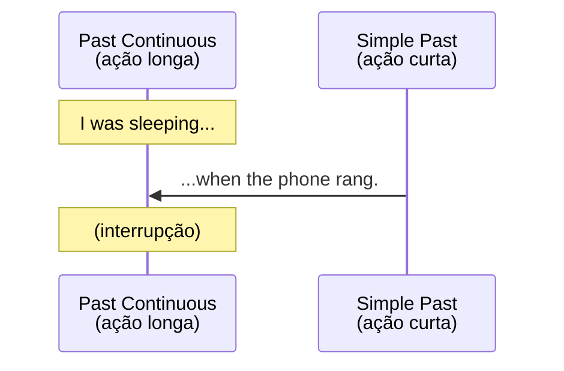

# Passado Contínuo (*Past Continuous*)

## Objetivo

Ao final deste tópico, o estudante será capaz de usar o passado contínuo para descrever ações em progresso no passado, combinar com o passado simples usando *when* e *while*, e diferenciar os dois tempos verbais.

## Pré-requisitos

- [Simple Past — Regular](01-simple-past-regular.md)
- [Simple Past — Irregular](02-simple-past-irregular.md)
- [Present Continuous](../01-a1-beginner/05-present-continuous.md)

## Conceitos Fundamentais

### Quando usar o Past Continuous

| Uso | Exemplo | Tradução |
|-----|---------|----------|
| **Ação em progresso no passado** | I was studying at 8 PM. | Eu estava estudando às 20h. |
| **Contexto/cenário** | The sun was shining. Birds were singing. | O sol estava brilhando. Os pássaros estavam cantando. |
| **Ações simultâneas** | She was cooking while he was cleaning. | Ela cozinhava enquanto ele limpava. |
| **Ação interrompida** | I was sleeping when the phone rang. | Eu estava dormindo quando o telefone tocou. |

### Formação

Estrutura: **Sujeito + was/were + verbo-ing**

| Sujeito | Auxiliar | Exemplo |
|---------|----------|---------|
| I / He / She / It | **was** | I was working. |
| You / We / They | **were** | They were playing. |

### Forma Afirmativa

```
I was reading a book at 9 PM.
She was working when I called.
They were watching TV last night.
We were living in London at the time.
```

### Forma Negativa

Estrutura: **Sujeito + was/were + not + verbo-ing**

```
I wasn't sleeping.           → Eu não estava dormindo.
She wasn't paying attention. → Ela não estava prestando atenção.
They weren't studying.       → Eles não estavam estudando.
```

### Forma Interrogativa

Estrutura: **Was/Were + sujeito + verbo-ing?**

```
Were you sleeping?           → Você estava dormindo?
Was she working?             → Ela estava trabalhando?
What were they doing?        → O que eles estavam fazendo?
```

### *When* e *While* — Combinando com Simple Past

#### *When* + Simple Past (ação curta que interrompe)



```
I was taking a shower when the doorbell rang.
She was driving when it started to rain.
We were having dinner when the lights went out.
They were playing soccer when it began to rain.
```

> **Estrutura**: *Past Continuous* + **when** + *Simple Past*
> Ou: **When** + *Simple Past* + *Past Continuous*

```
When the phone rang, I was sleeping.
= I was sleeping when the phone rang.
```

#### *While* + Past Continuous (ações simultâneas)

```
While I was cooking, she was watching TV.
While he was studying, his brother was playing games.
She arrived while we were having lunch.
```

> **Regra prática**:
> - **when** → normalmente com Simple Past (ação curta)
> - **while** → normalmente com Past Continuous (ação longa)

### Resumo de Combinações

| Estrutura | Significado | Exemplo |
|-----------|-------------|---------|
| PC + **when** + SP | Ação em progresso interrompida | I was reading **when** he called. |
| **While** + PC, SP | Algo aconteceu durante uma ação | **While** I was walking, I found a wallet. |
| **While** + PC, PC | Ações simultâneas | **While** she was cooking, he was cleaning. |
| SP + **while** + PC | Ação curta durante ação longa | He called **while** I was studying. |

## Comparações

### Simple Past vs. Past Continuous

| Simple Past | Past Continuous |
|-------------|----------------|
| Ação **concluída** | Ação **em progresso** |
| I **read** a book yesterday. | I **was reading** a book at 9 PM. |
| She **cooked** dinner. | She **was cooking** dinner when I arrived. |
| They **played** soccer. | They **were playing** soccer at that time. |

```
Yesterday at 8 PM:
- I watched a movie. (terminei de assistir → fato concluído)
- I was watching a movie. (estava assistindo naquele momento → em progresso)
```

## Erros Comuns

### 1. Usar *was* com *you/we/they*

- ❌ *They was playing soccer.*
- ✅ *They **were** playing soccer.*

### 2. Usar Past Continuous para ações concluídas

- ❌ *I was watching a movie yesterday.* (quando quer dizer "assisti")
- ✅ *I **watched** a movie yesterday.* (ação concluída)
- ✅ *I **was watching** a movie when she called.* (em progresso — correto)

### 3. Usar Past Continuous para sequência de eventos

- ❌ *I was waking up, was taking a shower, and was having breakfast.*
- ✅ *I woke up, took a shower, and had breakfast.* (sequência → Simple Past)

### 4. Confundir *when* e *while*

- ❌ *While the phone rang, I was sleeping.* (*while* + ação curta)
- ✅ ***When** the phone rang, I was sleeping.* (*when* + ação curta)
- ✅ ***While** I was sleeping, the phone rang.* (*while* + ação longa)

### 5. Usar stative verbs no Past Continuous

- ❌ *I was knowing the answer.*
- ✅ *I **knew** the answer.*

## Exemplos

### Diálogo — O que aconteceu?

```
A: What were you doing yesterday at 6 PM?
B: I was cooking dinner. Why?
A: Because I called you, but you didn't answer.
B: Oh, sorry! I was listening to music while I was cooking.
   I didn't hear the phone.
A: No problem! What were you making?
B: Pasta. It was delicious!
```

### Narrativa — Uma cena descritiva

```
It was a beautiful Sunday morning. The sun was shining and the birds 
were singing. People were walking in the park. Some children were 
playing near the lake. An old man was sitting on a bench, reading 
a newspaper. A woman was jogging along the path.

Suddenly, a dog ran across the path. The woman was running and didn't 
see it. She tripped and fell. Everyone stopped what they were doing 
and ran to help her.
```

## Exercícios

### Nível 1 — Complete com *was* ou *were* + verbo-ing

1. I ______ (sleep) when you called.
2. They ______ (play) soccer at 4 PM.
3. She ______ (cook) dinner.
4. We ______ (study) together last night.
5. He ______ (not / work) yesterday.

### Nível 2 — Combine com *when* ou *while*

1. I was taking a shower ______ the phone rang.
2. ______ she was studying, her brother was watching TV.
3. He fell asleep ______ he was reading a book.
4. ______ the teacher came in, the students were talking.
5. She was walking home ______ it started to rain.

### Nível 3 — Simple Past ou Past Continuous?

1. I ______ (walk) to work when I ______ (see) an accident.
2. She ______ (study) when the lights ______ (go) out.
3. They ______ (have) dinner at 8 PM yesterday.
4. While we ______ (wait) for the bus, it ______ (start) to rain.
5. He ______ (read) a book when she ______ (arrive).

### Nível 4 — Traduza para o inglês

1. Eu estava dormindo quando o alarme tocou.
2. O que você estava fazendo às 10 horas?
3. Enquanto ela cozinhava, ele lavava a louça.
4. Estava chovendo quando eu saí de casa.
5. Eles estavam jogando futebol quando começou a chover.

### Gabarito

<details>
<summary>Clique para ver as respostas</summary>

**Nível 1**: 1) was sleeping, 2) were playing, 3) was cooking, 4) were studying, 5) wasn't working

**Nível 2**: 1) when, 2) While, 3) while, 4) When, 5) when

**Nível 3**: 1) was walking / saw, 2) was studying / went, 3) were having (ou had), 4) were waiting / started, 5) was reading / arrived

**Nível 4**: 1) I was sleeping when the alarm went off. 2) What were you doing at 10 o'clock? 3) While she was cooking, he was doing the dishes. 4) It was raining when I left home. 5) They were playing soccer when it started to rain.

</details>

## Referências

- [Cambridge Dictionary — Past Continuous](https://dictionary.cambridge.org/grammar/british-grammar/past-continuous)
- [British Council — Past Continuous](https://learnenglish.britishcouncil.org/grammar/english-grammar-reference/past-continuous)
- Murphy, R. *Essential Grammar in Use*. Cambridge University Press. Units 6–7.
