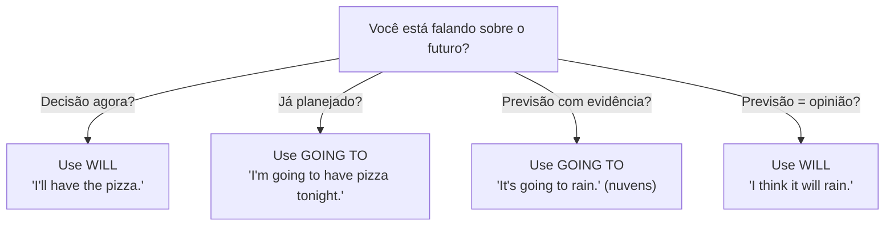

# Futuro — *Will* e *Going to*

## Objetivo

Ao final deste tópico, o estudante será capaz de usar *will* e *going to* para falar sobre o futuro, entendendo quando usar cada forma e as diferenças entre elas.

## Pré-requisitos

- [Simple Present](../01-a1-beginner/04-simple-present.md)
- [Present Continuous](../01-a1-beginner/05-present-continuous.md)

## Conceitos Fundamentais

### Duas formas de futuro

| Forma | Uso principal | Exemplo |
|-------|--------------|---------|
| **will** | Decisões espontâneas, promessas, previsões | I'll help you. |
| **going to** | Planos/intenções, evidências | I'm going to study tonight. |

### *Will*

#### Formação

| Forma | Estrutura |
|-------|----------|
| Afirmativa | Sujeito + **will** + verbo base |
| Negativa | Sujeito + **will not (won't)** + verbo base |
| Interrogativa | **Will** + sujeito + verbo base? |

```
I will help you.      → I'll help you.
She will not come.    → She won't come.
Will you be there?    → Você estará lá?
```

#### Quando usar *will*

| Uso | Exemplo | Tradução |
|-----|---------|----------|
| **Decisão espontânea** (naquele momento) | The phone is ringing. I'll answer it. | Vou atender. |
| **Promessa** | I'll always love you. | Eu sempre vou te amar. |
| **Oferta** | I'll carry your bags. | Eu carrego suas bolsas. |
| **Previsão (opinião)** | I think it will rain. | Acho que vai chover. |
| **Fato futuro** | She will be 30 next year. | Ela vai fazer 30 ano que vem. |
| **Ameaça/Aviso** | I'll call the police! | Vou ligar para a polícia! |

### *Going to*

#### Formação

| Forma | Estrutura |
|-------|----------|
| Afirmativa | Sujeito + **am/is/are + going to** + verbo base |
| Negativa | Sujeito + **am/is/are + not + going to** + verbo base |
| Interrogativa | **Am/Is/Are** + sujeito + **going to** + verbo base? |

```
I'm going to study tonight.
She isn't going to come to the party.
Are you going to travel this summer?
```

#### Quando usar *going to*

| Uso | Exemplo | Tradução |
|-----|---------|----------|
| **Plano/Intenção** (já decidido) | I'm going to buy a new car. | Vou comprar um carro novo. |
| **Previsão com evidência** | Look at those clouds! It's going to rain. | Olhe aquelas nuvens! Vai chover. |
| **Intenção firme** | She's going to study medicine. | Ela vai estudar medicina. |

### A Grande Diferença: *Will* vs. *Going to*



#### Comparação lado a lado

| Situação | *Will* | *Going to* |
|----------|--------|-----------|
| **Decisão** | Espontânea (agora) | Planejada (antes) |
| | *"I'll have the steak."* (no restaurante) | *"I'm going to cook steak tonight."* (já planejou) |
| **Previsão** | Baseada em opinião | Baseada em evidência |
| | *"I think Brazil will win."* | *"Brazil is winning 3-0. They're going to win."* |

### Contrações

| Formal | Contração | Pronúncia |
|--------|-----------|-----------|
| I will | I'll | /aɪl/ "áiol" |
| you will | you'll | /juːl/ "iúl" |
| he will | he'll | /hiːl/ "ríl" |
| she will | she'll | /ʃiːl/ "xíl" |
| it will | it'll | /ˈɪtl/ "ítol" |
| we will | we'll | /wiːl/ "uíl" |
| they will | they'll | /ðeɪl/ "dêiol" |
| will not | won't | /woʊnt/ "uôunt" |
| going to | gonna* | /ˈɡʌnə/ "gâna" |

> *"gonna"* é apenas oral/informal. Não use na escrita.

## Regras e Exceções

### Presente Contínuo para futuro

O **Present Continuous** também pode expressar futuro para **planos confirmados com horário/local definido**:

```
I'm meeting John at 5 PM tomorrow. (agenda marcada)
We're flying to Paris next Monday. (passagens compradas)
She's having dinner with her parents tonight. (combinado)
```

> **Diferença**: *going to* = intenção. Present Continuous = arranjo confirmado.

### *Shall* (formal/BrE)

*Shall* pode substituir *will* com **I** e **we** para sugestões e ofertas (mais comum no inglês britânico):

```
Shall I open the window?    → Quer que eu abra a janela?
Shall we go?                → Vamos?
Shall I help you?           → Devo ajudá-lo?
```

## Erros Comuns

### 1. Usar *will* para planos já decididos

- ❌ *I will travel to Japan next month.* (já comprou passagem)
- ✅ *I'm **going to** travel to Japan next month.*

### 2. Usar *going to* para decisões espontâneas

- ❌ (O telefone toca) *I'm going to answer it.*
- ✅ *I'll answer it.* (decisão do momento)

### 3. Esquecer o *to* em *going to*

- ❌ *I'm going study tonight.*
- ✅ *I'm going **to** study tonight.*

### 4. Usar *will* com *I think* + certeza

- *I **think** it will rain.* (opinião — correto com will)
- *Look at those clouds! It'**s going to** rain.* (evidência — going to)

### 5. Duplo futuro

- ❌ *I will going to study.*
- ✅ *I will study.* ou *I'm going to study.*

## Exemplos

### Diálogo — Planos para o fim de semana

```
A: What are you going to do this weekend?
B: I'm going to visit my parents on Saturday. And on Sunday,
   I'm going to clean the house.
A: That sounds busy! I don't have any plans yet.
B: Why don't you come with me to my parents' house?
A: That's a great idea! I'll bring some cake.
B: Perfect! They'll love that.
```

### Diálogo — Decisões espontâneas

```
A: I'm hungry.
B: Me too! Let's order food.
A: Good idea. What do you want?
B: I'll have a pizza. What about you?
A: Hmm... I think I'll have sushi.
B: OK, I'll call the restaurant.
```

## Exercícios

### Nível 1 — Complete com *will* ou *going to*

1. (O telefone toca) I ______ answer it!
2. She ______ study medicine. She already applied to the university.
3. Look at those clouds! It ______ rain.
4. I think Brazil ______ win the World Cup.
5. We ______ move to a new apartment. We already found one.
6. "There's no milk." — "I ______ buy some."

### Nível 2 — Complete as frases

1. I ______ (travel) to London next month. I already booked the hotel.
2. Don't worry. I ______ (help) you with your homework.
3. She ______ (not / come) to the party. She told me yesterday.
4. ______ you ______ (be) at home tonight?
5. They ______ (get married) in June. They sent the invitations.
6. I promise I ______ (not / be) late again.

### Nível 3 — Traduza para o inglês

1. Eu vou estudar inglês hoje à noite. (já planejado)
2. Acho que vai chover amanhã. (opinião)
3. Olhe! O ônibus vai sair! (evidência)
4. Eu levo suas malas. (oferta espontânea)
5. O que você vai fazer no sábado? (plano)
6. Não se preocupe. Eu não vou contar para ninguém. (promessa)

### Gabarito

<details>
<summary>Clique para ver as respostas</summary>

**Nível 1**: 1) 'll (will), 2) is going to, 3) is going to, 4) will, 5) are going to, 6) 'll (will)

**Nível 2**: 1) am going to travel, 2) will help / 'll help, 3) isn't going to come, 4) Will / be, 5) are going to get married, 6) will not be / won't be

**Nível 3**: 1) I'm going to study English tonight. 2) I think it will rain tomorrow. 3) Look! The bus is going to leave! 4) I'll carry your bags. 5) What are you going to do on Saturday? 6) Don't worry. I won't tell anyone.

</details>

## Referências

- [Cambridge Dictionary — Future](https://dictionary.cambridge.org/grammar/british-grammar/future)
- [British Council — Will and Going to](https://learnenglish.britishcouncil.org/grammar/english-grammar-reference/will-and-going-to)
- Murphy, R. *Essential Grammar in Use*. Cambridge University Press. Units 27–30.
