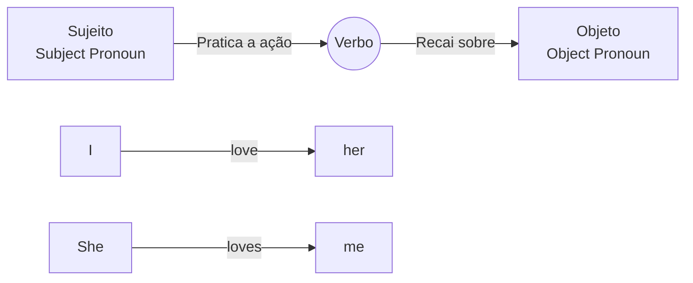

# Pronomes Objetos (*Object Pronouns*)

## Objetivo

Ao final deste tópico, o estudante será capaz de identificar e usar os pronomes objetos em inglês para substituir substantivos que recebem a ação do verbo ou vêm após preposições.

## Pré-requisitos

- [Pronomes Pessoais](../01-a1-beginner/02-personal-pronouns.md)
- [Simple Present](../01-a1-beginner/04-simple-present.md)

## Conceitos Fundamentais

### O que são *Object Pronouns*?

Os *Object Pronouns* (pronomes objetos) substituem o **objeto** de uma frase — a pessoa ou coisa que **recebe** a ação do verbo ou que vem após uma **preposição**.

| Subject Pronoun (Sujeito - Pratica a ação) | Object Pronoun (Objeto - Recebe a ação) |
|-------------------------------------------|----------------------------------------|
| **I** (eu) | **me** (me, mim, comigo) |
| **you** (você) | **you** (te, você, ti, contigo) |
| **he** (ele) | **him** (o, lhe, ele) |
| **she** (ela) | **her** (a, lhe, ela) |
| **it** (ele/ela - coisas/animais) | **it** (o, a, lhe, ele/ela) |
| **we** (nós) | **us** (nos, nós, conosco) |
| **they** (eles/elas) | **them** (os, as, lhes, eles/elas) |

### Sujeito vs. Objeto

A estrutura básica do inglês é: **Sujeito + Verbo + Objeto**



```
✅ I love her.       (Eu amo ela / Eu a amo)
❌ I love she.       (ERRADO: "she" só pode ser sujeito)

✅ She loves me.     (Ela me ama)
❌ Her loves me.     (ERRADO: "her" só pode ser objeto)
```

### Usos principais

#### 1. Após verbos (Recebedor da ação)

```
I see him every day.        → Eu o vejo / vejo ele todos os dias.
Can you help me?            → Você pode me ajudar?
We invited them.            → Nós os convidamos.
He called us.               → Ele nos ligou.
I bought it yesterday.      → Eu comprei isso/ele ontem.
```

#### 2. Após preposições (*with, for, about, to, from*, etc.)

```
This gift is for you.             → Este presente é para você.
I want to go with him.            → Eu quero ir com ele.
Don't talk about them.            → Não fale sobre eles.
Listen to me!                     → Escute-me!
She received a letter from us.    → Ela recebeu uma carta de nós.
```

## Regras e Exceções

### *You* e *It* não mudam

Os pronomes *you* e *it* são iguais tanto na forma de sujeito quanto de objeto. A função é determinada pela **posição** na frase:

```
You love John. (You = sujeito)
John loves you. (you = objeto)

It is on the table. (It = sujeito)
I bought it yesterday. (it = objeto)
```

### Ordem com dois objetos

Quando um verbo tem dois objetos (um direto - "o quê" e um indireto - "para quem"), o pronome objeto geralmente vem logo após o verbo:

```
Give me the book. (Me dê o livro.)
Show us your photos. (Nos mostre suas fotos.)
He sent her a message. (Ele mandou uma mensagem para ela.)
```

> Se usar *to* ou *for*, a ordem inverte:
> *Give the book **to me**.*

## Erros Comuns

### 1. Usar *Subject Pronouns* após verbos ou preposições

- ❌ *I saw he at the mall.*
- ✅ *I saw **him** at the mall.*
- ❌ *This is for she.*
- ✅ *This is for **her**.*

### 2. Confundir *his* (possessivo) com *him* (objeto)

- ❌ *I love his.*
- ✅ *I love **him**.* (O pronome objeto de 'he' é 'him')
- ✅ *I love his dog.* (Correto, pois 'his' acompanha o substantivo 'dog')

### 3. Usar pronomes retos brasileiros ("eu vi ele") traduzidos literalmente

No português falado do Brasil, é comum usar pronomes retos como objeto ("Eu vi ele", "Deixa eu ver"). Em inglês, isso é estritamente **incorreto**:

- ❌ *I saw he.*
- ✅ *I saw **him**.*
- ❌ *Let I see.*
- ✅ *Let **me** see.*
- ❌ *Call they.*
- ✅ *Call **them**.*

## Exemplos

### Diálogo — Falando sobre amigos e família

```
A: Did you see Sarah today?
B: Yes, I saw her at the library. I gave her the book she wanted.
A: Great. What about John and Mark?
B: I called them, but they didn't answer. I left a message for them.
A: Okay. By the way, can you help me with this project?
B: Of course! I can help you tomorrow afternoon.
```

### Frases comuns

```
Tell me the truth!                (Diga-me a verdade!)
Let us go!                        (Deixe-nos ir! / Vamos!)
Look at it!                       (Olhe para isso/ele!)
Are you talking to me?            (Você está falando comigo?)
I don't know him.                 (Eu não o conheço.)
```

## Exercícios

### Nível 1 — Substitua o substantivo em destaque por um pronome objeto

1. I saw **Mary** yesterday. → I saw ______ yesterday.
2. We invited **Paul and Jane**. → We invited ______.
3. She called **Peter**. → She called ______.
4. I bought **the car**. → I bought ______.
5. This present is for **my mother**. → This present is for ______.
6. Don't look at **the children**. → Don't look at ______.

### Nível 2 — Escolha o pronome correto

1. (He / Him) wants to talk to (she / her).
2. We went to the movies with (they / them).
3. Do you know (I / me)?
4. (They / Them) invited (we / us) to the party.
5. Can you pass the salt to (he / him)?
6. Look at (it / he)! It's beautiful!

### Nível 3 — Traduza para o inglês

1. Eu o vi ontem. (ele)
2. Ela nos ligou na semana passada.
3. Você pode me ajudar?
4. Este livro é para ela.
5. Eu não gosto deles.
6. Deixe-me ver.

### Gabarito

<details>
<summary>Clique para ver as respostas</summary>

**Nível 1**: 1) her, 2) them, 3) him, 4) it, 5) her, 6) them

**Nível 2**: 1) He / her, 2) them, 3) me, 4) They / us, 5) him, 6) it

**Nível 3**: 1) I saw him yesterday. 2) She called us last week. 3) Can you help me? 4) This book is for her. 5) I don't like them. 6) Let me see.

</details>

## Referências

- [Cambridge Dictionary — Pronouns: Personal](https://dictionary.cambridge.org/grammar/british-grammar/pronouns-personal-i-me-you-him-it-they-etc)
- [British Council — Personal Pronouns](https://learnenglish.britishcouncil.org/grammar/english-grammar-reference/personal-pronouns)
- Murphy, R. *Essential Grammar in Use*. Cambridge University Press. Unit 59.
