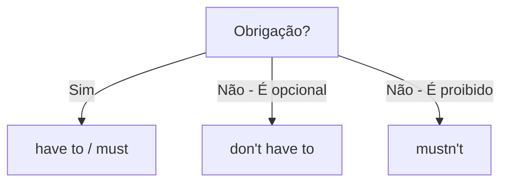

# Obrigação e Necessidade (*Have to* e *Must*)

## Objetivo

Ao final deste tópico, o estudante será capaz de expressar obrigação, necessidade e proibição em inglês usando os verbos modais/auxiliares *have to*, *don't have to*, *must* e *mustn't*, entendendo as nuances entre eles.

## Pré-requisitos

- [Simple Present](../01-a1-beginner/04-simple-present.md)
- [*Can* e *Can't*](../01-a1-beginner/11-can-and-cant.md)

## Conceitos Fundamentais

### Expressando Obrigação: *Have to* vs. *Must*

Ambos significam "ter que" ou "dever", mas há uma pequena diferença no uso (embora na fala do dia a dia sejam quase intercambiáveis na forma afirmativa).

| Verbo | Significado | Uso / Nuance | Exemplo |
|-------|-------------|--------------|---------|
| **have to** | Ter que | Obrigação **externa** (regras, leis, situação). Fatos. | I **have to** wear a uniform at work. (Regra da empresa) |
| **must** | Dever | Obrigação **interna** (sentimento pessoal do falante). Forte recomendação. | I **must** study more. (Eu sinto que preciso) |

> **Dica**: No inglês falado moderno (especialmente americano), *have to* é muito mais comum e natural que *must* para obrigações em geral.

### Formação do *Have to*

*Have to* comporta-se como um verbo normal (precisa de *do/does*).

| Forma | I, You, We, They | He, She, It |
|-------|------------------|-------------|
| **(+)** | I **have to** work. | She **has to** work. |
| **(-)** | I **don't have to** work. | She **doesn't have to** work. |
| **(?)** | **Do** you **have to** work? | **Does** she **have to** work? |

```
I have to wake up early tomorrow.
He has to pay the bills today.
Do we have to go now?
```

### Formação do *Must*

*Must* é um verbo modal (como *can*). Não usa *to*, não tem *-s* na terceira pessoa, e não usa *do/does*.

| Forma | Estrutura (todos os sujeitos) |
|-------|-------------------------------|
| **(+)** | Sujeito + **must** + verbo base |
| **(-)** | Sujeito + **must not (mustn't)** + verbo base |
| **(?)** | **Must** + sujeito + verbo base? (Formal/Raro) |

```
You must wear a seatbelt.
She must call her mother.
You mustn't park here.
```

### A Grande Diferença nas Negativas! (CRÍTICO)

A diferença mais importante no inglês entre *have to* e *must* está na **forma negativa**. Elas têm significados **completamente diferentes**.

| Negativa | Significado | Exemplo |
|----------|-------------|---------|
| **don't have to** | **Não é necessário** (Falta de obrigação / Escolha). Você pode fazer se quiser, mas não precisa. | Tomorrow is Sunday. I **don't have to** work. (Eu não preciso trabalhar) |
| **mustn't** (must not) | **Proibição**. Você não pode fazer isso de forma alguma. | You **mustn't** smoke in the hospital. (É proibido fumar) |



## Regras e Exceções

### *Have got to* (Informal)

No inglês informal e falado, é muito comum usar *have got to* (contraído para *'ve got to* ou *gotta*) com o mesmo sentido de *have to*:

```
I have to go. = I've got to go. = I gotta go.
You have to see this. = You've got to see this. = You gotta see this.
```

### *Must* para Dedução Lógica

Além de obrigação, *must* é muito usado para deduzir algo de que se tem quase certeza (99%):

```
You've been travelling all day. You must be tired. (Você deve estar cansado = Tenho certeza que está)
He has three luxury cars. He must be rich. (Ele deve ser rico)
```

### Passado de Obrigação

O passado de *have to* e de *must* é o mesmo: **had to**. (*Must* não tem forma de passado).

```
Presente: I have to work today. / I must work today.
Passado: I had to work yesterday. (Eu tive que trabalhar ontem)

Presente: She doesn't have to go.
Passado: She didn't have to go. (Ela não teve que ir)
```

## Erros Comuns

### 1. Usar *mustn't* quando não há obrigação

- ❌ *Tomorrow is Saturday. You **mustn't** wake up early.* (Significa "É proibido acordar cedo", o que é estranho)
- ✅ *Tomorrow is Saturday. You **don't have to** wake up early.* (Não é necessário)

### 2. Usar *don't have to* para proibições

- ❌ *You **don't have to** touch that wire, it's dangerous!* (Significa "Você não é obrigado a tocar, mas pode se quiser")
- ✅ *You **mustn't** touch that wire!* (É proibido/perigoso)

### 3. Usar *to* depois do *must*

- ❌ *You must **to** go now.*
- ✅ *You must go now.*

### 4. Conjugação errada de *have to*

- ❌ *He **have to** work.*
- ✅ *He **has to** work.*
- ❌ *Does she **has to** work?*
- ✅ *Does she **have to** work?*

## Exemplos

### Diálogo — No aeroporto

```
Security: Excuse me, sir. You have to take off your shoes.
Passenger: Do I have to take off my jacket too?
Security: Yes. And you mustn't carry any liquids over 100ml.
Passenger: Oh, I have a bottle of water.
Security: I'm sorry, you have to throw it away.
Passenger: Okay. Do I have to take my laptop out of the bag?
Security: No, you don't have to do that anymore with this new scanner.
```

### Regras de Trânsito

```
You must stop at a red light.
You mustn't use your phone while driving.
You have to wear a seatbelt.
You don't have to pay for parking on Sundays.
```

## Exercícios

### Nível 1 — Complete com *have to* ou *has to*

1. I ______ wake up at 6 AM every day.
2. She ______ wear a uniform at school.
3. We ______ pay the rent tomorrow.
4. John ______ study for his exam.
5. They ______ be here at 8 PM.

### Nível 2 — *Don't have to* ou *Mustn't*?

1. You ______ tell anyone! It's a secret.
2. You ______ wash the dishes. I'll do it later.
3. We ______ be late for the meeting with the boss.
4. You ______ wear a suit to the party. It's very informal.
5. In a library, you ______ make noise.

### Nível 3 — Traduza para o inglês

1. Eu tenho que ir agora.
2. Você não precisa (não tem que) me ajudar.
3. Ela tem que trabalhar amanhã?
4. Você não deve (é proibido) estacionar aqui.
5. Tivemos que esperar duas horas ontem. (passado)
6. Você deve estar cansado. (dedução)

### Gabarito

<details>
<summary>Clique para ver as respostas</summary>

**Nível 1**: 1) have to, 2) has to, 3) have to, 4) has to, 5) have to

**Nível 2**: 1) mustn't, 2) don't have to, 3) mustn't, 4) don't have to, 5) mustn't

**Nível 3**: 1) I have to go now. / I must go now. 2) You don't have to help me. 3) Does she have to work tomorrow? 4) You mustn't park here. 5) We had to wait for two hours yesterday. 6) You must be tired.

</details>

## Referências

- [Cambridge Dictionary — Have to](https://dictionary.cambridge.org/grammar/british-grammar/have-to)
- [Cambridge Dictionary — Must](https://dictionary.cambridge.org/grammar/british-grammar/must)
- [British Council — Modals of Obligation](https://learnenglish.britishcouncil.org/grammar/english-grammar-reference/modals-deduction-obligation)
- Murphy, R. *Essential Grammar in Use*. Cambridge University Press. Units 31–33.
