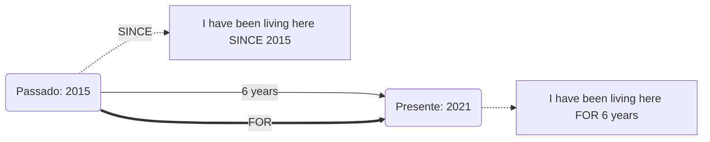

# Present Perfect Continuous

## Objetivo

Ao final deste tópico, o estudante será capaz de formar e usar o Present Perfect Continuous para descrever ações que começaram no passado e continuam até o presente, focando na duração da ação e no uso de *for* e *since*.

## Pré-requisitos

- [Present Continuous](../01-a1-beginner/05-present-continuous.md)
- [Present Perfect Simple](01-present-perfect-simple.md)

## Conceitos Fundamentais

### O que é o Present Perfect Continuous?

Usamos o Present Perfect Continuous para falar sobre uma **ação que começou no passado e ainda está acontecendo agora**, com foco em **há quanto tempo** essa ação está em andamento.

> Em português, costumamos usar o presente simples para isso: "Eu *estudo* inglês há dois anos". Em inglês, usar o presente simples nesse caso é um erro grave. Devemos usar o Present Perfect Continuous: "*I **have been studying** English for two years.*"

### Formação

Estrutura: **Sujeito + have/has + been + verbo-ing**

| Forma | Estrutura | Exemplo |
|-------|----------|---------|
| **(+)** | I/You/We/They **have been** + -ing<br>He/She/It **has been** + -ing | I **have been working**. (Eu tenho trabalhado/trabalho)<br>She **has been reading**. (Ela tem lido/lê) |
| **(-)** | I/You/We/They **haven't been** + -ing<br>He/She/It **hasn't been** + -ing | I **haven't been working**.<br>She **hasn't been reading**. |
| **(?)** | **Have** I/you/we/they **been** + -ing?<br>**Has** he/she/it **been** + -ing? | **Have** you **been working**?<br>**Has** she **been reading**? |

### Usos Principais

#### 1. Ações que começaram no passado e continuam no presente (Duração)
Foco em *há quanto tempo* algo acontece, geralmente com *for* ou *since*, respondendo à pergunta *How long...?* (Há quanto tempo...?).

```
I have been waiting here for two hours. (Eu estou esperando aqui há duas horas).
She has been living in London since 2018. (Ela mora em Londres desde 2018).
It has been raining all day. (Está chovendo o dia todo).
```

#### 2. Ações recentes que deixaram evidências no presente
A ação pode ter acabado agorinha mesmo, mas o foco é que o *processo* da ação causou um resultado visível.

```
A: You look exhausted! (Você parece exausto!)
B: Yes, I have been running. (Sim, eu estava correndo/corri).

A: Why are your hands dirty? (Por que suas mãos estão sujas?)
B: I have been repairing the car. (Eu estava consertando o carro).
```

### *For* e *Since*

Ambos são cruciais no Present Perfect Continuous para indicar a duração temporal.

| Preposição | Uso | Exemplos | Tradução |
|------------|-----|----------|----------|
| **For** | Um **período** de tempo (duração total) | for two hours, for three days, for ten years, for a long time | **por / há** |
| **Since** | O **ponto de partida** no passado (quando começou) | since 8 AM, since Monday, since 2015, since I was a child | **desde** |



## Regras e Exceções

### Verbos de Estado (*Stative Verbs*)

Como aprendemos no [Present Continuous](../01-a1-beginner/05-present-continuous.md), verbos de estado (verbos que descrevem situações, não ações - ex: *know, like, understand, have, be*) **não** costumam ser usados com *-ing*.

Se uma situação envolvendo um verbo de estado começou no passado e continua no presente, usamos o **Present Perfect Simple**, NÃO o Continuous.

- ❌ *I have been knowing him for 5 years.*
- ✅ *I **have known** him for 5 years.* (Conheço ele há 5 anos).
- ❌ *She has been having this car since 2020.*
- ✅ *She **has had** this car since 2020.*

### Present Perfect Simple vs. Continuous

Às vezes, a diferença é sutil e foca no resultado vs. duração:

| Foco | Present Perfect Simple | Present Perfect Continuous |
|------|------------------------|----------------------------|
| **Foco** | O resultado (a ação terminou) | A atividade em si (duração/processo) |
| **Exemplo**| I **have painted** my bedroom. (Terminei. O quarto está pintado.) | I **have been painting** my bedroom. (Estou pintando. Talvez não tenha terminado, estou sujo de tinta.) |
| **Quantidade vs Duração** | Responde: *Quantos?* / *Quanto?*<br>She has read 50 pages today. | Responde: *Há quanto tempo?*<br>She has been reading all day. |

## Erros Comuns

### 1. Usar Present Simple para ações que começaram no passado e continuam

- ❌ *I live here for two years.* (Tradução literal: "Eu moro aqui há dois anos")
- ✅ *I **have been living** here for two years.*
- ❌ *I wait for you since 2 PM.*
- ✅ *I **have been waiting** for you since 2 PM.*

### 2. Confundir *For* e *Since*

- ❌ *I have been studying English **since** three years.* (Three years é um período de duração).
- ✅ *I have been studying English **for** three years.*

### 3. Usar *since* com palavras que indicam duração

- ❌ *Since two hours ago.*
- ✅ *For two hours.*

## Exemplos

### Diálogo — Reclamando do clima

```
A: Is it still raining?
B: Yes, it is. It has been raining for three days non-stop!
A: I know, it's terrible. Have you been going outside at all?
B: Only to walk the dog. What have you been doing?
A: I've been reading a lot, and I've been watching some movies.
```

### Entrevista de emprego

```
Interviewer: How long have you been working in marketing?
Candidate: I have been working in marketing for eight years.
Interviewer: And how long have you been looking for a new job?
Candidate: I've been looking since January.
```

## Exercícios

### Nível 1 — Complete com *for* ou *since*

1. I have been studying English ______ two years.
2. She has been working here ______ 2019.
3. They have been talking ______ an hour.
4. It has been raining ______ yesterday morning.
5. He has been playing video games ______ a long time.

### Nível 2 — Complete a frase com o Present Perfect Continuous

1. I ______ (wait) here for 30 minutes!
2. She ______ (work) at this company since January.
3. How long ______ you ______ (study) Spanish?
4. We ______ (not / sleep) well lately.
5. You look tired. ______ you ______ (run)?

### Nível 3 — Corrija os erros

1. I work here for 5 years.
2. She has been knowing Peter since 2010.
3. I have been waiting since three hours.
4. I have read 3 books all day. (foco em estar lendo o dia todo)

### Gabarito

<details>
<summary>Clique para ver as respostas</summary>

**Nível 1**: 1) for, 2) since, 3) for, 4) since, 5) for

**Nível 2**: 1) have been waiting, 2) has been working, 3) have / been studying, 4) haven't been sleeping, 5) Have / been running

**Nível 3**: 
1) I **have been working** here for 5 years.
2) She **has known** Peter since 2010. (*Know* é verbo de estado).
3) I have been waiting **for** three hours.
4) I **have been reading** all day.

</details>

## Referências

- [Cambridge Dictionary — Present Perfect Continuous](https://dictionary.cambridge.org/grammar/british-grammar/present-perfect-continuous-i-have-been-working)
- [British Council — Present Perfect Continuous](https://learnenglish.britishcouncil.org/grammar/english-grammar-reference/present-perfect-continuous)
- Murphy, R. *Essential Grammar in Use*. Cambridge University Press. Units 18–19.
