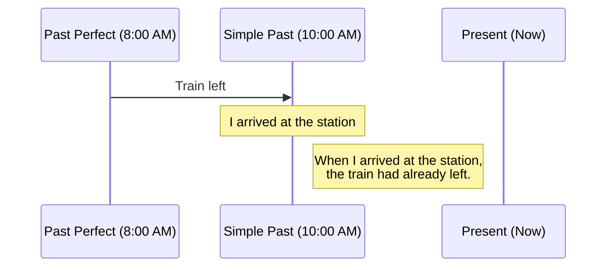

# Past Perfect

## Objetivo

Ao final deste tópico, o estudante será capaz de usar o Past Perfect para descrever uma ação que aconteceu antes de outra ação no passado, estabelecendo uma ordem cronológica clara entre os eventos.

## Pré-requisitos

- [Simple Past — Verbos Regulares](../02-a2-elementary/01-simple-past-regular.md) e [Irregulares](../02-a2-elementary/02-simple-past-irregular.md)
- [Present Perfect Simple](01-present-perfect-simple.md)

## Conceitos Fundamentais

### O que é o Past Perfect?

O Past Perfect é o "passado do passado". Usamos esse tempo verbal quando estamos contando uma história no passado e queremos nos referir a uma ação que aconteceu **ainda antes** do momento sobre o qual estamos falando.

Imagine que você está contando algo que aconteceu às 10h da manhã (Simple Past). Se você quiser mencionar algo que aconteceu às 8h da manhã, você usará o Past Perfect.

### Formação

Estrutura: **Sujeito + had + Past Participle (Particípio Passado)**

> A formação é a mesma do Present Perfect, mas usamos o passado do verbo *have*, que é **had**, para todos os sujeitos.

| Forma | Estrutura | Exemplo |
|-------|----------|---------|
| **(+)** | Sujeito + **had** + Particípio | I **had eaten** breakfast before I left. |
| **(-)** | Sujeito + **hadn't** + Particípio | I **hadn't eaten** anything all day. |
| **(?)** | **Had** + sujeito + Particípio? | **Had** you **eaten** before the meeting? |

### Contração

- I had = **I'd**
- You had = **You'd**
- He had = **He'd**
- She had = **She'd**
- We had = **We'd**
- They had = **They'd**

```
I'd forgotten my keys. (Eu tinha esquecido minhas chaves.)
She'd already left when I arrived. (Ela já tinha saído quando eu cheguei.)
```

> **Atenção**: *I'd* também pode ser a contração de *I would*. O contexto e o verbo seguinte deixam claro:
> - *I'd go* = I **would** go (verbo na forma base).
> - *I'd gone* = I **had** gone (verbo no particípio).

### A Linha do Tempo



## Regras e Exceções

### Palavras-chave Comuns

Para mostrar a relação de tempo entre duas ações passadas, frequentemente usamos as seguintes palavras com o Past Perfect:

| Palavra | Significado | Exemplo |
|---------|-------------|---------|
| **Before** | Antes (que) | I had finished my work **before** my boss arrived. |
| **After** | Depois (que) | **After** I had washed the car, it started to rain. |
| **Already** | Já | The movie had **already** started when we got to the cinema. |
| **By the time**| Na hora que / Quando | **By the time** I got home, she had cooked dinner. |

### Quando usar Simple Past nas duas ações?

Se você contar as ações **na exata ordem em que aconteceram**, você pode usar apenas o Simple Past para as duas. O Past Perfect é mais necessário quando você "quebra" a ordem cronológica na hora de falar.

**Ordem cronológica (Aconteceu 1, depois 2)**:
*I **ate** breakfast, and then I **left** the house.* (Simple Past + Simple Past)

**Ordem invertida na fala (Falo 2, referindo-me a 1)**:
*When I **left** the house, I **had** already **eaten** breakfast.* (Simple Past + Past Perfect)

## Erros Comuns

### 1. Usar Past Perfect para uma única ação no passado

O Past Perfect só existe em relação a um outro evento no passado. Não comece uma história com o Past Perfect sem ter estabelecido um contexto passado primeiro.

- ❌ *I had woken up at 7 AM yesterday.*
- ✅ *I **woke up** at 7 AM yesterday.* (Apenas Simple Past).
- ✅ *When she called me, I **had** already **woken up**.* (Há duas ações, uma antes da outra).

### 2. Confundir o significado ao não usar o Past Perfect

Usar o Simple Past ou o Past Perfect muda completamente o sentido da frase:

**Cenário 1:** *When I arrived at the party, John **left**.*
(Significa: Eu cheguei. Logo em seguida, John foi embora. Nós nos vimos).

**Cenário 2:** *When I arrived at the party, John **had left**.*
(Significa: John foi embora antes de eu chegar. Nós não nos vimos).

### 3. Duplo *Had*

Alguns alunos acham estranho escrever *had had*, mas é gramaticalmente correto. O primeiro *had* é o auxiliar do Past Perfect, e o segundo *had* é o particípio passado do verbo *have* (ter/consumir).

- *I **had had** breakfast before I left.* (Eu tinha tomado café da manhã antes de sair).
- Mais natural com a contração: *I**'d had** breakfast before I left.*

## Exemplos

### Narrativa Policial

```
When the police arrived at the house, the thief had already escaped. 
He had broken a window to get in, and he had stolen all the jewelry. 
The owners were shocked because they had locked all the doors before 
they went to sleep.
```

### Explicando um atraso

```
A: Why were you so late for the meeting?
B: It was a disaster! When I got to the station, my train had already left. 
   Then, I realized I had forgotten my presentation at home, so I had to go back. 
   By the time I got to the office, the meeting had already started.
```

## Exercícios

### Nível 1 — Escolha a opção correta

1. The movie (started / had started) before we arrived at the cinema.
2. I was hungry because I (didn't eat / hadn't eaten) all day.
3. When I got home, my brother (ate / had eaten) all the pizza! There was nothing left.
4. She didn't want to go to the museum because she (was / had been) there before.
5. After he (finished / had finished) his homework, he went to play outside.

### Nível 2 — Complete a frase com o verbo no Past Perfect

1. I didn't recognize him. He ______ (change) a lot.
2. We were late. The plane ______ (already / take off) when we arrived at the airport.
3. She felt terrible because she ______ (forget) his birthday.
4. By the time the firemen arrived, the fire ______ (destroy) the building.
5. I ______ (not / see) snow before I went to Canada.

### Nível 3 — Traduza para o inglês usando Past Perfect

1. Quando eu cheguei, ela já tinha saído.
2. Eu estava cansado porque eu tinha trabalhado o dia todo.
3. O trem já tinha partido quando nós chegamos na estação.
4. Depois que eles tinham comido, eles assistiram TV.

### Gabarito

<details>
<summary>Clique para ver as respostas</summary>

**Nível 1**: 1) had started, 2) hadn't eaten, 3) had eaten, 4) had been, 5) had finished.

**Nível 2**: 1) had changed, 2) had already taken off, 3) had forgotten, 4) had destroyed, 5) hadn't seen.

**Nível 3**: 
1) When I arrived, she had already left.
2) I was tired because I had worked all day.
3) The train had already left when we arrived at the station.
4) After they had eaten, they watched TV.

</details>

## Referências

- [Cambridge Dictionary — Past Perfect Simple](https://dictionary.cambridge.org/grammar/british-grammar/past-perfect-simple-i-had-worked)
- [British Council — Past Perfect](https://learnenglish.britishcouncil.org/grammar/english-grammar-reference/past-perfect)
- Murphy, R. *Essential Grammar in Use*. Cambridge University Press. Unit 15 (Intermediate version).
