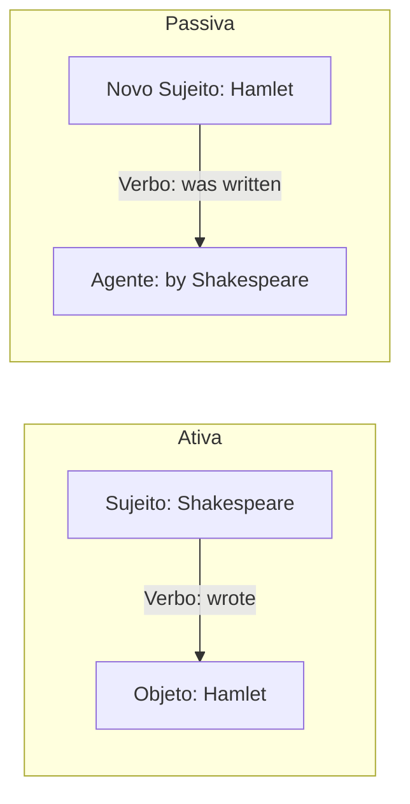

# Voz Passiva (*Passive Voice*)

## Objetivo

Ao final deste tópico, o estudante será capaz de identificar, formar e usar a voz passiva em inglês nos tempos verbais básicos (Presente, Passado e Futuro), entendendo quando é mais apropriado usá-la em vez da voz ativa.

## Pré-requisitos

- [Verbo *To Be*](../01-a1-beginner/01-verb-to-be.md)
- [Simple Present](../01-a1-beginner/04-simple-present.md)
- [Simple Past — Irregular Verbs](../02-a2-elementary/02-simple-past-irregular.md) (Uso do Particípio Passado)
- [Futuro — *Will* e *Going to*](../02-a2-elementary/04-future-will-going-to.md)

## Conceitos Fundamentais

### Voz Ativa vs. Voz Passiva

- **Voz Ativa**: O sujeito **pratica** a ação. O foco está em *quem* faz.
  *Shakespeare wrote Hamlet.* (Shakespeare escreveu Hamlet.)
- **Voz Passiva**: O sujeito **recebe** a ação. O foco está no *objeto* da ação.
  *Hamlet was written by Shakespeare.* (Hamlet foi escrito por Shakespeare.)



### Quando usar a Voz Passiva?

Nós usamos a voz passiva quando:
1. **A ação é mais importante** do que quem a praticou (notícias, processos científicos).
   *The new hospital was opened yesterday.* (O importante é que abriu, não quem cortou a fita).
2. **Não sabemos** quem praticou a ação.
   *My car was stolen!* (Eu não sei quem roubou).
3. **É óbvio** quem praticou a ação.
   *The thief was arrested.* (Obviamente, pela polícia).

### Formação da Voz Passiva

A estrutura fundamental da voz passiva em **qualquer** tempo verbal é:

**Novo Sujeito + Verbo *To Be* (no tempo verbal adequado) + Past Participle (Particípio Passado)**

> O agente da passiva (quem fez a ação, se mencionado) é introduzido pela preposição **by**.

#### 1. Simple Present (Presente Simples)
O verbo *to be* fica no presente: **am / is / are**

| Ativa | Passiva |
|-------|---------|
| Millions of people speak **English**. | **English** is spoken by millions of people. |
| They clean **the offices** every day. | **The offices** are cleaned every day. |

#### 2. Simple Past (Passado Simples)
O verbo *to be* fica no passado: **was / were**

| Ativa | Passiva |
|-------|---------|
| Alexander Fleming discovered **penicillin**. | **Penicillin** was discovered by Alexander Fleming. |
| Someone stole **my keys** yesterday. | **My keys** were stolen yesterday. |

#### 3. Future with Will (Futuro)
O verbo *to be* fica no futuro: **will be**

| Ativa | Passiva |
|-------|---------|
| They will finish **the project** tomorrow. | **The project** will be finished tomorrow. |
| The company will hire **new employees**. | **New employees** will be hired. |

## Regras e Exceções

### Transição de Pronomes

Quando transformamos uma frase da voz ativa para a passiva, se o objeto for um pronome (me, him, them), ele deve mudar para a forma de sujeito (I, he, they) ao ir para o início da frase.

- Ativa: *They invited **me** to the party.* (Objeto)
- Passiva: ***I** was invited to the party.* (Sujeito)

- Ativa: *Someone saw **him** stealing the car.*
- Passiva: ***He** was seen stealing the car.*

### Verbos com dois objetos

Alguns verbos (como *give, send, offer, show*) podem ter dois objetos. Nesses casos, existem duas formas possíveis de fazer a voz passiva. O mais comum em inglês é transformar a *pessoa* no sujeito da voz passiva.

Ativa: *Someone gave **me** a book.* (Objetos: me, a book)
Passiva 1 (Preferida): ***I** was given a book.*
Passiva 2: *A book was given to me.*

### Omissão do Agente (*by...*)

Na maioria das vezes, o agente da passiva (*by someone, by them, by people*) é **omitido** porque não é importante ou é desconhecido.

- ❌ *My car was stolen by someone.* (Desnecessário)
- ✅ *My car was stolen.*
- ❌ *Portuguese is spoken in Brazil by people.*
- ✅ *Portuguese is spoken in Brazil.*

## Erros Comuns

### 1. Esquecer o verbo *to be*

- ❌ *The letter written yesterday.*
- ✅ *The letter **was** written yesterday.*
- ❌ *The problem solved tomorrow.*
- ✅ *The problem **will be** solved tomorrow.*

### 2. Usar o Simple Past em vez do Past Participle

- ❌ *The window was **broke**.* (Broke = Simple Past)
- ✅ *The window was **broken**.* (Broken = Past Participle)
- ❌ *The car was **stole**.*
- ✅ *The car was **stolen**.*

### 3. Usar a Voz Passiva excessivamente (estilo de escrita)

Embora gramaticalmente correta, a voz passiva pode tornar o texto pesado e impessoal. No inglês geral (exceto artigos científicos ou notícias), prefira a voz ativa quando souber quem fez a ação.

- Passiva: *Dinner was cooked by John.* (Correto, mas soa estranho)
- Ativa: *John cooked dinner.* (Mais natural)

## Exemplos

### Notícias e Manchetes (Onde a passiva brilha!)

```
A new president was elected yesterday.
The museum will be closed for renovations next week.
Three people were injured in the accident.
The painting was stolen from the gallery in 1990.
```

### Placas e Avisos

```
Tickets must be shown at the entrance.
Credit cards are accepted here.
Trespassers will be prosecuted. (Invasores serão processados)
```

## Exercícios

### Nível 1 — Presente, Passado ou Futuro? Escolha o verbo *to be* correto

1. The Mona Lisa ______ (is / was / will be) painted by Leonardo da Vinci.
2. English ______ (is / was / will be) spoken in many countries today.
3. The new iPhone ______ (is / was / will be) released next month.
4. My bicycle ______ (is / was / will be) stolen last night!
5. These cars ______ (are / were / will be) made in Japan now.

### Nível 2 — Transforme as frases da Voz Ativa para a Voz Passiva

1. (Past) Someone found my wallet.
   → My wallet ______ ______.
2. (Present) They clean the room every morning.
   → The room ______ ______ every morning.
3. (Future) The mechanic will repair the car tomorrow.
   → The car ______ ______ ______ tomorrow.
4. (Past) Alexander Graham Bell invented the telephone.
   → The telephone ______ ______ by Alexander Graham Bell.

### Nível 3 — Traduza para o inglês usando a Voz Passiva

1. O livro foi escrito em 1995.
2. Este vinho é feito na França.
3. A casa será construída no próximo ano.
4. Eu fui convidado para a festa.
5. Minha janela foi quebrada ontem.

### Gabarito

<details>
<summary>Clique para ver as respostas</summary>

**Nível 1**: 1) was (passado), 2) is (presente), 3) will be (futuro), 4) was (passado), 5) are (presente).

**Nível 2**: 
1) My wallet **was found**.
2) The room **is cleaned** every morning.
3) The car **will be repaired** tomorrow.
4) The telephone **was invented** by Alexander Graham Bell.

**Nível 3**: 
1) The book was written in 1995.
2) This wine is made in France.
3) The house will be built next year.
4) I was invited to the party.
5) My window was broken yesterday.

</details>

## Referências

- [Cambridge Dictionary — Passive Voice](https://dictionary.cambridge.org/grammar/british-grammar/passive)
- [British Council — Passives](https://learnenglish.britishcouncil.org/grammar/english-grammar-reference/active-and-passive-voice)
- Murphy, R. *Essential Grammar in Use*. Cambridge University Press. Units 21–22.
