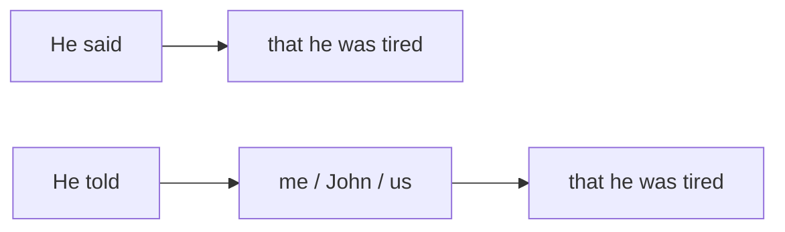

# Discurso Indireto (*Reported Speech*)

## Objetivo

Ao final deste tópico, o estudante será capaz de relatar o que outra pessoa disse em inglês, convertendo frases do discurso direto para o indireto e fazendo as mudanças necessárias de tempo verbal e pronomes.

## Pré-requisitos

- [Simple Past](../02-a2-elementary/01-simple-past-regular.md)
- [Past Continuous](../02-a2-elementary/03-past-continuous.md)
- [Past Perfect](04-past-perfect.md)

## Conceitos Fundamentais

### Discurso Direto vs. Indireto

- **Discurso Direto (*Direct Speech*)**: Citação exata do que a pessoa disse, usando aspas.
  *John: "I am tired."*
- **Discurso Indireto (*Reported Speech*)**: Você conta para alguém o que o John disse, sem usar aspas.
  *John said (that) he was tired.* (John disse que estava cansado).

### A Regra do "Passo Atrás" (*Backshift*)

A regra mais importante do *Reported Speech* em inglês é o "passo atrás no tempo". Como você está relatando algo que já foi dito no passado, o tempo verbal original geralmente "volta" um tempo no passado.

| Tempo Original (Direct) | "Passo Atrás" (Reported) | Exemplo |
|-------------------------|--------------------------|---------|
| **Simple Present** | **Simple Past** | "I **live** in Paris." → He said he **lived** in Paris. |
| **Present Continuous** | **Past Continuous** | "I **am working**." → She said she **was working**. |
| **Simple Past** | **Past Perfect** | "I **bought** a car." → He said he **had bought** a car. |
| **Present Perfect** | **Past Perfect** | "I **have seen** it." → She said she **had seen** it. |
| **Will (Futuro)** | **Would** | "I **will** go." → He said he **would** go. |
| **Can** | **Could** | "I **can** help." → She said she **could** help. |

> **Omissão do *that***: Na linguagem falada, o *that* (que) depois de *said* ou *told* é frequentemente omitido.
> *He said **that** he was tired.* = *He said he was tired.*

### Mudança de Pronomes

Os pronomes também mudam para fazer sentido na perspectiva de quem está relatando.
Se o John diz "Eu gosto do meu carro", você relata: "O John disse que **ele** gosta do carro **dele**."

- "I" → he / she
- "we" → they
- "my" → his / her
- "our" → their

*Maria: "I love **my** job."* → *Maria said she loved **her** job.*

## Regras e Exceções

### *Say* vs. *Tell*

Ambos significam "dizer/contar", mas têm regras gramaticais diferentes no discurso indireto.

| Verbo | Regra | Exemplo |
|-------|-------|---------|
| **Say (said)** | NÃO usa objeto direto pessoal (a quem foi dito) logo depois. | He **said** (that) he was tired. |
| **Tell (told)** | OBRIGATÓRIO usar o objeto (a quem foi dito) logo depois. | He **told me** (that) he was tired. |



- ❌ *He said me he was tired.*
- ✅ *He said to me he was tired.* (Gramatical, mas menos comum).
- ✅ *He told me he was tired.* (Muito comum).

### Perguntas Indiretas (*Reported Questions*)

Quando relatamos uma pergunta, **não usamos mais a estrutura de pergunta** (não usamos *do/does/did*, e não invertemos verbo e sujeito). A pergunta vira uma frase afirmativa normal.

Se for uma pergunta de *Yes/No*, usamos **if** ou **whether** (se).

| Pergunta Direta | Pergunta Indireta (Reported) |
|-----------------|------------------------------|
| "Where **do you live**?" | He asked me where **I lived**. |
| "What time **is it**?" | She asked what time **it was**. |
| "**Are you** cold?" | He asked **if I was** cold. |
| "**Did you watch** TV?" | She asked **if I had watched** TV. |

> Note como o verbo principal volta um passo no passado, e a ordem volta para Sujeito + Verbo.

### Expressões de Tempo e Lugar

Se muito tempo se passou ou você está em outro lugar, palavras de tempo e espaço também mudam:

| Direto | Indireto |
|--------|----------|
| today | that day |
| tomorrow | the next day / the following day |
| yesterday | the day before |
| here | there |
| this | that |

*John: "I will do it **tomorrow**."* → *John said he would do it **the next day**.*

## Erros Comuns

### 1. Esquecer de mudar o tempo verbal (Backshift)

- ❌ *She said she **is** tired.* (Pode ser aceito se ela ainda estiver cansada agora, mas o gramaticalmente seguro é fazer o backshift).
- ✅ *She said she **was** tired.*

### 2. Confundir *Said* e *Told*

- ❌ *He **told** he was going to London.*
- ✅ *He **said** he was going to London.*
- ✅ *He **told me** he was going to London.*

### 3. Manter a estrutura de pergunta no discurso indireto

- ❌ *He asked me where **did I live**.*
- ✅ *He asked me where **I lived**.*
- ❌ *She asked what time **was it**.*
- ✅ *She asked what time **it was**.*

## Exemplos

### Fofoca e Notícias

```
Direct: "I am going to quit my job."
Reported: Did you hear? Sarah said she was going to quit her job!

Direct: "We have won the lottery!"
Reported: The neighbors told us they had won the lottery.

Direct: "I can't come to the party because I am sick."
Reported: Mark said he couldn't come to the party because he was sick.
```

### Relatando Entrevistas

```
The interviewer asked me where I lived. Then, she asked if I had a car. 
I told her that I lived in the city center and that I didn't have a car, 
but I could take the subway.
```

## Exercícios

### Nível 1 — Mude o tempo verbal para o "passo atrás" (Backshift)

1. "I am hungry." → He said he ______ hungry.
2. "I like pizza." → She said she ______ pizza.
3. "We will go to the beach." → They said they ______ go to the beach.
4. "I can swim." → He said he ______ swim.
5. "I have finished." → She said she ______ finished.

### Nível 2 — *Said* ou *Told*?

1. He ______ he was tired.
2. She ______ me that she liked my shoes.
3. They ______ us they were leaving.
4. John ______ that he didn't know the answer.

### Nível 3 — Transforme as frases para o Discurso Indireto

1. "I live in Brazil."
   → Paul said that he ______ in Brazil.
2. "I am watching TV."
   → Mary said she ______ TV.
3. "Are you hungry?"
   → My mother asked me if I ______ hungry.
4. "Where is the station?"
   → The tourist asked me where the station ______.
5. "I bought a new car."
   → John told me that he ______ a new car.

### Gabarito

<details>
<summary>Clique para ver as respostas</summary>

**Nível 1**: 1) was, 2) liked, 3) would, 4) could, 5) had.

**Nível 2**: 1) said, 2) told, 3) told, 4) said.

**Nível 3**: 
1) lived (Paul said that he lived in Brazil).
2) was watching (Mary said she was watching TV).
3) was (My mother asked me if I was hungry).
4) was (The tourist asked me where the station was).
5) had bought (John told me that he had bought a new car).

</details>

## Referências

- [Cambridge Dictionary — Reported Speech](https://dictionary.cambridge.org/grammar/british-grammar/reported-speech)
- [British Council — Reported Speech](https://learnenglish.britishcouncil.org/grammar/english-grammar-reference/reported-speech)
- Murphy, R. *Essential Grammar in Use*. Cambridge University Press. Units 48–49.
