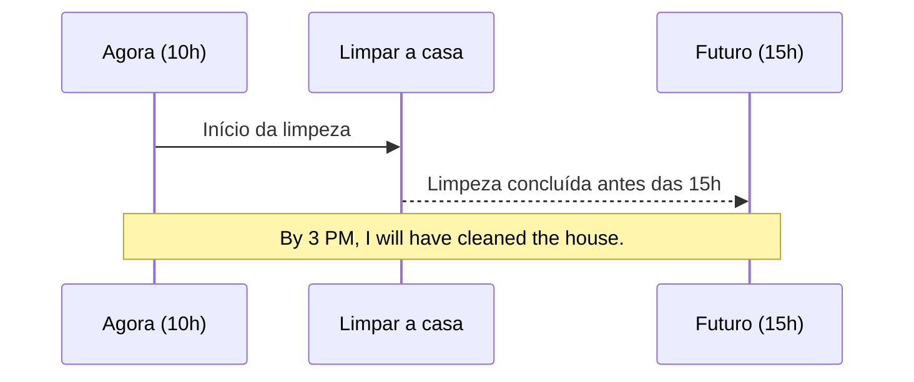

# Future Perfect e Future Continuous

## Objetivo

Ao final deste tópico, o estudante será capaz de usar o *Future Perfect* e o *Future Continuous* para descrever ações que estarão concluídas antes de um ponto específico no futuro, ou que estarão em andamento em um momento exato no futuro.

## Pré-requisitos

- [Futuro — *Will* e *Going to*](../02-a2-elementary/04-future-will-going-to.md)
- [Present Perfect Simple](../03-b1-intermediate/01-present-perfect-simple.md)
- [Present Continuous](../01-a1-beginner/05-present-continuous.md)

## Conceitos Fundamentais

Quando falamos do futuro em inglês avançado, muitas vezes precisamos ser mais precisos do que simplesmente dizer "eu farei algo" (*I will do*). Precisamos expressar a **duração** ou a **conclusão** de um evento em um ponto específico no tempo futuro.

---

### 1. Future Continuous (Futuro Contínuo)

Usamos o *Future Continuous* para dizer que **estaremos no meio de uma ação** em um determinado momento no futuro. É o equivalente futuro de "eu estou fazendo" (agora) ou "eu estava fazendo" (ontem).

#### Formação
Estrutura: **Sujeito + will be + verbo-ing**

| Forma | Exemplo |
|-------|---------|
| **(+)** | I **will be working** at 10 AM tomorrow. |
| **(-)** | She **won't be sleeping** when you arrive. |
| **(?)** | **Will** you **be using** the car tonight? |

#### Usos Principais
1. **Ação em andamento em um ponto futuro:**
   *Don't call me at 8 PM. I **will be having** dinner.* (Estarei jantando).
2. **Eventos futuros previsíveis ou rotineiros:**
   *I **will be seeing** John at the office tomorrow, so I can give him your message.* (Eu o verei de qualquer forma, faz parte da rotina).

---

### 2. Future Perfect (Futuro Perfeito)

Usamos o *Future Perfect* para dizer que uma ação **já terá sido concluída** antes de um momento específico no futuro. O foco não é na ação acontecendo, mas no fato de que ela estará **terminada** quando chegarmos àquele ponto no tempo.

#### Formação
Estrutura: **Sujeito + will have + Past Participle (Particípio Passado)**

| Forma | Exemplo |
|-------|---------|
| **(+)** | I **will have finished** the report by Friday. |
| **(-)** | We **won't have arrived** before 9 PM. |
| **(?)** | **Will** she **have graduated** by next year? |

#### A Preposição de Ouro: *By*
O *Future Perfect* quase sempre vem acompanhado da preposição **by** (ou *by the time*), que neste contexto significa "não mais tarde que" ou "até".

* *By 5 PM* (Até as 17h / Não depois das 17h).
* *By next week* (Até a semana que vem).
* *By the time you arrive* (Na hora que você chegar).



## Regras e Exceções

### Future Perfect Continuous

Existe também uma versão contínua do *Future Perfect*. Usamos para focar em **há quanto tempo** uma ação estará acontecendo quando um ponto no futuro chegar.

Estrutura: **will have been + verbo-ing**

- *By next month, I **will have been working** here for 10 years.* (Até o mês que vem, fará 10 anos que eu trabalho aqui).
- *By 8 PM, we **will have been driving** for six hours.* (Até as 20h, fará 6 horas que estamos dirigindo).

### Diferença Crítica: Future Simple vs. Future Continuous

Compare estas duas frases e como elas alteram a percepção de quem ouve:

- *A: We are having a party tomorrow.*
- *B1: Oh, I **will help** you clean.* (Decisão tomada na hora, uma oferta).
- *B2: Oh, I **will be helping** John tomorrow.* (Eu já estarei ocupado no meio dessa ação, então não posso te ajudar).

## Erros Comuns

### 1. Usar o Future Perfect sem um referencial de tempo

O *Future Perfect* só faz sentido se você estabelecer o limite (o *by*). Não use em frases soltas sem contexto futuro.

- ❌ *I will have finished my homework.* (Quando? Falta informação).
- ✅ *I will have finished my homework **by 8 PM**.*

### 2. Usar o futuro depois de *By the time*

A expressão *by the time* age como uma condicional/temporal (como *when* ou *if*). O verbo imediatamente após ela deve ficar no **presente**, não no futuro!

- ❌ *By the time you **will arrive**, I will have cooked dinner.*
- ✅ *By the time you **arrive**, I will have cooked dinner.*

## Exemplos

### No Ambiente de Trabalho

```
Manager: Will the presentation be ready for tomorrow's meeting?
Employee: Yes, sir. I will have finished all the slides by 5 PM today.
Manager: Great. Tomorrow at 10 AM, we will be presenting to the CEO, 
         so everything must be perfect.
```

### Fazendo Planos e Convites

```
A: Do you want to go to the cinema around 7 PM tonight?
B: I can't. I will still be working at 7 PM. 
A: What time do you finish?
B: I will have finished all my tasks by 8:30 PM. We can go to the 9 PM session.
```

## Exercícios

### Nível 1 — Future Continuous ou Future Perfect?

1. At 8 PM tonight, I (will be watching / will have watched) a movie. Please don't call.
2. By next year, she (will be graduating / will have graduated) from university.
3. Call me at 10 AM. I (won't be sleeping / won't have slept) anymore.
4. By the time we get to the cinema, the movie (will be starting / will have started). We will miss the beginning!

### Nível 2 — Complete a frase com a forma correta do verbo

1. This time tomorrow, we ______ (fly) to Paris! (No meio da ação)
2. By Friday, the mechanic ______ (repair) my car. (Ação concluída)
3. What ______ you ______ (do) at 3 PM tomorrow?
4. I'm sure they ______ (complete) the bridge by 2026.
5. Next month, my parents ______ (be) married for 30 years. (Use Future Perfect Simple)

### Nível 3 — Traduza para o inglês

1. Eu estarei dormindo às 23h.
2. Nós teremos terminado o projeto até sexta-feira.
3. Não me ligue entre 2 e 4. Eu estarei tendo uma reunião.
4. Na hora que você chegar (By the time...), eu terei limpado a casa.

### Gabarito

<details>
<summary>Clique para ver as respostas</summary>

**Nível 1**: 1) will be watching, 2) will have graduated, 3) won't be sleeping, 4) will have started.

**Nível 2**: 
1) will be flying
2) will have repaired
3) will you be doing
4) will have completed
5) will have been

**Nível 3**: 
1) I will be sleeping at 11 PM.
2) We will have finished the project by Friday.
3) Don't call me between 2 and 4. I will be having a meeting.
4) By the time you arrive, I will have cleaned the house.

</details>

## Referências

- [Cambridge Dictionary — Future Continuous](https://dictionary.cambridge.org/grammar/british-grammar/future-continuous-i-will-be-working)
- [Cambridge Dictionary — Future Perfect](https://dictionary.cambridge.org/grammar/british-grammar/future-perfect)
- Murphy, R. *English Grammar in Use*. Cambridge University Press. Units 24.
