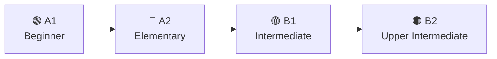

# Inglês — A1 a B2

Base de conhecimento para o estudo progressivo do idioma inglês, cobrindo os níveis **A1 (Iniciante)** a **B2 (Intermediário Superior)** do CEFR (Common European Framework of Reference for Languages).

---

## O que é o CEFR?

O **Common European Framework of Reference for Languages** é o padrão internacional para descrever habilidades linguísticas. Ele divide a proficiência em 6 níveis:

| Nível | Nome | Descrição |
|-------|------|-----------|
| **A1** | Beginner | Compreende e usa expressões básicas e cotidianas |
| **A2** | Elementary | Comunica-se em tarefas simples e rotineiras |
| **B1** | Intermediate | Lida com a maioria das situações de viagem e trabalho |
| **B2** | Upper Intermediate | Interage com fluência e espontaneidade com falantes nativos |
| C1 | Advanced | *(fora do escopo atual)* |
| C2 | Proficiency | *(fora do escopo atual)* |

---

## Fluxo de Aprendizado

---

## Módulos

### 📗 [Nível A1 — Beginner](01-a1-beginner/)

Fundamentos do inglês: verbo *to be*, pronomes, artigos, tempos verbais básicos, vocabulário essencial e primeiras conversas.

**Tópicos**: 15 · **Tempo estimado**: 6–8 semanas

---

### 📘 [Nível A2 — Elementary](02-a2-elementary/)

Expansão da base: passado simples, futuro, comparativos, quantificadores, conectivos e vocabulário para situações cotidianas.

**Tópicos**: 15 · **Tempo estimado**: 6–8 semanas

---

### 📙 [Nível B1 — Intermediate](03-b1-intermediate/)

Salto de complexidade: tempos perfeitos, condicionais, voz passiva, *reported speech*, phrasal verbs e registro formal/informal.

**Tópicos**: 16 · **Tempo estimado**: 8–10 semanas

---

### 📕 [Nível B2 — Upper Intermediate](04-b2-upper-intermediate/)

Refinamento e fluência: condicionais avançados, inversão, *cleft sentences*, colocações, expressões idiomáticas e escrita acadêmica.

**Tópicos**: 16 · **Tempo estimado**: 8–10 semanas

---

## Artefatos de Controle

| Arquivo | Descrição |
|---------|-----------|
| [roadmap.md](roadmap.md) | Índice detalhado com dependências e ordem de estudo |
| [progress.md](progress.md) | Rastreamento de progresso por tópico |
| [glossary.md](glossary.md) | Glossário de termos gramaticais e linguísticos |

---

## Dicas de Estudo

1. **Siga a ordem dos níveis** — cada módulo constrói sobre o anterior.
2. **Pratique diariamente** — 30 minutos consistentes valem mais que 3 horas esporádicas.
3. **Use os exercícios** — cada tópico traz exercícios de dificuldade crescente.
4. **Consuma conteúdo em inglês** — músicas, séries, podcasts e artigos no seu nível.
5. **Fale desde o A1** — não espere estar "pronto" para começar a praticar conversação.
6. **Revise regularmente** — volte a tópicos anteriores para consolidar o aprendizado.

---

## Recursos Recomendados

### Apps e Plataformas
- [Cambridge Dictionary](https://dictionary.cambridge.org/) — dicionário com pronúncia e exemplos
- [BBC Learning English](https://www.bbc.co.uk/learningenglish) — lições gratuitas por nível
- [English Grammar in Use (app)](https://www.cambridge.org/us/cambridgeenglish/catalog/grammar-vocabulary-and-pronunciation/english-grammar-in-use-5th-edition) — exercícios interativos

### Livros
- *English Grammar in Use* — Raymond Murphy (A1–B2)
- *Vocabulary in Use* — Stuart Redman (Elementary/Intermediate)
- *Oxford Practice Grammar* — John Eastwood (Basic → Advanced)

### Canais de YouTube
- [English with Lucy](https://www.youtube.com/c/EnglishwithLucy) — gramática e vocabulário
- [BBC Learning English](https://www.youtube.com/user/bbclearningenglish) — lições por nível
- [EngVid](https://www.youtube.com/user/engabordeaux) — professores variados, conteúdo por tema
